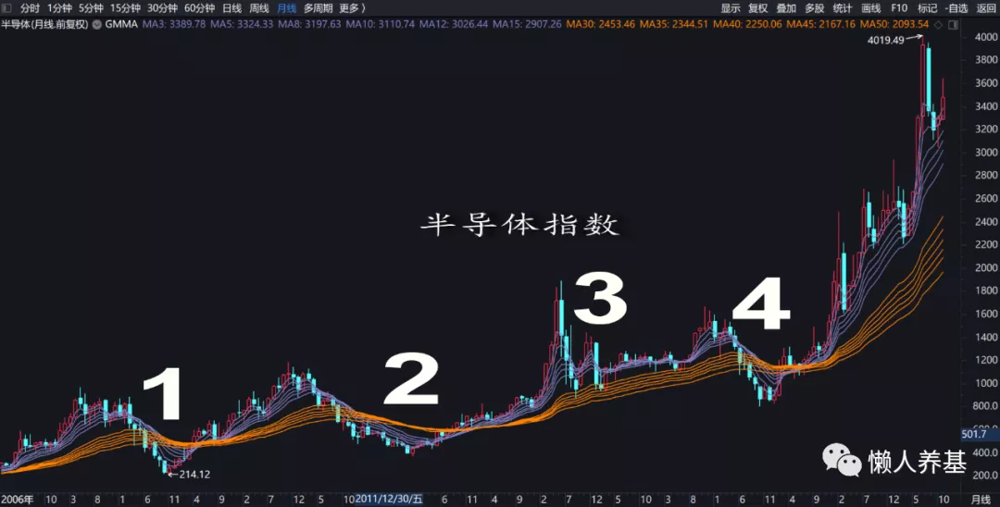

我们都知道投资基金赚钱最简单的原则是低买高卖, 反过来讲也可以这样表述: 高不买、低不卖.

作为长期价值投资者, 肯定是希望买得便宜的, 但如何便宜买胜率比较高呢?

我之前写过一篇文章[一个简单易行的基金买入策略](/pages/cc0963/), 从过往历史来看, 利用顾比均线来确定基金买入时机胜率较高:

选取顾比均线作为主图指标, 行业主题指数一般适用于价格跌进月线长期均线组买入策略, 买入周期 12 个月左右; 非行业主题主动权益基金适用于单位净值跌进周线长期均线组买入策略, 买入周期 6 个月左右; 而保守型二级债基和纯债基金适用于单位净值跌进日线长期均线组买入策略, 买入周期 3 个月左右.

我 2018 年买中概互联用过这个方法, 算是比较成功的; 2021 年逆势抄底中概互联和保险主题也用了这个方法, 目前还在进行中.

这篇文章发表后引起了众多朋友的关注, 在讨论区或私信问我顾比均线的朋友一直比较多, 主要问题有: 用哪个软件看顾比均线? 场外基金只有净值, 有顾比均线的软件也看不到它们的 K 线怎么办?

我可能已经回答过至少上百次类似的问题了, 而且最近还不断有人问.

想来想去还是写一篇专门的文章对此类问题做一个系统的回复.

鉴于有的行情软件没有顾比均线, 一般小白投资者也没有能力自己编辑指标公式增加顾比均线主图指标; 即使有了顾比均线主图指标后, 大部分行情软件还是没有场外基金的周 K 线、月 K 线切换功能, 所以朋友们没有必要非把自己用惯了的行情软件折腾出这些完备功能了.

解决办法是到国泰君安证券官网下载一个免费版的行情交易软件:[国泰君安证券富易电脑版](https://www.gtja.com/content/download.html). 别问我为什么, 因为我一直就是用的这个行情软件, 它具备我用顾比均线分析基金买入方法的所有完备功能. 华泰证券高级版 PC 版游客也可正常使用. 其它行情软件我不可能一一下载去试用.

下载安装完毕国泰君安证券富易电脑版后, 只需以游客身份打开行情软件, 键入任一场外基金代码, 比如 110011(易方达优质精选), 回车, 进入日 K 线状态. 我们看到的是与股票 K 线不同的一条净值走势曲线(因为每天只有一个净值).

别急, 我们要在右上角"复权"一项选择"前复权". 或者直接按"Ctrl+V"键从不复权切换到前复权. 这个很重要, 如果不复权, 分红或拆分份额会有巨大的跳空缺口, 会使我们的分析严重失真.

接下来, 在这一界面单击右键弹出上图所示的菜单, 再点击"选择主图指标"进入下图界面.

在"选择主图指标"菜单中选择"GMMA 顾比均线"并单击"确定", 我们期待的顾比均线就出来了.

在上图界面中选择周线、月线, 并按上下键选择所需要分析期间, 就可以进行基金买入时机的分析了.

通过对我自己优选过的主动权益基金分析, 用日 K 线跌入长期均线组确定买入时机会导致买入过早, 而用月 K 线会导致错失买入机会, 只有周 K 线确定买入时机最为合适.

同理, 用月 K 线确定波动较大的行业主题指数基金买入时机比周 K 线和日 K 线更优.

对波动很小的纯债基金和保守型二级债基, 则可以用日 K 线确定买入时机.

但这也不是绝对的, 波动和回撤从大到小依次适用月线、周线和日线策略, 所以部分科技主题主动基金或风格过于激进的其它类别主动基金也可能适用月线策略; 风格过于激进的高收益纯债基金也可能适用周线甚至月线策略.

某只具体基金到底适用哪种组别的策略也很容易判定, 在月线、周线和日线之间切换, 看哪种组别的顾比均线更具有操作价值, 就可以确定采用这一组别的策略.

这种策略从过往回测看胜率是非常高的. 但资本市场最大的确定性就是未来充满不确定, 所以这种方法应该结合其他分析方法一起使用, 尤其要结合基本面分析, 如果一个行业是一个趋势性衰退行业, 价格跌进长期均线组可能只是下跌噩梦的开始, 相对于基本面分析, 技术分析终究只能作为辅助决策手段.

而无论如何, 我认为这种分析方法还是具备实操价值的.

采用这种策略买入基金, 我仍然建议每只基金从投入第一笔计算时间, 按累计收益除以累计本金计算收益率, 达到年化收益率 20%止盈. 达到止盈条件时如果市场情绪不疯狂或者估值不算太高, 可以只止盈利润部分; 如果市场情绪疯狂或者存在巨大泡沫, 则果断执行清仓止盈.

【附一个电脑版的顾比均线指标公式(直接复制使用, 颜色可以修改)】

MA3: EMA(CLOSE, 3), COLORC08080;

MA5: EMA(CLOSE, 5), COLORC08080;

MA8: EMA(CLOSE, 8), COLORC08080;

MA10: EMA(CLOSE, 10), COLORC08080;

MA12: EMA(CLOSE, 12), COLORC08080;

MA15: EMA(CLOSE, 15), COLORC08080;

MA30: EMA(CLOSE, 30), COLOR0080FF;

MA35: EMA(CLOSE, 35), COLOR0080FF;

MA40: EMA(CLOSE, 40), COLOR0080FF;

MA45: EMA(CLOSE, 45), COLOR0080FF;

MA50: EMA(CLOSE, 50), COLOR0080FF;

MA60: EMA(CLOSE, 60), COLOR0080FF;

对行情交易软件玩得比较"溜"的朋友, 可以尝试看看自己用惯的行情软件到底行不行.

## 原文

- [顾比均线在基金投资中的运用](https://mp.weixin.qq.com/s/GQmi4Cu512qHKW6847qc3A)
