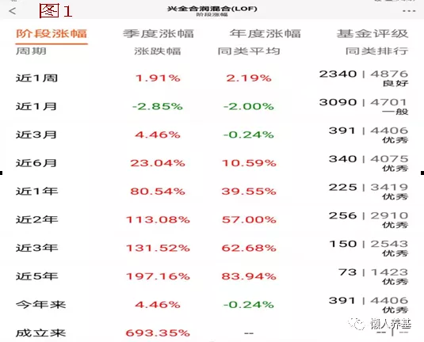
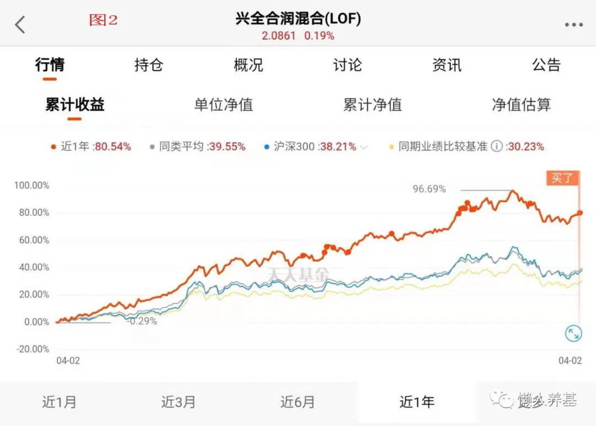
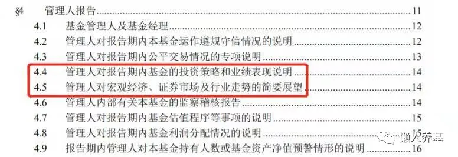
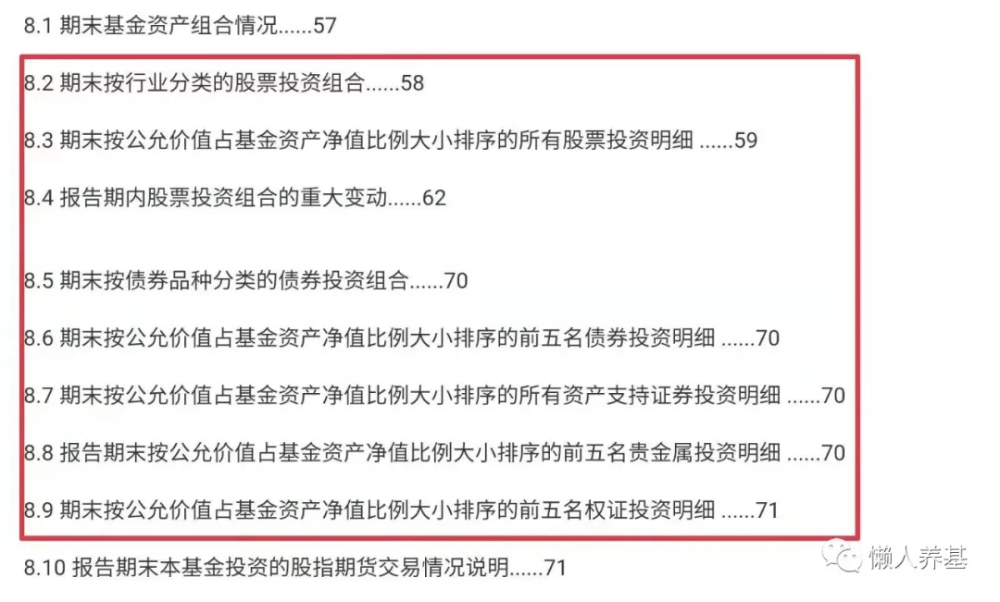
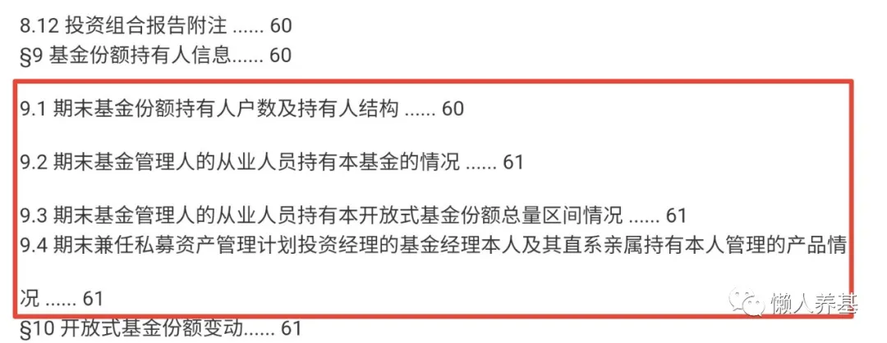
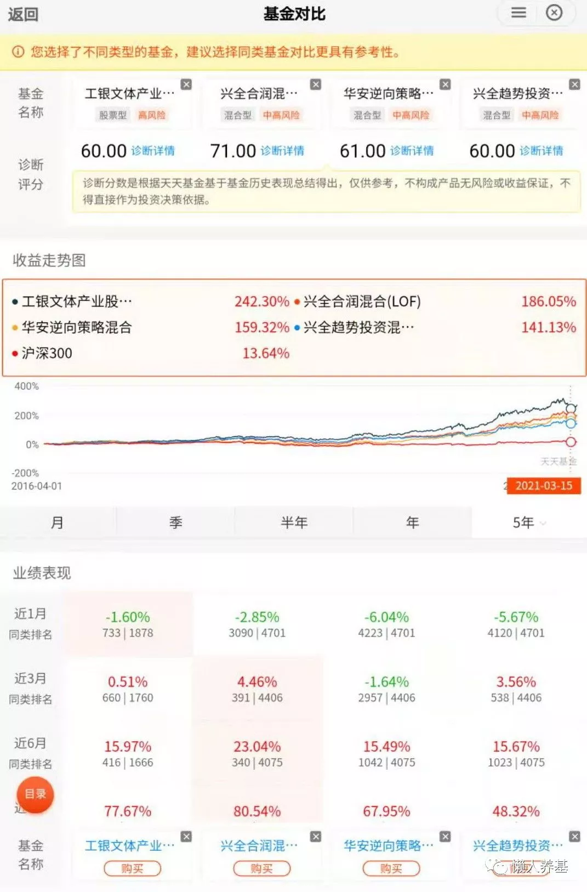

不熟不做, 不懂不投. 看懂一只主动基金是投资买入它的前提.

那怎么叫看懂呢? 一只主动基金摆在那儿, 就像一头大象之于盲人, 我们要尽可能从多个角度去触摸它、了解它, 尽可能多地还原它的全貌.

## 一、看懂基金经理

主动基金的灵魂是管理该基金的基金经理, 是我们需要了解的重中之重. 一只主动基金如果换基金经理了, 那么基本上可以把它视为另外一个产品了. 所以选主动基金其实是在选基金经理, 本文后面的收益率、定期报告、基金评级评奖等等, 实际上都是基金经理外化、表现出来的东西.

从基金公司网站、基金销售平台可以了解到下列内容:

### 1、基金经理的学历、从业经历.

许多基金经理都是从研究员、交易员、策略分析师、专户管理、保险公司资产负债匹配专员等"进化"而来; 做研究员时有的专门研究大消费, 有的研究 TMT, 而有的则专门研究光伏新能源; 而现在在公司成长组、价值组, 有的担任投研总监, 有的是公司副总……

所有这些, 可以为你提供基金经理擅长什么、选股会有什么倾向、大概会是什么投资风格这类线索.

业绩骄人的明星基金经理, 像张坤、刘彦春、董承非、朱绍醒、谢志宇、张清华等都是所在基金公司副总或总经理助理.

除了一定的天分, 基金经理是靠不断经历牛熊磨练出来的, 这个行业就像陈年的酒历久弥香, 无论短期业绩多辉煌, 从业经历短、担任基金经理少于三年的我一般都不会考虑.

### 2、基金经理背后的投研团队

虽然说基金经理是灵魂人物, 但他身后的投研团队也非常重要. 这就要求我们选择有实力的基金公司, 具体说就是权益投资规模靠前的基金公司, 它们有非常强大的投研团队, 可以给基金经理源源不断地输出内容和资源, 协助基金经理进行决策.

我自己经常关注的有兴证全球基金、交银施罗德基金、富国基金、易方达基金、工银瑞信基金、华安基金、中欧基金、景顺长城基金等基金公司. 这些公司除了有强大的投研团队, 良好的公司氛围还能不断培养孵化出新一代优秀的基金经理.

经常有明星公募基金经理跳槽私募后业绩变得平庸了, 跟离开投研团队的支持有一定关系.

### 3、基金经理管理该基金前后的业绩表现

虽然自基金创立以来一直管理的现任基金经理不在少数, 但朱绍醒 16 年管理富国天惠"从一而终"被奉为传奇; 很多基金经理要么因为跳槽管理过不同基金公司的产品, 比如曾管理过新华优选分红混合和中欧价值发现的曹名长, 管理过兴全社会现任和睿远成长价值的傅鹏博; 要么是中途接任基金经理的, 比如 2013 年 10 月 28 日开始管理兴全趋势的董承非, 2015 年 6 月 18 日接手华安逆向的崔莹……

以曹名长为例, 成名于新华基金时代, 当时他管理的新华优选分红混合几乎拿遍了所有基金奖项. 到了中欧基金后的代表作中欧价值发现 2016-2018 年成绩不错, 2019-2020 业绩落后, 今年春节后又迎来了它的高光时刻.

崔莹为例, 从 2016 年 3 月 9 日开始管理华安沪港深外延增长混合, 截至 2021 年 3 月 9 日刚好 5 周年, 根据 Wind 数据投资类型二级分类灵活配置型基金排名第一(1/787), 凭借业绩长期波动上行, 获得了银河证券三年期五星评级. 至 2021 年 4 月 2 日崔莹在该基金任职总回报为 315.12%, 年化回报达到 32.46%. 他管理的华安逆向多次斩获金牛奖, 2021 年获得晨星积极配置型基金提名.

而谢志宇于 2013 年 2 月 7 日开始管理兴全合润, 至 2021 年 4 月 2 日管理 8 年又 68 天, 任职回报达到 719.23%, 年化回报达到 29.30%. 兴全合润多年来都是 4-5 星评级. 2021 年该基金获得晨星积极配置型基金奖, 加上之前谢志宇管理的基金已经累计获得 8 次金牛奖、8 次明星基金奖、3 次金基金奖, 至此, 谢志宇也成为行业内为数不多的奖项大满贯基金经理.

### 4、理解基金经理的投资风格和投资体系

以中欧基金曹名长为例, 他自己总结的投资风格是"15% 的费雪尔+85% 的格雷厄姆", 强调低估值和性价比, 而且长期坚持不动摇. 2019、2020 年中欧价值发现的换手率为 93.65% 和 77.09%, 超低换手率表明他完全不跟随趋势、投资策略非常稳定不漂移.

华安基金崔莹, 整体风格均衡偏成长, 主张"应对比预测重要、任何市场都有机会", 基本面结合景气度选股, 偏重右侧交易, 通过行业分散来降低波动率. 崔莹管理的基金换手率都比较高: 华安逆向 2019 年、2020 年换手率分别为 487.37% 和 390.91%; 华安沪港深外延增长混合 2019 年、2020 年换手率分别是 578.09% 和 282.81%. 较高换手率表明崔莹投资策略比较灵活, 重趋势判断或风格轮动.

谢志宇整体投资风格均衡偏成长, 进攻性足够强而不极致, 长期表现优异但回撤控制一般, 所以他在 2016、2018 年大势不好的年份表现一般. 他管理的兴全合润 2019、2020 年的换手率分别为 105.10% 和 125.70%, 远低于崔莹. 较低换手率表明谢志宇更重视选股, 投资策略比较稳定.

## 二、看懂收益率

### 1、绝对收益率

相较短跑冠军, 投资更需要长跑健将. 所以我们既要关注短期收益率, 更要关注长期收益率.

(1)短期收益率

蛋卷、天天等基金平台都给出了每天、一周、一月、三月、六月、一年的基金净值涨幅, 并且都有各基金当天实时的净值估值数据, 方便我们当天投资时抉择.

(2)中长期收益率

三年、五年以至基金成立以来的收益率. 中长期收益率的参考价值更高. 比如, 兴全合润从 2010 年 4 月 22 日成立以来收益率为 693.35%, 到 2021 年 4 月 2 日一共 11.06 年折算年化收益率为 20.60%, 基本上是巴菲特的水平.

天天基金有长期的季度、年度涨幅, 可以很方便的进行查阅.

### 2、相对收益率

(1)相对于沪深 300 和同类基金平均涨幅

有一个月、三个月、六个月、一年, 直至成立以来相对于沪深 300、同类基金平均涨幅的比较. 从基金累计收益图上可以看出在不同时段, 该基金是否超过沪深 300, 是否超过同类基金平均水平, 是否超过同期业绩基准, 以及各超过了多少.

超过业绩比较基准, 方为及格; 超过沪深 300, 意味着战胜市场; 与同类基金平均水平比较, 则可以看出在同类基金中处于什么水平.

补充说明一下, 基金只能跟同类基金比较才有意义. 各平台的分类标准略有不同, 一般分为偏股型基金、标准混合基金、偏债基金、纯债基金几大类. 而晨星将基金大类分为积极配置型基金、混合型基金、积极债券型基金、普通债券型基金、纯债型基金.

(2)同类排名

本文图 1 显示的基金排名各大基金平台都有, 可以很方便地进行查阅, 基金在同类中处于什么水平一目了然.

同类基金排名一般采用四分位法则, 也就是按照基金涨幅大小顺序排列, 然后四等分, 排在前 25% 的为优秀, 排在 25-50% 的为良好, 排在 50-75% 的为一般, 排在 75-100% 的为不佳.

基金排名一定要长期短期结合起来看, 一般来讲, 越是短期的排名参考价值越小. 但如果一位长期业绩优秀的基金经理, 他管理的基金在短期内, 比如 3-6 个月排名严重下滑, 有可能是风格恰好不在他这里, 这时候反到可以作为抄底或临时加仓指标来使用.

### 3、风险调整后收益率

我们选择主动基金一定是冲着它相对于指数的超额收益来的. 然而凡事皆有因果, 超额收益的背后, 是额外承担的主动管理的风险. 所以风险调整后的收益指标也有重要的参考价值.

(1)年化收益率与年度平均最大回撤作比较, 可以得出投资该基金的性价比.

我认为这个指标比较直观, 比如一只基金 25% 的年化收益率相对 25% 的平均年度最大回撤, 与另一只基金 25% 的年化收益率相对 20% 的平均年度最大回撤, 投资者持有体验要好得多. 可惜各基金公司官网和基金销售平台都不提供现成的基金各年度最大回撤数据, 天天基金也只提供最近一年的最大回撤数据, 计算起来很不方便.

但天天基金有每只基金从成立来的每日净值数据, 普通投资者可以手工计算每年最大回撤, 再作算术平均得到年度平均最大回撤, 然后再与年化收益率进行比较, 只是麻烦了一些. 用夏普比率作个参考也可以.

(2)夏普比率: 基金承担每一单位风险(包括系统风险和主动管理风险)所获得的收益.

从天天基金网页版"基金概况-特色数据"一栏可以查到近一年、两年、三年的夏普比率. 比如, 兴全合润近一年、两年、三年的夏普比率分别为 2.94、2.00、1.37; 而同一时期的华安逆向为: 2.32、1.98、1.40; 工银文体产业股票为: 2.43、1.81、1.46; 易方达中小盘混合为: 2.69、1.82、1.42.

(3)信息比率: 基金承担每一单位主动管理风险所获得的风险补偿.

目前还没有提供信息比率数据的免费开放平台.

## 三、看懂定期报告(季报和年报)

公募基金每季度结束 15 日内公布季度报告, 年度结束 90 日内公布年度报告. 基金公司网站、各大基金销售平台、雪球都可以查看.

净值表现、利润表、资产负债表什么的都不用花过多精力去看, 只要看摘要就行了. 看定期报告主要看基金经理怎么说和怎么做.

### 1、看基金经理怎么说(管理人报告)

在管理人报告中, 基金经理会对报告期内管理基金的得与失做出总结, 并对未来做出展望. 基金经理一般都会判断货币、信用等政策走向, 分析感兴趣的行业或主题, 提出未来的应对思路.

这给我们分析基金经理的投资风格以及选股、择时等具体思路提供了依据.

比如, 谢志宇在兴全合润 2020 年年度报告中, 就明确提出, "经过 2019-2020 年的上涨, 部分公司的估值已经处于历史高位……2021 年我们将继续坚持自下而上精选个股的操作理念, 持续关注具备核心竞争力的公司, 努力平衡好公司的长期发展空间与短期估值, 不断寻找具有良好性价比的优秀公司." 年报中还强调要控制风险, 均衡配置, 降低波动, 以期更好地为投资者创造长期价值.

袁芳在工银文体产业股票 2020 年度报告中就明确提出"优质成长股依然是主力配置的方向, 板块上相对看好与海外需求相关的公司".

崔莹则在华安沪港深外延增长混合 2020 年度报告中重提"需要重视市场反馈"; "我们在组合投资上力求行业均衡, 单一行业配置比例通常低于 20%", "不做单一角度去思考解决问题的铁锤人". 表明了其重趋势、灵活应变的投资思路.

了解了基金经理的投资思路和大体的投资框架, 有利于我们理解各种市况下基金净值出现的涨跌, 便于我们做对照思考, 可以增强我们长期持有基金的信心.

### 2、看基金经理怎么做(基金持仓明细及变动情况)

重点看股债比例、前十大重仓股占净值比、十大重仓股行业分布、与上一报告期变化等细节.

(1)从股债比例有无重大变化, 看基金经理有无择时操作.

(2)是否有消费、医药、科技行业等有长期成长空间的股票, 占比多少.

(3)是否有近期热点行业、主题股票, 占比多少.

(4)从持仓及与上期变化, 分析换手情况, 判断与基金经理"说"的观点相不相符, 依此判断基金经理是否知行合一或者有无风格漂移.

### 3、看基金持有人结构

(1)看机构和个人持仓占比. 虽说机构持仓占比高的基金不一定就很好, 但可以做个参考. 我们可以学习借鉴机构的投资思维. 比如, 2020 年底工银文体产业股票 A 机构持仓占比 40.97%, 就是比较高的机构持仓占比.

(2)看基金公司和基金管理人有无持仓. 基金管理人是否持有自家基金产品以及持有多少, 表明了他们对该基金的信心, 同样可以作个分析参考指标. 比如, 工银文体产业股票 2020 年报显示, 本基金经理自持超过 100 万份.

总之, 看基金经理怎么说和怎么做, 并相互印证, 从而加深对基金经理的熟悉和了解.

## 四、看懂基金评级、评奖

### 1、基金评级

中国证券基金业协会官方认证的基金评级机构包括七家: 上海证券、海通证券、银河证券、招商证券、晨星、济安金信、天相投顾.

评级主要参考依据是收益和风险两大指标, 结合基金经理管理能力的综合考察. 各家评级机构的评级结果会在证券基金业协会网站每季度定期更新. 虽然各家评级机构的评级标准不尽相同, 对每一只基金的评级也会有差异, 但是可以相互印证.

在蛋卷基金、支付宝上, 点开基金页面都只显示晨星评级, 本文图 1 是天天基金 APP 上的"基金评级"选项, 点开就能看到上海证券、招商证券、济安金信三家评级机构的最近两年评级. 如果要看更多、更长期的评级, 可以到天天基金网页版"评级"一项查看.

建议选择各家评级都在三星以上的主动基金作为投资标的. 当然基金评级也意味着对现任基金经理的评级. 成立未满三年的主动基金没有评级, 能否选择作为投资标的, 看基金经理就可以了.

### 2、基金评奖

目前比较知名和权威的基金评奖主要有中国证券报的"金牛奖"、上海证券报的"明星基金奖"、证券时报的"金基金奖"以及知名国际基金评级机构晨星评出的"晨星年度基金奖".

我个人更关注晨星奖和金牛奖. 晨星奖每年入围提名的基金我都会关注, 它的奖项分为积极型配置基金奖、混合型基金奖、积极债券型基金奖、普通债券型基金奖、纯债型基金奖.

当然每个基金奖项, 从入围提名, 到最终获奖, 都是优中选优的主动基金. 对普通投资者来说, 这些入围及获奖基金数量已经不少了, 我们完全可以把这些评奖作为一个现成的筛选工具, 在入围和获奖基金中选择适合自己的主动基金.

## 五、学会使用一些基金分析工具

### 1、基金业绩评价

天天基金网页版提供. 基金业绩评价分选证能力、收益率、择时能力、稳定性、抗风险五项; 基金经理则由经验值、收益率、择时能力、稳定性、抗风险五项组成. 可以作为分析基金及基金经理的参考指标.

### 2、定投回测(定投计算器)

定投回测或者定投计算器功能, 蛋卷基金、天天基金、好买基金都有, 点开每一个基金页面就能看到, 不过天天的更全面一些. 有意思的是, 主动基金近 1 到 5 年定投回测显示, 普通的傻傻定投几乎超过其它各种智能定投、移动止盈定投等选项. 其实很多方法是越简单、越有效, 基金定投也不例外.

### 3、基金诊断

支付宝、天天基金都有基金诊断功能, 各有特色.

支付宝基金诊断功能令我印象深刻的是基金近一年投资者盈利或亏损统计, 并且给出亏损用户的行为特征——追涨杀跌、定投放弃、持仓时间短、频繁买卖等, 以及这些不良投资行为用户占总亏损用户的比例.

我试用过一下, 收益越高、波动越大的基金, 亏损用户比例越高; 而投资标准混合型、偏债型等收益不那么高、波动偏小的基金用户盈利比例越高. 这个结论和背后的逻辑我之前就有, 没想到能在销售平台用销售数据给予了验证.

天天基金的基金诊断功能也有特色, 有持有 7 天到一年盈利概率、近一年最大回撤、基金热度(关注人数、买入人数、相关讨论)等指标可供参考.

### 4、基金 PK

这个功能也挺有意思, 可以把心仪的几只基金放在一起 PK, 有图有真相, 有一定参考价值.

### 5、基金筛选

晨星网和天天基金网页版都有基金筛选功能, 可以设定一些条件, 比如五年三星级以上评级、积极配置型、开放式基金, 它就能给你筛选出来符合条件的全部基金; 我们只需要在前面 20-50 只基金中进行手工再筛选就可以了, 非常便捷省力.

## 小结

如果能认真做到以上五个部分, 一方面算是给自己心仪的主动基金建了个很完整的档案, 而实质上是通过对基金"庖丁解牛"读懂以下三个问题:

1、基金的中长期业绩如何?

2、这样的业绩从何而来?

3、这样的业绩可持续性如何?

三个问题解决了, 我认为"看懂"一只主动基金就是水到渠成的事了.

## 原文

- [我的主动基金分析框架(最新修订)](https://mp.weixin.qq.com/s/G-NvRTBZd7qYTOZa_izwBg)
