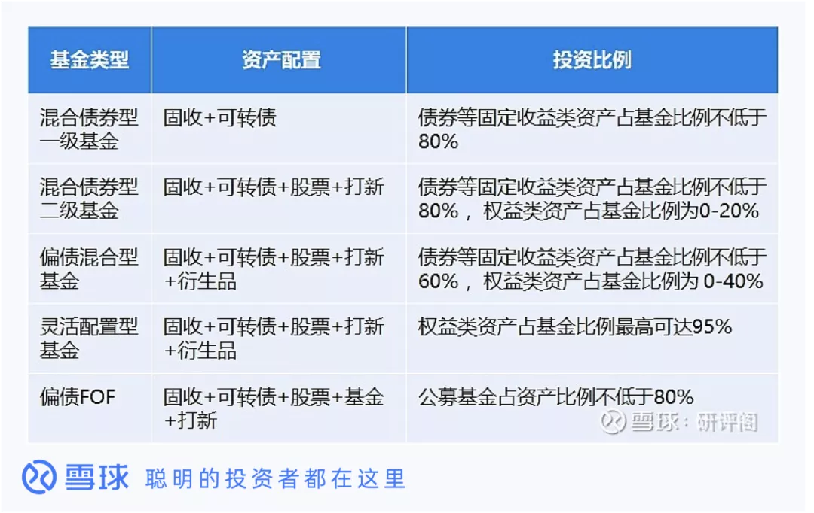

基金理财最近几年很火, 尤其 90 后、00 后, 买基金的比例越来提高, 我总结的基金投资策略是主动型基金被动管理, 被动型基金主动管理.

其中主动型基金是大家最喜欢的基金类型, 包含偏股型、"固收+"等, 去年因为是震荡市, "固收+"表现非常不错, 去年超九成的"固收+"取得正收益, 平均回报率 6.54%, 跑赢同期沪深 300 指数 10 个点以上.

像前海开源可转债、华商丰利增强定开 A、天弘添利 C、广发可转债 A 等, 去年收益率都达到 40%, 非常优秀.

那在选择基金时, 如何挑选一个优秀的"固收+"基金呢?

下面从什么是"固收+"基金、"固收+"基金有哪些优势、"固收+"基金适合哪些投资者、如何挑选优秀的"固收+"基金 4 个方面对"固收+"基金进行全面分析.

## 什么是"固收+"基金

"固收+"基金需要分两个层面来解释, 一个是"固收", 它代表的是收益稳定的基金投资产品, 其次是"+", 它代表的是风险较高、收益不太稳定的投资产品.

"固收+"可以看做是投资时的一种策略, 这个策略的特点是把部分资金投入到低风险能产生固定收入的产品中, 把剩余资金用来配置其他较高风险的资产.

如果还不清楚, 理财老娘舅有个很好的比喻:

固收部分是固收+基金的核心, "+"的部分仅是增彩的部分.

打个比方, "固收+"基金就是一碗饭, 固收部分就是米饭, "+"的部分就是搭配的各类菜.

米饭部分保证你能吃饱, 不挨饿(即绝大多数市场行情下, 让你有一个比较稳定的收益, 大概 2%到 5%).

菜是让你补充营养, 吃的爽(即让你有可能获得更高的收益). 高收益自然对应高风险, 如果加的是青菜, 有些超额收益, 但油水不够多. 如果加的是大鱼大肉, 油水多了, 但是导致身体的隐患也就大了, 比如高血压, 这就是风险.

说白了, "固收+"诠释了朴素的资产配置理念, 通过大类资产配置, 降低组合风险, 同时追求收益增强.

## 固收+基金有哪些优势

首先讲一下目前采用"固收+"策略的基金有哪几类:

(1)偏债混合: 权益仓位在 0~40%, 主要是"固收+股票+可转债+打新";

(2)二级债基: 权益仓位不高于 20%, 主要是"固收+股票+可转债+打新";

(3)一级债基: 不投资股票, 主要是"固收+可转债";

(4)灵活配置: 权益类资产占比最高可达 95%;

(5)偏债 FOF: 公募基金占资产比例不低于 80%.

再说下"固收+"基金的优点有哪些?

首先, "固收+"基金有相对较高的稳定性."固收+"基金会把大部分的资金用于投资有固定收益的资产, 比如国债、银行存款等, 这些资产风险较低, 收益稳定, 从而可确保"固收+"基金有相对较高的稳定性.

其次, "固收+"基金有相对较高的收益."固收+"基金会把少部分资金用于投资权益类资产, 比如股票, 以博取较高的收益, 避免都持有固收类资产造成收益较低的局面.

当然, "固收+"基金无论是在稳定性还是收益上都不是公募基金中最突出的, 它最突出的还是将二者进行了很好的结合, 而且在必要的时候, 还可以在二者之间进行转换, 从而实现'进可攻退可守'的投资策略.

比如在股市行情较好的时候, "固收+"基金可以将更多比例的资金用于投资股票, 从而提高基金的收益. 而在股市行情不好的时候, 又可以减少股票的投资, 增加固收类资产的投资, 提高基金的稳定性, 减少股市行情不利带来的风险.

## 固收+基金适合哪些投资者

我觉得"固收+"基金主要还是适合偏稳健保守的投资者.

如果是偏稳健保守型的人, "固收+"类的产品值得重点关注, 以固定收益类资产投资为主, 减少预期风险增加相对收益.

如果是偏积极进取型的人, 投资账户基本都是股票, 也可以考虑补充"固收+"类的产品, 进一步来平衡账户风险. 另外, 股债常常出现"跷跷板"效应, 即股熊债牛, 因此, 即便股市为熊市的时候, 也不至于整体账户亏太多, 投资路也可以走得更远.

## 如何挑选优秀的固收+基金

从以上对"固收+"基金的介绍中, 我们可以大致勾勒出挑选"固收+"产品的几大步骤:

(1)看基金名称

基金的"固收+"属性常常在名称中就有所体现, 常见的高频关键词包括:"增强+债券"、"稳"、"转债"、"绝对收益"、"对冲"等等.

(2)看资产配置比例

查看基金近年间披露的股票+可转债持仓占比情况, 判断其是否同自身风险偏好相匹配. 一只优秀的"固收+"基金, 其权益敞口还应随市场环境灵活调整, 熊市减配, 牛市增配, 而非一成不变.

一只"固收+"基金, 必定会在固收类资产和权益类资产上有一个大致的资金分配比例, 比如 80%以上的资金用于投资固收类资产、20%以下的资金投资权益类资产, 或者 70%以上的资金用于投资固收类资产、30%以下的资金投资权益类资产.

对于资金的不同比例的分配, 很大程度上决定了"固收+"基金的稳定性和收益的高低, 把较大比例资金用于投资权益类资产的, 其收益率或许会更高, 但稳定性就相对较差, 反之收益虽然较低, 但稳定性更高.

(3)看基金经理的过往经验及业绩

"固收+"基金的投资对象涉及固收类和权益类等投资逻辑截然不同的资产, 同时还要在不同资产之间进行资金的合理分配及不断调整, 因此相比仅以某一类资产为投资对象的基金来说, 管理起来可能会更难, 这就对基金经理有比较高的要求.

所以最重要的一点, 是要观察基金在过去若干年间的历史业绩, 且考察区间需要跨越熊市. 关注基金单年度收益, 尤其是典型熊市如 2018 年的收益情况, 而非单单查看"近 x 月"、"近 x 年"的业绩表现, 来判断其是否真正具备穿越牛熊的能力.

我们所能做的, 也只能是根据基金的历史表现, 尽力筛选出在属性上更符合"固收+"特性, 且具备成功经验的优秀产品.

最后, "固收+"基金虽然能在股市行情不好的时候稳定性更好, 但其收益也不可避免地会受到市场行情不好的影响, 所以能在股市行情较好的时候去买"固收+"基金, 或许就可以获得较好的收益.

(风险提示: 本文所提到的观点仅代表个人的意见, 所涉及标的不作推荐, 据此买卖, 风险自负.)

## 原文

- [优秀的"固收+"基金长什么样](https://mp.weixin.qq.com/s/d7lEjFhL-bXSsY1QOEIhDg)
