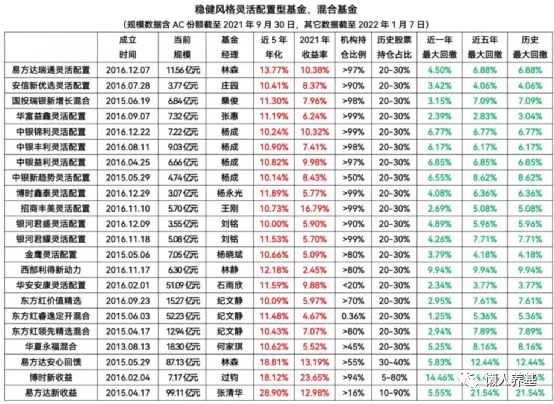

## 从固收到固收+

我们在做资产配置的时候, 以债券打底的偏债类资产是我们用于防守的"利器". 我自己也习惯于在基金组合中配置积极型(进攻型、前锋角色)、平衡型(攻守兼备型、中场角色)和稳健型(防守型、后卫角色)资产, 并在不同的时间、依据市场状况分配不同的比例来让自己安心持有、舒适投资.

防守型资产按照风险偏好不同又分为固收类(货币基金和保守型纯债基金)和固收+(二级债基和双债基金)两大类, 我之前写过《纯债基金的配置价值》和《优选积极债基可以构建长期收益率超越沪深 300 的债基组合》, 分别对这两类产品做了介绍.

固收+的中的二级债基, 其基本配置是债 8 股 2, 也就是除了债券仓位外, 还可以配置 20% 以内的股票仓位, 长期年化收益率可以达到 8-10%; 而通过设定业绩条件前 47.50%(晨星评级标准)筛选出来的基金, 长期年化收益率可以达到 10% 以上, 这一收益率确实可以媲美沪深 300 而波动却要小得多.

## 从固收+到权益-

其实, 在灵活配置型混合基金中, 还有一个数量庞大的群体, 它们因为投资债券的仓位不到 80%, 或者说投资股票的仓位超过了 20%, 但超过数量又不太多(一般不到 30%), 根据中国证监会对基金类别的分类标准, 它们不能叫做"债券基金", 波动水平和收益率也比二级债基要稍高一些, 但实际上与固收+的风险收益比应该是差不了多少的, 我们不妨把它叫做固收+的升级版或者"权益-"吧.

在混合基金中选择"① 股票仓位 20-30%"、"② 成立时间大于 5 年"和"③ 近 5 年最大回撤低于 10%"三个条件进行筛选, 符合条件的有 93 只混合型基金; 再加上"④ 近 5 年年化收益率高于 10%"一个条件, 这一数量减少为 60 只.

加上"⑤ 现任基金经理管理时间超过 3 年"继续筛选, 最终剩下 19 只. 详见下表.

## 稳健风格权益-

如表中可见, 19 只符合条件的基金分属 13 位基金经理, 我之前较为熟知的有四位, 分别是林森、纪文静、何家琪和石雨欣(陆奔), 都属于管理规模超百亿的基金经理.

余下 9 位目前管理规模都不大, 知名度也不高. 这些业绩不俗的基金多年来规模一直偏小(大部分不足 10 亿元), 其超额的重要来源有可能是打新, 而打新也是固收类基金重要的收益来源之一.

随着 A 股注册制的全面推行, 打新收益将面临着不确定: 一方面新股不败将成为历史, 打新收益有可能面临缩水; 但另一方面, 新股数量大概率会增加, 总的打新收益也未必会减少.

而如果基金规模增大, 打新对增厚基金收益也是不可持续的, 可以观察这类小规模基金限购情况得出结论.

而无论如何, 从过往业绩来看, 这 19 只基金年化收益率超过 10%, 最大回撤不到 10%, 确实是颇为稳健的.

## 激进风格权益-

在我过往投资过的基金经理中, 我熟知的股债俱佳的高手除了易方达的林森, 还有博时的过钧和易方达的张清华, 我把他们既追求相对收益(行情好时)又追求绝对收益(行情不佳时)的代表作也一并列在表中.

林森的代表作我列了易方达安心回馈, 其实他管理的另一只风险偏好程度更高的易方达瑞程灵活配置混合业绩更为惊艳; 过钧的博时新收益过往股票持仓最低曾到 5% 左右, 几近空仓, 而最高股票仓位接近 80%; 张清华易方达新收益过往股票持仓最低不到 20%, 最高超过 90%.

追加的这三位的代表作, 虽然近 5 年最大回撤超过了 10%, 但回撤较大的易方达新收益和博时新收益得益于过往对股票仓位的灵活控制, 从年度回报看每年都取得了正收益.

因此我把它们列为"权益-"中的激进派, 一样值得关注.

## 广义权益-: 有绝对收益理念的权益类基金

稳健的实质是追求较高收益的同时注意控制回撤. 将筛选条件设定为

① 偏股混合型基金+主动股票型基金+平衡混合型基金

② 近五年年化收益率大于 10%

③ 近五年回撤率排序前 25%

④ 基金规模大于 20 亿元

⑤ 当前基金经理连续管理三年以上

一共有 9 只基金入选, 分别是:

兴全商业模式优选混合, 交银优势行业, 富国美丽中国混合, 工银文体产业股票, 中邮新思路灵活配置, 嘉实增长混合, 鸿德优选成长混合, 交银阿尔法核心混合, 广发稳健增长混合.

这一类的"权益-"基金, 近五年最大回撤水平在 10-20% 之间, 大部分已经是我们耳熟能详的明星基金了, 适合风险承受能力更高一些的投资者, 较低风险承受能力的投资者也可以选择它们进行低配.

## 等权重配置可以获取优秀基金经理的平均收益

根据过往业绩表现筛选出来的基金经理, 都有绝对收益理念, 他们管理的基金追求较高的收益, 更注重这种收益的性价比; 当前可以对他们的业绩进行一个简单排序, 但未来 5 年谁会最好、谁又会最差, 是根本无法预判的.

而根据自己的风险偏好, 选择他们中的全部或部分, 对他们进行等权重配置, 以此来获得他们未来平均水平的回报, 是一种中庸而可行的方法.

## 基金过往业绩不能简单线性外推

需要特别注意的是, 过往业绩(包括收益率、回撤指标等)并不代表未来表现, 成分基金未来既有可能有上佳的表现, 也可能会出现"固收-"的效果(尤其小规模打新基金业绩持续性存疑); 构建基金组合是一种试图获取所选优秀基金(经理)平均收益水平的一种尝试或思路, 不构成投资建议.

## 原文

- [稳健之选: 从固收+到"权益-"(最新修订)](https://mp.weixin.qq.com/s/Tj_Sssz-jPXGr4y66Bz_Ww)
