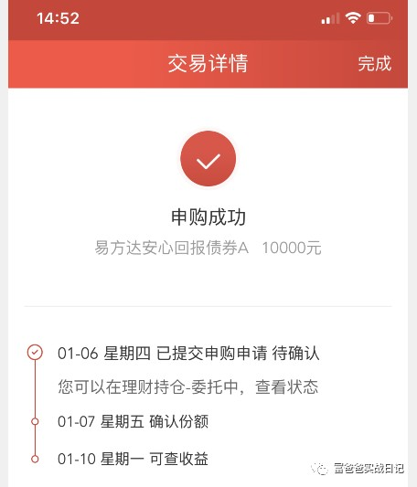

债券基金是阿静接触的最早的几种理财投资产品之一, 而且作为稳健的、中低风险的、年化收益远超存款的投资品, 一直在我的资产配置中占据了重要的一席.

但市场上二级债基达到 1500 支左右, 加上纯债基更是达到了 2800 支左右.

在这么多支里面, 想要淘出收益不错的、稳定的、风险较低的、适合我们的那几只, 各位觉得难呢还是小菜一碟?

其实还真的不是很难.

今天直接实操, 各位看看简不简单:

首先打晨星网, 点击基金筛选器,

将三年评级和五年评级都勾选 3 星以上,

再勾上积极债券和普通债券(也就是二级债基)

最后在五年年化那里填上大于 8%

如下图:

之后点击查询, 就会将一千五百支二级债基压缩到了 25 支:

(这里五年年化给我搞得有点蒙, 本来以前我都是使用五年年化大于 6% 的条件进行筛选的, 但这次使用 7% 进行筛选后还有 71 支, 让我感觉还是太多了, 所以最终使用了大于 8% 的条件进行筛选的, 至于为什么使用大于 6% 的条件筛选出来的数量比以前多了呢, 我想可能是这两年债基表现较好吧.)

之后我们再把这 25 支里, 近期换了经理的去掉, 单支债或股持仓过重的去掉(选出持仓比较分散), 重仓可转债的去掉, 业绩好的时候特别好差的时候特别差的去掉(即业绩不稳定的去掉), 大概三五支左右, 就可以组成你的债基组合了.

如易方达裕丰回报债券, 大基金大公司, 经理 6 年 313 天, 前五大债券仅占 5.63%, 五年回报(年化)7.36%, 三年回报(年化)8.07%, 二年回报(年化)10.37%, 相当稳健, 可选.

如诺安双利债券发起, 可转债(可交换债)占 61.57%, 前五债券持仓占 21.66%, 过高了, 放弃!

为什么要去掉重仓可转债的基金呢?

因为可转债起伏已经接近于股票了, 和我们稳健的要求不符, 如果真要投资, 还不如直接去投资可转债基金, 或是像我一样直接做可转债.

最后将你准备买入的资金平均分散在这三五支里就可以了.

为什么要选出持仓分散的, 还要把资金平均分散在这三五支里?

主要就是为了防范风险, 具体可看: 债券基金该怎么买之风险篇

阿静这次中意的是 420102、002739、002351 这三支, 做好准备, 只待下午近收盘时看跌幅大小决定是否买入.

但这天杀的券商平台, 竟然没有代理这三只在债基图片

最后被迫无奈, 匆匆忙忙选出了两只备胎: 110027 和 110017

这! 一看代码, 就知道出自同一家基金公司, 又和阿静分散不同公司的投资理念冲突, 最终选择先买一只, 其余在挑选看看

当然, 也有今天跌得不够多的原因, 感觉还可以再等等图片

(PS: 没有入选 25 支内的其他债基并不代表不优秀, 我选的这几支也不表代最优秀, 只是支数太多, 用这个方法、花最少的时间直接过滤出相对优质的、风险较低的那几只, 长期战胜中位数没问题, 但绝难排名在前几, 主要胜在安全度高些, 抄作业者可要有心理准备)

## 原文

- [只需"点几下"就可以选出优质二级债基的技巧](https://caifuhao.eastmoney.com/news/20220106201548182612170)
- [债券基金该怎么买之进阶篇二](https://caifuhao.eastmoney.com/news/20201117094648024842640)
