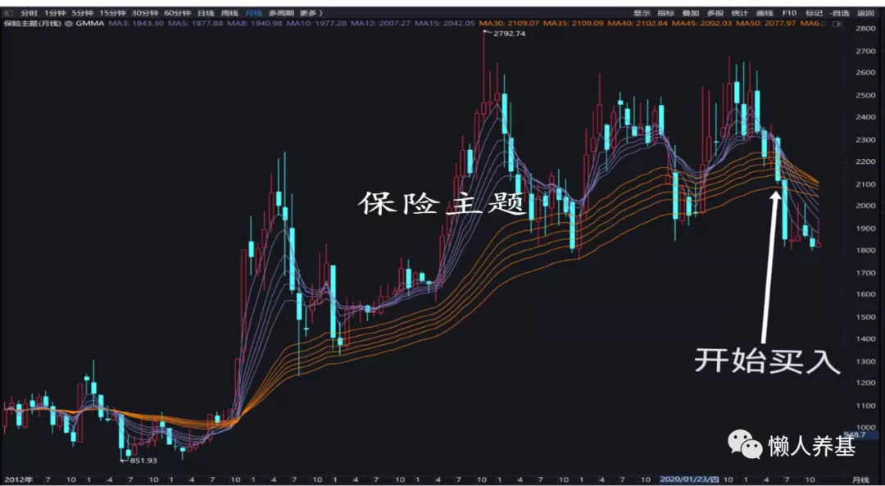

经历了 2019、2020 连续两个基金大年, 我对自己的收益也比较满意, 2021 年我给自己的定位是防守之年, 目标收益率 ±10% 都算正常.

## 年初持仓

年初在《2021, 我的基金如何安放?》一文中, 我详述了自己的基金配置策略, 前锋(进攻)、中场(攻守兼备)和后卫(防守)分别按 40%、40%和 20%的比例配置, 股债比大约是股 6 债 4. 主动被动基金配置比例是主动基金占比 60%、指数基金占比约 40%.

## 今年"动"了哪些东西

熟悉我的投资者知道, 我是一个追求投资舒适度的"躺平派". 但全年下来, 除了每月以组合的方式追加投入增量资金, 也有一些计划外的投资"动作", 分述于下.

### 1、调整主被动基金占比, 以投资主动基金为主

1 月下旬在某基金创出发行认购天量之际, 我感觉有点不妙: 新基金卖疯了, 泡沫可能要来了. 根据我的投资经验, 我选的主动基金在回撤幅度上大都显著优于指数, 于是果断将主被动 64 比调整成主动基金组合占比 90%以上、指数基金占比 10%不足.

### 2、逆势"抄底"中概互联

从 5 月中旬起, 由于中概互联从最高点下跌超过 30%(2.65\*70%=1.855), 达到了我逆势投资行业指数基金的条件, 我以月定投的方式开始投资中概互联场外联接基金, 在中概互联限购之后, 作为替代, 我主要投资场内的恒生互联网 ETF.

在我的计划里, 这部分的投资占我全部可投资资金 10%左右, 部分用增量资金购买, 部分用原来基金组合中的偏债部分进行转换, 目前已投入约 9%.

### 3、逆势投资保险主题

从 6 月初起, 保险主题落入顾比均线月线长期均线组, 我开始以定投的方式买入. 计划买入总投资额的 10%, 也是转换一部分, 增量资金买入一部分. 目前投入 9%左右.

### 4、将中场的部分仓位转换为进攻属性的基金

从 4 月份起买入韩创的观察仓位, 还写了篇文章《顶流中的后浪?——深度分析大成新锐产业混合基金》, 7 月份起将何帅的仓位逐渐转换了一部分到韩创上面, 转换比例约 5%.

### 5、适当超配置价值风格

由于行情风格极致分化, 7 月底起, 将何帅交银优势的一部分逐渐转换成价值风格的偏股基金国富中小盘和中泰开阳价值. 转换部分大约占总投资额的 10%.

### 6、转出广发稳健

转出广发稳健的主要原因是它长期持有的生物医药类仓位占比较大, 担心生物医药板块调整带来不利. 7 月份将广发稳健的一半转换成了易方达安心回馈; 另一半则转换成了西部利得量化成长混合和易方达新收益.

### 7、小打小闹的其它"动作"

2 月下旬因天量并没有带来天价、结合市场情绪止盈了有色金属. 年中陆陆续续买了几只主动基金的观察仓, 还买了基金投顾产品, 做投顾体验.

## "动"与"不动"对收益率的影响

因为有新增资金投入, 完全不动当然不可能. 为了便于计算, 我把年初持仓设定为 2020 年 12 月 31 日. 实际的情形当然是有微小出入的, 但差别不大.

统计计算截至时间都是 12 月 24 日收盘后.

如果年初持仓完全不动, 则截至 12 月 24 日的收益情况如下:

主动基金组合 12.03%(前锋部分 14.01%\*40%, 中场部分 11.03%\*40%, 后卫部分 10.06%\*20%), 指数基金组合 0.53%. 按主动被动 60:40 计算全仓收益率为 7.43%.

以下计算各项"动了"的部分对收益率的影响:

### 1、指数基金转换为主动基金

1 月下旬将指数基金组合逐步转换成主动基金组合肯定是带来正向收益的"动作". 以上年末持仓计算的理论正向收益率为 12.03%-7.43%=4.60%. 2021 年 1 月份主动基金组合收益率为 2.67%, 指数基金组合收益率为 2.32%, 两组合收益率相差 0.35%, 也就是转换起点相差 0.35%, 再加上基金转换的摩擦成本, 将 40%的指数基金全部转换为主动基金的正向收益实际上处于 4-5%的水平.

### 2、抄底中概互联和保险主题

"抄底"中概互联和保险主题在 2021 年度肯定是带来负向收益. 粗略计算如下:

中概和保险主题当前持仓都是 9%左右, 两项相加按 18%计算. 这两部分虽然也有增量资金, 但主要由防守部分(积极债基)转换而来, 首先计算转出的防守部分的损失, 10.06%\*18%=1.81%. 而中概当前的浮亏约 22%, 保险主题浮亏约 10%, 这两部分带来的浮亏为 9%\*22%+9%\*10%=2.88%. 由此计算抄底中概和保险带来的负向收益为 1.81%+2.88%=4.69%, 考虑到转出部分的收益计算误差和转换成本, 抄底中概和保险的实际负向收益处于 4-5%的水平.

### 3、将何帅的基金部分转韩创、部分转价值风格

7 月份将何帅的交银优势部分仓位转换成韩创的大成新锐产业混合, 占总仓位 5%左右, 这个转换带来正向收益约 1.31%\[(38.70%-12.50%)\*5%\]; 但将交银优势转换成价值风格的国富弹性市值和中泰开阳(占总仓位约 10%)带来负向收益约 1.22%\[(12.50%+2.30%)\*5%+(12.50%-3%)\]. 理论上两个转换基本上不亏不赚, 但算上摩擦成本应该是略微亏损的.

### 4、转出广发稳健

7 月份转出约一半到易方达安心回馈, 约 6%仓位, 带来大约 0.6%正收益; 转出 3%至西部利得量化成长带来约 0.3%的正收益; 转出约 2%仓位至易方达新收益带来约 0.1%负收益. 转出广发稳健大约带来约 0.8%正收益.

### 5、其它"动作"

2 月下旬止盈有色金属, 仅从与目前的价格对比来看是略微的负向收益, 但算上 10 个月的机会成本, 应该是正向收益. 年内增量资金买入基金和投顾产品, 除了投入中概和保险主题的外, 大部分实现了正收益, 但对总的收益率影响基本上可以忽略不记.

全部"动了"部分的第 1 项与第 2 项、第 3 项与第 5 项正负向收益基本上刚好抵销, 所有的"动作"带来的正向收益大体上就剩下第 4 项, 也就是不到 1 个点的正向收益. 而这个收益的计算又是粗略的, 说不定这个"粗略"带来的误差还不只一个百分点. 所以基本上可以作结论, 我今年所有的操作总体上没有影响到持仓基金的总体收益率, 即使有影响, 额外操作带来的正向或负向影响基本上可以忽略不记.

照此推算, 我总持仓的收益率就应该在 7.43%附近, 而我的实际收益率是 6.50%左右, 这跟实际初始仓位各基金比例并没有像计算用的数据那么精准有关.

## "动"和"不动"的得与失

### 1、指数基金转主动基金

主动基金当前还有不菲的超额收益, 我今年股债比(股 6 债 4)大体相当的主动基金组合收益率为 12.03%, 而指数基金组合仅 0.53%, 而且这种超额应该还能维持数年. 消灭这一超额的前提可能是绝大部分散户退出直接股票交易转而选择基金进行投资, 而且基金等机构投资者进入了程序化交易时代, 机器程序化交易将捕捉各种转瞬即逝的投资机会, 从而让市场变得十分有效.

在此之前选择以主动基金投资为主这一大方向无疑是正确的, 未来数年我也将采取这一种投资方式.

### 2、"抄底"行业指数基金

抄底这种逆向投资行为就是主动买套, 从短期来讲一定是降低投资收益的行为, 增加不良体验的. 今年我如果不逆向布局中概互联和保险主题, 我的投资回报近 12%, 而抄底行为几乎让收益率腰斩. 从短期来看, "抄底"行为似乎很傻很天真, 事实上也多少有这种成分.

但我依然对抄底乐此不彼. 这几年我抄过有色的底、抄过黄金和原油的底, 2018 年已经抄过一轮中概互联的底了, 无一例外都获得了成功. 除了原油当时因为场内存在巨大的溢价我很快就从场外转场内获利"逃跑"外, 其它的逆势投资获利周期都在 1-2 年.

我在之前的文章中就提到过, 这些抄底行为从性价比来看基本上都不如在同期买入我持仓的主动基金, 尤其是不如进攻属性较强的主动基金. 但为什么今年还是忍不住要抄底中概和保险主题呢?

最最根本的原因是我觉得中概和保险主题跌出了一定的确定性, 也就是说, 站在当前时点, 以定投的方式布局它们, 我觉得可能比投资其它标的的安全性更好、确定性更高. 我们买行业主题基金说到底是买它们的成分企业, 跌了那么多下来、足够便宜了确实可以买一些.

但这种逆向布局最关键的是控制投资比例和投资周期. 我今年买中概又是场外又是场内, 既有中概互联, 还有恒生互联网, 不仔细盘点都不知道已经 9%了, 我估计我最后的投资会稍微突破 10%的比例限制, 但一定不会超过 15%.

从今年投资保险和中概的经验来看, 相比最高点下跌 30%开始投资, 价格跌入顾比均线月线长期均线组体验更好, 但也需要更多的耐心, 也可能会因此失去一些投资机会, 因为一些较小级别的回调可能等不到投资机会.

如果中证新能源指数此轮回调能够从最高点下跌 30%以上, 理想情形能够跌入月线顾比均线长期均线组, 我肯定会再"抄"一回底, 投入 10%左右的资金.

### 3、调整持仓中的基金

调整持仓有两种原因: 一种是我觉得有更好的投资标的, 比如交银优势转换为大成新锐产业混合, 广发稳健转换为易方达安心回馈; 另一种是为来年布局, 比如将交银优势转换为国富中小盘和中泰开阳价值, 想在持仓中稍微超配价值风格.

我今年的调整大体上是不亏不赚的结果, 无论盈亏, 这是一种优化自己投资策略的努力, 将来也不可避免. 但今年的调整达到了总持仓约 27%的比例, 我觉得还是稍高了点. 而且现在仔细斟酌, 如果这部分不调整, 来年也不一定差. 毕竟最初反复考量选定的何帅和傅友兴都是久经考验的老将, 仍然具有配置价值.

所以对于这一块, 还是要管住自己的手, 来年尽量少作调整.

### 4、关于舍弃积极债基、只用不同投资风格构建投资组合的考量

这个问题我在解读持仓基金中报时明确提出并陆续付诸实践, 目前来看主要是将积极债基部分分批转换为中概和保险主题, 已转出约四分之三的积极债基, 目前积极债基还有 7%左右的持仓占比.

现在看来这个方案太过激进了些. 如果只是不同投资风格的偏股基金构成组合, 一旦出现系统性风险的时候, 我将面临"无粮可用"的不利局面, 不利于投资心态的稳定.

所以之后我将停止将积极债基转出, 计划在适当的时候止盈部分获利较多的基金, 充实到积极债基中.

## 大方向做对了, 细节上可以不必太过纠结

复盘 2021 年基金投资, 我觉得在大方向上没什么问题.

2021 年是风格极致分化的一年, 押对方向是大牛市, 押错方向则可能是大熊市.

全部指数基金截至 12 月 24 日获得最高收益的是跟踪中证煤炭指数的一只基金, 收益率 55.44%, 新能源类主题基金的大部分涨幅超过 40%; 而中概类的年内最高负回报达 47%(QDII, 23 日数据), 保险、医疗、生物医药类的今年跌幅在 10-20%之间. 指数基金回报最大首尾差超过 90%.

主动基金这个数据更夸张. 截至 12 月 24 日, 主动基金最高收益是 122.35%, 收益率超过 80%的有 7 只基金, 我持仓的其中一只位列 7 只之一; 收益垫底的基金, 为负回报 35.78%, 负回报超过 20%的有 28 只之多. 主动基金年内回报最大首尾差达到惊人的 158.13%.

作为一名稳健风格的投资者, 我不可能押注任何方向, 因为万一押错了, 多年积累的收益可能就会灰飞烟灭. 所以我只能均衡配置, 再看好的方向也只能适当超配, 先拿到市场的 β, 再拿到主动基金平均的 α. 只有这样, 投资赚钱才能持续, 投资也才具有最高的确定性.

如前文所述, 今年我如果不抄底中概和保险, 收益率会超过 10%; 因为逆势抄底几乎使总体收益率腰斩, 但也还是有 6.50%左右的正收益率. 无论如何, 2019、2020、2021 我已经连续三年正收益了, 总体来说我还是满意的, 因为我对收益率目标抱有现实而理性的期望, 我认为我走在了正确的投资道路上.

按我的理解, 正确的大方向具体来说有下列几点:

1、长期投资, 高不买、低不卖.

2、以生意的视角理解基金投资, 懒人养基, 尽量少动, 慢慢变富.

3、投资以主动基金为主, 指数基金为辅.

4、组合投资, 均衡配置, 不赌方向.

细节上选 6 只还是 8 只基金, 相同风格的基金经理选张三还是李四, 各基金的占比是 10%还是 15%……不必太过纠结.

大方向一致, 细节不同, 长期投资的结果差别不会太大.

也没有一个十全十美的投资方案和策略, 适合自己就好.

## 我对明年的投资比今年稍微乐观一点

经济下行压力较大, 稳增长可能是明年的主基调. 而稳增长其中一个重要措施就是提供流动性. 一个相对宽松的货币环境对股市是友好的.

抛开宏观基本面, 从我个人投资策略来看, 我在 2021 年是偏防守的, 而防守, 正是为来年的进攻做准备.

在我的持仓中, 有相当比例的基金 2021 年的走势相对落后或一般, 而这部分基金业绩相对落后是因为与今年的市场风格契合度不高. 2022 年如果风格变化, 它们中的一些可能会有"表现"的潜力.

来看看我今年的业绩归因:

收益前 5: 华安逆向(华安沪港深外延增长混合)、大成新锐产业混合、交银优势、兴全可转债、国泰国证有色金属.

亏损前 5: 中概互联、方正富邦保险主题、兴全合宜、工银圆兴、易方达新收益.

其实除了中概和保险主题, 其它"亏损"基金都是微亏或在盈亏平衡线上下波动.

也就是说, 我现在主要持仓中, 除了崔莹、韩创今年业绩不错, 谢志宇、袁芳、董理(接替董承非)、赵晓东今年以来表现一般或相对落后, 尤其是他们可以投资港股的基金表现较差.

再加上一跌再跌的中概和保险主题基金, 我观察到部分投资者已经对它们开始产生绝望情绪, 希望明年初或上半年能止住跌势, 不再创新低.

这部分我会在展望 2022 的另一篇文章《2022, 我的基金如何安放?》里详述, 欢迎关注.

## 原文

- [动与不动之间：复盘2021基金投资](https://mp.weixin.qq.com/s/-GRRwVd9j_N4Mjlp2zbrYA)
