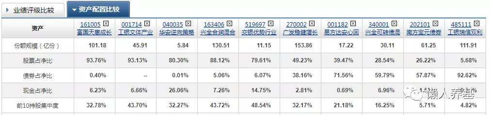

我们在构建自己的投资组合时, 要分辨主动基金哪些具有进攻属性, 适合做前锋; 哪些能攻善守, 适合中场; 哪些又是防守型选手, 适合做后卫. 公众号后台也老有朋友问我怎么判定一只主动基金的进攻防守属性, 之前虽然作过一些回答但总感觉太过零碎, 今天来写一篇文章完整介绍一下我对这个问题的看法.

## 第一个指标看股票仓位占基金投资组合(净值)的比例, 股票占比越高, 进攻属性越强.

这个指标与基金分类有一定关系. 股票型基金股票占比最高, 偏股混合基金次之, 标准混合型基金再次, 偏债混合基金股票仓位更低, 纯债基金就没有股票仓位.

股票仓位应该多看几个季度的, 通过分析可以看出基金经理的操作思路.

比如朱少醒的富国天惠虽然是混合基金, 但是它的股票仓位不管牛熊基本长期维持在 90%以上的高仓位, 长期看甚至比股票型基金工银文体产业股票仓位都高, 它的进攻属性由此可见一斑.

而董承非的兴全趋势股票仓位长期维持在 80-90%的高仓位, 但今年一季度则大幅调降到 60%以下, 其短期防守属性一下子就显现出来了; 如果他看准时机, 可以随时把股票仓位加上去, 如果市场风格契合, 反弹起来也会很快. 所以有时候以退为进也可以理解为一种进攻.

## 第二个指标看持仓个股的行业集中度.

这个指标通过统计分析主动基金季度持仓明细得出, 天天基金虽然有基金行业配置统计但过于粗糙, 好多细分行业全部眉毛胡子一把抓放在"制造业"了, 根本没多大参考价值.

从细分行业看, 越是单个细分行业占比越高的基金进攻性越强, 反之行业分布越分散均衡的基金则进攻属性越弱.

蔡嵩松的诺安成长混合清一色的芯片半导体, 进攻属性最强, 但涨时齐涨, 跌时共跌, 会导致波动过大, 所以才会有涨时蔡经理, 跌时经理菜的笑谈.

再比如我们都熟知的张坤的易方达中小盘混合和刘彦春的景顺长城新兴成长混合集中重仓白酒消费, 赵蓓的工银前沿医疗和葛兰的中欧健康医疗混合集中重仓医药医疗都是很著名的进攻属性很强的例子.

## 第三个指标看前十大重仓股的集中度和个股集中度.

有的主动基金前十大重仓股就占到基金净值的 70-80%, 有的只有 30-40%; 有的基金个股都顶格配置到 10%, 有的基金则再看好的个股也只配置 5-6%.

前十大重仓股集中度越高, 个股集中度越高, 基金的进攻属性越强; 反之基金的进攻属性越弱.

## 第四个指标看主动基金持仓股票换手率.

2019 年和 2020 年全部偏股主动基金的平均换手率都是 310%左右.

换手率越高, 说明基金经理择时越频繁, 想通过择时创造超额收益的意图越明显, 因而基金的进攻属性越强; 换手率越低, 表明基金的超额收益越是来自于基金经理的选股能力, 而通过择时创造超额收益的意愿越弱, 因而进攻属性越弱.

从换手率角度看, 大成新锐产业、华安逆向、信诚周期轮动和工银文体产业的进攻属性明显强于交银优势、中泰开阳价值、兴全合润和国富中小盘; 而兴全趋势和广发稳健增长的进攻属性最弱.

## 第五个指标是长期业绩.

同类型主动基金, 业绩越好, 进攻属性越强; 反之, 进攻属性越弱.

构建投资组合的时候还可以简单粗暴做以下考虑: 偏股型基金, 五年以上长期年化收益率到达 20%或者以上的, 进攻属性强, 可以充当前锋; 标准混合型基金, 年化收益率最好达到 15%的, 能攻善守, 适合中场; 二级债基, 年化 8%左右的, 适合防守, 做后卫.

第五条反过来说就不一定成立: 进攻属性越强, 并不意味着业绩越好; 防守属性越强, 也并不意味着业绩会越差.

进攻或者防守属性只是投资风格的一个方面. 所谓盈亏同源, 通常进攻属性越强, 业绩波动会越大; 而防守属性越强显得越稳健, 业绩波动可能越小.

当然, 不同风险偏好的投资者, 对进攻防守属性的理解是不同的. 所谓千人千面, 适合自己风险偏好和投资风格的理解才是最正确的.
