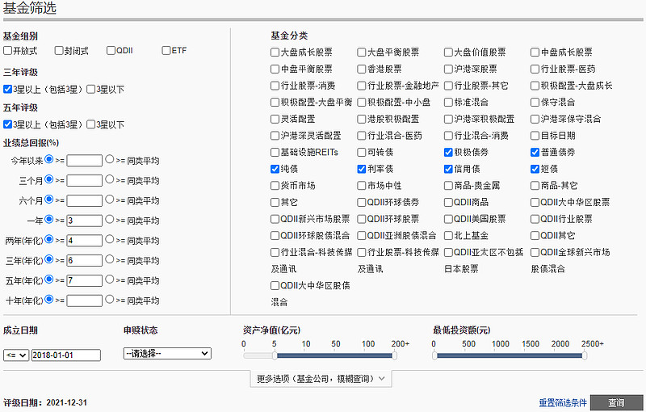
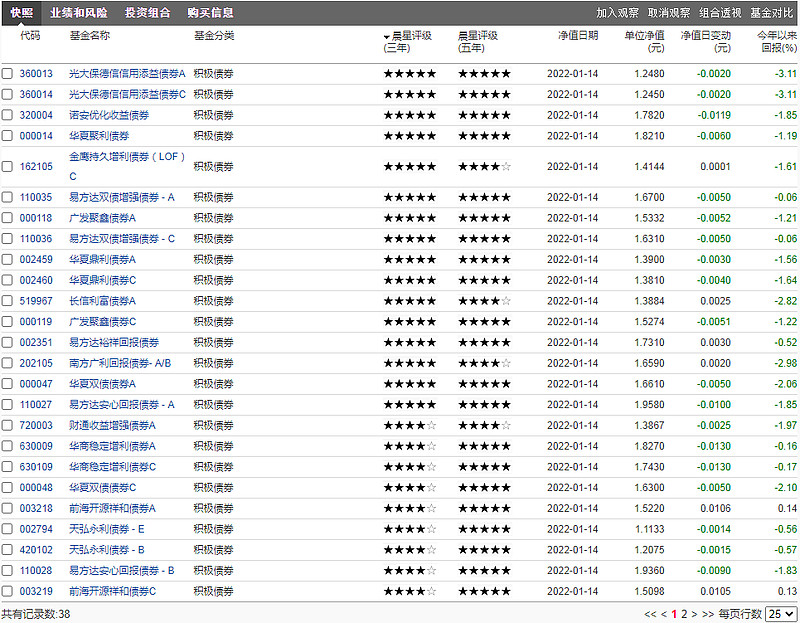
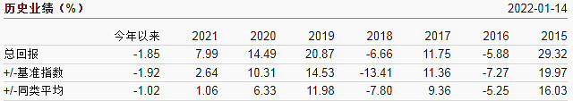
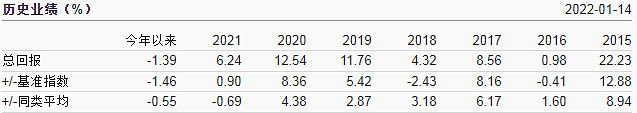
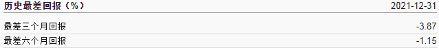
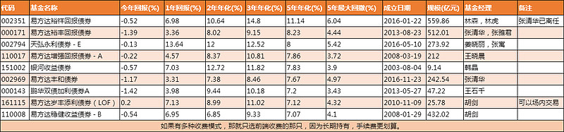

## 1、何为固收+

固收+的本质是一种投资理念, 并不特指某一类型的基金, 简单理解就是在固定收益的基础上加了点浮动收益.

固定收益部分主要配置的是债券, 例如企业债、国债、票据等, 确保每年能获得相对固定的收益, 而浮动收益部分主要配置的是可转债、股票类资产, 会受到市场波动以及基金经理选股的影响.

大部分固收+的固定收益部分和浮动收益部分的比例是 8:2, 固定收益部分的年化收益率大约在 4%-5%左右, 而加上浮动收益后的固收+, 年化收益率平均大约能到 7%-8%.

在安全性较高的前提下, 还能获得如此可观的收益, 这就使得固收+被越来越多的投资者所接受.

但千万不要以为固收+就是固定收益, 没有风险, 那就大错特错了. 固收+的固收部分, 风险是不大, 但"+"的那部分, 既是+的收益, 也是+的风险, 既有可能是正的增强收益, 也有可能是负的增强收益. 最后导致的结果就是固收+的整体收益率可能是正, 也有可能是负, 且当市场环境不好时, 负收益的固收+比比皆是.

## 2、选择标准

### (1)每年的收益率都要为正, 这是最最重要的一点.

既然是投资固收+, 那最最重要的目的就是求稳, 在求稳的基础上, 再考虑获得更多的超额收益.

如果持有一只固收+, 浮动收益部分的亏损比固收部分的收益还多, 那整体收益率就是亏损的, 那肯定就算不上一只好的固收+.

### (2)业绩归因, 要确保固收+的业绩是当前基金经理的功劳.

换言之, 就是要确定这只固收+有没有换过基金经理, 如果当前的基金经理才接手不久, 那这只固收+的历史收益率就几乎没有参考价值.

如果要判断当前的基金经理是否优秀, 那就得去找他管理的时间更长的固收+, 看看它的历史收益率怎么样. 如果不优秀, 那就直接 out, 如果优秀, 那就去选择他管理时间较长的那只. 同一基金经理, 同一类型的基金首选他管理时间最长的那只, 因为那只才是他的名牌, 一定会注入更多的精力.

### (3)基金经理的从业年限.

债市也有牛熊, 只是没有股市那么大的波动而已. 债券相对股市来说, 风险会小很多, 但买入固收+, 也相当于是雇了位基金经理帮你管钱, 那最好还是选择从业经历长的, 历史业绩优秀的帮你管钱会更加放心.

### (4)最大回撤越小越好, 换言之, 就是卡玛比率越高越好.

固收+最重要的是固收, 那投资固收+就应该归到低风险投资中, 体现在收益率曲线上, 就是历史最大回撤.

如果持有一只固收+, 最大回撤也能达到十几个点, 那我估计肯定没有人能长期坚定持有.

最大回撤也可以用卡玛比率来表示, 卡玛比率 = 超额收益 / 最大回撤, 收益率越高, 最大回撤越小, 卡玛比率就越高, 所以卡玛比率理论上是越高越好.

### (5)2022 年附加条件, 可转债持仓占比不要超过 20%.

2021 年有很多固收+的业绩表现得非常好, 但业绩归因后, 发现业绩的主要来源是高仓位的持有可转债, 而可转债恰逢遇到 2021 年的可转债牛市, 收益率出现爆发式增长. 但往往这种增长是不可持续的, 随着可转债整体估值的抬高, 当前可转债的债性已经很低, 而股性很高, 这就会造成 2022 年的可转债市场波动会很大, 想要再通过可转债获得超额收益将会变得非常困难.

所以, 2022 年选择可转债, 我会单独加上这一条, 可转债的持仓比例不能太高, 最好是低于 20%.

## 3、选择实操

只讲理论而不讲实操, 那都是在耍流氓. 虽然固收+已经不算是什么新产品, 但各大基金公司的官网我都去逛了一遍, 最后发现还是回到了晨星网. 选过基金的朋友都知道, 晨星网在选择基金方面确实是做得最好的.

(1)如下图, 设置筛选条件.

由于我们追求的是长期稳健的回报, 那筛选时对长期年化收益率的要求就会比短期收益高.

基金分类我们可以如图勾选, 也可以只勾选积极债券, 因为晨星网上还没有单独的固收+选项.

成立日期限制在 2018 年之前, 且规模限制在 5 亿以上.

(2)点击查询后, 可以得到如下图的 38 只债券基金.

通过查询条件的筛选, 把固收+的选择范围从大海捞金缩小到 38 只, 使我们更容易选择出好的固收+.

(3)进入详情页, 根据选择标准一项一项的核对是否满足要求, 满足要求的就可以加入自选.

反例:

查看排名第一的光大保德信信用添益债券 A(360013), 发现 2016, 2018 年都是负收益, 且基金经理更换频繁, 虽然这两年的负收益不是当前基金经理造成的, 但当前基金经理才任职 2 年多, 且基金持仓的可转债比例高达 79.11%, 直接 out.

正例:

易方达裕丰回报债券(000171), 每年收益都是正收益, 且相当可观, 基金经理张清华管理的时间已经 8 年多, 且可转债占比仅有 6.36%.

历史最差回报的亏损也非常有限, 只要能坚定持有 1 年, 那都是正收益. 各项指标都满足, 这才是我们要找的固收+.

## 4、选择结果

选择固收+的实操是一步费时又繁琐的操作, 需要一只一只的去核对是否满足所有的选择标准, 对于没有那么多精力的朋友, 可以参考下图, 我已经帮你把这一步费时费力的操作做了.

上图是根据客观数据选择出来的优秀固收+, 不代表本人主观意见.

上图是我严格按照固收+的选择标准, 选择出来的 9 只优秀的固收+基金. 可能是我的选择标准定得太高, 满足要求的固收+产品数量仅仅 9 只, 不过, 这也挺好的, 可以大大减轻我们的选择困难症.

## 结语:

投资固收+, 我们最最重要的目的就是求稳, 只有在稳的基础上还能增加正的增强收益, 那才是我们要找的固收+

## 原文

- [选择固收+, 看这篇就够了](https://xueqiu.com/9896517675/209150498?share_type=weixin&data_type=link&data_model=sd&fix_uid=7010266987&sharetime=2)
