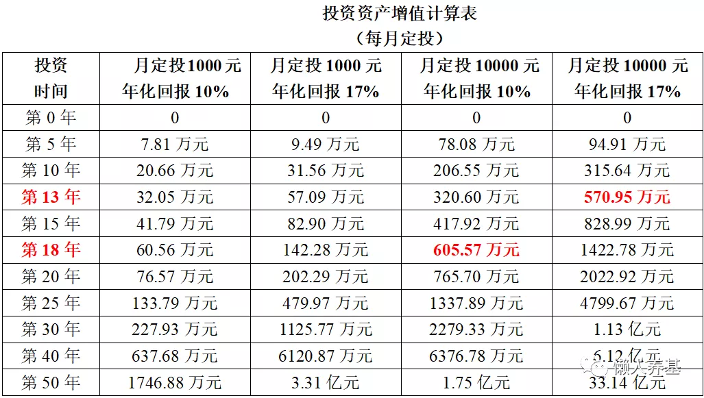

## 如何定义财务自由

一提到投资, 有一个话题永远绕不开, 那就是财务自由.

财务自由的基本定义是, 被动收入可以覆盖我们日常生活所需全部开支, 包括衣、食、住、行, 医疗健康的需要, 基本的交际, 必要的娱乐, 等等.

但财务自由也是分层次的, 就拿基础的衣食住行来说, 吃山珍海味、一身行头几十上百万、住豪华别墅、出行豪车头等舱, 是一种财务自由; 粗茶淡饭、衣着简约朴素、住普通公寓、开十几万的代步车, 也是一种财务自由.

而绝对的财务自由差不多是一个伪命题, 由于人的贪婪和各种奢侈品的出现, 再多的钱也不够用. 百万财富, 可能连财务自由起步的标准都达不到; 千万财富, 一个百万手包就可以把你打败; 亿万富豪, 一辆限量款超跑就能让你望而却步……更遑论顶级豪宅、各种极尽奢华的销金窟了.

网上那些虚头巴脑的财务自由标准就不用看了, 它只会让人充满焦虑和绝望. 对普通人来讲, 最基础或最低层次的财务自由, 就是被动收入超过自己的年薪或自己创业的年均收入, 这时候就可以躺倒不干, 退休了.

我认为这种只跟自己比的账务自由, 结合个人的能力和现状, 显得简单而纯粹, 而且会让人有盼头, 实现起来会更有动力.

如果还想再积极一点, 为了克服通胀对我们生活水平的影响, "退休"后被动收入每年还要有 3%左右的增长, 以维持自己当前的生活水平不降低.

可能马上会有人提出反对意见, 你这个财务自由的标准是静态标准, 过十年二十年等你这个财务自由目标达到时, 那时的财务自由标准早就面目全非了.

别急, 我会在下文会涉及到这个问题.

## 为什么要实现财务自由

到底活着是为了工作, 还是工作就是为了活着?

社会分工在提高效率的同时也会让人做着日复一日简单重复的工作, 无休止的加班更增添了我们的疲惫感和挫败感; 创业的艰辛又会让我们为了得到生意和业务而陪吃、陪喝、陪笑……

"人在屋檐下, 不得不低头", 应该是我们大部分职场或创业人士的真实写照.

而有了一份能完全覆盖日常开支的被动收入, 或者说这份被动收入已经超过我们不得不"为三斗小米折腰"而工作带来的收入时, 我们是不是可以挺起腰杆来说不了呢?

对! 努力实现财务自由就是为了遵从自己内心, 干自己喜欢、自己想干的事.

财务自由某种程度上就是可以说不的自由.

TM 的, 我早看自己的 BOSS 不爽了……早不想做这么憋屈的生意了……

辞职, 歇业. 生活不止眼前的苟且, 还有诗和远方.

其实从实现人生价值的角度看, 追求财务自由的过程就是实现人生价值的一部分. 而真正实现财务自由了我们也闲不下来, 我们会用自己的兴趣继续创造财富, 只是这种创富过程显得不是那么急功近利, 更多的还是一种随意而安.

而只要给社会创造了价值, 回报一样会源源而来.

## 财务自由到底需要多少钱?

华尔街有个财务自由 4%法则, 也称 25 倍法则:

财务自由本金 = 一年支出 / 4%

或者:

财务自由本金 = 一年支出 × 25

也是说, 如果一年的支出是 12 万元(每月支出 1 万元), 则想要获得财务自由需要的本金是 12 万元 / 4% = 300 万元; 如果一年的支出需要 30 万元(每月 2.50 万元), 则财务自由本金 = 30 万元 / 4% = 750 万元. 依此类推.

我认为这个 25 倍法则已经足够保守了.

1、将这 25 份先拿出 10 份来在 10 年之中使用:

第一年, 2 份放货币基金(年化收益率 2-3)供第一、二年开销, 2 份放纯债基金(组合, 年化收益率 3-4)), 6 份放积极债基(组合, 年化收益率 6-8%).

第三年从将纯债基金全部转出至货币基金, 供第三、四年花销用, 同时从积极债基中转出 2 份到纯债基金, 余下 4 份积极债基.

第五年如法炮制, 余下 2 份积极债基.

第七年开始只余下 2 份货币基金, 2 份纯债基金.

第九年余下 2 份货币基金用到满十年.

纯债基金也会有波动, 偶尔年份也会有负收益, 所以我们给出两年才转出一次的方案确定性就很高了.

2、余下 15 份放入一个股债均配的主动混合基金组合中一直不动, 如果在 10 年中能够达到年化 7%左右收益率, 那么 15 份就翻倍到了 30 份; 而如果目标只是恢复到 25 份, 只需要达到 5.2%的年化收益率. 从经验上看, 要达到这样的收益率都并不难.

3、从第 11 年开始, 将余下的部分重新分成 25 份, 10 份用于近 10 年, 15 份继续投资于主动偏股基金组合.

如此 10 年往复一次. 本金大概率会越滚越大, 根本花不完.

当然这也才是财务自由该有的样子.

## 通过一定的财务规划, 普通人可以实现财务自由吗?

答案是肯定的.

但每个人的财务状况是千差万别的, 因此肯定不存在一个标准的、普遍适用的实现财务自由的方案.

我们每个人必须先努力让自己值钱, 现阶段挣得够多, 实现财务自由才具备现实基础.

所谓巧妇难为无米之炊, 挣得太少、入不敷出的人肯定没有本钱谈财务自由; 而挣得多、花得更多的人, 也永远走在入不敷出的路上, 同样没有谈财务自由的资格.

想要实现财务自由, 必须适当约束自己当下的消费欲、延迟享受, 同时做好财务规划.

为便于展开论述和计算, 我把实现财务自由的起点定在能把自己当下收入的一半结余下来用于基金定投. 当然如果能把更大比例的当期收入进行投资, 实现财务自由的时间肯定会缩短, 而用更低比例投资的人实现财务自由则需要更长的时间.

如果一直有能力做到将收入的一半按月投入到主动偏股基金里, 要达到财务自由标准, 也就是年收入的 25 倍、月收入的 300 倍, 需要多长时间呢?

我做了个月定投计算表格如下图.

如果按月入 1 万计算, 每月投入一半就是 5000 元, 达到 300 万的财务自由本金, 按宽基指数年化回报 10%需要 18 年, 按主动偏股基金平均年化回报 17%需要 13.50 年.

需要特别注意的是:

1、我们用同样的计算方法、对不同的人设定了不同的财务自由标准.

不同的人, 能力和对未来的预期不同, 对应着不同的财务自由门槛. 年入 12 万的人, 只需要 300 万就算达到财务自由标准了; 而年入 100 万的人, 需要 2500 万才算财务自由.

2、为了简化计算, 我们假设了十年中每个月投入的金额都是一样的, 而我们在前文中设定的财务自由的起点是能把每月收入的一半投入权益基金里; 放在十年以上的维度, 我们的收入其实是不断增长的, 从薪金来看近十年远远不止翻了一倍, 所以我们预期的投入也是不断增加的.

举例来说, 现在月入 1 万元的投资者当前每月可以投资 5000 元, 十年后月薪可能是 3 万元, 每月的投入就达到了 1.5 万元了. 这样算下来, 到了 13.5 年或者 18 年后, 这样的投资者积累的财务自由本金就不止是 300 万元, 也许可能是 450 万元或者 600 万元, 能够与当时的物价和消费水平相适应, 还是能够满足那时的财务自由标准的.

如此说来, 这样给每个人"量身定做"的财务自由目标, 应该有很多人能够达成吧?

可我的基本结论是否定的, 如此"低标准"的财务自由也只有少数人能够最终达到.

原因也很简单: 结余一半的收入和坚持十多年都是逆人性的.

大部分人的财务自由都只是一个梦, 不会认真地付诸实践; 财务自由当然也只会眷顾少数人.

但对大部分人而言, 只要能结余一部分钱, 并坚持长期投资, 我们中的大部分人可以做到财务健康和财务安全, 同样可以过得舒适自在.

## 原文

- [普通人如何通过基金投资实现财务自由？](https://mp.weixin.qq.com/s/vZqbiM0CRiu8fCQBjkMmJg)
