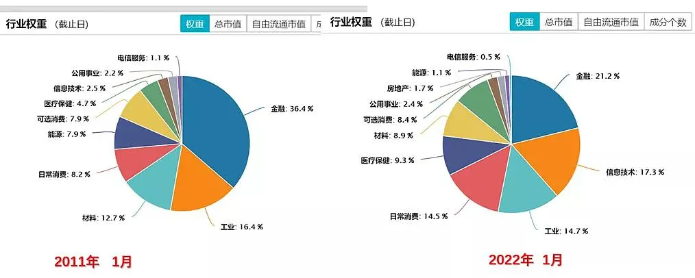

但凡接触过基金投资的小伙伴都听说过被动(指数化)投资和主动投资(管理人主动选股, 主动择时). 网上也有大把文章教人做指数投资, 只要看估值表, 就可以简单化投资, 实现低买高卖.

但事实真的如此吗? 本文会逐步讨论"看估值买宽基的意义"到底有几何? 实际上, 指数估值的方法有很多, 我们最常见/用的是滚动市盈率 PE (TTM).

PE=P/E=市值/盈利

指数的市盈率=所有成分股的市值之和/所有成分股的净利润之和. 这个数据不需要大家去算, 很多软件上都会给出指数的估值参考.

之所以企业/行业之间会产生不同的估值, 是市场对不同企业/行业有着不一样的预期. 比如利润增速高的公司, 市盈率就会大大超过增速低的公司. 因为市场认为它更具备成长空间, 所以愿意给它更高的估值.

指数的 PE 也是同理, 比如 A 股的沪深 300 的 PE 和创业板相比较低, 就是由于利润增速差距大, 市场给的估值不同所导致的.

那指数怎么才算"低估"呢?

有不少投资者都会参考一个指标: 估值历史百分位.

把历史 PE 从小到大排序, 然后看当前的 PE 处于(历史上)什么样的位置. PE 的历史百分位表示的是—在历史上有多少比例的 PE 是低于当前 PE 的.

数据来自 wind, 截至 2022/1/15

比如当前(2022/1/14)沪深 300 的百分位是 72.85%, 说明历史上有 72.85%的 PE 是低于当前 PE 的. 这个数值越大, 说明指数当前的估值越高.

那是不是说明目前处在百分位 72.85%的沪深 300 是高估呢? 我们带着疑问继续讨论.

之所以用【沪深 300 指数】 来举例, 是因为沪深 300 是我们投资中一个重要指标, 是一个跨市场, 包容性强的【宽基指数】.

所谓包容性, 是说沪深 300 包含了上海、深圳 2 个交易所规模最大、交易最活跃的 300 只股票, 是蓝筹股、核心资产的代名词, 基本上涵盖了中国各行各业(除互联网外)最为优秀的公司.

指数每隔一段时间都会来一次优胜劣汰, 把表现不好、流动性差的剔除掉, 而那些涨得好的企业则会被调入.

在这样的推陈出新中, 沪深 300 是一直处在变化之中的!

我们都知道它在变, 但对于这个变化的程度到底有多少? 我们其实是模糊的, 因为很少有人会关注沪深 300 指数内 300 只股票所属行业的变化.

我们用【数字】直观的表征这个变化

【沪深 300 近 10 年的行业变迁】

数据来自 wind, 截至 2022/1/15

再进一步, 我们来看各个行业在【最近十年具体的权重变化数值】

数据来自 wind, 截至 2022/1/15

【信息技术】(隆基股份、立讯精密、海康威视)

【日常消费】(贵州茅台、五粮液、伊利、泸州老窖)

【医疗保健】(恒瑞医药、迈瑞医疗、药明康德)

在近 10 年的维度里, 这三类行业权重上涨最多, 分别上涨了+14.8%、+6.3%和+4.6%.

【金融】(招商银行、中国平安、东方财富)

【能源】(中国石油、中国石化、中国神华)

【材料】(紫金矿业、万华化学、恩捷股份)

在近 10 年的维度里, 这三类行业权重下跌最多, 分别下降了-15.2%、-6.8%和-3.8%.

沪深 300 在这 10 年里发生了巨大的变化, 流水的成分股, 铁打的沪深 300, 指数名字虽然还是没变, 但 2011 年的沪深 300、和今天的沪深 300 已经完全不是一个东西了.

目前沪深 300 的前十大持仓和权重占比

之前创业板的股票上市满三年才能纳入沪深 300 指数, 导致宁德时代等一直没有被纳入沪深 300. 修订后, 【上市时间超过一年】即可纳入沪深 300 指数.

所以在去年底, 宁德时代、爱美客、迈瑞医疗、卓胜微等创业板大牛公司纳入了沪深 300, 沪深 300 成分构成中, 细分行业的新能源和医药的权重大幅增加. 内在行业变化反映了当前市场趋向科技、消费与健康等方向, 也是当前经济结构变化的趋势.

未来, 新规会让未来沪深 300 只股票所属行业加速变化! 加速指数"追涨杀跌"的过程.

那么像沪深 300 这样的宽基指数, 内在所属行业的大幅变化, 对于"看估值买指数的意义"到底有多大影响?

根据文中数据表明, 最近 10 年金融行业权重下降了 15%, 而信息技术上涨了 14.8%.

假设, 金融行业在沪深 300 中的权重的降低的 15%, 和信息技术行业在沪深 300 中权重升高的 14.8%相抵, 那么即使沪深 300 指数在十年前和今天处在一样的位置, 指数 PE 也会变高!

因为通常金融行业的市盈率通常比较低(例如 10 以内), 而信息技术的市盈率通常比较高(例如 40 以上).

例如这 15%的权重, 从 10 倍市盈率的金融, 变成 40 倍的信息技术, 会直接导致沪深 300 指数的市盈率提高 4.5 倍左右!

15%\*40-15%\*10=4.5

(仅代表演示计算, 不代表指数市盈率的计算方法).

这真是什么都没变, 只是调了调行业, 就一切大不同了!

那我们看估值来买指数还有意义么?

这就像是同一个水果篮子, 以前里面装的大多是【普通大苹果】, 现在大多是【猫山王榴莲】, 我们能单单只看水果篮子价格的变化, 来判断这个水果篮子是卖贵了还是便宜吗?

当然, 在这里并不是说让大家不能去看估值买宽基, 而是不要迷恋估值对于投资的影响.

哪怕是在去选择窄基行业投资的时候, 除了要看 PE 以及 PE 的分位数, 还要考虑具体行业未来的成长性. 因为行业指数也会随着行业的快速成长到成熟, 估值也会发生变化. 哪怕 PE 和 PE 百分位都很高, 如果行业成长空间广阔, 那么也会具有一定的投资价值.

而且估值指标有很多种, PE 指标只是众多估值指标中的一个. 真正专业的投资者是会把估值指标与未来的成长性相结合.

目前跟踪沪深 300 的指数基金规模约为 2488 亿元. 在所有指数基金规模中占比最高, 约为 11.19%. 其次是中证 500 占比 6%, 证券公司占比 4%.

对于大多数人来说, 指数基金还是承担着底仓的重要角色.

综上所述

正如巴菲特所说的, 投资是一个模糊的正确. 这世上不可能有一个固定方法去投资, 就能得到很好的回报.

PE 仅能作为投资一个参考指标, 不要迷恋估值对于投资的影响, 特别是宽基指数. 在这点上, 行业指数的 PE 可能会比宽基指数的 PE 要更客观一些, 即使同一行业里的个股仍有会有巨大分化, 但整体行业的估值还是有一个相对区间.

我们永远要用动态思维去思考和投资.

凡是过往, 皆为序章.

## 原文

- [看估值，买沪深300的一个大漏洞！](https://mp.weixin.qq.com/s/99_4pE6V9oiNANmW5wuSEA)
