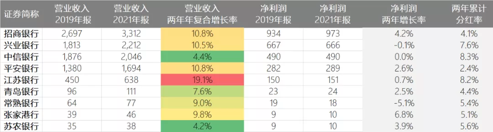

最近星球有个粉丝发了个 H 安证券的测算, 说:

21 年, 2 亿规模账户网下打新收益是 12%, 5 亿是 6.2%;

22 年, 2 亿规模账户网下打新收益预估是 5.3%, 5 亿是 3.2%;

收益减半, 以后选基金不用太纠结打新问题了.

实话说, 22 年公募基金的打新收益, 肯定是不及 21 年的~

不过打新这东西吧, 本来就是一年不如一年的, 要知道 20 年时, 打新基金收益可是能达到一年 15 个点…

当时咱只需要无脑买 2 个亿左右的股票基金就好了, 随便都能赚, 和捡钱似的.

那为啥一年不如一年, 22 年打新收益要更差呢?

一个是市场资金没有以前那么充沛了, 这就会导致新股收益下降, 现在你们去瞅新股, 经常动不动就破发, 整体打新股收益率大不如前.

一个询价规则也发生了一些变化, 以前可以抱团给低价, 现在不行了, 价格更加市场化, 所以收益也大大下降.

但有总比没有的好吧~

这不机构预测 22 年打新基金的收益还是有 5.3%么, 虽然往年有 10%+, 但 5.3%也不低, 怎么就不值得关注了呢

我觉得 22 年依然还是得关注一下基金打新的, 毕竟开年这么难, 能多赚一点是一点.

打新基金, 对于纯股票型的, 最佳基金规模就是 2 亿上下, 注意, 这个规模是合计的, 把 A、B、C 啥的算在一起.

如果是 ETF 的话, 则直接看 ETF 的规模.

简单举个例子吧, 比如我今年比较看好银行板块, 选择 ETF, 那么能有 2 个亿左右规模的 ETF, 就最好.

那我们就去找这类基金.

很轻松就能找到.

比如鹏华中证银行 ETF, 近一年相对中证银行指数的超额收益达 8.11%, 规模是 2.54 亿.

如果你看好银行指数, 就买这个 ETF 就可以了, 因为有打新收益的加持, 会比指数表现更好一些.

如果你场内不考虑, 场外也可以选华安中证银行, 近一年也有 6%的超额收益, 规模为 2.9 亿.

但是华安中证银行费率略高, 管理费为 1%, 而鹏华中证银行只需要 0.3%, 性价比是要更好一些的.

这个 2 亿规模打新, 适用于各种基金, 比如主动股票类的, 指数类的, 都有这个打新收益的加持.

所以你们看金牛 20, 为啥选的规模都是 2 个亿左右, 也是想在优选基金的情况下, 多吃这个打新收益.

........

对了, 这周 9 家银行公布业绩快报, 除了中信银行增速略慢一点, 其他银行净利润同比增长均超 20%, 江苏银行更是超 30%, 增速牛啊~

虽然有 20 年疫情基数低的关系, 但直接对比 19 年, 整体增长也是不错的, 营收平均增加 10%以上.

利润因为疫情为实体让利的原因, 增长不多, 但这两年分红还是不错的.

考虑目前银行接近翔一般的估值, 后续其他银行业绩能跟上的话, 接下来搞不好要迎来一波春天.

当然春天不来的话, 吃分红也还行吧, 再差的话, 我就当理财来配了~

## 原文

- [一年不如一年…](https://mp.weixin.qq.com/s/gnip8egvJmElNTB2uDBuVw)
