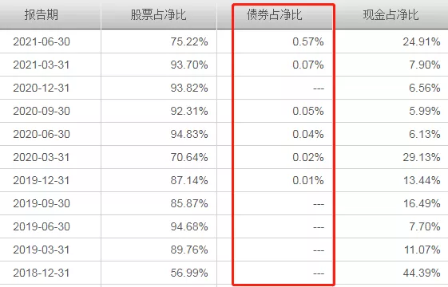
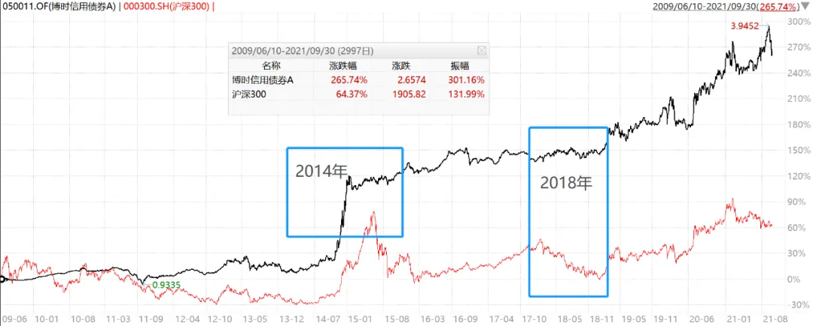
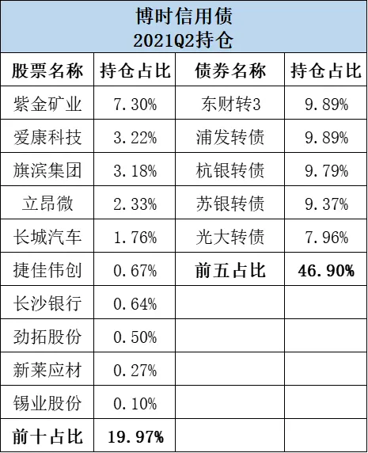
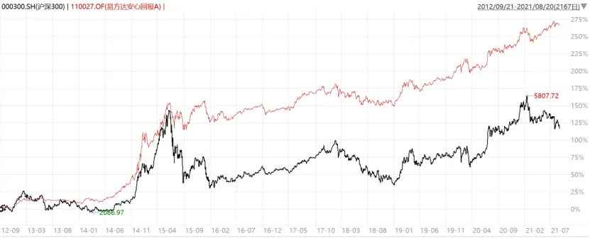
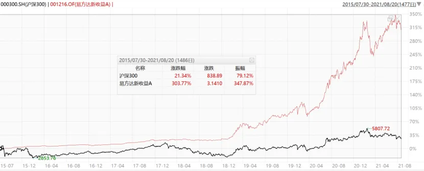
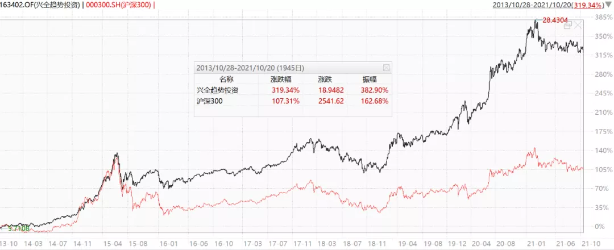
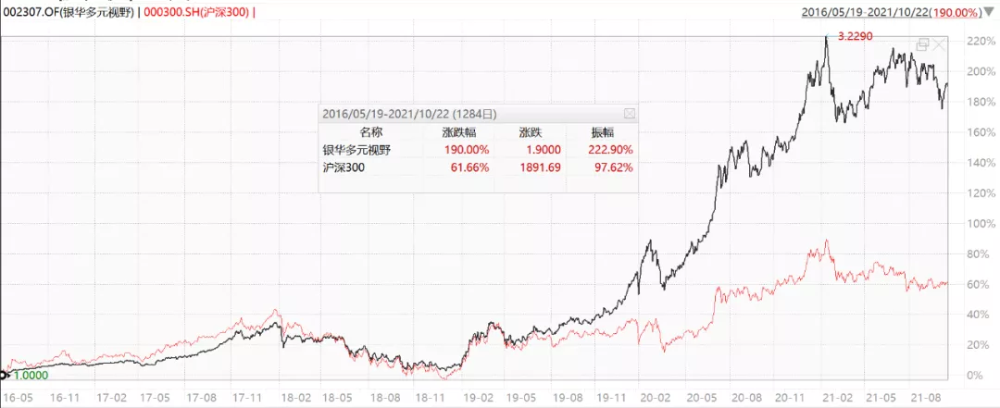
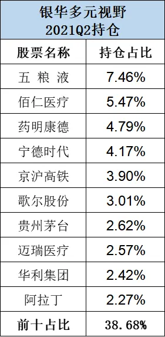
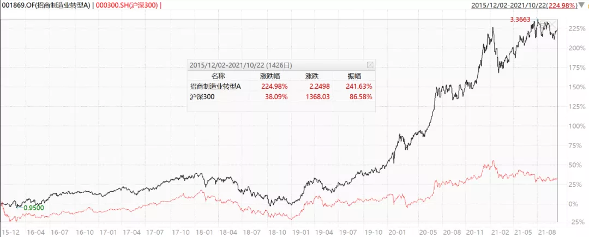
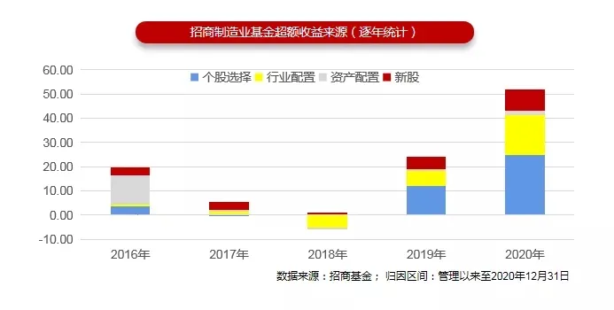

我们考察基金经理时, 大部分时候是关注【选股能力】. 然而, 绝大部分基金既可以投股票, 还可以投债券, 或者持有现金. 其中股票还包括了 A 股和港股, 债券还包括了利率债、信用债、可转债等.

因此, 一个全面的基金经理应该同时具备大类资产配置能力(含择时)、选股能力和选债能力.

但是这种基金经理是非常稀缺的, 毕竟投资范围太广了, 对知识和经验的要求非常高, 即使很多从业十几年的基金经理也不敢说自己是全能的. 同时擅长这些的优秀基金经理应该数不出超过 15 个.

实际情况是: 大部分偏股的基金经理都较少配债, 有时候基金经理即使持有现金也不去投资债券, 因为他们不懂.

比如, 下图是某个基金的资产配置情况, 很多时候基金经理宁愿持有现金也不太配置债券, 这对资金效率是一种浪费.

大部分偏债的基金经理, 在选股时都比较依赖基金公司支持, 他们主要决定配多少比例股票, 但不擅长具体选股, 也是因为不懂.

我们都知道股和债都有周期, 不可能一直表现好. 往往还会有跷跷板效应. 如果基金经理同时擅长选股、选债和大类资产配置, 就能更好适应各种不同的市场环境, 持续稳定的创造投资回报.

此外, 三项全能的经理也需要一只灵活配置的基金, 最好股票、债券的仓位都可以灵活调整, 投资范围较广, 这样便于基金经理发挥, 这样的基金也就非常适合作为组合底仓, 长期持有.

今天, 就为大家盘点几位"三项全能"的基金经理, 以及他们合适的基金.

## 一、博时基金·过钧

过钧是 A 股最有资历的顶流固收基金经理, 从业经验 20 多年, 任基金经理也有 17 年余经验, 资历排全行业第 3.

他的代表作博时信用债, 名叫"信用债", 其实是一个比较激进的二级债基, 2021 二季报显示, 股票仓位顶格配置 19.96%, 可转债占比高达 77.46%, 信用债占比不到 9%.

翻看历史持仓, 基本上一直保持了这种积极的重配股票和可转债的配置, 这也是过钧的特点——积极的利用各种大类资产创造收益, 尤其擅长可转债. 不过波动率并不会特别高, 因为他对可转债的选择还是偏稳健的.

代表作博时信用债 2009-6-10 成立, 过钧从该基金成立以来一直独立管理该基金, 长达 12 年以上, 是市场上稀有的长情基金. 全市场管理单一基金任职时间 10 年+ 且任职年化 10%+ 的基金经理仅 26 人; 其中, 偏债型基金经理仅 4 人, 而过钧任职年化第一.

截止目前(2021 年 10 月 22 日, 下同)取得了 269.15%的收益, 在同期 97 只偏债基金中排名第一! 年化收益率 11.13%, 年化波动率 12.35%. 大幅战胜了沪深 300, 同期为 67.53%.

过钧的资产配置能力很强: 2014 年牛市, 他通过 20%股票顶格配置+70%以上可转债配置, 跟上了牛市涨幅.

到 2015Q1, 他又将股票仓位降为 13%, 可转债仓位降到 6%, 提前落单为安, 保住了收益果实. 2015 年最大回撤仅 7%, 同期沪深 300 最大回撤 42%!

2018 年熊市, 他在保持 20%股票仓位和 20%可转债仓位的情况下, 通过超配利率债, 做波段和调整久期, 依然取得了 3.94%的正收益.

过钧的股票投资强调行业均衡配置, 逆向投资. 2021Q2 股票持仓(见下图)均衡分散, 偏向小盘股, 转债的持仓以金融系为主, 偏稳健.

过钧的另一个特点是每次的定期报告都会写很多, 并且讲的非常好, 值得学习和参考, 我每期必看.

过钧是近年来卸任了大批曾经管理的基金, 目前只管理了 3 只, 规模仅 78.87 亿, 这个规模简直太香了, 有机会创造更多超额收益.

过钧还管理了一只灵活配置型基金"博时新收益", 并且去年开始逐渐加仓了权益, 成功把握住了今年小盘股的行情, 今年以来取得了 28.40%的收益, 市场排名靠前.

2021 年中报显示, 该基金规模仅 3.7 亿, 其中机构占比 94.5%, 绝对是还没被市场发现的香馍馍.

优选基金: 博时新收益(灵活配置型基金, 股票仓位:0-95%)

## 二、易方达基金·张清华

张清华是固收出身, 有 7 年多的投资经验, 是易方达固收的领军人物.

他的代表作易方达安心回报(二级债基), 从 2013-12-23 至今, 取得了 236.26%, 年化回报 16.73%.

甚至战胜了沪深 300, 同期为 117.71%. 在 406 只偏债基金中同期排名第二(第一是过钧). 体现了极强的综合能力.

张清华的特点是长期高仓位持有股票, 股票投资风格跟随市场变化; 灵活配置可转债, 敢于运用杠杆; 积极配置信用债.

张清华的资产配置能力极强. 易方达安心回报虽然股票仓位只能 20%, 但是他积极利用可转债加杠杆跟上了牛市涨幅. 又在 2015 年 6 月精准的减仓. 仅此一役, 2015 年就跑赢沪深 300 指数 24%.

期间可转债仓位:

2014Q4 为 118.52%

2015Q1 为 53.54%

2015Q2 为 3.21%, 实现完美逃顶.

他的易方达新收益 2018 年底之前断断续续由张清华和林森共同管理, 一直保持低仓位, 当股市 2016 年、2018 年下跌的时候, 都获得了正收益. 然后在 2018 年底精准加仓.

期间股票仓位:

2018Q3 为 13.77%,

2018Q4 为 49.58%,

2019Q1 为 75.77%, 之后一直保持高仓位运行, 充分享受了本轮牛市.

2021 二季度股票仓位 75%.

如果把易方达新收益当成一只偏股基金来看, 从 2019-1-1 至今, 取得了 218.13%, 同期排名 153/1851, 同期沪深 300 为 64.74%. 说明债券出生的张清华, 管理股基能力也很强.

唯一不完美的就是管理规模, 张清华目前总管理规模高达 1201 亿. 即使只计算权益管理规模, 也有 300 多亿, 这么大的规模, 想再要在牛市中迅速减仓是很难的.

优选基金: 易方达新收益(灵活配置型基金, 规模 110 亿, 股票仓位:0-95%)

## 三、兴证全球基金·董承非

最近, 600 亿顶流大佬董承非离职是一个热点话题, 稀缺的全能经理又少了一位, 虽然他离职了, 但我还是想介绍一下, 因为他的能力太稀缺了.

除了投资股票和债券, 基金创造收益的方法其实还有很多, 比如配售、定增、打新、股指期货、套利等. 要说市场上谁的"武艺"最全面, 那一定是董承非.

董承非, 2003 年大学毕业就加入兴证全球基金, 从研究员逐步成长为现在的副总经理, 其实年纪并不大(1977 年), 但已经是一员老将了, 有 14 年的投资经验.

董承非的特点是收益来源很多, 他注重大类资产风险收益比, 充分利用股票、债券、可转债、股指期货、大宗商品等投资品种, 并采用定增、大宗交易、套利、择时等灵活的投资方法, 为基金创造收益. 因此他的基金有长期收益好、波动回撤低的特点.

代表作兴全趋势(163402), 也是兴证全球的王牌基之一, 2005.11 成立以来, 在两位大佬王晓明和董承非的主要管理下, 至今已取得 16 年 24 倍的收益.

其中, 董承非 2013 年接手, 管理近 8 年, 取得 321.08%的收益, 同期排名 29/136, 年化收益率 19.66%, 年化波动率非常低, 仅 17.6%, 夏普比率是偏股基金中最高的基金之一.

他的另一只基金兴全新视野, 拥有业内几乎最为"宽松"的配置空间: 股票为 0-95%、债券 0-100%、权证 0-3%、资产支持证券 0-20%、股指期货 0-10%、债券回购 0-40%.

该基金在 2015 年 7 月 1 日的(牛市高点)发行, 到 2015 年底, 居然还取得了 3.4%的正收益, 而同期沪深 300 收益为 -12.27%.
董承非对多种投资品种、投资方法和投资工具的驾轻就熟, 是他同时取得业绩好和低波动的重要原因. 也是市场上非常稀缺的"低波动+高收益"基金经理, 难以被超越, 离职了非常可惜.

不过他后续去了私募, 应该能更好的发挥. 因为私募的投资范围更大, 投资工具更多, 会更有利于董承非发挥.

## 四、银华基金·贾鹏

贾鹏是北京大学、香港大学双硕士学位. 历任宏观策略研究员和行业研究员.

贾鹏有 7 年的投资经验, 既管过债基, 练就了自上而下的宏观思维; 也管过股基, 培养了自下而上的微观思维.

债基和股基的投资理念, 有时候是矛盾的. 职业生涯中, 贾鹏敢于自我革命, 做了两次较大的进化: 从【注重绝对收益】转变为【追求长期收益】、从【自上而下为主】转变为【自下而上为主】.

代表作银华多元视野, 是一只灵活配置型基金, 股票比例为 0%-95%. 贾鹏于 2016 年 5 月 19 日任职, 2019 年之前会做一些仓位调整, 2019 年之后, 一直保持了高仓位运作.

截止 10-22, 收益率为 190%, 年化收益率为 21.65%, 同期排名 225|1407.

上图也能看出, 其绝大部分超额收益, 也都是来自于 2018 年投资理念进化之后.

目前贾鹏的投资理念是, 先做资产配置, 从资产之间的性价比出发, 找到相对估值比较便宜的资产. 再会根据不同的市场环境和市场阶段, 以及行业景气度变化挑选行业配置.

确定了大类资产和行业之后, 主要精力放在自下而上选股上, 看增长空间、竞争格局、行业景气度和估值, 重视商业模式和管理层, 追求风险与收益的平衡, 行业均衡配置.

2021Q2 持仓, 股票仓位占 82.4%, 以医药消费科技新能源的龙头公司为主. 债券占比 5.48%, 以国债为主.

优选基金: 银华多元视野(灵活配置型基金, 规模 5.41 亿, 股票仓位:0-95%)

## 五、招商基金·王景

王景从业经验丰富, 2003 年入行, 有近 10 年的投资经验, 是招商基金的头牌基金经理.

她先后管理过二级债基、避险策略基金、灵活配置型、股票型等不同类型的基金, 既有宏观经济的研究能力, 又有深度研究公司的能力, 能力圈广泛.

2014 年, 她管理的股基和债基, 分别获得了股票金牛奖和债券金牛奖, 全市场仅此一位获此殊荣.

曾经(2011-2015)管理的二级债券基金代表作是招商安瑞进取债券, 累计回报 79.20%, 同期排名 16|202(前 8%).

2015 年起, 王景不再管理债券基金, 专注于权益类产品.

偏股基金代表作是招商制造业混合, 2015 年 12 月 2 日任职至今, 累计回报 224.98%, 年化回报 22.13%, 同期排名 41|1219(前 3.5%). 作为一只制造业主题基金, 能取得如此好的收益, 挺厉害的.

从内部做的收益归因看, 资产配置、行业配置和个股选择各贡献了三分之一.

王景擅长做资产配置, 从历史仓位来看, 几次择时都挺准确, 贡献了一定的超额收益, 她的诀窍是把握周期和流动性.

不过王景并没有对择时形成路径依赖, 2017 年, 她发现外资进入后, 市场越来越注重选股, 于是减少了择时频率, 仓位变动较小, 长期保持高仓位运作.

王景一直用"木桶理论"要求自己, 认为决定长期收益率的是最短的板, 因此必须不断的学习、补短板, 提升长期综合能力. 这也是为什么她的能力如此均衡和全面.

王景投资风格主要是关注变化、偏好长景气的行业, 均衡配置, 个股选择上, 比较关注企业长期竞争力, 尤其是对靠技术驱动形成领先优势的企业.

不足之处也是管理规模太大了, 目前 9 只基金, 637 亿, 尤其是近两年, 一下子增加了 7 只基金, 几百亿的规模, 恐怕需要一定的时间去适应.

优选基金: 招商 3 年封闭瑞利混合(可场内购买, 规模 6 亿, 可投港股, 股票仓位 0－95%).

结语: 其实还有傅友兴、邬传雁、徐荔蓉、李崟、林森等基金经理也都具备文章提到的 3 项全能, 但由于他们管理的基金主要是股债平衡型基金或偏股型基金, 没有办法灵活调整, 因此没有纳入本次盘点.

大家感兴趣, 有机会我也可以再介绍介绍, 欢迎大家持续关注我.

## 原文

- [600 亿顶流退圈，细数那些极其稀缺的“三项全能”基金经理](https://mp.weixin.qq.com/s/hewJM7H7KMlAQwWHsEYjVg)
