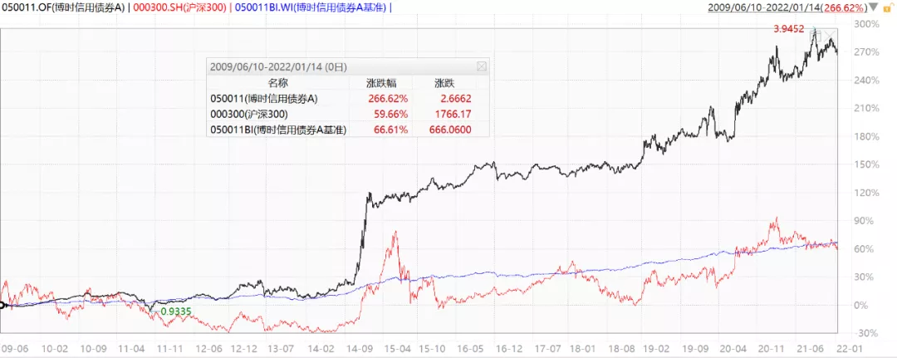
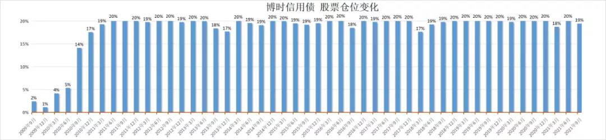
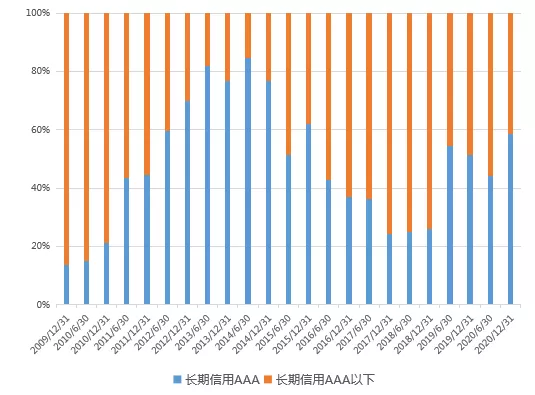
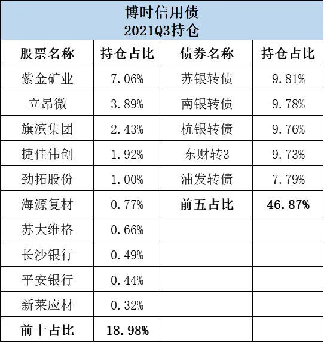
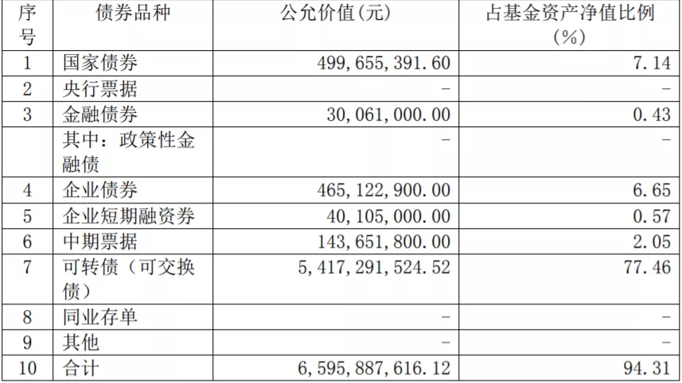
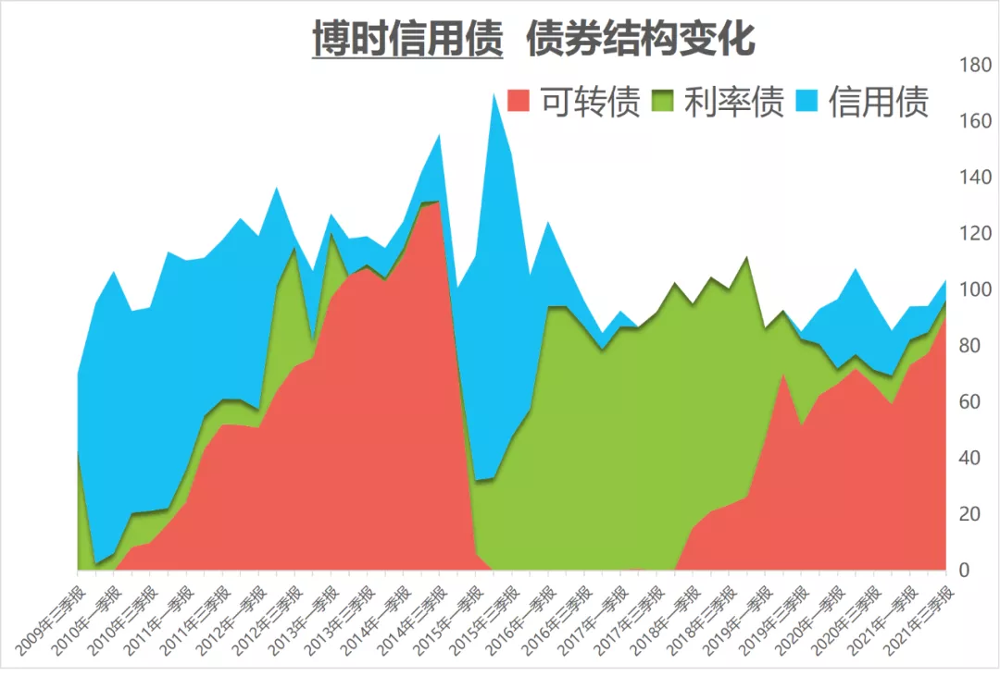
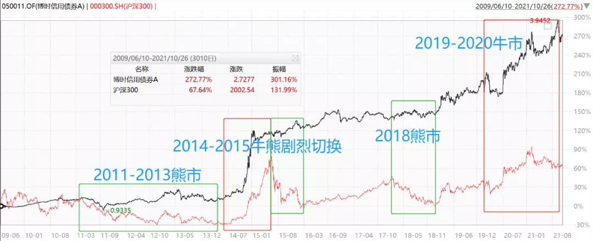
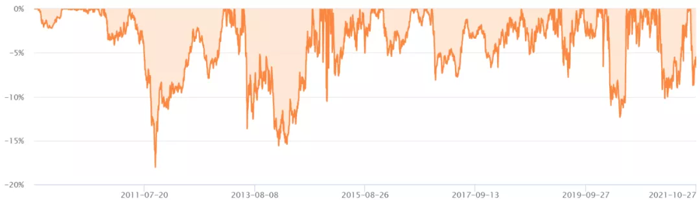
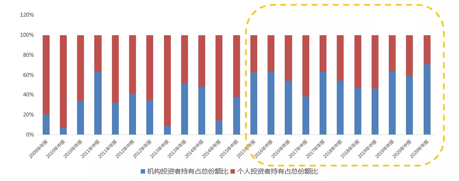

过钧是国内最有资历的顶流固收基金经理, 从业经验 20 年多, 亲身经历过 2000 年美股互联网泡沫; 任基金经理 17 年, 在 2700 多名基金经理中排第 3; 业绩出色, 博时信用债同期业绩排名第 1.

可能是为了培养新人, 过钧是近几年卸任了 10 多只曾经管理的基金, 目前只管理了 3 只, 规模仅 95 亿. 这个规模简直太香了, 有机会创造更多超额收益, 也给了我们买入过钧的基金有一个比较好的时机.

前文[《细数那些极其稀缺的"三项全能"基金经理》](/pages/62bb4a/)简单介绍了过钧, 很多读者都说意犹未尽, 今天就为大家详细介绍一下——博时基金·过钧.

## 基本情况

过钧 1995 年起先后在上海工艺品进出口公司、德国德累斯顿银行上海分行、美国 Lowes 食品有限公司、美国通用电气公司工作.

2001 年回国, 在华夏基金固定收益部工作. 2004 年在华夏基金管理过一年货币基金.

2005 年加入博时基金, 开始管理债基. 先后管理过纯债、二级债、美元债、可转债、分级基金、灵活配置型基金、偏股型基金等, 积累了丰富的投资经验, 能力圈广泛.

任职以来获得过金牛奖、晨星奖等 11 座奖项. 现任公司首席基金经理.

## 业绩情况

过钧的代表作是博时信用债, 2009-6-10 成立, 他从该基金成立以来一直独立管理该基金, 长达 12 年以上, 是市场上稀有的长情基金.

全市场管理单一基金任职时间 10 年+ 且任职年化 10%+ 的基金经理仅 29 人, 其中, 偏债型基金经理仅 4 人.

截止 2022 年 1 月 14 日, 取得了 266.62%的收益, 在同期 27 只偏债基金中排名第一! 年化收益率 10.85%. 不仅大幅跑赢基准(下图蓝线), 甚至大幅战胜了沪深 300(红线).

为什么博时信用债可以大幅跑赢沪深 300? 该基金虽然名叫"信用债", 其实是一个比较激进的二级债基. 2021 三季报显示, 股票仓位顶格配置 19.12%, 可转债占比高达 90.8%, 信用债占比 7%.

翻看历史持仓, 基本上一直保持了这种积极的重配股票和可转债的状态. 这也是过钧的特点——积极的利用各种大类资产创造收益, 尤其擅长可转债. 有基民开玩笑说他有"权益的灵魂".

## 横向对比

过钧任职以来的同期业绩是全市场排名第一, 所以不需要再进行任何同期业绩对比.

而且, 过钧虽然管理二级债基, 不过投资风格一直比较激进, 其他二级债基普遍比较稳健, 与他对比也不太公平.

市场上唯一投资风格和长期业绩能和过钧匹敌的, 可能只有易方达的张清华.

不过张清华现在的管理规模是 1490 亿, 过钧仅 95 亿, 不管是自下而上选股选债还是自上而下资产配置, 过钧优势都很大. 投资经验张清华近 8 年, 过钧 17 年, 过钧经验也更丰富.

## 定量分析

### 1、历史持仓情况

历史持仓基本上保持了顶配股票, 超配可转债的状态, 大类资产轮动, 组合整体略偏权益.

股票平均仓位 17.9%, 可转债平均仓位 51.4%, 信用债平均仓位 30.8%, 利率债平均仓位 33.2%.

股票仓位很少调整, 但是会调整持仓结构.

股票持仓多数时期以大盘风格为主, 投资风格偏向价值, 前十持仓历史平均 PE 为 23 倍左右, PB 为 2 倍左右, 较为看重估值.

行业偏爱: 金融、地产、家电、有色、建材

股票持仓基本上前十就代表了整个股票投资组合, 敢于持股集中, 行业适度分散.

债券持仓变化较大, 看好某一种品种时超配, 不看好时低配或不配.

利率债配置偏向中长久期, 任职期间平均维持在 6.02 左右. 信用债敢于做适度下沉获取超额收益.(见下图).

### 2、当前持仓情况

2021Q3 股票仓位 19.12%, 依旧保持较高水平.

行业总体上比较均衡, 偏向周期, 市值中偏小盘前十持仓平均 PE 为 31.5, 平均 PB 为 4.6, ROE 为 14.6%.(数据来源: 韭圈儿 APP)

债券持仓以金融系可转债为主, 略微加了一点杠杆, 持仓较为集中.

### 3、资产配置能力

过钧投资生涯至少已经经历了 4 轮熊市、3 轮牛市. 基本上都做到了熊市获得绝对收益, 牛市跟上市场涨幅. 他的出色表现很大一部分是通过大类资产配置实现的.

股票基本上是长期顶格配置的, 主要依靠可转债、利率债、信用债的轮换, 以及股票的行业变化来应对市场变化.

过钧是开始管理博时信用债是 2009 年熊市, 一开始也确实是以信用债为主.

2011-2012 年股市是熊市, 债券是牛市, 过钧依靠信用债取得了不错的收益.

2013 年债券转熊, 他开始逐渐减仓债券, 加仓可转债.

2014 年牛市, 他不断加仓可转债配置, 最高达到 130%, 跟上了牛市涨幅, 当年取得了 88.34%的收益, 在同类基金中排名第一!

到 2015 上半年, 他将可转债仓位逐渐清仓, 提前落单为安, 保住了收益果实. 2015 年牛转熊时, 他的最大回撤仅 4.9%, 同期沪深 300 最大回撤 42%!

2018 年熊市, 他在保持 20%股票仓位和 20%可转债仓位的情况下, 通过超配利率债, 依然取得了 3.94%的正收益.

2019-2020 牛市, 他又不断加仓可转债, 跟上了牛市涨幅.

2021 年股市结构性调整, 很多人都出现了负收益, 过钧又提前布局了小盘股和周期股, 取得了优秀的收益. 以博时新收益为例, 2021 年收益为 23.84%, 同期排名 290|2125.

以上调整说明过钧具有极强的资产配置能力, 擅长左侧布局, 但又不会左侧布局的太早.

### 4、风险控制情况

过钧管理博时信用债以来, 年化波动率为 12.33%, 高于其他二级债基平均 8%左右的年化波动率, 低于沪深 300 同期 22.19%的年化波动率.

回撤控制方面, 职业生涯中最大回撤为-18%, 发生在 2011 年 9 月. 2015 年之后之后回撤控制的越来越好, 特别是是 2015-2016 熊市、2018 年熊市这种系统性熊市期间回撤控制较好.

不过总体来看, 波动和回撤高于普通二级债基, 波动水平更接近与股债平衡型基金的.

### 5、持有人结构

机构投资者一直以来都非常青睐过钧, 博时信用债长期有较高比例的机构资金配置.

尤其是 2015 年后, 过钧凭借优秀的业绩打响名气, 之后机构资金长期占比 60%以上. 2021 年中报显示, 博时信用债的机构占比高达 78%. 内部资金占比也比较高.

博时新收益更是长期被机构资金占据, 机构持有比例一直在 90%以上.

## 投资理念

过钧能力全面, 经验丰富, 投资理念非常值得我们学习. 不过这位大佬很低调, 极少出来访谈或路演, 所以很难引用他的投资金句来分析投资理念.

### 1、大类资产配置: 相信均值回归, 左侧布局, 极值调整

过钧说自己的投资理念受霍华德马克思影响较大, 认为市场是有周期性的, 相信均值回归.

他擅长宏观分析和各类资产的估值比较, 选择低风险高收益品种, 卖出高风险低收益品种.

过钧比较认同霍华德马克思在《投资最重要的事》说的: 市场的情绪波动类似于钟摆的运动. 虽然弧线的中点最能说明钟摆的"平均"位置, 但实际上钟摆停留在那里的时间非常短暂. 相反, 钟摆几乎始终在朝着端点摆动. 但是, 只要摆动到接近端点, 钟摆迟早必定会摆回中点.

非常重视"端点", 偏好在极值时做大类资产大幅度的调整, 而不是日常的反复调整.

所以我们前面定量分析可以看到, 过钧在看好某个大类资产的时候敢于重仓, 不看好的时候可以一点都不配置.

过钧:

"我的框架就是低风险低收益, 在市场贪婪的时候, 卖出或者规避那些高风险低收益的资产; 而在市场恐惧的时候, 左侧布局.

霍华德认为市场的波动极致是不可能到中位就停止的, 从一个极点到另一个极点, 我们市场也是一样, 一边是恐惧, 另一边是贪婪, 市场周而复始.

我特别喜欢极值, 极值就意味着均值就要恢复了. 极值是大类资产切换非常重要的阶段, 每一次到极值的时候, 其实也是我组合进行一个大的切换的重要时间段.

极值有很多种, 比如成长股和价值股的估值差异、国债期限利差、信用利差等.

最近这几年, 很多投资者已经不看周期, 觉得赛道更重要, 坡要长雪要厚……但市场还是会有周期性反应, 没有什么东西会脱离地心引力. 霍华德的《周期》里面写了, 周期肯定会重复, 其实历史不是简单的重复.

我不太相信东西一直很便宜或一直很贵, 最近对于某个公司, 大家把估值看到 2030 年、2060 年. 我曾经经历过 2000 美股互联网泡沫, 我记得 1999 年 4 季度有个杂志的封面文章就是《熊市已死》, 说美国市场可能进入一个历史上所从来没有的新阶段, 牛市可以永续, 比较保守的估计假设下一个熊市是 2030 年. 后来过了 6 个月熊市就来了. 所以每一次极值的时候就要小心了."

### 2、股票部分: 逆向投资, 低估买入

过钧说自己的投资风格是价值成长. "价值成长, 比起买高估值高成长的股票来说, 所付出的代价低很多."

价值就是要估值要足够便宜, 最好在大家都比较恐惧的时候进; 同时也要求有一定的成长性, 企业没有增长的话, 也难以获得良好的业绩.

他的历史持仓偏向低估值, 尤其是低市盈率高股息率股票, 中长期持有, 低换手率. 近年来逐渐增加了对成长股的配置.

### 3、债券部分: 信用债适度下沉、利率债波段操作

据介绍, 过钧的债券投资理念受《固定收益手册》和《利率史》两本书影响最大. 最基本的就是要搞清楚风险和收益的对等关系.

债券配置上, 聚焦核心资产, 重视票息价值, 以信用债为基础, 进行适当信用下沉调整, 以获取高额收益回报.

利率债波段操作, 保持中等杠杆和短久期加强组合回撤的控制, 轻易不做交易性博弈, 在久期操作上, 跟随市场利率变化进行灵活调整.

### 4、可转债部分: 偏好低股性、高债性的转债

过钧非常喜欢可转债, 他比较偏好低股性、高债性风格的可转债, 当行情震荡时, 具有较强的防御能力.

过钧也很擅长可转债, 过去有较多的超额收益都是由可转债部分创造. 近年来转债擅长的扩容, 也给了过钧更大的发挥空间.

对于可转债的买入机会, 他颇有心得. 他说:"每当转债纯债收益率达到正 YTM 甚至是转股期权价值接近零的时候是很好的买入机会, 如果是整体市场特征则几乎可以认为是大盘的底部."

### 5、风险控制: 根据不同的大类资产采取不同的风控方式

前面的定量分析我们发现博时信用债比其他二级债基波动更大, 风格更加激进. 因为过钧并不是特别在意波动, 比较认同霍华德说的"波动不是风险, 无法弥补的亏损才是风险".

过钧:

"风险越低的东西, 受宏观的影响越大; 风险越高的部分, 就越跟个体风险越大. 所以我买利率债这些主要是看宏观, 具体的股票、转债相对来说更偏向于个体的, 而且在分析股票的过程中已经把宏观因素考虑进去了."

## 看好方向

虽然平时很少出来宣传自己, 过钧对待基金的定期报告却非常认真, 每次都会写很多, 并且写的非常好, 有很多他对宏观和市场的判断, 被视为必读的基金季报之一, 我自己也是每期必看!

对于后市, 他在最新的 2021 三季报中说:

我们一直强调本轮放水源头的美国对于紧缩更偏向于预期管理, 而非动真格, 市场资金还是要寻找新的出路.

西方疫情迟迟不好转造成供给受限, 加上旺盛的需求, 可能使得通胀压力的高度和长度可能会大于市场预期, 周期股还是有必要在组合内占有一席之地. 相比单纯的因为价格上涨获益的行业和公司, 我们更偏好于量的提升带来收入和利润增长的公司.

## 目前管理的基金情况

过钧目前管理 3 只基金, 合计规模 95.17 亿元, 这个管理规模对于过钧来说是绰绰有余.

过钧近几年卸任了十几只基金, 除了保留代表作, 他还保留了一只灵活配置型基金——博时新收益.

该基金股票仓位 0-95%, 申购费仅需 0.08%(一折), 运作费率 0.65%每年.

博时新收益先前是一个偏打新的基金, 过钧从 2016-2-29 开始和王曦一起管理, 2020-08-10 开始独立管理, 之后他逐渐加大权益仓位, 现在已经是一个偏股型基金了. 也算是满足了过钧"权益的灵魂".

基金经理既会选股, 又会固收, 还能择时, 规模又不大, 我比较看好博时新收益, 后续有望成为过钧新的大展拳脚的舞台.

## 原文

- [有意思, 这位固收大佬, 有着"权益的灵魂"](https://mp.weixin.qq.com/s/F8DFPLnbm6IhbmcqIn0B9g)
