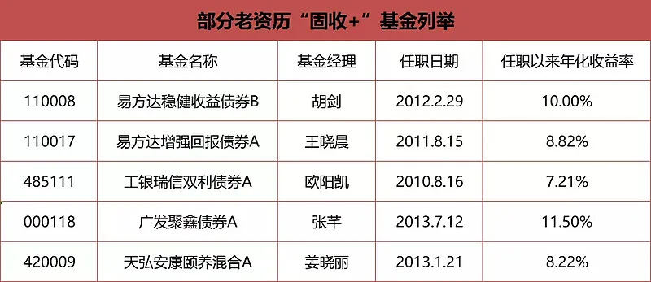
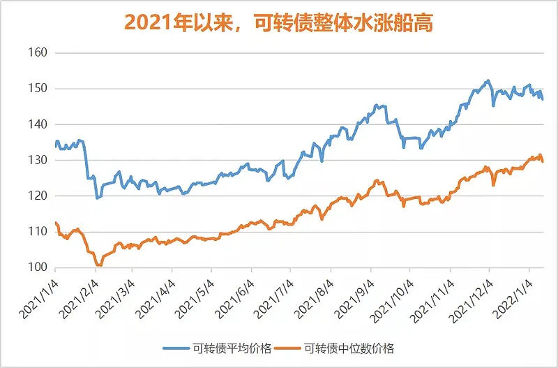
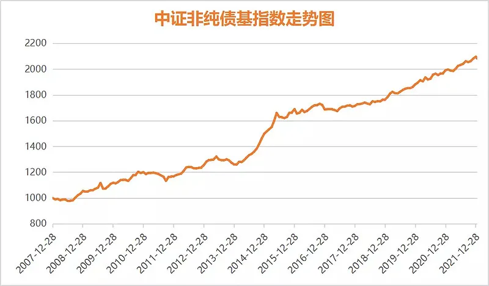

2022 开年的 A 股市场波动又给我们上了一堂风险教育课, 促使投资者再去审视自己的股债资产配置是否合理. 投资者在面对市场波动时, 往往会高估自己的承受能力. 听到 20%的最大回撤感受, 与真金白银回撤了 20%给人带来的冲击是完全不同的. 在市场的动荡中, 我们发现大部分"固收+"依然稳健, 能起到降低波动的中流砥柱作用, 但也有部分"固收+"回撤较大.

不同的"固收+"在收益增强策略上差异很大, 承担的风险差异也很大. 在 2022 年的新起点上, 我们有必要梳理一下"固收+"投资中需要注意的若干问题, 以期让"固收+"这个大类品种, 成为我们投资行稳致远的基石.

## 合理预期"固收+"的收益

"固收+"泛指以固定收益投资为主, 多元策略增强收益为辅的基金. 常见的多策略增强收益包括股票、可转债投资、新股网下申购等. 在 A 股市场颇为动荡的 2021 年, 大部分"固收+"都取得了不错的投资成绩, 少部分"固收+"因为得当的投资策略, 在 2021 年甚至取得了超 10%的收益率. 部分高收益"固收+"开始受到投资者的关注, 投资者带着不合理的预期参与其中, 可能低估了相关基金的潜在风险以及业绩的可持续性.

图 1: 部分资深"固收+"基金经理的长期投资业绩

来源: Wind, 截至 2022.1.14

股债资产回报的常识告诉我们, "固收+"品种取得 10%以上的收益率绝不是常态, 如果低风险投资长期收益率如此之高, 这让主动权益投资和宽基指数投资情何以堪? 从较长的历史时段看, 考察绩优二级债基与偏债混合型基金的成绩, 对于非重仓可转债的"固收+"而言, 预期年化收益率目标定为 6-8%是比较理性的. 6-8%的收益区间, 考虑了"固收+"主动权益投资、少部分可转债投资、兼顾了纯债部分的长期投资以及新股网下申购策略可能带来的投资增益空间.

从"固收+"的收益来源分析, 当前债市仍处于 2018 年以来的牛市行情中, 股市仍处于 2019 年以来的结构性慢牛行情中. 一旦遇到股市或债市的长时间回调, "固收+"的年化收益率会普遍面临下行风险. 2021 年的 A 股市场中小盘风格强势, 部分"固收+"提前布局了中小盘股, 比布局大盘蓝筹的"固收+"获取了超额收益. 年年都有强势的 A 股行业与风格板块, 与其后知后觉盲目追涨, 不如提前做好统筹配置.

## 关注可转债与打新的新变化

2021 年是可转债的牛市, 中证转债指数全年上涨 18.48%. 从可转债整体的行情看, 占可转债存量市场较大的头部银行转债 2021 年表现略显逊色, 更多的中小盘上市公司发行的可转债 2021 年涨势喜人. 可转债是有存续期限的投资品种, 也是一个随着价格变动, 收益与风险关系发生渐变的品种. 当可转债价格整体水涨船高时, 可转债会失去安全边际, 会变得像股票一样波动巨大. 部分可转债基金自 2022 年以来下跌 5-10%, 不得不说是一种风险警示.

图 2: 可转债水涨船高, 防御性显著降低

来源: 集思录, 时段: 2021.1.4-2022.1.14

根据集思录提供的数据, 当前存量可转债的平均价格高达 147 元, 转股溢价率为 34.32%, 可转债的到期收益率为 -5.17%. 较高的平均价格、转股溢价率以及到期收益率为负数都在强调可转债市场的变化, 幻想 2022 年的可转债表现复制 2021 年是非常困难的. 对于部分可转债仓位极高的"固收+", 投资者应注意其中隐含的风险. 对于陌生的"固收+", 尤其是 2021 年有较大涨幅记录的, 在投资之前一定要仔细阅读基金定期报告, 穿透持仓资产来分析其中的风险性因素.

可转债是不少二级债基标配的投资品种, 因为二级债基不能享受新股网下申购的红利. 混合型、灵活配置型的基金则可以参与新股的网下申购. 值得注意的是, 伴随着创业板与科创板注册制新股的定价改革, 注册制新股破发已经不再是新闻. 网下新股申购有一定的锁定期, 在新股上市涨幅变小以及市场波动增大的双重影响下, 预计 2022 年的打新收益也会比过去两年低不少, 投资者应该适应注册制时代新股申购的风险.

## 坚守稳健防御定位, 做多元化配置

"固收+"是中低风险投资品种, 也是不容易犯错的投资品种. 优秀的"固收+"长期看是一条斜率稳步向上的曲线, 可以不必频繁卖出即可兑现投资收益. 在"固收+"的投资上, 立足于稳健防御的定位, 能多一点锦上添花的超额收益更好, 如果遇到市场波动暂无超额收益, 更多的要看到"固收+"平抑整体投资波动的压舱石效果.

图 3: 中证非纯债基指数长期斜率向上

来源: Wind, 截至 2022.1.14

"固收+"虽然长期的投资收益预期低于主动权益基金, 但"固收+"在极端的市场行情中因为低回撤, 关键时刻可以作为子弹朝权益投资方向打出. 从机会成本、投资心态管控以及应对市场不确定性三方面看, "固收+"都是基金投资者不可或缺的一部分.

每一种"固收+"的增强策略都不会一直有效, 正是这种非全程的有效性才保证了它们的长期有效性. 可转债投资、新股网下申购、量化对冲套利等策略, 都是在不同的行情与周期中, 互有优势的策略. 我们很难提前预测哪一年是可转债投资的丰年, 哪一年是新股网下申购的丰年, 哪一年量化对冲套利策略又会有突出表现.

既然采取各种策略的"固收+"长期投资回报互有起伏但整体优秀, 投资者便应该进行多元化资产配置来实现跨周期的收获, 而不应该今年追这个, 来年追那个. 比如, 看到采取可转债投资的"固收+"2021 年整体更优秀, 投资者在 2022 年才开始去追, 很可能最终的结果不尽如人意, 因为与 2021 年年初相比, 当前的可转债投资环境已经发生了变化.

在 A 股市场与债市实现了较长时期的慢牛之后, 2022 年的主动权益与固收投资可能都需要适度降低预期. 适度降低投资预期并不是说要赎回, 不做基金投资配置了. 基金投资是接纳家庭长期闲钱的水池, 需要长期的建设和维护. 震荡行情、熊市行情都是做好长期建设与配置的良机, 太多的基金投资者不把资产配置做在平时, 等到市场行情火热了, 赚钱效应明显了才再回到市场, 很可能又是竹篮打水一场空.

稳健的资产配置能够让投资者在不预测市场的前提下, 笑对市场的涨跌起伏, 并在其中充分受益. 把基金投资当做是长期的事业来做, 资产配置让我们有实力穿越牛熊, 乐观积极的情绪能让我们面对市场的波动而屹立不倒. 当我们拥有了坚韧不拔的意志与坚定的投资纪律时, 就没有什么波动能把我们打倒. 基金投资, 乘上时间之马, 跨过坎坷起伏, 我们必将看到不一样的美景!

## 原文

- [2022基金投资要注意这3点](https://mp.weixin.qq.com/s/LE85ibFhjcvHxxZqShyYHA)
