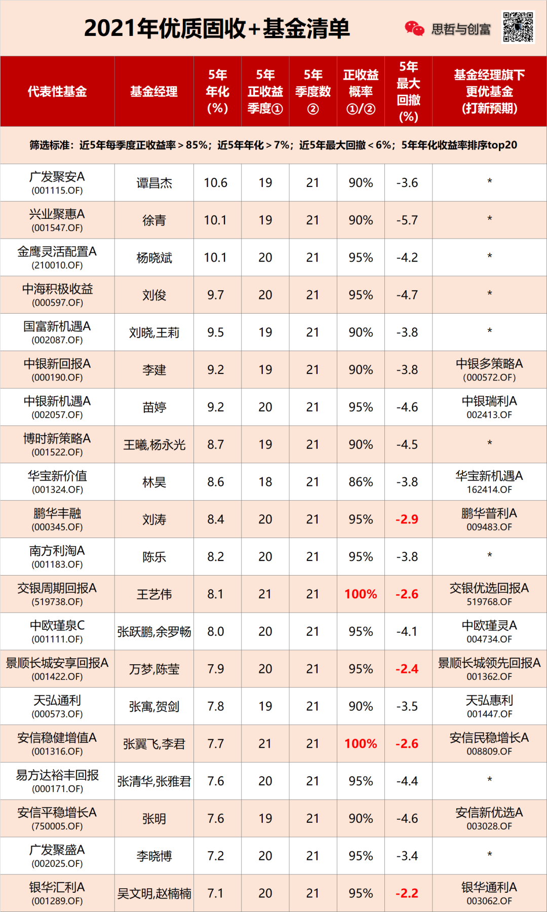
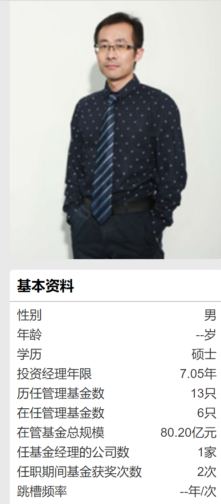
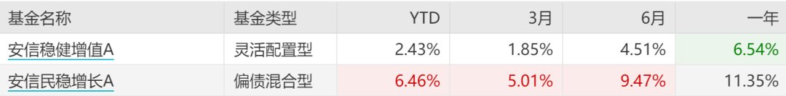

又是瞌睡行情, 抱团雄起两天立马又萎了, 大 A 股真心不争气.

发现个现象, 这几天咨询固收+基金的朋友有点多, 可能大家跌的有点心慌, 想上点稳健基压压惊.

这篇文章满足一下大家的需求.

不过话说在前头, 如果各位看官看不上那一年"可怜"的几个点到十几个点的收益率, 那这篇文章就关掉吧, 不适合你~

固收+简单说就是基金尽量做到每个季度都保持正收益, 持有 3 个月以上亏损的概率极小.

让投资人的体验和吃德芙一样丝滑

筛选固收+基金的方法, 首先是看基金单季度实现正收益的概率, 最好是每一个季度都赚钱~

其次是看业绩的排名, 回撤的控制, 最后根据基金公司投研实力, 以及规模的匹配度(一般 10 亿左右最优).

来, 上干货:

先收藏再说.

简单讲解一下:

目前整个 A 股市场, 连续 21 个季度都保持正收益的基金, 只有两只, 很稀缺.

一个是交银周期回报, 不过这只基金去年换人了, 现在是一个新基金经理, 王艺伟在管理.

ps: 颜值还是挺高的有木有~

交银有个固收策略组合叫稳稳的幸福, 她的周期回报和多策略回报都入选了, 而且仓位不低, 说明交银还是很看重这位美女基金经理的

换基金经理这事不用太担心, 固收+基金都有一个策略框架, 选股更多依靠背后的投研团队, 所以业绩断崖式下滑的概率不大.

另一个是安信稳健增值, 这只基也是连续 21 个季度正收益, 五年年化 7.7%, 张翼飞拿奖不少, 人也帅, 抵得上我颜值的 80%

优点在于基金经理的团队从未变更过, 业绩更加稳定.

不过这只基金现在规模有点大, 打新效益已经被稀释了, 他的另外一只安信民稳增长表现可能会好.

另外万梦的代表基金景顺长城安享回报也很稳, 最大回撤只有 2.4%, 也是 20/21 的胜率.

稳字派可以重点考虑以上几位.

再说稍微激进一点点的

谭昌杰的广发聚安, 虽然只有 19/21 的胜率吧, 但他的固收+年化做到 10%+, 在这个榜单排名 No1.

谭昌杰是从业十几年老司机了, 管理规模 300 多亿, 这只基还有打新收益, 难得.

杨晓斌的金鹰灵活配置, 五年年化也超 10%, 去年的收益高达 24%.

虽然也有 20/21 胜率, 但它的股票仓位偏高一些, 波动回撤更大.

前面说的一大堆, 全都是灵活配置型基金, 仓位都非常灵活.

不过清单里也混入了一些不合群的品种, 比如刘涛的鹏华丰融, 是一只纯债基金.

这位老哥是纯债基里的业绩王, 鹏华丰融 5 年年化是 8.4%, 不含股票做到这个业绩就有点离谱.

不过鹏华丰融是一年开放一次申购, 现在还封闭着, 最近马上要开了…

一般封闭债基的业绩普遍要更好一点, 因为仓位更高, 所以债基封基一般业绩都好于开基.

如果不追封基的话, 偷偷告诉你, 他还有一只鹏华普利, 也是开放申购的亲儿子.

但因为发行没多久, 宣传也不到位, 很多人不知道~

对了, 还有个偏债混合基也入选了.

就是张清华的易方达裕丰回报, 这只基我之前也分享过好几次.

清华是择股型选手, 这只基靠炒股贡献了不少超额收益, 虽然只有十几个点的仓位.

总的来说裕丰哪里都好, 费率也低, 但就是规模太大, 但他的混合基哪只都不小, 喜欢凑合一下呗.

还有一大堆有实力的选手我就不一一列举了, 表格里都有, 如:

刘晓的国富新机遇

李健的中银多策略

苗婷的中银瑞利

陈乐的南方利淘

业绩也都不差, 都是 TOP10 级别的固收+选手.

今天写的基金, 风险都蛮低, 持有 3 个月以上 85%以上正收益, 所以不用太操心亏钱风险

但因为股票仓位基本在 2 成以内, 你们也别期待发家致富, 也就替代下银行理财.

我做个引路人, 无利益相关, 纯粹分享下, 节省你们的寻基时间.

## 原文

- [90%胜率的理财基...](https://mp.weixin.qq.com/s?__biz=MzA3MDk1MjA3Nw==&mid=2651830240&idx=1&sn=574c9f932df14f87e79544110c3f56f0&chksm=84cfe202b3b86b145a0627613ca947b815bd22d69e4d62d33466206e941d3417ece8b22c9b92&scene=21#wechat_redirect)
