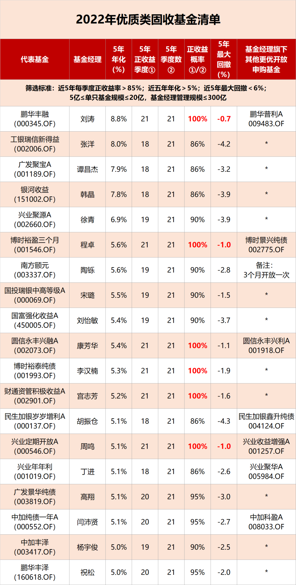
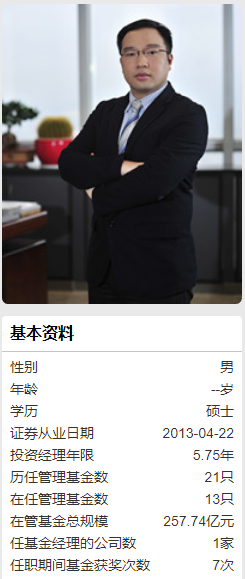
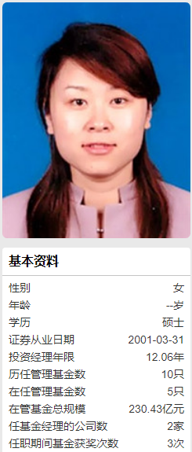
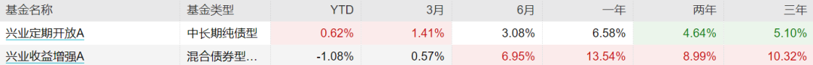

最近我发现大家对类固收基金的兴趣越来越浓厚了, 我留言随便一句话, 竟有好几十人在后台发"固收+"...

能够理解, 行情不好, 账户天天绿, 心态都有点遭不住.

固收+不是不能买, 不过我还是提示下, 咱千万别在固收+和股票基之间反复横跳, 容易打脸.

尤其是新基民, 可能 20 年入市, 发现一入即顶, 日日亏钱, 就想转变风格.

低迷的时候, 更需要一些坚守和耐心.

当然了, 如果你一开始在风险资产上配置比例就严重超出自己的承受范围, 那么也没毛病, 尽早降低仓位, 调整成一个舒服的状态, 确实可以.

考虑到你们急切的心情, 我也是立马行动起来, 重新又做了一波固收基金的筛选和更新, 供大家参考.

那话不多说, 直接上干货:

## 先说我筛选固收+基金的方法.

首先既然是固收, 那么得看"固收+基金单季度实现正收益的概率", 最好是每个季度都能赚钱.

其次是看业绩排名, 回撤控制, 最后根据基金公司投研实力, 以及规模的匹配度进一步筛选.

我筛选的具体条件如下:

1. 近五年每季度正收益概率＞ 85%；
2. 近五年年化＞ 5%；
3. 近 5 年最大回撤＜ 6%；
4. 5 亿 ≤ 单只基金规模 ≤20 亿；
5. 基金经理管理总规模 ≤300 亿；

## 筛选结果如下:

先收藏再说.

简单讲解一下:

在我的筛选条件下, 能连续 21 季度都保持正收益的基金, 共有 6 只.

其中只有刘涛的鹏华丰融和周鸣的兴业定期开放这两只是长期由一位基金经理管理.

另外宫志芳的财通资管积极收益, 也即将满 5 年, 而其他 4 只中间都更换过基金经理, 单人管理远不够 5 年.

所以综合来看, 刘涛、周鸣和宫志芳这三位的稳定性最佳.

不过基金的季度正收益率高、稳定性强并不代表业绩好, 但它每年能有至少 5%的涨幅, 而且还基本感觉不到回撤.

这种十分丝滑的体验感, 不正是固收+基金最大的亮点嘛图片~

好, 下面再详细说说这三位基金经理.

### 第一个鹏华刘涛:

鹏华刘涛可以说是纯债基里的业绩王, 不到六年时间获奖 7 次, 拿奖拿到手软, 近五年年化收益率 8.8%, 不含股票做到这个业绩就很离谱.

刘涛是香港大学金融硕士, 毕业即加入鹏华基金, 先后做过固收部债券研究员、固收信用主管等, 2016 年开始任职基金经理.

他非常擅长信用债投资, 对宏观利率走势把握也非常准, 而且非常注重回撤控制, 近五年最大回撤只有 0.7%.

不过鹏华丰融是一年开放一次申购, 现在还封闭着, 开放日在每年 11 月 19 日左右.

一般封闭债基的业绩普遍要更好一点, 因为仓位更高, 所以债基封基一般业绩都好于开基.

如果不追封基的话, 偷偷告诉你, 他还有一只鹏华普利, 也是开放申购的亲儿子.

但因为发行没多久, 宣传也不到位, 很多人不知道~

第二个兴业周鸣:

兴业周鸣是清华学霸, 金融从业近 21 年, 基金管理 12 年, 专注固收+领域的实力女将, 现任兴业固定收益投资部总监.

如果单看业绩, 她的兴业定期开放并不靠前, 但贵在长期稳定, 而且作为兴业固收部总监, 有一定团队优势.

不过这只基金是定期开放型, 每年开放一次, 灵活性较差, 可以考虑她的另一只兴业收益增强, 混合二级债基, 可以投一些可转债和股票.

业绩也很优秀, 但波动也更大.

基金不同时间年化收益率

缺点是规模偏大, 有 48 亿, 打新预期略不足.

第三个财通宫志芳:

宫志芳是数理金融硕士, 外汇和债券交易员出身, 她在任职期间也拿了不少奖项, 尤其 2018 年, 在债基普遍较弱的行情中, 获得了一年期开放式债基金牛奖.

宫志芳也是表中唯一一个以混合二级债基取得连续 21 季度收益为正的选手, 目前她管理的招牌基金是财通资管积极收益.

另外, 连续 21 个季度收益为正的选手, 还有程卓的博时景兴纯债、康芳华的圆信永丰兴利和李汉楠的博时裕泰纯债.

不过缺点是这三位基金更换过, 程卓是相对任职比较长的, 稳字派可以重点考虑.

再说几个偏激进点的.

张洋的工银瑞信新得益, 近 5 年年化收益率 8%, 仅次于刘涛, 但他是股债结合, 喜欢量化交易和轮动, 收益高、回撤也相对较大.

还有谭昌杰的广发聚宝, 去年也介绍过他, 从业十几年的老司机, 业绩在当时排名第一.

不过他最牛的广发聚安已经交给别人管理了, 但这只也不错, 胜率 86%, 规模 12 亿.

再比如:

韩晶的银河收益

徐青的兴业聚源

刘怡敏的国富强化收益

胡振仓的民生加银岁岁增利

以上这四只也都是股债混合型优质基金, 业绩和稳定性都不差.

不知道大家有没有发现, 这次入选的大多都是纯债基金, 而混合型固收+仅有 6 只, 与 2021 年这篇《[90%胜率的理财基...](/pages/f43434/)》的结果相差蛮大的.

主要是因为固收类基金在选股上大多以大盘蓝筹等权重股为主, 一旦股市真跌起来, 那么季度胜率注定也是会大幅降低.

虽说股债混合类固收+基金的收益弹性更大, 但论持久稳定增益, 还是纯债稳定.

当然还有的就是规模实在太大了, 比如我去年给大家推荐过安信民稳的张翼飞, 目前管理规模已接近 500 亿, 确实会对投资策略产生一些小幅的影响.

表中提到的基金, 均为低风险品种, 统计结果持有 3 个月以上 85%以上正收益, 所以不用太操心极端风险.

但因为股票仓位基本在 2 成以内, 甚至是纯债, 所以你们也别期待太高, 也就考虑替代下银行理财.

我做个引路人, 无利益相关, 纯粹分享下, 节省你们的寻基时间.

## 原文

- [做了个固收基排名...](https://mp.weixin.qq.com/s/GJzPQiGjZKSsISqSCd1xDA)
