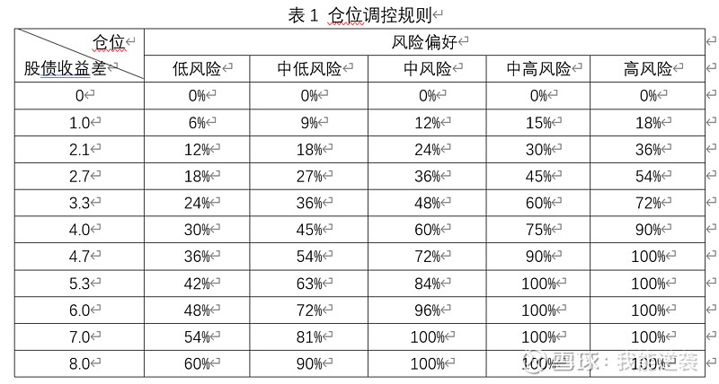
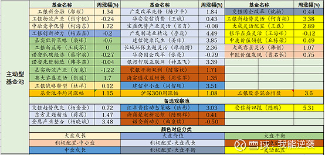
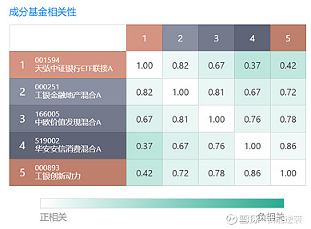

大家常说基金投资体系. 为什么要构建基金投资体系? 在我看来, 最关键的一点就是让自己的投资有章法, 摆脱情绪干扰.

我在置顶文章和其他几篇文章中详细介绍了我的投资体系, 我估计有很多人看不太懂, 有很多人没有时间和精力动手实践. 所以, 我想到不少读者存在上述问题, 如果我搞一个简单的小体系反而对于大家比较有用.

## (一)一个简单的仓位轮动策略

我在文章中曾经提到过, 股债收益差是极具参考价值的一个指标, 基于股债收益差构建一个简单的策略是非常可行的.

### (1)应该理解的东西

对于投资, 我希望读者们能头脑清晰, 投资体系当然也不例外. 所以下面关于体系内在的逻辑, 你应该理解.

采用股债收益差这个指标的内在逻辑是, 通常大家买的基金持仓主要以股票为主, 股市是否有投资价值可以通过与债市比较进行判断, 投资股市还是债市取决于谁性价比更高. 牛市, 股票在高位, 风险非常大, 股票预期收益率很低, 股债收益差相应也很低, 投资股市性价比很低, 应该降低基金仓位; 熊市, 股票在低位, 反而风险小, 股票预期收益率很高, 股债收益差也很高, 投资股市性价比很高, 应该提高基金仓位.

### (2)计算股债收益差

使用股票预期收益率减去其债券预期收益率. 股票收益率可以用沪深 300 市盈率的倒数考虑; 债券预期收益率用十年期国债收益率代替. 即股债收益差=1/沪深 300PE-十年期国债收益率.

沪深 300 收益率可在问财中查询, 以方便与我后面的轮动策略中的参数统一; 十年期国债收益率在英为财情中查询.

### (3)轮动策略

通过上述方法计算得到股债收益差后, 偏股基金仓位按以下规则进行调控, 其余仓位配置偏债基金. 表中风险偏好需要你搞清楚自己属于哪一类.

## (二)选基策略

我建议还是以配置主动型基金为主, 因为行业类基金对于投资者行业研究要求很高. 先前写过一篇[文章](/pages/bc5cc4/), 选择主动型基金有两种思路: 一种是选择持续优秀的好学生; 另一种是选择以前由于客观原因没发挥好的学生.

### 第一种思路选基我会重视几点:

(1)过往业绩持续优秀.

可以从近 1 年、近 2 年、近 3 年、近 5 年这几个维度考量; 也可以分年度, 如 2017、2018、2019、2020、2021 这样的维度考量.

(2)规模 2~100 亿.

滤掉规模过大的基金, 避开热门基金; 滤掉规模过小的基金, 避免清盘风险.

(3)排除掉行业集中的基金.

对于单吊某个行业或者重仓某个行业的基金, 坚决不予考虑, 因为无法判断他下一次能否赌对.

### 第二种思路选基要有出色的风格判断能力和备选基金的储备.

你要知道过去这个学生为什么没有发挥好? 下一次考试题目大概率是什么风格, 哪位同学可能会逆袭. 对应到基金上, 过去是什么风格, 未来预判风格如何, 哪位经理有可能翻身.

上文写了我选择基金的思路, 既然本文主题是建一个简单的基金投资体系, 在选基这块, 从我每周更新的基金池中去选择也是一种更省事的策略.

表中仅列出了行业相对分散的主动型基金, 对于一些行业类基金未列出, 如我实盘持有的中证银行和金融地产. 这类基金持有体验事实是比较差的, 去年银行一直没有启动, 也是很折磨人的, 未来我准备再减少这类基金的比例.

对于新手来说可根据风格适当均衡一些配置, 在每种风格下选择一支, 基金数量控制在 5-7 支, 我每周总结中也会谈到市场风格, 我本人会适当做些倾斜, 仅供参考.

## (三)构建组合举例说明

以我构建的基金组合(接近实盘)举例说明一下.

天弘中证银行, 大盘价值, 持仓全部为银行, 选它是因为费率比较低;

工银金融地产, 大盘价值, 持仓以银行、地产、券商为主, 交由基金经理自行调配, 基金经理鄢耀, 其管理的工银新金融也在基金池中, 值得信赖;

华安安信消费, 大盘成长, 持仓以消费、服务业为主, 基金经理王斌, 非常有潜力的年轻基金经理;

工银创新动力, 大盘价值, 持仓以保险、银行、地产、基建、券商等价值股为主, 基金经理杨鑫鑫, 极佳的风控能力, 价值派经理中的遗珠;

中欧价值发现, 中盘价值, 持仓以地产、家电、汽车零部件、建材等为主, 基金经理曹名长, 深度价值风格, 15 年从业经历, 只要风格在价值这边, 曹名长必定会有所发挥.

上述组合整体配置思路是: 看好银行, 加大银行配置比例; 风格上看好价值风格, 向价值风格倾斜, 成长风格略作配置稍稍平衡. 从组合相关性分析也可看出, 天弘中证银行和工银金融地产相关度较高, 这也是主观加大银行配置的结果, 其余基金相关性都比较低.

做个假设, 上述组合不考虑配置银行和金融地产这两个行业类基金, 我可能会考虑两种方案替代, 一种是配置诺安低碳经济和英大睿盛灵活进行替代; 再一种是配置英大睿盛灵活和东方主题精选(或建信中小盘)进行替代. 前者更偏价值, 后者只是稍微偏价值些.

这部分内容谈了谈组合配置的思路, 其实风格判断还是比较复杂的, 有时也不见得对, 对此我的看法是, 基于可靠的方法进行判断, 只要能在大波段上能够大概率对就行, 这部分内容不再展开写了, 如果没有判断风格能力, 可以均衡配置.

## 最后做个总结:

第一步: 计算股债收益差;

第二步: 选主动型基金, 要清楚基金经理的风格;

第三步: 构建组合, 要清楚基金在你组合中的角色;

第四步: 严格按仓位调控规则运行

## 原文

- [帮读者构建一个简单的基金投资体系](https://xueqiu.com/1973975515/211936442?share_type=weixin&data_type=link&data_model=sd&fix_uid=7010266987&sharetime=2)
