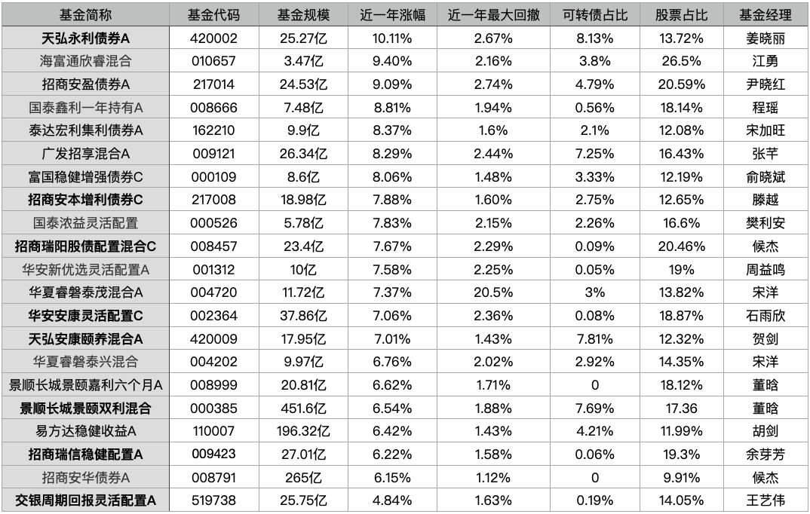
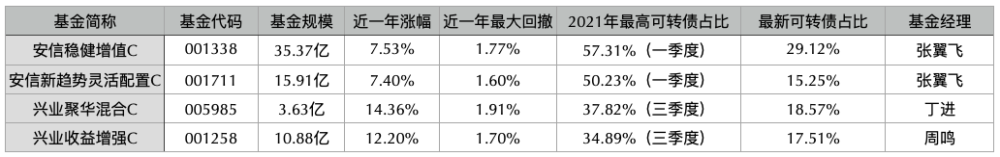

之前提到过, 可转债现在在一个估值高点上, 回调的风险比较大.

配置了大量可转债的固收+, 难免也会受到影响.

所以我更新了下固收+的备选池子, 剔掉了一些可转债占比高的, 增加了一些过去一年涨的不错且可转债占比不超过 10%的.

## 筛选的标准包括:

资产配置里必须要有股票, 股票比例不能过低, 不然进攻性不够; 也不能过高, 不然风险等级就上去了;

近一年收益率 6%以上;

近一周跌幅不超过 0.5%;

近一年最大回撤不超过 3%;

除此之外,

基金规模太小的、太大的, 成立不足三年的, 基金经理任职时间太短的, 近一月、近三月、近六月都没赚钱的…统统筛了出去.

最终整理后留下了以下这 21 只:

(净值截止 2 月 21 日)

基本上每只都是五边形战士, 兼具防守和攻击.

其中加粗的是我买了的(最后一只其他指标都好, 收益率不够, 但因为我还在持有, 所以也放了进来), 其他的留作备选追踪, 以便随时调整和买入.

大家也可以参考参考.

这些基金的可转债占比, 数据来源是它们 2021 年的第四季度报告, 不排除现在已经有所调仓的可能,

所有基金业绩只代表过往, 不代表将来.

另外, 没出现在表格里的产品, 并不代表不好,

有一些固收+, 虽然可转债占比比较高, 但它在高点是不断往外卖出的.

你们可以去看看自己的基金过去一年持仓中可转债比例的变化, 如果时间越往后, 可转债比例越低,

说明基金经理对行情的判断, 以及在交易操作上的把控力都是比较强的,

这种就不需要太担心.

比如张翼飞的安信稳健增值, 去年第一季度可转债占比最高, 达到了 57%, 到第四季度就只剩 29%了.

他的安信新趋势灵活配置也是如此.

还有周鸣的兴业收益增强、丁进的兴业聚华混合, 可转债占比都是在第三季度加仓达到最高点, 然后到第四季度大幅减仓,

买入、卖出的节奏把握得非常好, 几乎吃到了可转债这轮上涨整个周期的红利,

近一年的回撤数据和收益率表现都很优秀: 回撤不超过 2%, 收益率分别达到了 12%和 14%.

很厉害.

我把提到的这四只也整理了表格, 供参考:

以上两份表格里, 基金后面标注了 A 的, 代表还有同基金的 C 类(有的还有 B 类), 标注了 C 的同理.

## 原文

- [挑出了25支固收+，能赚钱又抗跌](https://mp.weixin.qq.com/s/FTz7QQHTXV_VqoYTEPB0lA)
