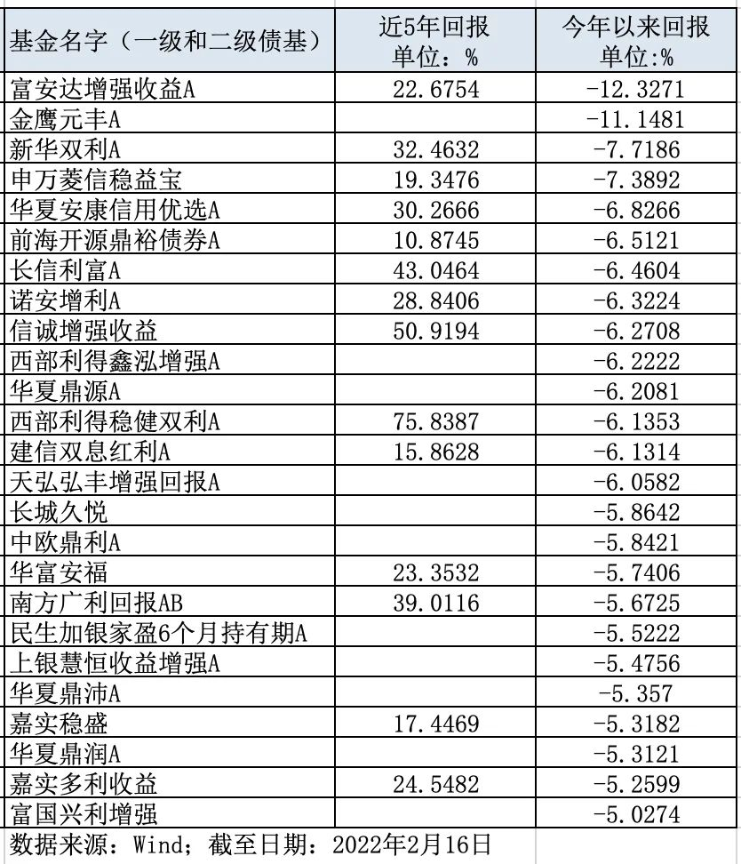

年初至今, 各种赛道被轮番抛售, 市场缺乏明显主线. 近期海外地缘风险上升, 叠加美国通胀爆表以及加息预期增强, 全球避险情绪更是大幅升温. 前些天, 司令也和大家一起探讨了, 2022 年如果缺乏大类资产配置意识, 或许怎么"折腾"都有可能亏钱.

常见的大类资产配置, 除了 A 股市场的股债类资产, 还包括境外股债资产, 以及黄金、石油等大宗商品资产. 但是, 最常见的大类资产配置方式还是股债两类资产, 比较典型的产品比如"固收+"基金.

从 2020 年开始, 兼顾攻守特征的"固收+"基金规模迎来高速增长. Wind 数据显示, 截至 2020 年末, "固收+"基金规模达到 19511.31 亿元, 较 2019 年增长 123.85%; 截至 2021 年末, 规模更是增长到 29686.82 亿元, 较 2020 年增长 52.2%. 并且, 从几类产品收益率表现来看, 确实也没有让投资者失望.

以 Wind 一级混合型债券基金指数(885006. WI)为例, 2020 年收益率 4.40%, 2021 年收益率 7.47%; 再以 Wind 一级混合型债券基金指数(885007. WI)为例, 2020 年收益率 9.12%, 2021 年收益率 7.82%, 较好地满足了稳健型投资者需求.

不过, 随着 2022 开年以来市场震荡下跌, "固收+"基金也出现了不同程度的下跌, 截至 2022 年 2 月 17 日, Wind 一级混合型债券基金指数收益率-0.67%, Wind 二级混合型债券基金指数收益率-2.20%, 令不少投资者唏嘘不已, 甚至打算亏损赎回.

下图是司令整理的部分一级和二级债基, 截至 2022 年 2 月 16 日, 今年以来下跌幅度超过 5%的"固收+"基金合计 25 只(多类份额, 合并计算, 且剔除名字中明确的可转债基金), 比如富安达增强收益债券 A 收益率-12.33%, 金鹰元丰债券 A 收益率-11.15%, 新华双利债券 A 收益率-7.72%, 申万菱信稳益宝债券收益率-7.39%.

那么, 大家手中的"固收+"基金是否还能继续持有? 司令建议分三步进行判断, 具体来举例说明. 以下数据来源: Choice, 截至 2022 年 2 月 17 日.

## Step1: 历史季度胜率

不少投资者更喜欢参考长期收益率, 但是司令建议追求稳健的投资者, 可以优先考虑季度胜率情况. 仍以富安达增强收益 A 为例, 过去八个季度(2020Q1-2021Q4, 下同)有两个季度出现亏损, 2021Q1 季度甚至亏损了-4.31%, 显然风险收益策略相对较为激进. 再以华夏聚利债券为例, 尽管今年以来收益率-2.44%, 但是过去八个季度胜率均为正, 风险收益策略较为稳健, 可以继续拿在手中观察.

## Step2: 收益增强方式

"固收+"产品是个大类, 既包括一级债基、二级债基、混合债基, 还包括偏债混合以及采用量化对冲策略等产品. 那么, 应该如何识别不同"固收+"产品的底层资产投资策略, 以便更好了解收益增强方式呢? 以易方达丰和债券为例, 历史持仓中以债券资产为主, 还包括少量股票资产, 当股市整体下跌时, 股票资产的表现对收益增强策略会有较大影响. 如果觉得持有股票资产风险过大的投资者, 就可以避免持有此类收益增强方式的"固收+". 再以平安添利债券为例, 历史持仓中没有任何股票资产, 也不参与一级市场新股申购和增发, 主要投资于国债、企业债、公司债等债券品种, 基金经理通过"杠杆与久期"手段, 以实现增强收益. 对于担心因为股票涨跌导致波动较大的投资者来说, 可能会是较佳选择.

## Step3: 同类横向比较

投资除了"绝对收益", 还有"相对收益". 对于一只优秀的"固收+"产品除了要看绝对收益, 各个阶段还应该能持续跑赢同类平均. 以平安双债添益 A(一级债基)为例, 2020Q1-2021Q4 连续八个季度收益率依次是: 0.84%、2.59%、2.03%、4%、1.13%、3.46%、3.11%、1.95%, 而同期 Wind 一级混合型债券基金指数收益率依次是: 1.72%、-0.03%、1.56%、1.08%、0.05%、2.26%、2.76%、2.22%, 前者基本能够持续跑赢对应指数; 再以鹏华信用增利债券 A(二级债券)为例, 2020Q1-2021Q4 连续八个季度收益率依次是: 2.44%、3.84%、1.59%、3.81%、-0.94%、3.13%、1.88%、4.13%, 而同期 Wind 二级混合型债券基金指数收益率依次是: 0.84%、2.08%、2.77%、3.15%、-0.38%、2.72%、2.77%, 前者同样基本持续跑赢对应指数.

好了, 经过以上三个步骤后, 大致就能判断出手中的"固收+"基金是去还是留(是否符合自身风险偏好). 当然, 产品长期收益表现、基金经理资历、管理年限是否稳定等因素, 对于"固收+"产品同样也较为重要, 大家可以一起参考.

## 原文

- [“固收+”基金下跌，还能继续持有吗？](https://mp.weixin.qq.com/s/KUwuh28YG7SFGABVCoio5Q)
