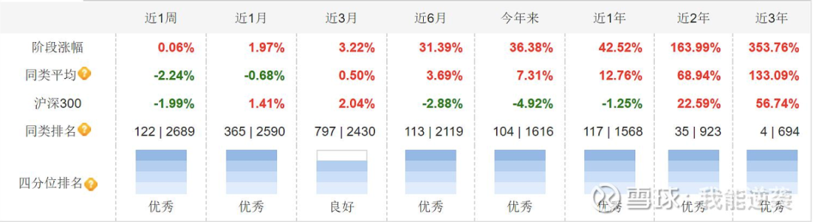
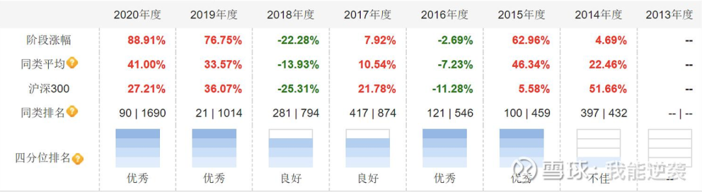

基金投资中选基是很多基民最关注的, 如果选对并获取了不错的收益, 还是很有成就感的. 但是很多人选基金没有什么思路, 往往就是抄作业, 或者看到收益好跟风. 这篇文章我谈谈主动型基金选择的两种思路.

相信大家都明白一个道理, 选择主动型基金本质就是选择基金经理. 那么, 如果我们基民是一个班级的老师的话, 选基就相当于挑学生, 看看谁能在未来的考试中取得好成绩.

顺着这个比喻, 选择主动型基金有以下两种思路.

## 挑那些一如既往优秀的学生

我们把选基带入到上述比喻中, 其实就好理解了. 要选一个下次考试能发挥出色的学生, 很简单的一个逻辑就是选择一个过往考试成绩非常出色, 且非常稳定, 很少失常的学生.

我觉得这是一个非常好的思路, 也是我未来会持续坚持的选基策略. 要知道优秀的人持续优秀的概率远高于他突然下滑的概率, 相信有些人会觉得市场行情难以预料, 基金经理运作基金远比学生考试复杂的多.

我同意这个看法, 我的办法是, 选出多个过往业绩出色的基金经理, 如果说一个基金经理可能翻车, 那么多个优秀经理同时翻车的概率会大幅下降, 这样的策略大概率会长期取得远超主动型基金平均水平的收益, 随着时间积累就能实现显著的超额收益.

那么问题的关键就在于, 如何定义过去一如既往优秀. 如果还是挑选学生, 你会关注哪些方面呢? 以下是我的答案.

### 1)关注老师对学生的评价

学生过去的表现如何, 老师最清楚, 基本知道学生大致是个什么水平. 对于基金, 同样的道理. 我会看基金评级, 特别是晨星评级, 选择过去三年和五年晨星评级都在三星以上的基金.

援引晨星网的官方解释, 晨星评级方法是: 给予某类基金三年评级时, 晨星会根据各基金截至当月末的过去 36 个月回报率, 计算出风险调整后收益 MRAR. 各基金按照 MRAR 由大到小进行排序: 前 10%被评为 5 星; 接下来 22.5%被评为 4 星; 中间 35%被评为 3 星; 随后 22.5%被评为 2 星; 最后 10%被评为 1 星. 如下图所示.

这意味着, 我会直接 Pass 晨星评级为一星和二星合计 32.5%的基金. 因为按这种思路, 我选的就是一如既往出色的基金, 我只相信那些过去取得成功的基金. 就像挑选学生, 过去一直很差的学生还是算了吧, 那些过去优秀的学生显然胜率更高.

另外一点, 晨星评级我会更看重三年, 因为基金经理体系完善需要时间, 往往头两年业绩一般, 但是随着体系完善, 厚积薄发业绩会慢慢体现出来. 向三年倾斜, 可以捕捉到这类基金经理. 这就好比, 一个学生一、二年级学习一般, 但三、四、五年级都很出色, 最终虽然过去五年总体表现受到一、二年级成绩的拖累, 但这个学生很可能已经步入了正轨.

### 2)关注是否一直很优秀

偶尔一次两次考的好, 说明不了问题, 也许刚好做过这套题, 甚至作弊. 所以, 要想挑选出有真才实学的学生, 最好是几乎每次考试都能名列前茅.

我会要求基金在过去的一年、两年、三年、五年业绩都能跑赢同类平均. 因为也许某一个时间段业绩出色可能有运气成分, 但各个时间段都表现都优秀就不容易做到了, 这样就能把一些浑水摸鱼之辈踢出去. 有些文章中提到挑选那些每一年业绩表现都名列前茅的也是一样的道理. 下图是按阶段涨幅和年度涨幅考察基金过往业绩的两个思路.

### (3)关注是否有偏科

大家都知道学习上偏科的话, 考试成绩很大一部分要看运气了. 例如, 本来数学不好, 结果考试特别简单, 和尖子生相比也没落下多少, 其他擅长的科目发挥又非常出色, 所以成绩就上去了. 但是, 谁能保证下次数学还是这么简单呢? 我会扎扎实实选那些不偏科, 每一门功课都不错, 随便你怎么考的学生.

所以, 挑选基金我会避免那些行业集中, 重仓追热点的基金, 例如今年的很多重仓新能源的基金. 因为, 我无法判别基金经理明年能否继续赌对行业, 像下面这样的基金, 今年业绩非常突出, 但是万一明年新能源降温之后, 他能否再次押中行业呢

以上是我挑选基金比较看重的几点, 另外, 基金经理管理基金的年限和基金规模我也会适当考虑, 通常我希望基金经理能管理该基金三年以上, 至少也要非常接近三年; 另外我喜欢在 100 亿以内选择基金.

## 挑那些过去发挥失常的学生

第一种思路, 相当于优中选优, 那些过去发挥不好的就干脆不再考虑. 我相信很多人会想到, 在股市中不见得过去业绩差就完全没有希望. 这就是第二种思路: 挑过去发挥失常的学生.

我认为以下这几种情况值得考虑.

### 1)本身就非常优秀, 客观原因发挥失常

例如, 一个非常优秀的学生, 由于忘带准考证, 缺考一科, 导致成绩很差. 但是, 这种情况下, 下次的成绩多半会恢复正常.

有些基金经理中途离职干了几年私募, 又回来了, 虽然过去几年没有公募基金的业绩, 但其实力仍然不能小觑. 再比如, 有些基金经理虽然管理公募基金时间虽短, 但其从业年限却并不短, 过去可能在管理专户, 也有一些从研究总监转过来管基金的, 这类基金经理也可以适当关注. 例如, 建信的周智硕.

### 2)偏科严重, 但是未来的考试会更有利于他

例如, 一个学生文科很差, 理科很好, 文理科严重不均. 如果在高中分开文理之后, 该同学选择学理, 几乎可以断定, 他的成绩一定会有非常大的提升, 因为未来的考试不用考不擅长的文科对于他更加有利.

对应基金经理, 他们各有各的擅长, 有些是价值风格, 有些是成长风格. 过去几年的大盘成长风格下, 这种现象非常明显, 那些擅长价值风格的基金经理普遍业绩不佳. 但是, 一旦风格切换, 那些擅长价值风格的基金经理就会王者归来.

正如, 前面一篇文章提到的, 我在今年二月份清仓成长风格的基金, 买入曹名长、丘栋荣, 并且超配银行, 就是判断可能会有风格上的切换. 现在回过头看, 今年曹名长、丘栋荣的基金表现的不错, 银行表现很差. 事实上, 今年并不完全是价值风格, 风格在不断切换, 但是可以看出, 风格稍稍切换, 那些价值风格的基金经理就展示出了他们水平. 因此, 如果有非常厉害的风格判断能力, 可以按这个思路去做.

## 原文

- [选择主动型基金的两种思路](https://mp.weixin.qq.com/s/B_tXFk2LCg3k47UYi65uzw)
