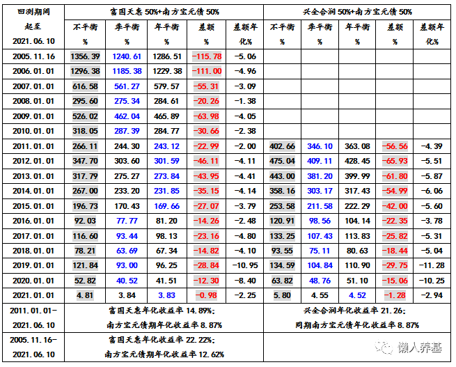
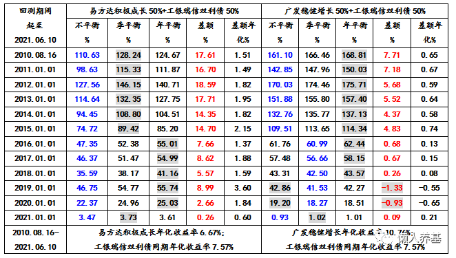
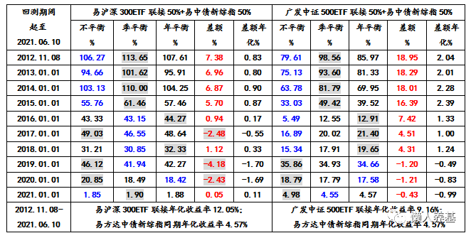

投资做资产配置的朋友都知道股债动态再平衡的概念, 股票基金和债券基金两种大类资产按一定比例(比如股六债四, 股债均配, 股四债六)配置好了后, 每年选一个固定的时间, 将运行了一年后发生偏离的股债比例, 重新调整回原始比例, 方法就是: 股票基金涨多了就卖出一部分股票基金, 同时买入相同金额的债券基金; 反之亦然.

从开始学习投资的第一天起, 股债再平衡可以增厚投资收益的观点就深入我心, 原理也很简单, 这个过程本身就是低买高卖的过程, 而低买高卖能增厚收益也是很好理解的.

有一个说法更吸引人, 通过股债均配并进行每年动态再平衡, 在降低波动的同时, 可以达到单配股票不配债券的收益率. 计算方法很简单: 股票年化 10%, 债券年化 6%, 则股债均配不做动态再平衡的情况下可以达到年化收益率【(10+6)/2=】8%, 通过股债动态再平衡可以增厚 2%左右的年化收益率, 两数相加, 股债均配的总收益率仍然达到了股票年化的 10%.

后来做过几次偏股基金与偏债基金组合动态再平衡的回测, 竟然发现大部分时候做了动态再平衡后的收益反而不如不做动态再平衡的收益. 当时也没把它当回事, 因为有时候也会出现做了动态再平衡后收益更高的情形.

直到有一次, 我对沪深 300 指数和中证全债指数两个指数按 50%对 50%的均配方式, 做了十多年动态再平衡和不平衡的收益率计算对比. 而这次由于是手工计算, 使我对一些细节有了进一步的认识: 在沪深 300 涨幅可观的几年中, 动态再平衡的结果, 使沪深 300 的份额减少了. 这一下才使我恍然大悟: 股债动态再平衡, 长期来看不仅不能增厚收益, 反而应该是降低收益率的.

当然得出这一个结论有三个前提, 基于以下简单模型:

1、股市和债市虽然有波动, 但长期来讲肯定都是螺旋向上的;

2、股票基金的年化收益率一定是大于债券的年化收益率的, 也就是我们通常知晓的, 股票指数年化收益率 10%左右, 债券基金年化收益率 6%左右.

3、绝大部分年度股票基金收益率大于债券基金收益率.

基于以上简单模型, 我们就可以作出以下推论:

1、由于股票基金年均上涨幅度大于债券基金, 股债再平衡是不断卖出股票基金, 买入债券基金的过程. 比如, 股票基金每年上涨 10%, 债券基金每年上涨 6%, 则再平衡基本上就是每年卖出 2%的股票基金, 买入同等金额的债券基金.

2、股票基金长期来看肯定是净卖出的, 也就是说, 股票基金到最后的份额是减少的、债券基金的份额则是增加的.

3、高收益资产份额减少、低收益资产份额增加, 相对于不做动态再平衡, 股债再平衡最后一定是降低了组合的收益率.

股债再平衡正面看是低买高卖, 从反面看则是拔了鲜花种杂草.

4、股债再平衡只在股熊债牛, 或者大部分年度股票基金收益率小于债券基金时能够提升组合收益率.

当然上述结论是基于股票基金收益率几乎每年都超过债券基金这一简单而理想化的模型. 现实的股债市场肯定不是这种单边而线性的涨跌模式, 而是双向波动而且是波幅巨大的. 因此需要做大量的实测对上述结果进行验证.

我设计了三组股债均配实测.

第一组: 顶流主动偏股基金与积极型二级债基两者均配的动态再平衡与不平衡的对比;

第二组: 业绩处于中下游的主动偏股基金或标准混合基金与稳健型二级债基两者均配的动态再平衡与不平衡的对比;

第三组: 沪深 300 或中证 500 指数基金与中证全债指数基金两者均配的动态再平衡与不平衡的对比.

我们先看第一组. 富国天惠与积极型二级债基南方宝元债各 50%构成一个组合; 兴全合润与南方宝元债各 50%构成成另一个组合. 测试时间是基金成立以来的每一年截至 2021 年 6 月 10 日, 分别计算累计收益率.

这一组的特点是偏股基金部分的收益率以绝优势超过与它构成组合的二级债基: 富国天惠自 2005 年成立以来年化收益率达到 22.22%, 远超同期南方宝元的 12.62%; 兴全合润自 2010 年成立以来的年化收益率超过 20%, 而同期南方宝元债年化收益率为 8.87%.

这样本组组合比较符合本文前面的假设条件, 更接近于股债组合简单而理想化的模型, 所以本组的测试结果呈以下特点:

1、无论从哪年开始测试, 不做动态再平衡的收益率都是最高的(最高收益率我用黑字带底纹标示).

2、绝大部分时间段每季度都做动态再平衡的收益率是最低的(蓝字部分).

3、动态再平衡拉低组合收益率是颇为巨大的, 简单算术平均达到了年化 7%左右, 差不多损失一整个稳健型二级债基的收益率了.

再看第二组. 这一组我随机找了一只长期表现处于中下游的主动偏股基金易方达积极成长与稳健型二级债基工银瑞信双利债各 50%构成一个组合; 标准混合型基金广发稳健增长与工银瑞信双利债各 50%构成另一个组合.

本组第一个组合易方达积极成长自 2010 年以来的年化收益率 6.67%不及工银瑞信双利债的 7.57%; 第二组广发稳健增长十多年的年化收益率 10.78%超过了工银双利债的 7.57%, 但超过幅度仅 3%左右, 远没有第一组股债业绩差异明显.

第一个组合的股债收益率对比处于本文理想假设的对立面, 所以无论从哪一年开始测试, 不做再平衡的收益率都是最低的(蓝字部分), 而且超过一半的测试时段每季度都做再平衡的收益最高, 可能是易方达积极成长每个季度的净值波动较大所致. 但是再平衡对组合的正收益贡献不算大, 年化平均略低于 2%.

第二个组合股债收益率对比符合股大于债的条件, 但幅度显著小于第一组的两个组合; 可能收益率优势抵不过净值波动对再平衡的影响, 所以这一组合超过一半的测试时段, 每年再平衡一次的收益率比不做再平衡略高. 但是再平衡对这一组合各时间段的收益率影响轻微, 年化幅度平均低于 0.5%, 几乎可以忽略不计.

第三组也有两个组合, 分别是易方达沪深 300ETF 联接与易方达中债新综指各 50%构成一个组合, 广发中证 500ETF 联接与易方达中债新综指各 50%构成第二个组合.

两个组合中股债收益率股大于债的特点都是比较显著的, 第一个组合沪深 300 年化 12.05%显著超越中债新综指的 4.57%, 第二个组合中证 500 年化 9.16%显著超越中债新综指的 4.57%. 与第一组的主动基金组合比较, 可能是指数基金波动幅度更大的缘故, 本组两个组合 70%的测试时段股债再平衡的收益率好过不做再平衡.

波动更大的中证 500 与中债新综指构成的组合, 动态再平衡对各测试时段的收益率影响更大些, 中证 500 有 40%的测试时段动态再平衡达到了年化 2%左右的正收益贡献. 而沪深 300 与中债新综指构成的第一个组合, 再平衡对它的收益率的影响较为轻微, 大部分时段小于年化 1%的水平.

通过上面三组 6 个组合的测试, 虽然无法得出一个普遍适用的结论, 但对我的实际操作还是有充分的参考价值的.

## 总结如下:

1、如果用优秀的偏股主动基金与偏债主动基金构成组合, 不需要我们去做动态再平衡, 选择信任基金经理, 这些事交给基金经理就好了. 我们做动态再平衡无异于画蛇添足, 很有可能带来负收益.

2、用宽基指数基金与纯债基金构建的组合, 每年一次动态再平衡是必要的. 由于指数基金波动较大, 动态再平衡对收益率的影响略偏正面. 但影响幅度不大.

3、尽量避免选到长期业绩不佳的主动基金. 我第二组第一个组合只是想多一种组合构成方式看测试结果. 如果一只主动权益基金长期年化收益率不如二级债基, 全部持有二级债基就好了, 完全不需要这样的组合.

4、上述所有动态再平衡都没有考虑基金申赎费用, 即使理论上某种组合季度再平衡增收效果显著也不建议采用, 每个季度申赎一次可能 4%就没了.

5、股债再平衡最主要的目的是降低波动幅度, 改善股债组合的持有体验, 使我们能够坚持长期投资. 从天下没有免费午餐这一规律来讲, 既然降低了波动幅度, 即使以稍微降低一点收益率作为代价也是值得的.

## 原文

- [股债动态再平衡增厚长期收益是真的吗？](https://mp.weixin.qq.com/s/1zpHIscxRLTdu0n2BFfKSQ)
