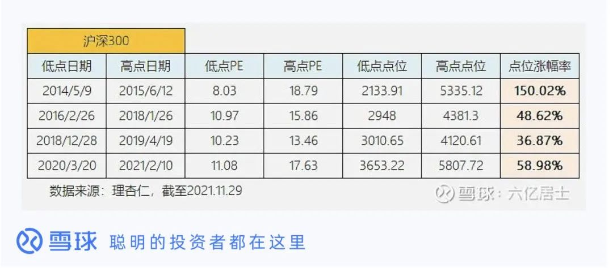
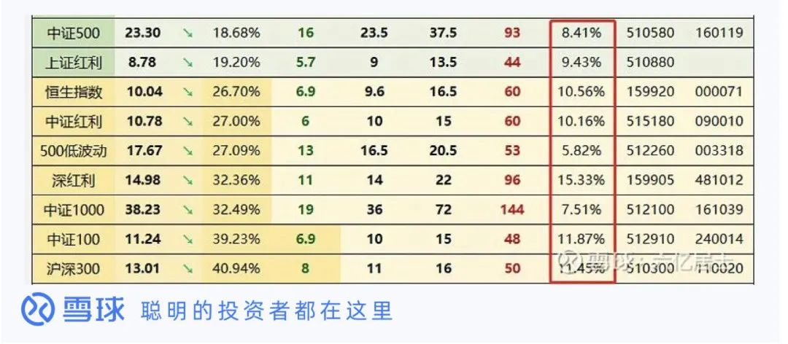
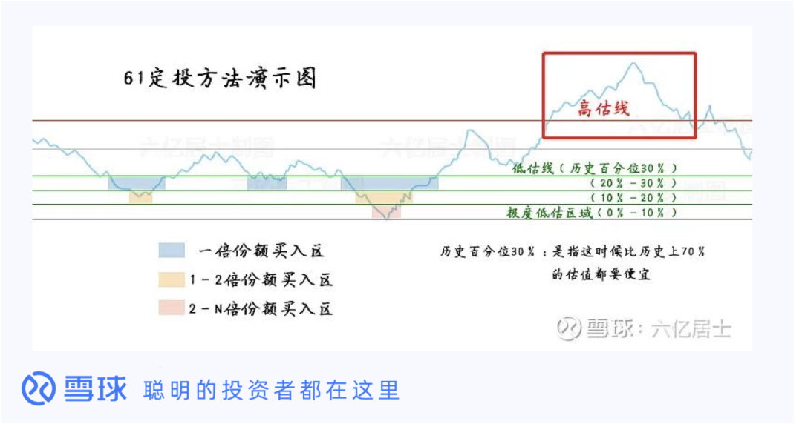
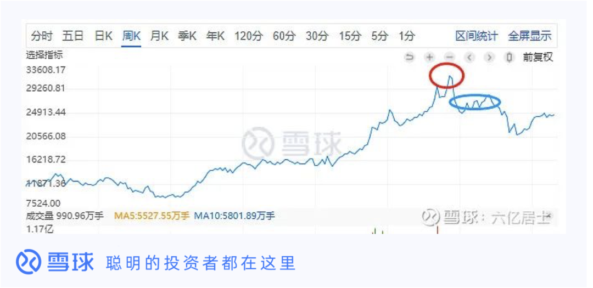
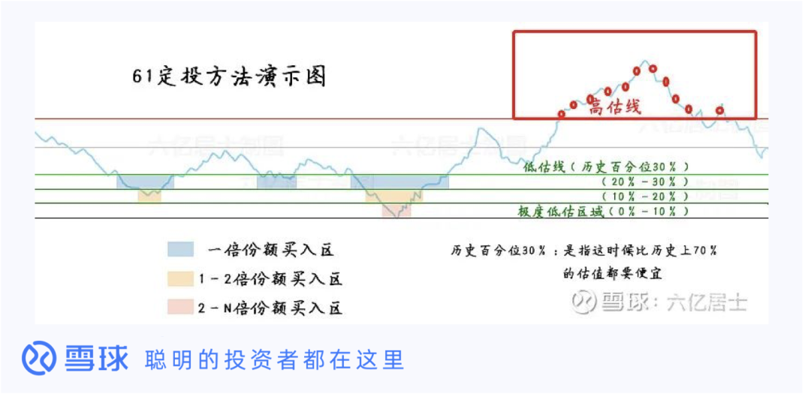

止盈是每一个投资者必须面对的核心问题, 在我看来:

止盈并非独立于投资体系之外, 止盈应该是我们整体投资计划的一部分, 我们需要在定投之前就已经确定好不同指数基金的止盈方式.

不要等到需要止盈时, "凭感觉"操作, 这样容易"后悔", 产生不必要的浪费. 我其实写过不少止盈方式, 不过更多的是在各指数分析时, 写在了文章中, 这次独立拿出来, 总结成一文, 方便新手参考.

为了方便新人理解, 我尽量用图表来解释这几种止盈方式:

## 浮盈止盈

就是基于"浮盈"比例, 设定的止盈线.

这是我们最起步、最常见的止盈方式之一. 例如: 持仓标的浮盈 30%止盈, 这个方式相对粗糙, 并没有考虑持有年限, 也没有区分持有标的的弹性, 也没有考虑指数的估值水平.

何为弹性: 不同的指数, 基于其不同的特色、成长性、波动率, 历史回溯看高低起伏的"弹性"是不一样的.

为了能提供止盈的效率, 我建议针对不同的指数波动率, 设定不同的止盈百分比.

以沪深 300 为例, 我们可以观察其最近 10 年波动率:

我取了近十年沪深 300 的主要升幅阶段数据, 从数据看, 主要升幅波动在 30-50%, 碰到牛市高达 150%.

基于以上数据, 短期小波动无视的情况下, 考虑到不一定买在最低点, 也不可能卖在最高点, 沪深 300 可以设定 20%-30%的浮盈止盈条件. 不同的指数, 可以根据历史波动幅度, 调整止盈条件, 这个需要一定的分析能力.

当然, 这个方式很难吃到牛市.

## 年化止盈

浮盈止盈并没有关注"持有年限", 有时候虽然浮盈 30%, 但实际上已经持有 5 年, 年化算下来, 可能还不到银行理财.

这个时候我们就需要使用: 年化止盈

年化收益率止盈的基础设定条件, 可以根据指数的全历史年化收益率结合该指数的 ROE 来看, 这两个指标一定程度上反应了该指数的长期收益率.

举个例子: 以沪深 300 指数复合年收益率 10%左右, 那么可以设定持有一年的收益率要求是 10%, 持有两年整的收益率=10%+((1+10%)×10%)=21%, 同理: 持有三年的收益率=33.1%.

不同指数的基础 ROE 在我的估值表内有说明, 我后续也会继续迭代更新, 尽可能相对准确.

## 高估止盈

高估止盈是需要估值判断的

没有估值判断, 也就没有"高估"一说, 下图是以前我介绍如何定投时的图, 该图演示了定投的方式.

当指数估值到达历史百分位 70%或 80%时, 我们就可以实施止盈, 该方式需要较长的持有周期, 能较好的吃到历史相对高位收益.

但可以明显看到, "山顶"的收益是吃不到的, 毕竟上图是观后镜, 我们在前进中无法判断何时是历史最高点, 只能用 70%、80%等值相对高的获取收益率.

## 高点回撤止盈

我们确实很难预测何时是最高点, 退而求其次的办法是:

等它从高点回落一段时间, 比方自前方高点回落 10%或 20%的时候止盈.

这个方式适合"弹性高"的指数.

比方年初的酒类和现在暴热的光伏、碳中和, 我们其实很难判断在"市场暴热"时, 该指数会涨到什么地步.

以中证消费指数为例:

上图为例, 中证消费指数在 2021 年 3 月初到达阶段高点, 我们无法判断是否为顶点, 可以继续等待, 到下跌至蓝色部位时, 大概率能发觉, 上述红圈位置为阶段高点, 蓝色区域适合"高点回撤止盈".

这个方式难度颇高, 首先有可能是假摔, 下跌后继续上涨. 然后在下跌后, 也容易产生"浮盈回撤厌恶"情绪, 有时候"贪婪作祟", 还想再涨回去.

但对比高估止盈来说, 实际上蓝圈位置会比"中证消费"高估止盈更佳, 原因是这类高波动高成长行业指数, 有时候会比较"不理性".

## 高估分批止盈

我推荐的是这个方式——

高估时, 定期分批止盈.

具体操作如下:

1、判断指数是否进入高估, 如果是, 则开始制定止盈计划, 每周一轮, 每次减仓 10%标的仓位.

2、第二周继续判断是否高估, 如果是, 则继续减仓 10%; 如果不是则持仓部分保持不动, 继续等待机会;

3、后续连续 10 周, 如果一直高涨, 则会在第 10 周清仓完毕, 也就是 10×10%=100%. 止盈完, 继续涨也不用懊恼, 基本上已经吃了大部分肉了.

4、后续如果几周后下跌, 则相当于高位止盈一部分, 持仓继续保留, 套出现的现金等待目标低估, 或者定投其他低估优秀指数, 实现资金更高的使用效率.

5、10%, 10 周, 可以自由定义, 我是考虑到 A 股的牛市一般持续时长而定的数据, 你也可以定义为 8%+12 周, 或者 15%+7 周等.

这个方式结合低估定投、正常时长期持有, 高估时分批止盈, 能获得较高的整体收益率.

示例如上图, 大家由图可见, 红色小圈就是执行止盈的节点, 随着时间推移, 只要指数还处于高估的位置, 就不断止盈, 整个体系下来, 我们一定卖不到最高点, 但能相对的卖在高估的位置.

当然上图是比较乐观的趋势, 有时候可能两次止盈后就会落. 也可能指数一路高估到天际, 然后我们只是止盈在前半段.

但是, 我们也明白, 人非圣贤, 哪能卖在最高点? 适可而止, 等待下一轮定投吧.

## 永不止盈

部分市场属于"有效市场", 以美股的"标普 500"指数为例, 该指数在较长时间里, 一直保持在一个相对合理的估值水平, 那么止盈就是亏损. 此类市场, 优秀宽基指数可以长期持有, 除非出现极度不理性的高估, 例如"互联网泡沫"时代才会止盈.

部分指数属于"躺平"模式, 以红利指数为例, 该指数以高股息率作为特性, 指数有非常强的安全边际, 且能产生非常高的现金流. 而且很多人持有红利指数的目的, 很多是为了养老, 当进入较大年龄之后, 我们也没有很多精力、能力去盯着指数是否高估, "躺平"一点长期持有, 每年乐呵呵的拿分红来养老, 也是不错的.

## 结语

股市里常言: 会买是入门, 会卖才是高手.

以上方法有时候是可以混搭的, 比方第一个方法也可以采用"浮盈分批止盈", 高估止盈也可以升级为"基于估值绝对值, 进行分批止盈", 用浮盈比、估值绝对值等指标来进行"分批", 同样能优化收益率.

同样连红利指数都可以使用"根据股息率, 分批止盈". 例如官方股息率 2:<4.5%止盈 33%, 4.0%止盈 33%, 3.5%止盈 34%.

以上所有指标只是介绍而已, 所有止盈策略还望各位自行设定, 本文仅仅是我浅薄且主观的理解, 如果错漏还望海涵, 如有好的方法, 请不吝留言分享.

## 原文

- [图解指数基金止盈的 6 种方式](https://mp.weixin.qq.com/s/sWpfevJ4dcbou6UZw_hNVQ)
