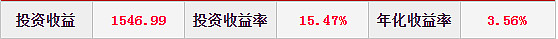

## 本文要点

1、买基金前, 就要想到我买这只基金就是来赚钱的, 不是为了回本才买的. 一定要清楚触及自己买基行为的点是什么? 到底是了解基金经理优秀、还是基金公司优秀、还是朋友推荐、还是理财经理推荐等等原因, 了解触动自己的点.

2、如果第一条同意, 回本就卖是不合适的. 所以, 平时要多精选基金, 筛选绩优基金, 不断优化自己的持仓.

3、买到差基金, 回本都是问题, 就不用讨论回本后是否继续持有了.

4、设立止盈点. 回本后, 继续持有, 上涨或下跌都有可能, 基金收益也是呈现涨涨跌跌波动的, 这就要自己为自己设立止盈点了. 卖出决策时, 可以看市场疯狂程度, 看基金是否经常上热搜, 看官媒是否定调市场过热. 或者关注业内良心基金公司是否有看空信号、限购等.

5、总体看, 本人是赞同回本继续持有, 直到目标收益, 前提是买的优质基金, 即便下跌也不恐慌, 能拿得住的基金.

6、在等待漫漫回本路上, 还有一个问题值得思考: 为什么不卖掉它? 行为经济学上讲, 人们是厌恶损失的, 心理上, 5%负收益带来的痛苦要大于 5%收益带来的快乐. 正确的做法是拔掉杂草, 留着鲜花.(这个步骤需要大量的功课, 否则很可能陷入追涨杀跌)

## 正文:

今日大涨, 一扫连日来的恐慌下跌阴霾, 这得益于高层的定调讲话.

今年是一个没有跨年行情, 没有两会行情的年份, 今日的大涨又让人看到了回本有望! 讲到这, 有个话题:"回本就卖"是否合适呢? 有论调说"买基金是为了回本", 身边也有不少人持有四五年说, 终于回本了, 并且卖出了.

### 一、回本就卖 VS 回本继续持有

今天我们就来聊一聊"回本就卖"这一话题, 为了观点鲜明, 分为赞同派和反对派.

赞同派: 经过一次次的下跌, 一次次的刷新心理承受的下线, 每次下跌都会强化自己的认知:"等回本了就一定卖掉它".

反对派: 感觉吃亏, 投资这么多年, 买基金为了回本, 感觉投了个寂寞. 丧失很多机会.

你是哪一种? 你赞成哪种? 我们用数据来看下.

### 二、筛选代表性数据

首先, 在基金品类里选取的是偏股型基金、股票型、股债混合型, 主要是主动权益类的.

情况一: 在这些基金里, 最大回撤的一只基金的回撤达到了 78.23%. 假如有基民, 不幸于 2015 年 6 月 1 日高点买入(000893)这只基金, 一直持有到 2019 年 1 月 2 日, 整整回撤了 78.23%, 并且继续持有至今, 仍没有回本, 7 年时间仍是-13%, 非常惨了.

情况二: 在上述基金类别里, 共有 6140 只产品, 成立以来平均最大回撤率是 28.33%.

情况三: 去掉 2019 年 2 月及以后成立的基金, 也就是样本, 只要成立时间在 2019 年 1 月及以前的产品, 有 2893 只产品, 再求它们的平均最大回撤率是 33.30%. 这个数据很有代表性, 我们就用该数据看看代表性基金, 回本后继续持有的情况.

### 三、代表产品

最大回撤 33.30%, 具体到基金产品里是华宝转型升级混合(F001967) 最大回撤是 33.36%.

如下图:

该基金 2017 年 11 月 9 日是阶段高点, 随后开始回撤, 直到 2019 年 1 月 3 日, 形成历史最大回撤率 33.36%. 随后开始逐步上涨, 直到 2020 年 8 月 17 日, 完全收复回撤.

三个重要的时间点:

2017 年 11 月 9 日最高点

2019 年 1 月 3 日最低点

2020 年 8 月 17 日收复回撤.

### 四、回本后, 不同持有时间的收益情况

如果高点买入华宝转型升级, 将有 1008 天的负收益(回撤形成天数+回撤修复天数), 这两年多时间, 一直处于煎熬(负收益)之中, 随着负收益越大, 想必坚持下来的小伙伴会越来越少, 甚至更加坚定【回本就卖】的想法.

1、回本就卖:2017 年 11 月 9 日买入, 2020 年 8 月 16 日卖出. 盈亏基本持平, 去掉手续费, 管理费略有亏损, 投了个寂寞.

2、假如回本后, 再继续持有 3 个月, 将获得 5.81%的收益率

3、假如回本后, 再继续持有 6 个月, 将获得 25.38%的收益率

4、假如回本后, 再继续持有 9 个月, 将获得 18.72%的收益率, 比上述的收益还少了些, 可见, 回本后继续持有, 不一定是一直涨, 而是呈现涨涨跌跌的情况.

5、假如回本后, 再继续持有 1 年, 将获得 40.70%的收益率, 收益比较可观了.

6、假如回本后, 再继续持有 1 年 6 个月, 将获得 26.38% 的收益率, 荡秋千, 又回去了.

7、假如回本后, 再继续持有至今, 将获得 26.38% 的收益率, 收益荡秋千, 继续回去.

综上, 对于自己认可的优质基金来说, 回本后, 虽然有涨有跌, 但还是继续持有等到止盈点, 再卖出比较好. 如果回本就卖, 不仅浪费了自己的机会, 也有可能错过接下来的上涨, 因为已经忍受很长时间的回撤了, 何不再持有一段时间呢~

## 原文

- [你打算回本就卖吗? 先别急~ ](https://xueqiu.com/2217395043/214327657?share_type=weixin&data_type=link&data_model=sd&fix_uid=2874661635&sharetime=2)
