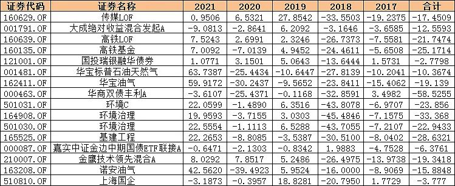
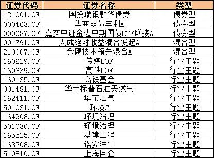
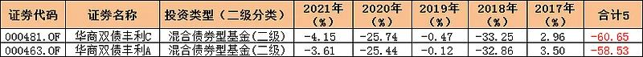

基金回本是可以的, 只不过需要的是时间, 那么, 具体需要多长时间? 二级债需要多长时间? 为了更准确的回答该问题, 进行了一番数据统计.

## 要点如下:

1、首先, 更正一个使用词, 投资要用闲钱, 这里的闲钱的词, 非常不合适, 都是辛辛苦苦的血汗钱, 应该改为"长线资金"更为准确恰当, 即: 投资要用长线资金.

2、持有时间越长, 偏股型基金正收益概率越大. 而债券基金并不是持有时间越长, 正收益概率越大, 而是呈现"垃基"只会越来越烂的特点

3、行业主题风险高, 回本时间非常长, 甚至 5 年回不了本, 直到持有 8 年才能回本, 期间丢失很多机会.

4、避免处置效应, 学会止损, 要卖掉垃基, 留着优质基金.(这个相对比较难)

5、债券型建议就不要抄底了, 该类基金并不是持有时间越长, 正收益概率越大. 非常大的负收益(超 20%的负收益), 可能是赶上违约了, 风控不行的公司, 除了认栽的同时, 只能拉黑该公司了, 此生再也不买它旗下的各类产品了, 除非该公司舍得把赔掉的收益给补偿回来.

6、债券类基金跌起来竟然比权益更恐怖, 回本更难, 所以对本人来说风险等级, 要重新划分了.

以下是正文佐证:

## 假如 2017 年追涨买入

在这里需要有几组数据进行说明, 2017 年偏股基金指数收益率是 12.63%, 2018 年偏股基金指数收益率是-24.58%; 上证指数 2017 年上涨了 6.56%, 2018 年涨跌幅是-24.59%, 根据"追涨杀跌"的特点, 我们假如 2017 追高买入, 不幸赶上 2018 年熊市, 啥时候能回本?

2017 年未合并下是 3705 只, 2017 年全市场非货基金平均收益是 9.78%, 结合基民追涨的心理特点, 假如我们的收益率都是大于等于平均收益率 9.78%, 将这部分基金全部选出来.

接下来, 依次计算持有到 2018 年末、2019 年末、2020 年末、2021 年末后, 收益情况:

### 1、2017 年收益率+2018 年收益率

高光时刻的 2017 年, 持有到 2018 年底, 这样的收益率平均值是-1.21%. 也就是说原先由超 9.78%的收益率(平均收益 24%), 经过 2018 年变为了-1.21%.

假如很不幸, 我们买的基金经过 2018 年都是在平均收益率-1.21%之下, 看看几年能回本?

(1)在 3705 只产品里, 共有 1560 只产品是负的, 也就是说追高买入后近 42%的产品是负收益.

(2)在 3705 只产品里, 共有 2145 只产品收益是大于 0 的, 大约 58%是正收益.

(3)在 3705 只产品里, 共有 1452 只产品是在平均收益率之下的, 占比 39%.

### 2、再看看在平均收益率为之下的, 加上 2019 年的牛市后, 回本情况?

(1)通过统计发现, 加上 2019 年收益率后, 在 2017 年追高买入的基金平均收益达到了 21.48%.

(2)持有 2017、2018、2019 三年后, 仍有 186 只负收益产品, 占 2017 年追高买入的 5%.

(3)也就是说在 2017 年追高买入, 经过 2018 年熊市后和随后的 2019 年上涨, 95%的基金是正收益了.

### 3、再看看加上 2020 年牛市收益后, 看看能能全部回正?

统计发现, 仍然有 34 只产品是负收益, 占 2017 年追高买入的 0.9%, 也就是说 2017 年买入, 持有到 2020 年底正收益的概率达到了 99.1%.

### 4、再看看加上 2021 年收益后, 看看能能全部回正?

统计发现, 仍然有 20 只产品是负收益, 占 2017 年追高买入的 0.5%, 也就是说 2017 年买入, 持有到 2020 年底正收益的概率 99.5%.

持有 5 年依然没有正收益产品的共有 16 只, 分别如下:

从产品类型上看, 这 16 只产品里行业主题类的最多有 11 只, 占比约 70%, 主动混合型 2 只, 占比 12%; 债券类 3 只, 占比 18%. 由此可见, 行业主题类风险是非常高的, 买错后 5 年回不了本.

## 假如 2018 年"精准"抄底买入

我们先选择 2018 年平均收益率之下的, 都是按照精准抄底买入, "小跌小买, 大跌大买", 也就是说 2018 年的平均收益率之下的, 只作为样本量, 看这些基金的未来表现如何.

2018 年的全市场非货基金的平均收益率为-9.6%, 选取该收益率之下的基金作为样本量, 在 2018 总有的 4708 只, 共有符合要求的 2340 只.

1、这些样本在 2019 年平均收益率是 36.78%, 负收益的仅有 20 只, 也就是说精准抄底后, 负收益的概率是 0.85%, 正收益的概率是 99.15%.

2、持有到 2020 年末, 在 20 只的负收益产品里仍有 16 只是负收益, 也就是说"垃基"只会越来越烂.

3、持有到 2021 年末, 在 20 只的负收益产品里仍有 6 只是负收益, 也就是说"垃基"只会越来越烂. 而且 5 只是债券基金, 占比 83%, 收益率-30%, 赶上违约了? 有信用风险了?

抄底买入的持有 1 年正收益就高达 99.15%; 追涨买入持有 1 年的正收益为 58%. 由此, 抄底更好点.

从基金类型看, 债券型建议就不要抄底了, 非常大的负收益可能是赶上违约了, 有信用风险, 风控不行的公司, 除了认栽的同时, 只能拉黑基金公司, 此生再也不买它旗下的各类产品了, 除非该公司舍得把赔掉的收益给补偿回来.

## 偏债混合(二级)回本时间

2017 年负收益的占 63 只

2018 年负收益的占 179 只

2019 年负收益的仅占 5 只

2020 年负收益的仅占 19 只

2021 年负收益的占 27 只

从上述数据可知, 2018 年负收益数量最多, 达到了 179 只.

截至 2022 年 3 月 14 日, 共有 817 只偏债混合(二级), 我们将以上五个年度都是负收益的作为整体样本量, 可以得到 226 只产品, 也就是说任意时点买入, 买到负收益的概率为 28%.

回本时间无法判断, 但是正收益的概率可以算出来

持有完成的 5 个年度(2017-2021), 负收益的有 10 只, 正收益的有 216 只, 占比 95.58%.

持有完成的 4 个年度(2018-2021), 负收益的有 10 只, 正收益的有 216 只, 占比 95.58%.

持有完成的 3 个年度(2019-2021), 负收益的有 10 只, 正收益的有 216 只, 占比 95.58%.

持有完成的 2 个年度(2020-2021), 负收益的有 11 只, 正收益的有 215 只, 占比 95.13%.

持有完成的 2 个年度(2018-2019), 负收益的有 12 只, 正收益的有 214 只, 94.69%.

从以上可以得到, 债券基金并不是持有时间越长, 正收益概率越大, 而是呈现"垃基"只会越来越烂的特点. 比如下面这只, 没人管的样子.

回本时间无法判断, 大概率是违约了, 如果按照买到违约的二级债了, 那回本期限就更长了, 按照该基金一直不动不折腾, 每年 2%的温和通胀, 可以作为收益的话, 可以自行得出, 但这也将失去了很多机会.

## 原文

- [基金大跌后, 回本需要多长时间?](https://mp.weixin.qq.com/s/Ek9YqvWhR1sdEIYw4xk9OQ)
