最近的股票跌成狗了, 老婆本都要亏完.

这时, 很多人在问能抄底吗?

周期将会告诉你答案!

回顾历史, A 股有 9 次比较大的底部, 以上证指数(SH000001) 为例:

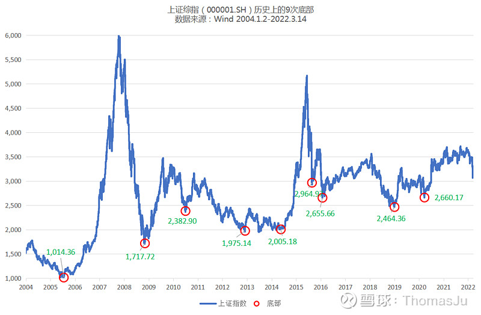

对应的时间分别为:

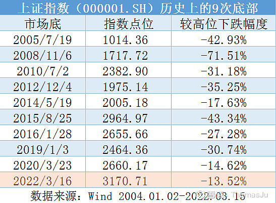

总结来看, 历史大底一般都存在以下特征:

1)底部往往处于"紧信用"阶段;

2)换手率处于低迷状态;

3)风险溢价会达到顶点;

4)新发基金较为低迷;

5)估值创下阶段性新低;

以下一一阐述.

## 一、底部往往处于"紧信用"阶段

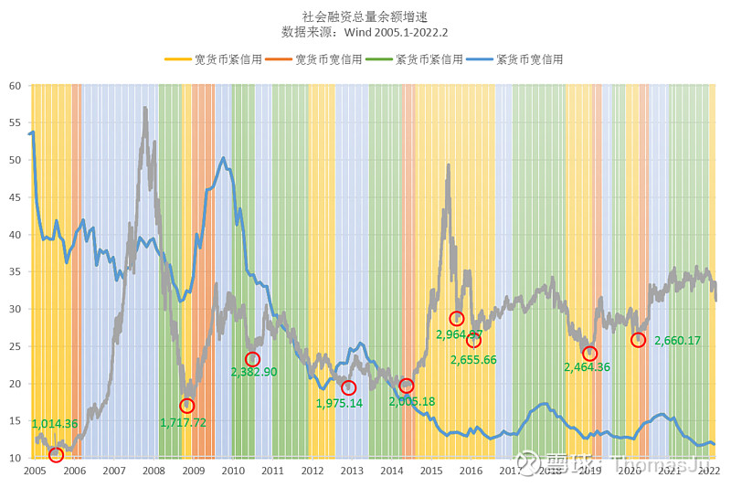

资料来源: 泽平宏观

根据货币信用周期, 我们不难发现. 历史上的 8 次底部, 有 7 次是处于"紧信用"阶段.

那么问题来了, 货币信用周期对投资有什么指导作用?

我们可能听过一个比较有名的"美林投资时钟", 美林时钟把经济周期划分为四个阶段: 复苏、过热、滞胀、衰退. 在这四个阶段, 表现最好的资产分别为股票、大宗商品、现金、债券. 投资者可以根据美林时钟, 在各个经济周期配置不同的资产, 以追求收益最大化.

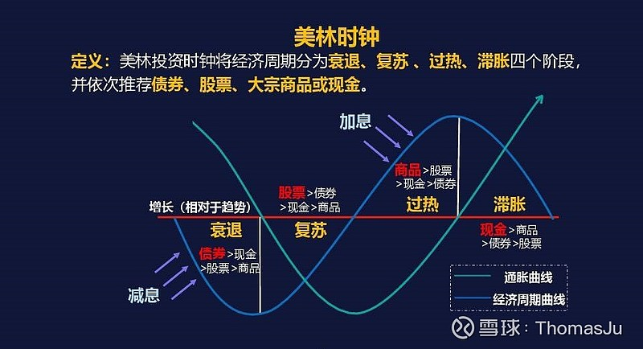

在美国, 美林时钟是比较有指导意义的. 但是在中国, 美林时钟没有那么准确, 会出现"水土不服"的情况.

在这种情况下, 改良版的美林时钟--"货币信用框架"理论, 更加符合中国的情况.

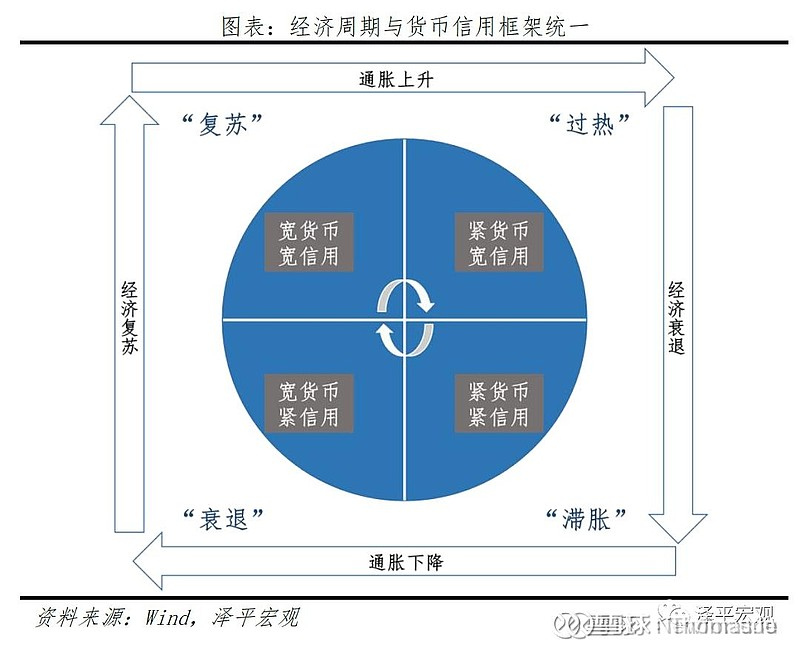

图片来源: 泽平宏观

衰退期: 对应"宽货币+紧信用", 这时股票的表现最差.

复苏期: 对应"宽货币+宽信用", 这时股票的表现最好.

过热期: 对应"紧货币+宽信用", 这时股票也有较好的表现.

滞涨期: 对应"紧货币+紧信用", 股票表现较为不佳.

因此, 在"宽信用"阶段, 股票往往表现较好; 而在"紧信用"阶段, 股票的表现往往较差.

那么, 要怎么判断现在是紧信用还是宽信用呢?

"社会融资规模"反映了全社会的借钱总额, 这一指标很重要, 因为它是经济的先行指标. 我们可以用社融总量余额同比增速来判断信用的宽紧.

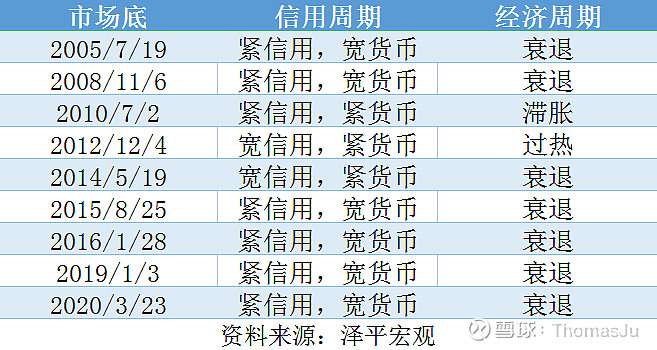

在 A 股的 8 次底部中, 有 7 次都是处于紧信用的阶段.

为什么货币信用周期用来预测股市是否上涨时那么准?

这是因为中国是一个由债务驱动型的经济, 房地产投资和基建投资作为信用派生的载体, 在经济不好时, zf 就刺激一下房地产和基建, 以此拉动经济, 从而带动整个社会的经济走向复苏.

在宽信用周期, 经济开始复苏, 企业的盈利改善, 因此股市表现很好; 在紧信用阶段, 经济下行的压力比较大, 所以股市表现不好.

## 二、换手率处于低迷状态

换手率反映了市场的分歧和冷热状况.

当换手率高时, 投资者的分歧比较大, 看多和看空的人都很多, 代表市场情绪处于较为火热的状态. 当换手率低时, 投资者的分歧比较小, 大家一致看多或者看空, 市场就会比较冷清.

以上证指数为例, 每次 A 股见底时, 换手率都不高, 平均换手率为 0.68%.

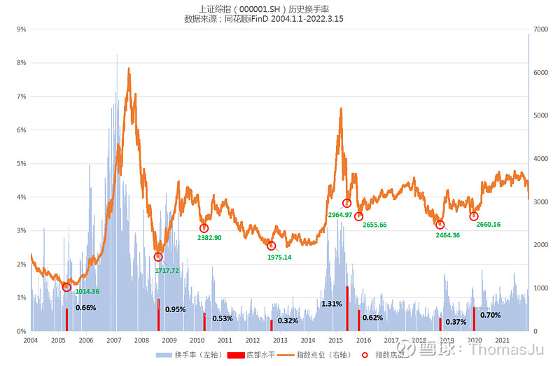

数据来源: 同花顺 iFinD 2004.04.01-2022.03.15

当大家交出了"带血"的筹码, 并且都一致看空股市时, 就意味着股市要见底了. 正如巴菲特所说"别人恐惧我贪婪". 投资就应该"买在无人问津时, 卖在人声鼎沸时".

## 三、风险溢价会达到顶点

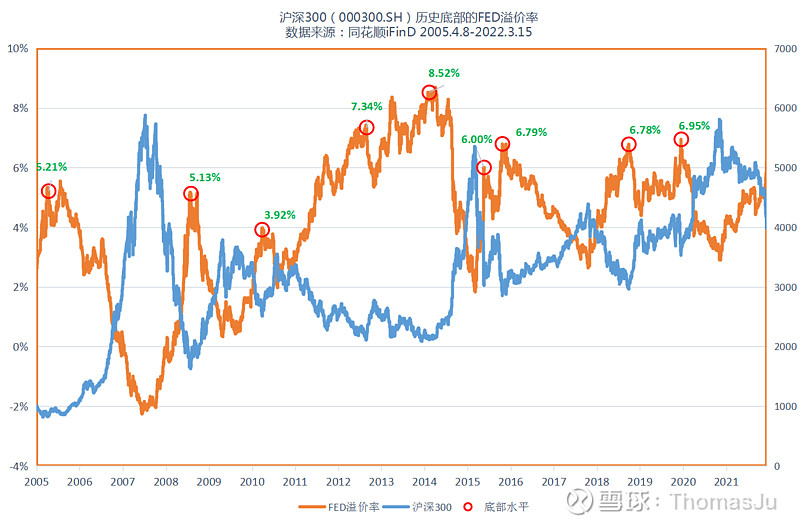

每次见底时, 股票的风险溢价都会达到顶点.

以沪深 300(SH000300) 为例, 我们用 FED 溢价率(市盈率的倒数-十年期国债收益率)来表示风险溢价.

这个指标越高, 代表持有股票比相对于持有债券的性价比越高, 反之亦然.

如图, 每当 A 股见底时, 股债性价比都会达到阶段性的顶峰. 这意味着持有股票的性价比是比较高的.

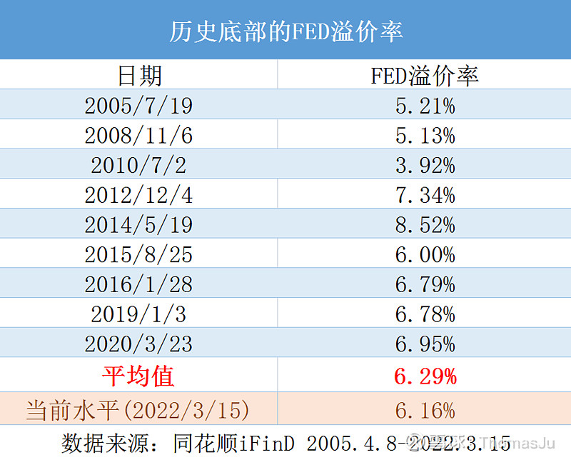

## 四、估值创下阶段新低

每次 A 股见底时, 估值都会创下阶段性新低. 这时候, 股票往往比较便宜.

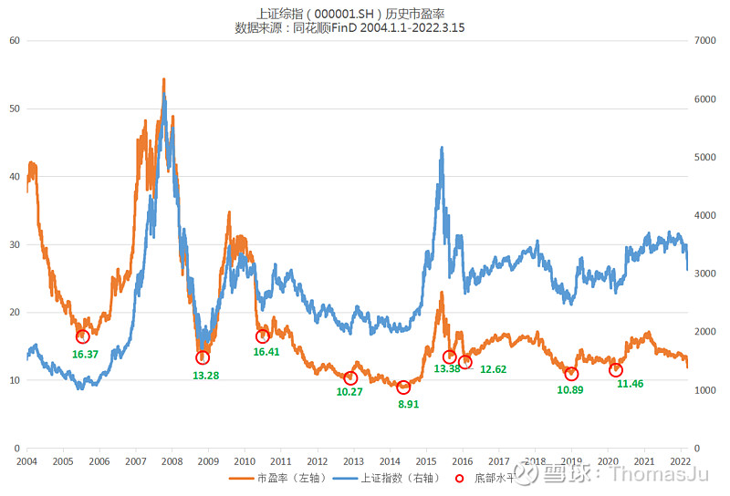

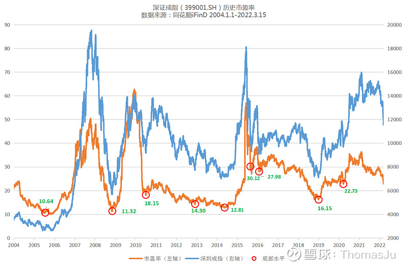

数据来源: 同花顺 iFinD 2005.04.08-2022.03.14

上证指数和深证成指(SZ399001)历史上几次底部的估值水平分别为:

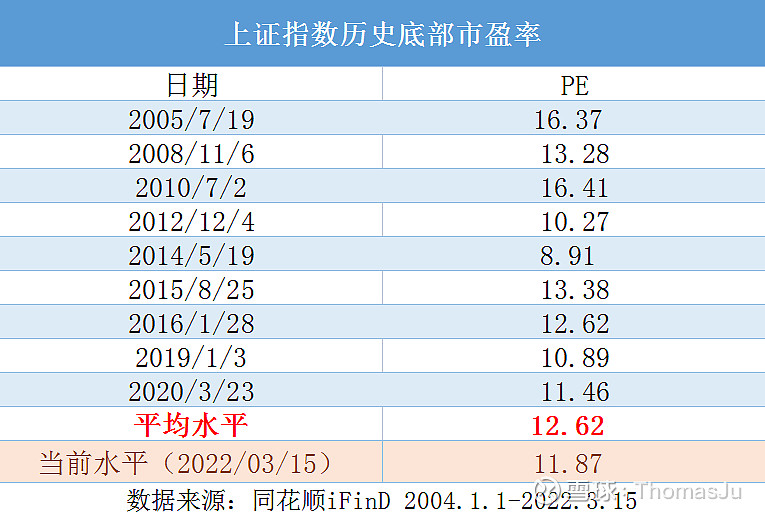

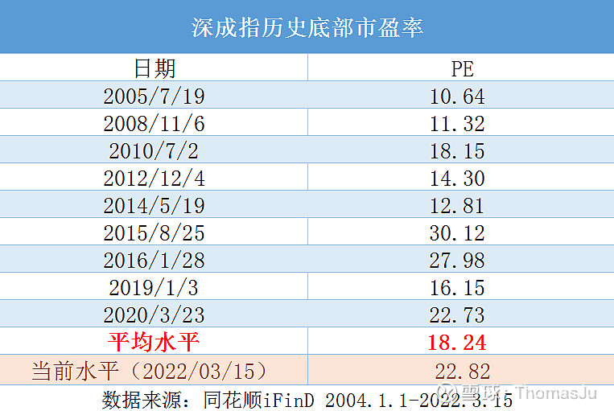

当下, 上证指数的估值水平已经低于历史底部估值的平均水平, 而深圳成指当前的估值水平与 2020 年 3 月相当, 低于 2015 和 2016 年底部时的水平.

## 五、新发基金处于冰点

用新发行基金的份额也可以判断投资者的情绪. 在 A 股历史底部时, 基金发行往往会遇冷.

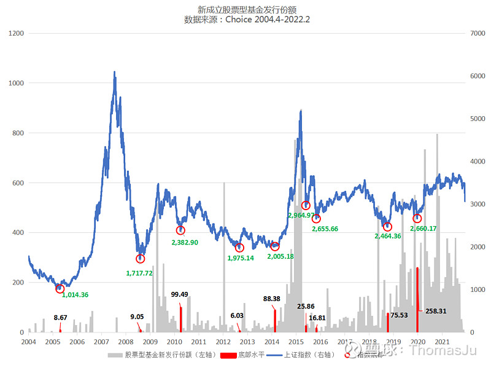

数据来源: 同花顺 iFinD 2004.04-2022.02

这是因为随着市场的下跌, 基民的信心容易受到打击, 市场情绪较为恐慌.

基金行业里流传着一句话"好发不好做, 好做不好发", 意思是当市场行情比较火热时, 发行基金很容易, 但是基金经理操作起来很难. 当市场行情不好时, 基金可能不好发行, 或者陷入"滞销", 当大家都不看好时, 行情可能就会在绝望中诞生.

2 月份, 基金发行已经进入了冰点. 股票型基金的发行份额仅为 2.24 亿份, 已经低于历史上的底部水平了. 大家都被割韭菜了, 哪还有闲钱去买基金?

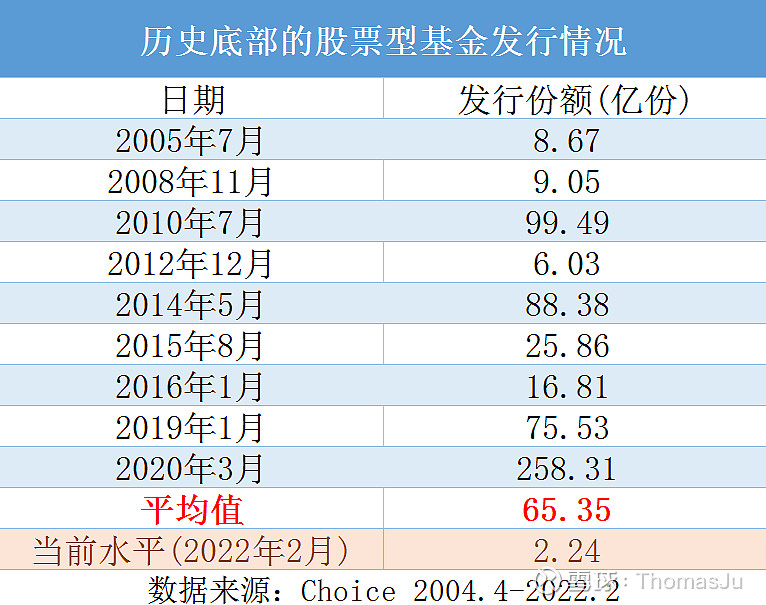

## 六、总结

综上所述, 从各个指标来看, 我们现在所处的阶段和历史上的 9 次底部比较相似.(相似, 但不代表现在已经到底)

在今年稳增长的基调下, 经济增速要实现 5.5%, 后续必然会有更多的刺激政策出台, 可以期待一波股市的表现(前提是要选对赛道)!

## 原文

- [可以抄底了吗? 复盘历史上股市的九次底部, 用五大指标来告诉你](https://xueqiu.com/8399405506/214340584)
