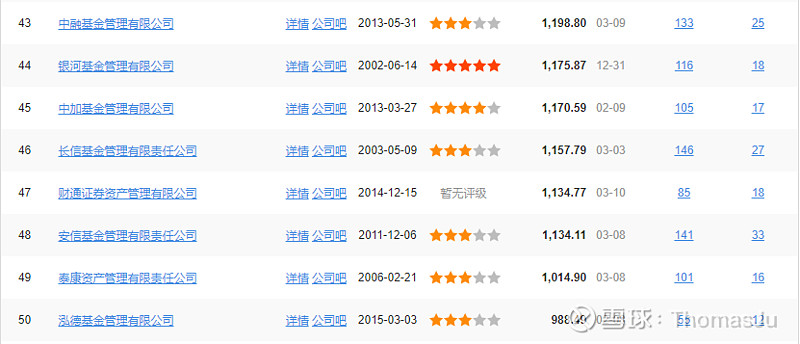

## 一、固收+的特点

固收+的特点是: 风险中等, 收益中等, 比债券基金收益高.

所谓"固收+", "固收"的部分会有 70%-80%的资产投资于债券当中, "+"的部分将 20%-30%的资产投资于股票、可转债、股票打新等资产中.

图片来源: ThomasJu

这也就决定了固收+的特点: 稳中有进--进可攻, 退可守. 以大部分债券作为打底, 追求稳健收益; 小部分投资于较高风险的股票等产品中, 追求刺激的收益.

## 二、固收+适合哪类人群?

固收+比较适合风险承受能力较低, 但能接受一些亏损的人. 这种人不甘心自己的钱存进银行或者货币基金里面, 存生存死三毛几也没什么意思. 为了追求高一些的收益, 愿意承担一定的风险.

另外, 在市场行情不太明朗的时候, 也适合买固收+, 追求较为稳健的收益.

在牛市中, 你觉得固收+没什么意思, 赚得也不如股票型基金多; 但是如果遇上了熊市或者震荡市, 你明白"稳稳的幸福"是多么好.

比如说在 2021 年这种震荡市, 沪深 300 都下跌了 5.2%, 很多基金也是亏损的状态. 但是固收+的平均收益达到了 4.75%, 跑赢沪深 300 近 10 个点. 表现优秀的甚至可以达到 10%以上. 正所谓"慢就是快".

## 三、如何选择固收+

### 1. 基金成立以来年化收益率高于 7%

我们用 7%的收益率来筛选能在"+"部分上实现超额收益的基金.

固收+中, 债券部分占了约 80%的持仓, 按 4%收益率来计算, "+"的部分占约 20%, 按 19%的收益率来计算, 能够实现的收益率为 7%(80%\*4%+20%\*19%).

"+"的部分能实现长期 19%的年化收益率, 是非常难得的. 对基金经理的能力提出了比较高的要求.

因此, 7%能够筛选出一些在股和债上都表现优异的基金经理.

### 2. 基金经理从业年限和基金成立时间 5 年以上

基金经理的从业年限至少要 5 年以上. 从业年限越长, 经验越丰富, 也经历过牛熊转换. 我们买起来也比较放心.

基金成立时间也要超过 5 年. 成立时间太短, 没有经历过完整的牛市和熊市, 我们很难根据基金的历史业绩来分析基金的表现.

### 3. 选择大型基金公司

固收+最大的风险不是股票亏损, 而是债券暴雷. 一旦债券暴雷, 你老婆本都要给亏完, 债券还会卖不出去烂在手里, 导致流动性风险.

为了防止暴雷的风险, 我们尽量去大的基金公司买固收+, 因为大公司的风控更加完善. 大公司内部的债券信用评级能够有效地排雷, 一般的小公司比较穷, 养不起那么多信用评级的人.

下图为基金公司排名前五十, 供参考.

图片来源: 天天基金网

### 4. 基金规模 10 亿以上

可能很多人还不太了解债券. 不同于股票交易, 债券的每一笔的交易都是非常大的. 规模小了, 操作起来比较难.

因此, 规模在 10 亿以上的固收+比较好. 至少有 8 亿用来操作债券, 剩下至少 2 亿投资于股票中.

## 四、固收+的风险

前文提到, 固收+最大的风险是债券暴雷, 这是风险的大头;

另外, 持仓中的股票也会有风险. 如果基金经理管理不善, 可能固收+就会变成固收-, 稳稳的幸福变成了稳稳的赔钱.

除此之外, 债券价格的波动也会带来风险. 但是在长期利率下行的背景下, 债券价格就会随之水涨船高, 债券部分仍然会提供较好的回报.

## 五、筛选出来的基金池

我根据回报和风险, 筛选出了五组固收+基金, 按照以下几个条件:

1)基金成立五年以上

2)基金经理从业 5 年以上

3)年化回报率 7%以上

4)基金规模 10 亿以上

5)股票持仓占比 10%-30%

### 1. 高回报, 中回撤

### 2. 高回报, 高回撤

### 3. 中回报, 低回撤

### 4. 中回报, 中回撤

### 5. 低回报, 低回撤

## 六、总结

## 原文

- [固收+基金的筛选标准, 一文看懂!](https://xueqiu.com/8399405506/214883035?share_type=weixin&data_type=link&data_model=sd&fix_uid=2874661635&sharetime=2)
