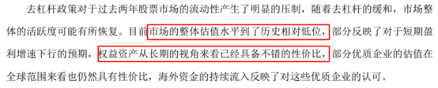

今天，铁柱来问我：

师兄，你昨天说，基金买在高点，几年下来也能赚钱。

那如果我买在低点，是不是很快就赚到钱、赚更多钱呢？

答案：当然了！

我给他看了股市的两个低点，分别是：

1、2016 年 1 月底

2、2019 年 1 月

以基金 A 为例。

（因为昨天举过例子，铁柱较熟悉）

假如，你在这俩低点，分别投入 10 万。

一直傻 fufu 拿到现在，会是多少呢？

从 2016 年拿到现在，当初 10 万，到现在约 21 万。

赚了 117%。

从 2019 年拿到现在，当初 10 万，到现在约 25 万。

赚了 147%。

听闻，铁柱很开心。

但我马上给他补了一刀：

可是，就算机会来了。

铁柱你也未必抓得住~

铁柱不解，信誓旦旦：

当然抓得住啊，只要看到很便宜了，就满仓搞、加仓搞啊！

真是这样吗？

如果你当时关注的基金 A，走势是这样：

3 个月跌了 20%。

请问你敢买吗？

铁柱：

额……

铁柱怂了。

其实，这就是基金 A，在 2015 年底到 2016 年初的走势。

同样的情况，发生在 2018 年。

这一年也跌了大约 20%。

在到达低点之前，基金 A 经历了一轮暴跌！

飞流直下三千尺！

这种情况下，你敢买？

如果你没有认知，看到下跌，你只会害怕，怎么可能捞货抄底？

铁柱心有不甘：

啊？那师兄，你有什么办法可以判断低点吗？

Emmmm......

当然有啊！我有一套方法。

三个指标，教你抄底基金！

## 指标一：股市吸引力指数

昨天不少小伙伴都猜到了。

不错，大家学的很扎实。

如果想知道，一只基金是否处于低谷。

对应的，股市整体估值，也不能太高。

（这里指的是股票型基金和混合型基金）

那就需要看“股市吸引力指数”了。

具体的方法，这里就不赘述了。

大家复习点这里：[惊喜！股市捡钱的机会来了！](/pages/811ecf/)

直接说结论：

股市吸引力大于 2.5 时，基金大概率处于低点附近。

举个例子：2014 年 6 月，熊市末尾。

当时的股市吸引力指数是多少呢？

简单算一下。

十年期国债收益率是 4% 左右，中证 800PE 是 10 左右。

算下来吸引力指数约 2.5，妥妥的黄金机会啊！

那当时的基金 A，是否处于低点呢？

确实如此。

即便不是处于最低点，也是相对低点了。

之后，它的表现怎么样呢？

（2014 年 6 月至 2015 年牛市，基金 A 的走势）

一路涨上天啊！

直接涨了 130% 多。

怎么样，第一个指标还可以吧？

股市吸引力指数，不仅适用于股市，用在“基场”也行得通。

宏观大环境没问题了，接下来，看第二个指标，

与基金自身有关的——“回撤”。

## 指标二：回撤

什么是回撤？

回撤，指一只基金从最高点，回落到最低点的百分比。

比如，一只基，平时都是 10 元，突然有一天到了 20 元，

然后又回落到 5 元，那他的回撤就是 75%。

下次，当它的价格再次回撤 75% 的时候，

你会考虑买入吗？

大概率是会的。

只要市场一天还在，基金一天不倒闭。

就有人继续看好这只基金，它的价格总会涨。

我们还是以基金 A 为例。

它在 2015 年底，发生过一次大的回撤。

当时最大回撤达到了 20%。

但随后再也没有低于这个位置。

（基金 A，近几年来最低点）

同样，在 2018 年熊市里，它也跌了近一年，回撤 30% 左右。

综上，如果你在回撤 20%-30% 的价位买入基金 A，

几乎就是抄底了！

所以下一次，当基金 A 回撤 20% 的时候。

你就该意识到，它的低点快到了。

不光是这只优秀基金，其他基金也一样。

当它近期的回撤达到历史最大回撤附近，

就具备一定吸引力。

再结合指标一的“股市吸引力指数”，对宏观趋势的判断。

大致可以判断出，这只基是否处于低点了。

如果，这时还能有一个专业人士跳出来，

明确告诉你，现在就处于低点！

这个概率能进一步提升到 99%！

那么问题来了，去哪找这个专业人士呢？

这涉及到我们的第三个指标——“观点”。

## 指标三：观点

我们的方法，再怎么科学有效。

也总有一些目不能及的地方呀！

无论是从专业度、信息渠道还是从业经验来看，

我们都比不上那些优秀的基金经理。

如果能让他们透露一下：

基金什么时候处于底部，几时能抄底，那该多好！

但这显然是不现实的。

一来，人家时间这么宝贵，哪有空理咱们；

二来，基金经理的基本素养，以及法律条文，不允许他这样做。

难道，咱们就没有办法了？

还是有的，毕竟办法总比困难多。

基金经理每半年或者一年，都会发布一次基金报告。

我们可以从这些报告当中，了解一些信息呀！

举个例子，在 2018 年，熊市底部的时候。

基金 A 的经理，曾在年报中发布如下观点：

凡是提到“...估值...低位”、“权益类资产...不错的性价比”等等的，

这种话，答案已经很明显了。

平时，他们是不会这么说的。

假如你是一个男生，突然有一个女生让你去她家修电脑，

然后开始对你百般诱惑。

就差说出那句：

直男们~她什么意思，难道你还不明白吗？

难不成，你真的全程专注于修电脑？

基金经理的这段话，也是类似，疯狂暗示大家。

随后的事情，大家都知道了。

这只基的价格，头也不回地，直接上天了！

像是近期，多位明星基金经理，放松或打开大额申购。

（由原来的 1000 元调高至 10000 元）

不少基金公司，最近也宣布自购家里的基金。

这都表明基金公司、基金经理的信心。

毕竟开始拿真金白银购买自家基金了。

如果你判断出低点。

但因为拿捏不准，而没有下手。

那么你就将错过捡筹码的机会，

比别人少赚几个点，甚至几十个点。

可见，一件事情，在你拿捏不准的时候。

身边有位专业人士，提供指导意见，是多么重要啊！

## 总结

以上，就是判断低位、抄底基金的三个指标。

咱们最后总结一下：

指标一，股市吸引力指数＞ 2.5；

指标二，回撤接近历史最大百分比；

指标三，参考基金经理的观点。

分析基金时，上面三个指标，

出现 1 个，就是不贵；

出现 2 个，就是便宜；

出现 3 个，还想什么？盘它呀！

这三个指标，你学会了吗？

铁柱一脸开心：

师兄，我学会了！

冲冲冲，我要抄底！

师兄：

慢着，铁柱你要注意仓位管理和拉开价差啊！

毕竟买在最低点和卖在最高点，都是投资的魔咒。

没一会儿，铁柱哭唧唧跑来：

师兄，我缺的不是方法，我缺的是钱啊……

emmmm，那先把这三个指标学好收藏吧。

愿爱学习的你被世界温柔以待~

## 原文

- [这三个指标就能抄底基金？后悔没早知道](https://mp.weixin.qq.com/s/aF2qzjFDk3fNwPP-4vtKrQ)
