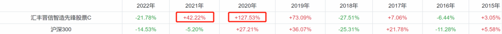
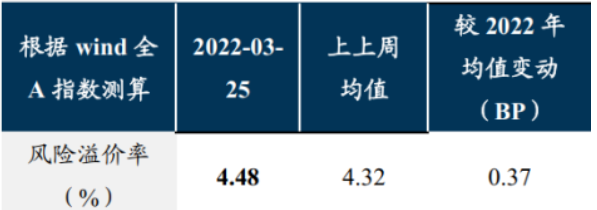
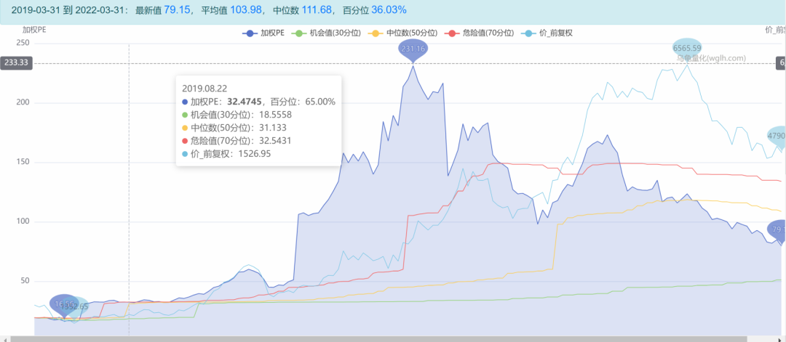
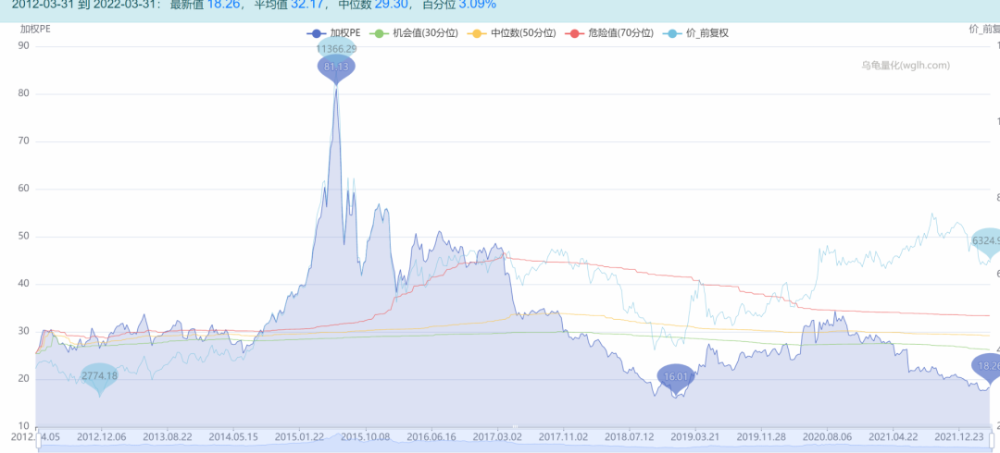
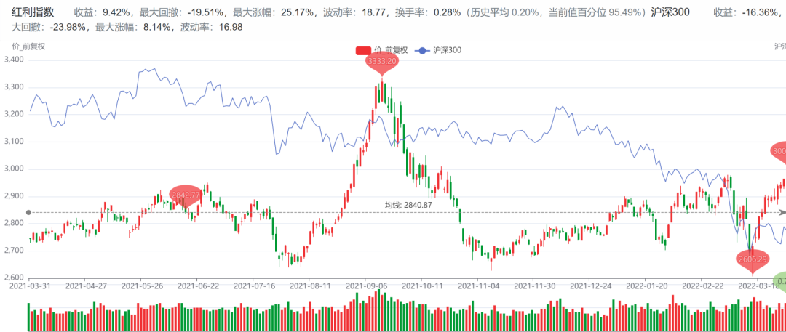
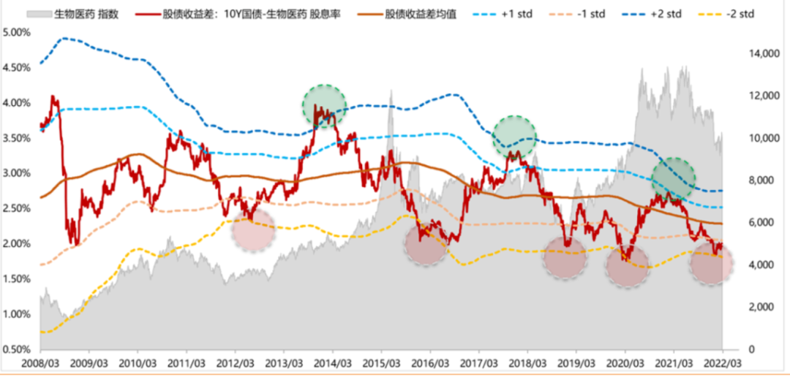

今天看了基金经理陆彬的路演，

大佬说现在的 A 股非常便宜，非常有吸引力。

别小看这哥们儿，人家是 2020 年股基冠军！

2021 年也赚了 42%，今年惨一点，亏了 21% 了。。。

大佬是怎么得出股市有机会这个结论的呢？

主要是以下两点。

第一，A 股的风险溢价很高，和 2018 年底以及 2020 年疫情爆发的时候差不多。

我特地查了数据，还真是，2018 年底的风险溢价也就是 4% 出头。

风险溢价，大家可以理解成股民的恐慌情绪，这个指标越高，说明大家越害怕，越不敢买股票。确实，现在这个阶段，各种黑天鹅爆发，大家的投资情绪确实很低落。莫非真是到了“别人恐惧我贪婪”的时候？

单看情绪指标恐怕还不能得出这个结论，大佬还提出了第二个论据——估值低！

陆彬比较看好以新能源车、光伏、医药和互联网为首的成长赛道投资机会，经过这一大波的杀跌，赛道股的估值处于一个比较低的位置。

新能源车的 PE 现在是 79 倍，相较于前两年的一两百倍，确实便宜了不少。

**但是现在这个价格，我觉得也很难出现全面性的机会，因为一个新兴行业，估值最高的时候一般是渗透率在 10% 左右的时候，去年 12 月，新能源车的渗透率已经突破了 20%，估值很难回到以前的水平。**

但是也确实有一些优质的股票，只有二三十倍的 PE，算是比较有性价比了。

最后大佬也说了，现在的 A 股机会，堪比过去二十年房地产投资的大机会，理由也很简单：因为买房子不赚钱了，老百姓找不到好的投资渠道，最合适的还是买股票。

这一点怎么说呢，我认可部分观点，房地产的黄金时代确实过去了，但炒股跟买房子不一样啊，买房子坐等躺赚就好了，炒股难度还是很大的，赚钱的人目前也是少数，我们还有很长的路要走。

好吧，给大家做个总结。

第一，当前整个市场的情绪确实是偏恐慌的，很多悲观的预期也确实已经反映在股价中了，比如说战争的不确定性，疫情的不确定性。也就是说，如果没有更可怕的黑天鹅事件，应该不会有太恐怖的下跌。

所以我个人感觉，不要在这个时候割肉。

第二，今年确实全球经济都不景气，通胀问题和地缘冲突也很严重，这种市场吧，不是说赚不到钱，只是对于我们这种业余投资者，投资体验会很不好，今天给你来个涨停，明天给你来个跌停，这谁顶得住啊，所以还是趁高把仓位降一降。

第三，今年其实是一个比较适合加大定投力度的时机，因为很多指数确实是处在一个比较便宜的时机了，这个时候多拿点筹码，以后总会反弹的。

以下几个指数是我个人相对比较看好的，供大家参考。

1）中证 500 指数

整体估值处于历史最低区间，且利润增速不错，安全性比较高。

2）红利指数

这个指数长期表现不太好，主要都是一些高分红的传统行业，如果大家特别恐慌，可以考虑这个指数，拿点稳定的分红还是 OK 的。

3）生物医药指数

这个指数套了我十几个点。。。其实我买的时候已经很便宜了。但是现在又跌了这么多，不过好在现在的估值基本触达了历史最低了。。。希望守得云开见月明吧！

最后还有两个我觉得可能会有反转的指数，光伏和新能源车。

为什么看好光伏，是因为硅料的产能在陆续投放，有助于下游组件降本，对整个产业链是利好。

新能源车大家应该都知道，最近车厂都在涨价，因为上游的碳酸锂已经涨到 50 万元/吨了，2020 年才几万元。最近我们的工信部也出来喊话了，要解决锂盐价格过高的问题，对中下游也是利好。

整体上看，到下半年这两个行业的逻辑会更高一些，光伏又比新能源车确定性稍大一些。

## 原文

- [冠军说，该抄底了！！！](https://mp.weixin.qq.com/s/nSSQfPuaf-GAOLKOVOg9Pw)
