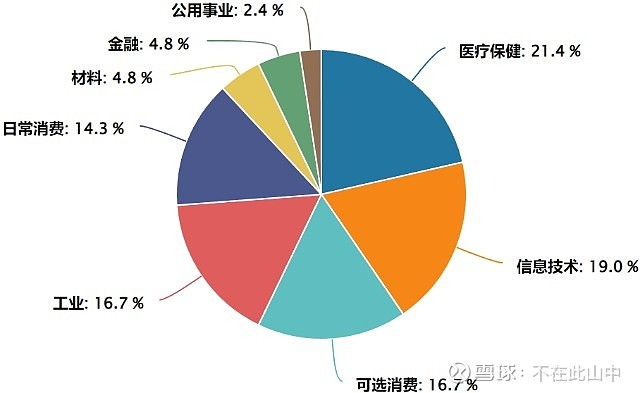
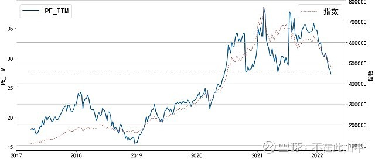
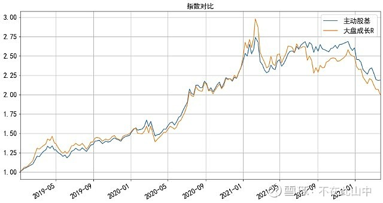
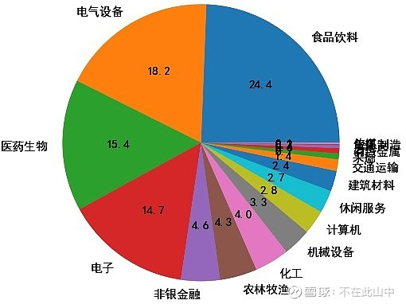
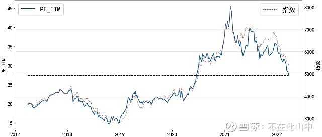
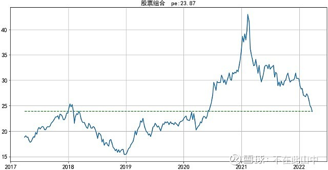
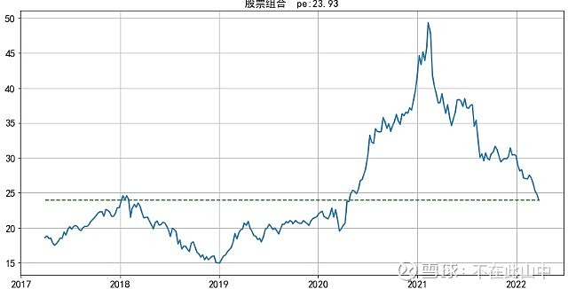
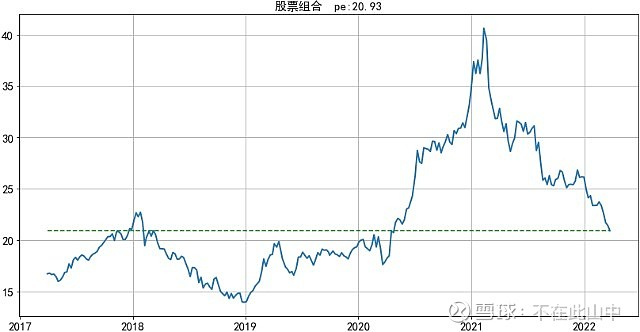

对于价值投资者而言，便宜时买入，贵了卖出，是很常见且相当有效的一种策略。

以投资股票为主的基金可分为两大类，主动基金和被动基金，其中，被动基金也称指数基金，顾名思义，是跟踪指数的基金，常见的如沪深 300、中证 500 等指数基金，由于指数编制透明，容易估值，便于判断贵还是便宜。

而主动基金就不太好判断了，一般是借用市场指数，市场指数贵了，就认为主动基金也贵了，市场指数便宜，可认为主动基金也便宜，这在多数情况下没问题，但在这两年市场结构性分化严重的情况下，可能存在较大偏差。

事实上，在偏股型基金中，主动基金才是主角，其整体规模要比指数基金大得多，基民关注度最高、动辄数百亿的基金也大都是主动基金，那么，

有没有一些简单有效的方法来更准确地衡量主动基金贵还是便宜？

基金跌了这么多，现在是该割肉还是补仓？

本文主要思路是寻找能更准确地代表主动基金持仓股票的股票指数。有没有这种股票指数呢？经过反复比对、考量，我找到了两个近似的。

## 一、茅指数

“茅指数”的推出是在 2020 年基金极致抱团时，涵盖了各个行业的各种“茅”，可谓基金抱团股的代表，具体来说主要包括消费（含日常消费和可选消费）、医药以及科技制造等领域拥有较强成长性及技术实力的部分龙头公司。

因此，用茅指数来代表主动基金的核心持仓无可厚非，和许多主动基金类似，该指数从 2021 年 2 月份的最高点至今跌掉近 4 成，那么茅指数当前的估值如何呢？该指数当前市盈率约 27，下图给出了该指数从 2017 年至今 5 年多时间的市盈率走势，图中蓝实线为市盈率、红虚线为指数，黑横虚线为当前市盈率：

几点思考：

1. 2019 年以来指数大幅上涨伴随着市盈率上升，指数近期的下跌也伴随市盈率下降，可以认为，估值是指数涨跌的主要影响因素。

2. 目前的市盈率大致处于近 5 年中等略微偏高的位置。

3. 由于公司基本面质量过硬，在当前宏观不确定因素较多的情形下，是享有确定性溢价的，当前 27 倍市盈率不算贵。

4. 保守估计，指数未来 5 年盈利年化增速超过 10%，也就是说，如果估值不变，长期投资收益率在 10% 以上，还是有一定吸引力的。

茅指数是主动基金重仓股的代表指数，但其实和主动基金业绩走势一致性不算很高，和基金净值走势高度一致的是下面这个指数。

## 二、国证大盘成长指数

国证大盘成长指数，反映了 A 股市场大盘股中具有成长风格股票的价格变动情况，包括 66 只股票，也都是质量好的大公司。

2019 年的这一波牛市以来，大盘成长指数的走势和主动股基指数契合度非常高，用该指数来代表主动股票基金持仓或是更好的选择。

下图是主动股基指数和大盘成长 R 指数的叠加，感受下二者相似度：

当我将这二者叠加时，说实话，自己也感到吃惊，竟然相似度如此之高！

从行业分布上看，重仓的食品饮料、医药、电子、电气设备都是基金重仓行业：

看看大盘成长指数近 5 年的市盈率变化：

经过分析，我们也能得到和茅指数类似的结论：

指数走势主要跟随估值，当前市盈率 27，中等略微偏高。结合公司质量、行业前景、宏观环境，指数当前已逐渐显现投资价值。

然而，不管是茅指数还是大盘成长指数，都是借助现有股票指数来估计主动基金股票持仓的价值，有没有更直接一点的办法呢？

有！

## 三 主动基金重仓股组合

按照股票持仓限制，偏股主动基金主要分为普通股票型基金、偏股混合基金和灵活配置基金这三类。

我分别提取了这三类基金 2021 年 4 季报披露的重仓股，用整体基金持有市值最高的 100 只股票做了个组合，编了三个市值加权指数，我测算了该指数近 5 年的市盈率，下面看看这三个指数的市盈率走势。

普通股票基金重仓股指数：

偏股混合基金重仓股指数：

灵活配置基金重仓股指数：

可以看到，2021 年 4 季报披露的主动基金重仓股组合市盈率要低于前面提到的茅指数和大盘成长指数，从历史上看，大体都处于中等位置。

从质量看，重仓股组合 ROE 都超过 15%，属于质地较好的公司，这一结论和前面两个指数是一致的。

总之，不论从茅指数、国证大盘成长还是基金重仓股，得到的结论是类似的。

主动基金持仓股票的质量通常较高，经过 1 年多的下跌，目前估值已经进入合理区间，显示出一定的投资价值。

诚然，从估值看还算不上很低，但在经济不确定增加、整体投资收益下降的大背景下，基本面好、确定性高和行业前景好的股票未必能回到当年的低估区间。

因此，在操作建议上，我认为，目前的偏股主动基金整体估值合理，机会大于风险，即便不准备加仓，也没必要在这个位置减仓。

以上是个人基金投资研究的记录，每个人投资期限、风险承受力不同，不构成投资建议

## 原文

- [跌这么多，主动基金够便宜了吗？](https://xueqiu.com/1468358080/215607970?sharetime=2)
