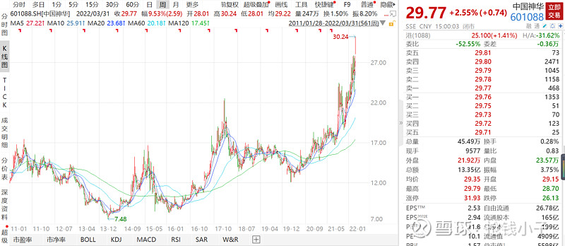
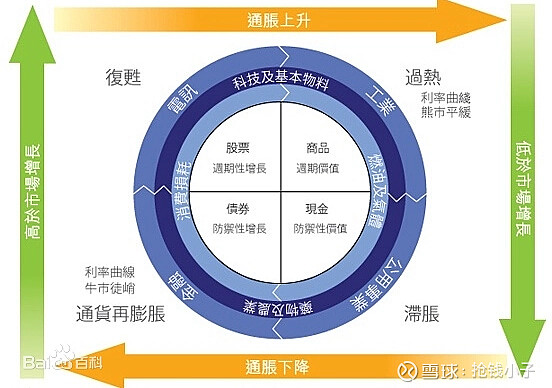
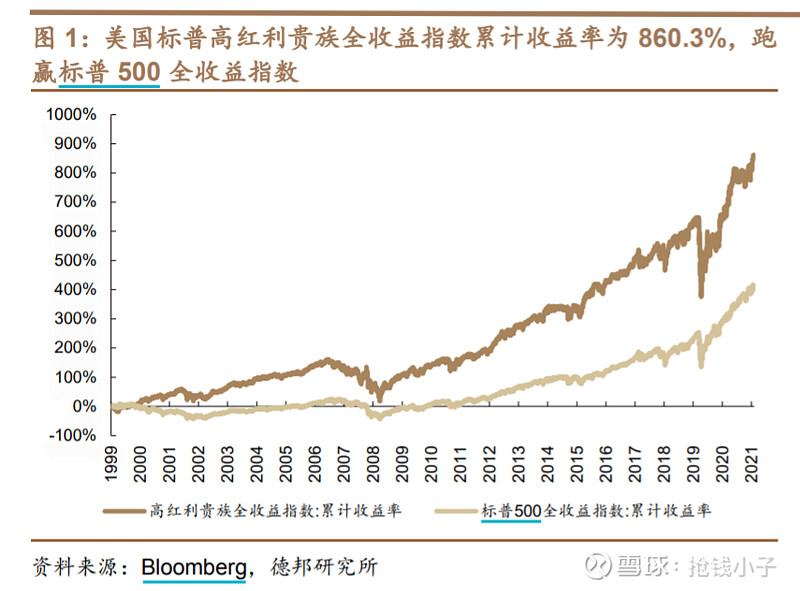
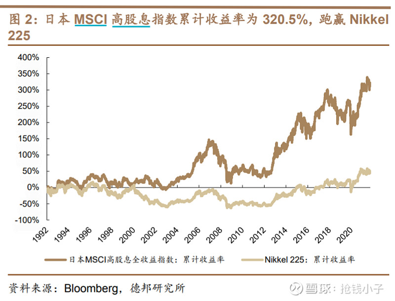
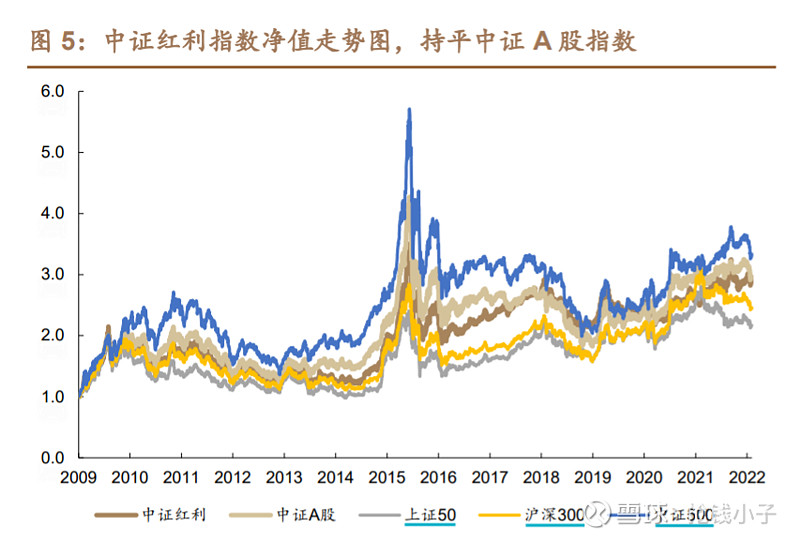
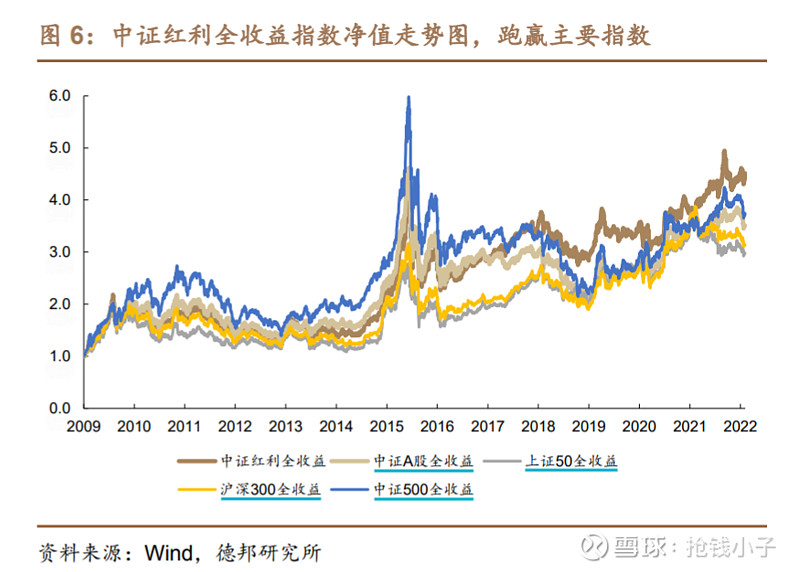
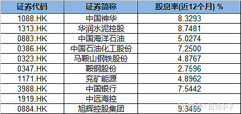
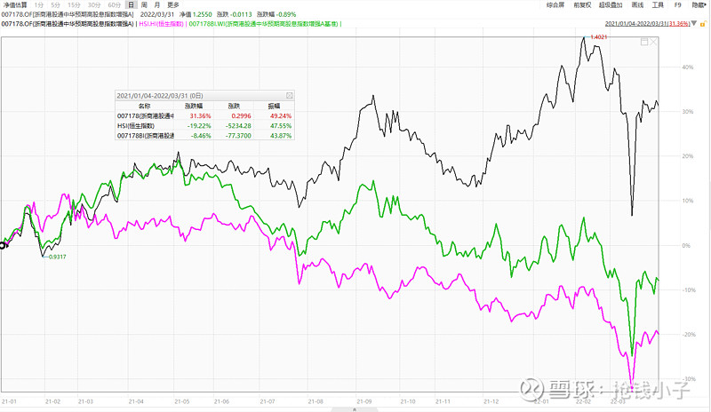
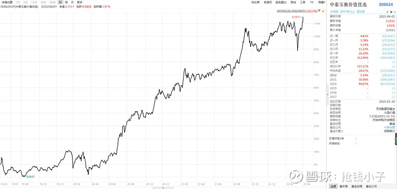

年报季到了，高分红个股收到越来越多的关注。3 月 28 日大红大紫的煤炭龙头中国神华宣布将净利润全部分红，按当日收盘价算，中国神华的股息率高达 8.69%！受此消息的影响，中国神华的股价大涨，在其他 A 股一片哀号之际，自己创出了十年来新高。

一面是屡创新高的高股息股，另一面是进入 2022 年不断回调的各种股票，球友们对高股息策略，一个古老又被遗弃许久的古典策略产生了兴趣，甚至恍惚间开始觉得这会是 2022 年能否盈利的关键之匙。

高股息率到底有什么好？其实，你能看到，真正大张旗鼓说高股息好的主流机构、基金经理并不多，眼下明星基金经理大多成名于捕捉成长股，这段时间随着产品净值的回撤，遭遇了基民唾弃，但他们很难因为被唾弃就去拥抱价值，具有根深蒂固的成长股思维和成长股的审美习惯，一时半会儿转不过来这个弯，习惯认为价值股这些玩意儿都涨不高，没大意思。

可当下的时代背景，似乎对高股息的个股而言，还真的不错。大家都听说过一个东西叫美林时钟，一种将“资产”、“行业轮动”、“债券收益率曲线”以及“经济周期四个阶段”联系起来的方法的投资工具。

现在的背景是什么？我认为毫无疑问，进入了滞涨！经济停滞，通货膨胀。虽然油价这几天跌破了 100 元/桶，但肉眼可见，所有资源商品都在涨，美联储那边一再否认通胀，但直升机撒出去的钱怎么会凭空消失？经济停滞，看看飙涨的地惨，就理解了。

根据美林时钟的指引，滞涨时最好的选择是什么？现金！财商课、银行理财经理、房地产中介天天跟你说，手握现金就是傻子。现实可能并非如此，根据美林时钟，此时最好的资产不是股票、不是商品也不是债券，而是现金。

高股息就是高派现，就是现金，高股息率的低估值价值股具有类现金资产的属性，这也许才是近期高股息率个股走强的根本原因。

说了这么多，高股息策略能否成为今年最亮眼的策略？

先说结论，我认为这种可能性非常大。虽然现在夹头被认为是一种自嘲的说法，但穿越历史的长河，无论海外还是 A 股，这个策略都经得住考验。

目前海外市场已有多只高股息策略的指数表现较好，例如美国的标普高红利贵族全收益指数自 1999 年 12 月指数成立以来，标普高红利贵族全收益指数年化收益率为 10.8%，跑赢指数 3.2 个百分点。

日本 MSCI 高股息指数的年化收益率为 4.8%，跑赢日经指数 3.5 个百分点。

你可能会说，我们不一样，A 股这片土地就不适合种价值的种子，可数据说明一切，高股息策略在 A 股也是长期有效的投资策略。

如果不考虑分红再投资，高股息策略资产组合跑赢 50、300 指数，持平中证全 A。以 2009 年 1 月 1 日为起点，截至 2022 年 2 月 8 日，中证红利指数的年化平均收益率为 9.2%。

09 年至今，中证红利指数的分红再投资贡献 40.9% 投资收益，如果将到手的分红再投出去，高股息组合跑赢全 A，超额收益可观。

从长期看，高股息策略非但不算差，反而能够稳中求胜。**对于古典价值投资者而言，以足够低的估值买入是关键，高分红收益率为保障，静待估值修复带来的潜在高收益可能。**

从短期看，成长派的明星经理不待见价值股时，现金为王的滞胀阶段，高股息策略很有可能逆袭！

看到这里是不是很激动？但赚钱似乎没那么容易，高股息率的个股太多了，钢铁、煤炭、银行、公共事业遍地都是，但不是每个都会轮番涨，梦里大家都是我猜对轮动，先搞到煤炭，接下来搞银行，再到公共事业，把一年轮动的钱都赚到。但现实是，当面对着一众高股息个股时，你的交易陷入钟摆陷阱，这边看着中国神华涨起来，几个大 V 带带节奏，头脑一热梭哈进去。回调两天，你挺不住了，又看到有大 V 写一定要铭记交易纪律，该止损就止损，随后乖乖割肉。就在割肉的一刹那，银行股快速飙升。

当然，我相信一定有极具盘感的天赋交易者，能够行云流水的在各个行业龙头股中做切换，赚取超额收益，但这个收益不会属于大多数人。如果不是龙命，踏踏实实简简单单，未尝不好。对于高股息而言，靠基金这个工具似乎不错，简单聊聊我认为可以考虑的基金。

1、全世界最被低估的港股市场中，专注高股息策略的指增产品——浙商中华预期高股息 A(F007178)

很多 A 股股民觉得 A 股很惨，但港股其实比 A 股惨的多。相对 A 股来说，港股目前的股息率更高，估值更低，中华预期高股息为股票价格指数，追踪“港股通”合资格名单内最高的 40 只高预期股息率的证券表现，而中华预期高股息当前估值尤其低，但是股息率非常高。

看看这只基金的十大持仓，过去 12 个月平均股息率超过了 6.5%，这里面还没算上中远海控潜在的逆天股息率。

极低的估值提供了一个相对较大的安全边际，恒指已进入一个“高赔率”区间，高股息类资产又因经营产生稳定充沛的现金流，或具备较高的分红水平，具备长期投资价值。

与此同时，这个基金还是一只纯港股指数增强型基金，据悉该基金依靠神秘的投研体系，指数成分内 AI+HI 双重增强，成份外精选低估个股，过去一年超额收益看起来还不错。

如图中所示，黑色线是该基金的净值曲线，粉色线是恒生指数，粉色线则是浙商中华预期高股息指数。2021 年至今，黑色的浙商中华预期高股息累计涨幅 31.36，大幅跑赢跌幅超 19% 的恒生指数，也跑赢了他的基准指数近 40%。

我并不精通，也不了解他的超额是如何创造的，但我觉得这背后有点东西。

2、深度价值投资者的主动产品——中泰玉衡价值优选混合 (F006624)

价值风格的基金很多，不过同为价值风格基金也会有不同的打法，我看到市场上有这样的分类，深度价值派，价值中的成长派以及红利价值派。

红利价值派的基金经理更偏爱高股息率的公司稳定的红利现金流收入，有助于提高投资组合的安全底线，此外高股息上市公司的 ROE 普遍较高估值普遍较低防御性较强，不过我觉得这个不如交给指数 ETF 来搞。

而深度价值派，选择确定性没那么强但是基本面有望改善被市场低估的行业或公司，静待困境反转这种思路赚取的是价值回归的钱，基金经理不抱团不跟风，先于市场做出价值判断的主动基金我觉得很有意思。

一方面当下可能因其选择低估行业而受到高股息率的偏爱，另外一方面选择困境反转行业、企业同时创造阿尔法，这种产品可能会在 2022 年迎来戴维斯双击。

姜成的中泰玉衡价值优选混合今年以来逆势涨超 5%，并于今日创出了自己的净值新高。

从持股上看，这只基金 2021 年披露的十大持仓中，既有中国神华这样的明星股，也有建筑行业的基石中国建筑，还有不被人看好今天却逆势冲涨停的万科 A，简单测算前十大持仓过去 12 个月平均股息率达到了 4%。

与今年一季度左手煤炭、右手房地产大放异彩的万家精选不同，我认为中泰玉衡价值优选混合取得的成绩并非主动选择，更像是长期坚守后的市场馈赠。

一方面，2006 年姜诚研究生毕业，在他入行之初钢铁煤炭等周期板块还是超级成长股，研究做得好的才会安排去覆盖这些行业，姜诚有幸成为其中一员，并逐渐建立起涵盖了食品饮料、商业医药、机械、造纸、煤炭等行业的研究框架。这与很多新生代的基金经理不同，因为经历过，所以更了解。

此前看过一篇远川关于基金经理姜成的采访，有段话让我记忆深刻。

远川：你刚才说到会根据悲观的情况出价这是出于什么样的考虑？

姜诚：一方面未来是不可准确预测的，所以我不会准确地去用 DDM 模型股利贴现模型估一个票值多少钱，但是可以用 DDM 模型去反推这个票，如果要值 30 倍市盈率，它未来应该有多好，然后去思考出现这种情况的概率。所以很多情况下其实用的是排除法。

另一方面我还需要很厚的安全边际去面对不确定性，安全边际就是反过来想，比如我不知道某一只股票 10 年 40 年之后会怎么样，但我可以去想它不会怎么样最差的状况是什么，那你给最差的情况估值然后再去买之后你会发现后面遇到的更多是惊喜而不是惊吓。

安全边际就是这样一种状态，它不是市盈率有多低，而是坏的情况一旦发生，损失依然可控甚至没有，损失还能赚点小钱，这是导致我的组合整体呈现出偏低估值状态的原因所在。

入行于 2006 年，对传统第二产业有着深刻理解，恪守安全边际，也许这只产品会在 2022 年越走越好

## 原文

- [赚的钱都拿来分红，中国神华股价创 10 年新高！高股息策略死灰复燃？专注高股息策略的基金都有谁？](https://xueqiu.com/9350291617/215980111?share_type=weixin&data_type=link&data_model=sd&fix_uid=2874661635&sharetime=2)
