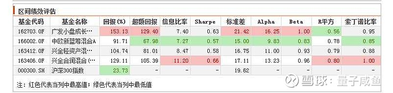

兴全趋势作为兴全基金家的一只王牌基，原来由老将董承非管理，后来董承非跳槽去了私募，现在由谢治宇管理，基金经理除了谢治宇还有童兰和董理，由于兴全系基金培育基金经理的传统是老带新，所以我们这篇文章分析下兴全趋势的持仓，分析下兴全趋势的实际管理人是哪一位。

如果一个基金有多位基金经理，那么分析实际管理人只能通过分析基金当前持仓和多位基金经理其单独管理的基金的持仓进行对比分析，和哪一位基金经理单独管理的基金的持仓最接近，那么他就是实际管理人，因为通常基金经理的精力也是非常有限的，每位基金经理都有自己的一个关注股票池，不可能因为管理了多只基金而搞两套系统，所以基金经理如果管理多只基金，其基金持仓的相似度应该比较高。

我们先看下兴全趋势当前的持仓情况：

兴全趋势在 2021 年 10 月 20 日基金经理由“董承非、童兰”变更为“谢治宇、童兰、董理”，我们逐一进行分析：

谢治宇的代表作是兴全合润，并且兴全合润的基金经理也只有谢治宇一个人，可以作为分析对比标的，童兰只管理过兴全趋势这一只基金，并且资历较浅，估计还是以学习为主，估计不是管理的主力，董理除了管理兴全趋势外，还单独管理兴全轻资产，可以作为对比分析标的。

兴全轻资产的前十大持仓如下：

兴全合润的前十大持仓如下：

我们对比下当前前十大持仓的重合度：

其中持仓重合的用黄色标注，持仓变动不一致的用红色标注，持仓变动一致的用绿色标注，可以发现兴全趋势和兴全合润前十大持仓仅 2 只重合，而兴全趋势与兴全轻资产前十大持仓就有 7 只重合，持仓重合度非常高，虽然仓位变动上有所出入，不过基本可以确定，兴全趋势的实际管理人是董理，我们再看下净值走势的相关系数：

可以看到近 3 个月兴全趋势 VS 兴全合润走势相关性系数为 0.92，而兴全趋势 VS 兴全轻资产的相关性系数高达 0.99，基本可以验证前面关于兴全趋势的实际管理人是董理的推论。

那么既然确定了兴全趋势的实际管理人是董理，那么我们看看董理的业绩情况，还是结合“咸鱼优质主动基挑选原则 V1.0”来分析：

## 1.优先选择头部基金公司的王牌基

兴全趋势和兴全合润一样，都是兴全系的王牌基，这个没啥问题；

## 2.基金经理管理的主动型基金长期历史业绩优秀

我们只能通过分析董理单独管理的兴全轻资产来分析，首先看下董理任职以来的年化收益率为 11.83%，比较一般，不过其管理兴全轻资产是从 2017 年 11 月 23 日开始，也就四年多的时间，时间还比较短，长期业绩还有待观察：

不过兴全轻资产这只基金本身的历史业绩还是不错的，从 17 年 3 月 31 日统计的区间看过来，基本和其他同类型的混合基金差不多，没有明显逊色：

兴全轻资产这只基金成立近 10 年，总收益率为 626%，年化收益率更是高达 21.9%，还是非常不错的；

## 3.尽量选择灵活配置型，有仓位自主权

兴全趋势的股票仓位为 30%-95%，仓位自主权还是很好的，基金经理有很大的自主空间；

## 4.优先配置全市场择股的基金

兴全趋势不能投港股，这一点和兴全合润一样，兴全合宜相比之下可以投资港股，可以选择的标的会多一些；

## 5.基金经理管理的主动型基金历史净值回撤控制好是加分项

就统计区间（从 2017 年 11 月 23 日开始）的夏普比率和索丁诺比率和中欧新蓝筹差不多，比另外两只差一些：

近 5 年最大回撤 24.19%，长期走势也还是比较平稳的，回撤控制还可以，没有特别大的硬伤；

## 6.基金经理管理的同类基金规模在 300 亿以下是加分项

目前董理管理的只有兴全轻资产（87 亿）+ 兴全趋势（299 亿），总计 386 亿，相比于谢治宇这类老将来说，规模已经小了很多，规模尚小有优势；

另外上次统计的谢治宇管理规模 963 亿就需要修正一下，目前谢治宇在管规模为：

兴全合宜 A+C（259.4 亿 +16.66 亿）+ 兴全合润（334 亿）+ 兴全社会价值（54.53 亿），总计为 665 亿，这样算起来，谢治宇的性价比又提高了一些；

## 总结：

a.兴全趋势实际管理人是董理，谢治宇只是挂名 + 指导，童兰是助手 + 学习，核心配置还是在董理；

b.董理历史业绩整体中规中矩，不过时间尚短，长期业绩还需要继续观察，但是如果只是作为“优质主动基武器包”分散买入策略中一只标的，那么买兴全趋势也是没问题的；

c.如果看好谢治宇，不妨换成兴全合润/兴全合宜；

## 原文

- [“王牌基”硬核测评：兴全趋势深度分析](https://xueqiu.com/9600110938/216024734?sharetime=2)
