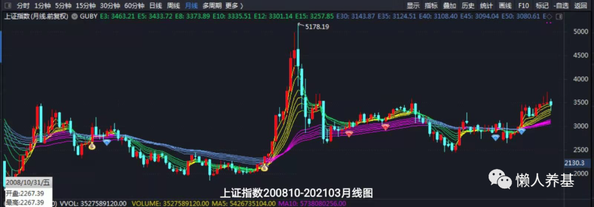
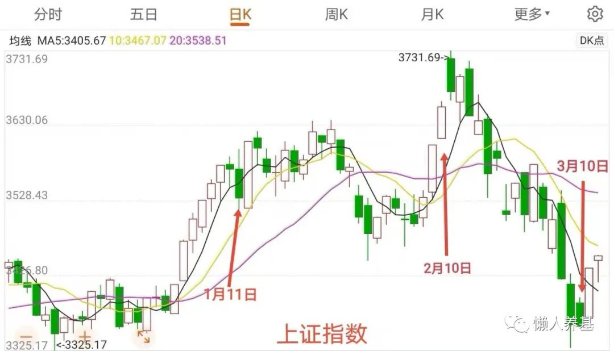
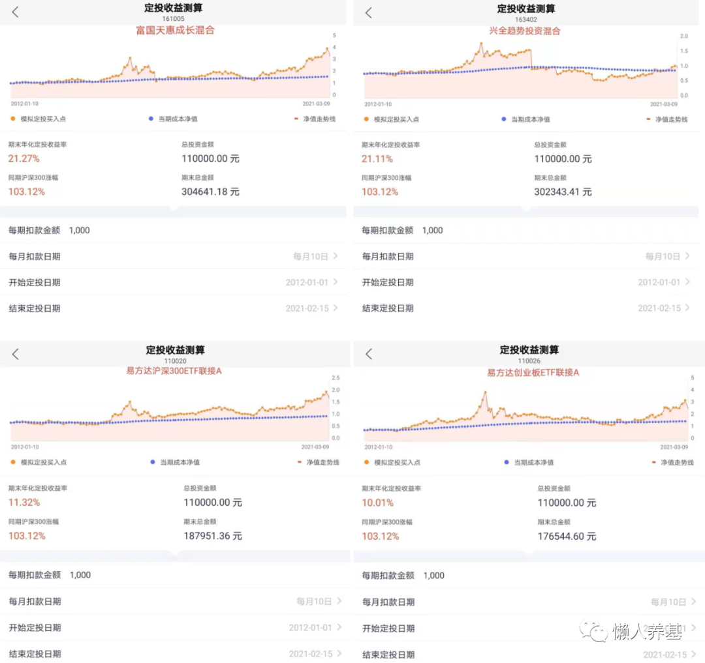
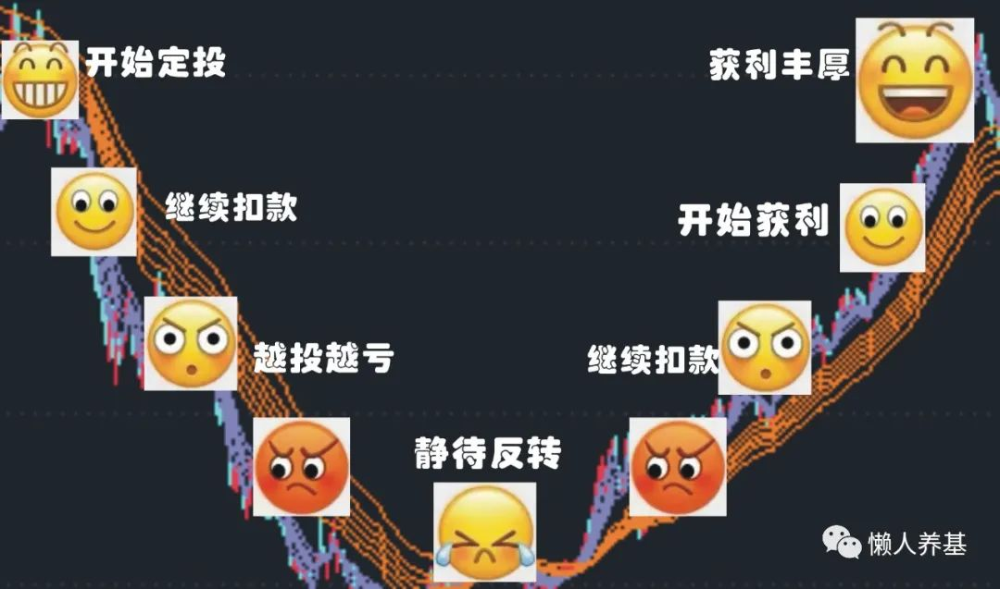

最近问我基金如何定投的朋友还真有点多，说明定投的宣传比较到位，比起动不动就一把梭的传统股民，这届基民实打实还是进步不小的。

但为什么要定投？如何开始定投？投什么？投多少？投多久？止不止损？止不止盈？如何止盈？止盈后又如何开始新的一轮定投？对这些问题，好多小白投资者还是一脸懵逼的。我这里就来解答一下。

## 一、定投的本质

定投是选择享受国家和社会发展进步的红利，通俗来说就是赌国运：只要社会发展进步，股市就会滚滚向前。

定期定额投资最大的好处是获得市场平均成本。定投一周，就是最近一周的市场成本；定投一个月，就是最近一个月的平均市场成本；定投一年，获得的就是最近一年的市场平均成本。以此类推。

获得市场平均成本意味着不谋求打败市场，同时也不被市场打败。对于长期价值投资者来讲，我们本来的目的就是“养只金基下金蛋”，以市场平均成本来获得股市长期螺旋式上升的成果，相信这是最明智的做法，也是基金定投的要义。

这里再强调一下股市长期螺旋上升的底层逻辑：上市公司每天每周每月每年都在赚钱赢利，之所以螺旋上升而不是直线上升是因为交易引起了波动。

情绪钟摆使人在交易中有时像打了鸡血，有时像霜打的茄子，而定投恰好可以让人跳出这种折磨，它是对付波动恶魔、让投资无限回归理性的利器。在定投中，如果市场上涨，你会开心，因为你投进去的部分已经开始赚钱；如果市场下跌，你也会开心，因为花同样的钱能买到更多的基金份额。

而定投解决了基民“善于而且敢于”追高的问题，改善了基民的投资体验，给基民带来了切切实实的好处。不信可以查阅下历年的权益基金发行数据，发行量最大的时候几乎都在市场最高点，最近一次某基金发行遭 2300 亿热钱追捧的新记录，也几乎“完美”地发生在近期市场的最高点附近。

## 二、教你克服总怕投在高点、总想投在低点的心魔

好多朋友在问，是不是越跌越投啊，上涨是不是就不投或者少投啊……非常正常，大部分投资者一上来就想择时，就想着战胜市场。

可长期来看择时是一种输家游戏；而定投的基本特点就是定期投入、到时就投，完全不择时。你可以随时开始定投，马上开始也无妨。

跟追涨杀跌的基民不一样，想定投的基民也会走向另一个反面：我会不会投在最高点上啊？我能不能低点再投啊？答案是办不到。

定投嘛，投在高点上一两次是可能的，但无碍大局。以按月定投为例，我们来看下大家最为熟悉的上证指数月线图。（上证是一个奇葩的指数，大家最熟悉，因此用它举例，但它的投资价值非常有限。）

最不幸运的，就算从 2015 年大水牛投起，收盘点位高于 4000 点的月份只有 4、5、6 三个月，而 4 月和 6 月两个月还有低于 4000 点的交易日。在最高的 6 月份，收盘点位高于 5000 点的交易日只有 7 个，6 月份定投一次，选择不同定投日投在 5000 点之上的概率只有三分之一（6 月份 21 个交易日）。

如果从收盘点位高于 4000 点的 2015 年 4 月份开始定投，为方便计算把定投日都确定为每月最后一个交易日，则定投一年至 2016 年 3 月底的平均成本为 3504.15，剔除超过 4000 点的三个月，平均成本为 3191.02，为不剔除的 91.06%；定投到 2 年这一数值为 95%；定投三年至 2018 年 3 月份，这一数值达到 96.80%。可见，定投时间越长，高点几个月对平均成本的影响越小，而且，这些年 A 股的走势大体都遵循这么一个规律：大涨之后必有大跌，高点之后紧随着低点，按月平均之后总的成本曲线是比较平滑的。

再拿最近大盘的走势举例，如果第一次定投就不幸投在 2021 年 2 月 10 日的高点，3 月 10 日马上给你来个近期最低点，是不是很魔幻？所以定投择时完全没有意义，时间拉长了怎么努力都只能拿到一个市场平均成本，还是老老实实的到时间就投、完全不折腾为好。

## 三、定投投什么

### 1、首先我主张以优秀的主动基金为主

优秀的主动基金相较指数基金有着不菲的超额收益，而且这种超额收益还会在相当长时间内存在。主因两个：第一，主要宽基指数由于市值加权和行业过于分散，还有历史原因导致成分股中有一些行业前景欠佳或成长性不足的问题，优秀的主动基金可以靠精选个股和消费、医药、科技等行业来超越指数；第二，目前 A 股散户以 20% 左右的持股市值占比，创造了 80% 左右的交易量，因此 A 股市场仍然是散户主导交易的市场，而公募基金在资金、人才、信息方面有着对散户的天然优势，还有大把的韭菜可以收割。

看下图数据说话：自 2012 年 1 月 1 日每月定投 1000 元，富国天惠、兴全趋势完胜沪深 300 和创业板。这两只主动基金仅从业绩看不算顶尖的，大多时候徘徊在良好和优秀之间，可以代表我说的优秀主动基金。而且它俩成立时间够长便于做回测比较。

### 2、当前市况最好以股债配置的方式进行

2021 年的股市，在经历了 2019、2020 年较大幅度上涨后，年初我的判断是“行情已过半山腰”；经过最近一个月的调整，估值虽有下降，但整体上也不能用“便宜”来形容了。

我们知道，股市投资胜算只在两种情况下出现：绝对低估如 2018 年底，只买不卖，可以完全持有股票基金；绝对高估如 2015 年 5、6 月，只卖不买，可以完全持有债券基金或货币基金。处于两种极端情况下的中间阶段，股市上下皆有可能，以股债配置的方式定投，相当于留有一部分抄底股票的类现金期权，进可攻、退可守，是更有胜算的投资方式，使我们更容易“甩开膀子”大胆投资。

方案有：

（1）稳健偏积极：股 6 债 4.

（2）稳健均衡：股债均配。

（3）稳健偏防守：股 4 债 6。

（4）积极进攻型：股 7 债 3 至 100% 股票基金。如果你长期获取现金流的能力很强，对投资和波动的理解到位，可以增加股票基金占比，直至只投股票基金。

### 3、主动基金怎么选

主动基金数量庞大，比股票还多，怎么选？简单粗暴，直接从五星、四星评级基金里进行挑选就好。我的标准如下：

（1）首先看现任基金经理从业时间多长，从业时间不足三年的直接 Pass 掉，基金经理越老越好，从业时间越长越好。

（2）第二看该基金经理的长期业绩，至少 3-5 年，最好 5 年以上，从年度看稳定排名优秀和良好的。老有人拿“后视镜思维”抬杠，意思说业绩只代表过去。认真说这话的你可以朝他吐口水了：选拔人才不看过往的业绩，难道看他脑袋上有毛无毛，是不是聪明绝顶？

（3）第三看基金经理投资风格，我喜欢风格均衡不极致的长跑健将，投资他们的基金能给你比较好的持有体验。主要体现在行业、个股不要过于集中，避免涨起来够猛、跌起来够疯、大起大落的情况。最好前十大重仓股不超过总资产的 50%、单一行业占比不超过 30%。

经过 2 月 18 日开始的这一轮调整，风格极致、各种含“茅”量高的基金，其收益率水平基本已经回到了与均衡风格基金同一起跑线上了。但均衡风格基金相对的低波动率对投资者的持有体验更为友好，应该成为我们的底仓或核心配置。

（4）第三看基金经理有没有控制回撤的意识和能力。可以查看年度最大回撤等指标以及大幅调整年度比如 2008、2016、2018 年的业绩表现，回撤过大（超过同类平均水平）的不选。

第（3）、（4）项可结合查阅分析基金季度报告《报告期内基金投资策略和运作分析》章节得出结论。

### 4、如果想投指数基金，建议不超过 20%

成熟市场主动基金大多跑不过宽基指数基金。我们虽然也在不断前进，但离成熟市场还很远，所以我的建议是以主动基金为主、指数基金为辅。

也有杠精拿主动基金比指数基金管理费高 1% 说事，还言之凿凿地翻出国外某经典投资著作，却选择性忽略权益主动基金平均有 6-7% 超额收益这一事实。认真说这种话的杠精也可以朝他脸上吐口水了，让他有多远滚多远。

沪深 300、创业板、恒生指数、沪港深 500 等宽基指数，深证红利、中证红利等策略加权指数，中证主要消费、中证医药、中证科技、中概互联、人工智能等行业指数长期来看值得关注。

### 5、不定投自己不了解或者理解不了的基金。

不定投强周期行业基金、夕阳产业行业基金。

不投细分行业主题基金，行业越细分，风险程度越接近于个股。

## 四、存量资金与增量资金在定投方法上会有所不同

我们通常所指的定投，是指我们每个月节余的钱按计划进行的投资，在我们几十年的职业生涯中几乎是源源不断的。增量资金，也就是每月节余的钱，每月定时投一份，不择时，不中断。

当然也可以周定投，不过周定投会让人随时关心行情，对工薪族来说，会不会出现在一个月内时间拉长了出现资金挪用问题，所以我不太主张周定投。

在决定投资基金的时候已经有一笔比较大的积蓄，也就是存量资金。对存量资金定投我有这么几个观点：

1、如果存量资金数额较大，是自己每月节余可以用于基金定投金额的若干倍，就以倍数计算，是多少倍就分成多少份，每月投入一份，与每月节余部分一起投，相当于投入双份。如果存量资金很多，拆分数量最多也不要超过 36 份，也就是说，可投资存量资金再多，也不要超过三年投完。

这样做的目的是既在一定程度上考虑投资效率，也照顾到投资心态容易平稳的问题。虽然没有更多数据支撑，在我多年的投资过程中，选择优秀的主动基金定投，基本上定投到第三年都会有赢利了。我的体会是，只要后续有钱投入，就不会太在乎前面的投资浮亏。而等到有浮盈了，投资心态会更好。

2、如果不想分三年投资完，比如想一年 12 个月就投完，也完全可以。只需要把股债比调整一下，将债基调高 10 个百分点，比如原来打算股 6 债 4 的，调整成股债均配；股债均配的，调整成股 4 债 6，依此类推。这样做是用配置的保守对冲时间上的激进，如果 1 年投完股票基金成本偏高一点，也可以在之后通过动态再平衡或逐步调整股债比降低成本。

## 五、定投投多久？

在我的观念里，投资理财应该是一种生活方式，是一辈子的事。所以我主张定投时间尽可能拉长。我甚至会做这样的安排，一部分钱在我们工作赚钱的时候完全不动用，直至退休之后才逐步拿出来用。

一方面确实因为复利积累靠的是时间，如果听任它积累 50 年，我们普通人完全不敢想像的财富会被创造出来。我在《做生意，还是买生意》一文中做过测算，10 万元一次性投资，如果按照公募偏股基金近 20 年的平均年化收益 16.50% 算，50 年后变成了 2.07 亿元。如果每月定投 2500 元，按 16.50% 的年化回报，50 年后可以积累 66.68 亿元！是不是很魔幻？可惜 50 年太长，我们绝大部分人办不到。

第二个原因是，随着我国老龄化的来临和日益严重，80 后之后的大量年轻人可能会面临老无所养、老无所依的局面。我国目前实行的养老体系是一种代际转移的养老制度，现在工作的年轻人交纳的养老金养着现在退休的老年人，等 80 后以后的这些年轻人退休时，交养老金的年轻人说不定还没有退休老人多，到时候肯定存在着养老金严重不足的问题。如果在退休后还想过个体面有尊严的生活，恐怕现在就得为多年之后的退休养老作打算。

## 六、定投止不止损？止不止盈？如何止盈？

定投止盈不止损，定投止盈不止损，定投止盈不止损。重要的事说三遍。如果不是长期不用的钱，就一定不要拿来定投。定投就一定要投到盈利，达到盈利目标了，才考虑止盈。

1、除非投资标的有问题，比如你定投了一堆强周期品种、夕阳产业行业基金，等下一波周期到来可能要很多年，或者行业趋势性衰退、看不到前景，否则定投一律不止损。如果看错了、投错了，不管盈亏都要出来，转换成宽基指数基金、宽赛道主动基金或者有长期投资价值的消费、医药、科技主题行业基金。

2、傻傻定投完全不止盈，行不行？从回测数据来看是完全可行的。我们拿成立时间最久知名度也最高的富国天惠和兴全趋势作回测，两只基金都成立于 2005 年底，假如我们从 2006 年起每个月 10 号傻傻定投 1000 元，到 2021 年 2 月 10 日最后一期投完，一共定投 182 期，本金投入都是 182000 元，很巧合两只基金到 2021 年 3 月 9 日期末累计金额都超过了 80 万，定投年化收益分别达到 17.71% 和 17.76%。

但是傻傻定投不止盈，要做很多次过山车，我们是拿不住的。

3、所以我建议年化收益率达到 20% 止盈。为什么是 20% 呢？因为我想达到 16.50%，也就是公募偏股基金长期平均年化收益率，止盈后有再开始定投的运作，会损失投资效率，所以把年化收益率定得稍高一点。注意这个年化 20% 是计算复利的，从投资第一笔算起，第一年 20%，第二年 44%（1.20×1.20），第三年 72.8%（1.20×1.20×1.20），依此类推。

达到目标止盈后，把全部资金分成 24-36 份，跟每个月增量资金一起开始新一轮定投，依然按照 20% 年化收益率止盈。如此循环往复。

4、前面说了，目前这种总体不高不低的市况，我主张以股债配置的方式定投，以我自己的风险偏好，我喜欢按股 6 债 4 配置定投。这种配置定投止不止盈呢？如何止盈？

从今年的走势结合国家对股市的政策和制度建设来看，长期震荡走慢牛的可能性大于 2007 年、2015 年那种短期急促的疯涨。果真如预期这样的话，每年春节后第一个交易日（我的习惯，其他时间也可以）做一次动态再平衡就可以了。动态再平衡实际上就是一种止盈方式，将运行了一年的投资组合重新恢复比例至股 6 债 4。

如果出现 2007 年、2015 年那种急促的疯涨，总市值每上涨 10% 就将股票基金比例调降 10 个百分点，直至完全清仓股票基金。配置的是主动基金组合还是指数基金组合，具体止盈方法和细节会有所不同，但总体思路都是一样的。我的另一篇文章《投资的实质是应对》提供了更为详细的思路，感兴趣的朋友可以在我专栏里或者我的公众号“懒人养基”中参阅。

## 七、关于定投的其它重要问题

1、有没有优化的定投方案？像智慧定投、低估定投什么的

我们都有一种梦想，就是总想打败市场。

智慧定投、低估定投依赖的底层逻辑是精准估值，有经验的投资者都知道，同一天不同渠道给出的估值数据可谓五花八门，差别很大。解释是优化过，比如有的剔除了商誉等估值因子。其实我们应该认识到，所谓估值都只是毛估估，不能不信，太过相信就过了。

这类方法有个最大的问题，需要等待很长时间比如 2-3 年才能等到一次低估机会，从资金使用效率来讲是有问题的。另外，低估到非低估相差不到 1 个百分点就不能投了，也太过机械了，这种情况我们在有的平台上使用了智慧定投，好几个月不给扣款，于是就改手动或者普通定投了。

我用股债配置的方式定投，其实就解决了像目前这种估值不便宜时段的定投问题。而且如果 A 股未来像成熟市场一样走出慢牛行情的话，估值不便宜会成为常态。我自己认为股债配置定投的方式是一种更为“模糊的正确”，更适合大多数普通投资者。

2、熊市要不要停止定投？

这是个气死人不偿命的问题。熊市是最好的定投时机，下跌越多，定投成本越低，牛市来了才能有更好的收益。典型的定投微笑曲线就是左侧定投，越跌越投，静待右侧来临，曙光初现，直至大获全胜。

可是就有一些朋友在熊市里因为恐惧干脆停止了定投，错过了捡便宜筹码的大好机会，这是定投最不应该犯的错误。

千万千万不要在市场下跌的时候停止扣款。

3、要不要趁大跌加个仓？

定投最重要的原则就是遵守纪律，除非你有富裕的资金，否则不要开这种“黑车”，一次大跌早早把子弹打光了，等定投时间到了说不定点位更低，可是没有钱投了。

4、定投时间恰好碰到大涨，要不要等等再投？

不等。说不定越等越高。

5、再问一次，我真的真的忍不住了，要不要止损？

恐慌、忍不住想跑的时候，可能正是遍地黄金的时候。千万千万不能止损，坚持定投，静待获利。

如果你实在实在忍不住止损出来了，说明你不适合定投，也不适合做权益投资，把钱老老实实放货币基金里就好。很多人一辈子都不投资权益市场，一样过着花儿一样的幸福生活。

小结：

定投就是跟随市场，不谋求打败市场。

跟市场争利的，往往会死得很惨。等着市场发钱的，往往都会赚得盆满钵满。

## 原文

- [免费的基金定投教程，一篇管够](https://mp.weixin.qq.com/s/rmVIYMf-EbTurkwVN5IH9g)
