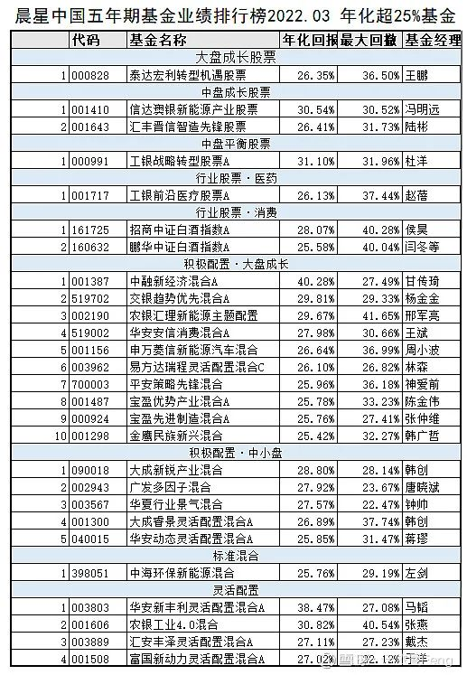
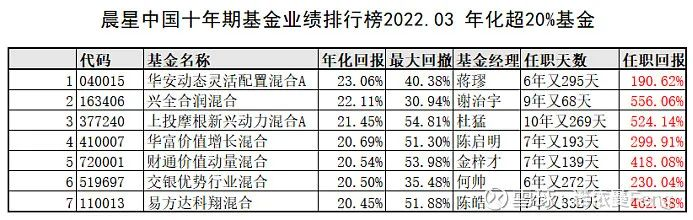
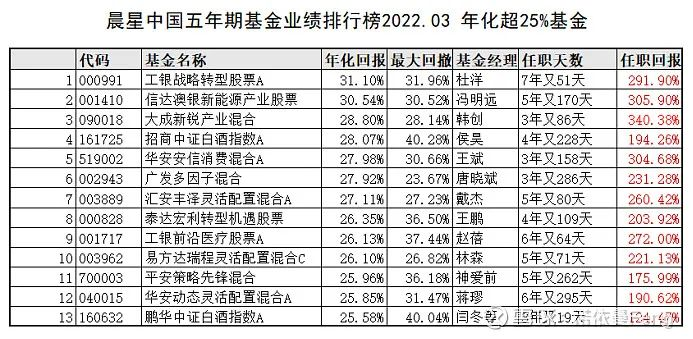
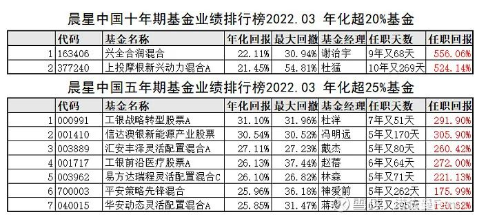
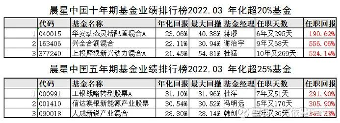
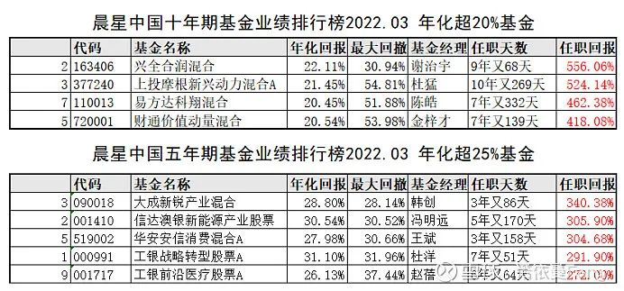
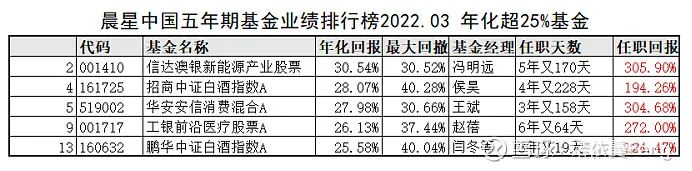
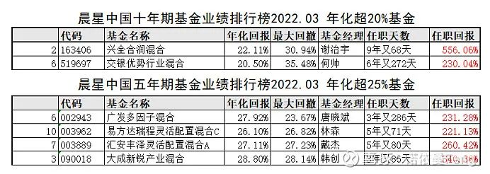
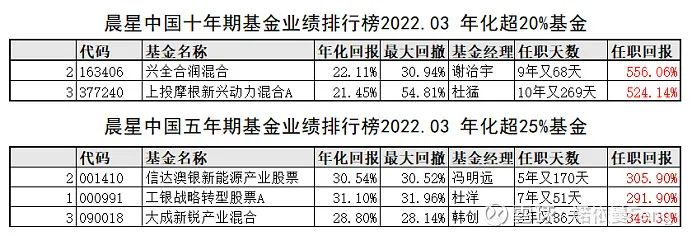

面对一万多只基金，无论是基金小白还是资深基友，大多数的时间都耗费在基金的“筛选”上。

基金小白初来乍到，面对十倍基、冠军、划线选手、五星等各种“诱惑”无从下手；资深基友似乎老谋深算，喜欢用这个比率、那个标准差、甚至看不懂的公式来“迷惑”自己，有时也不知如何是好。

复杂事情简单做，往往能效果更好。

单纯从投资的最终目标 -- 回报出发，选择就会容易得多。

今天，就跟大家探讨一种简单、方便、有效的选择基金的方法：

基于长期业绩回报的“三步选基”法

## 第一步、选择长期业绩优秀的基金

筛选长期业绩优秀的基金有很多种方法。

各基金平台都有“基金排行榜”，投资者可以选择不同的年限、不同的基金种类进行排行，有的平台还可以自选时间段。比如大家都熟悉的雪球基金等平台。

有的专业机构则只列出长期业绩榜单，比如银河证券、海通证券；而晨星基金则定期发放一年、三年、五年、十年的分类榜单，短中长期都有。

与基金平台的“基金排行榜”的大排行不同，专业机构的业绩榜单则只列出 TOP 基金。

若筛选条件一样，则各平台所列榜单差别很小。

本文以晨星十年基金业绩排行榜和五年期基金业绩排行榜为例，介绍“三步选基”法。

### 1.1、从十年业绩排行榜中找出所有十年年化回报超过 20% 的基金。

### 1.2 从五年业绩排行榜中找出所有五年年化回报超过 25% 的基金。

## 第二步、匹配长期业绩优秀的基金经理

查看基金现任基金经理任职天数，选择现任基金经理管理时间长的基金：确保业绩回报主要由现任基金经理取得。

### 2.1 从十年年化回报超过 20% 的基金中，筛选出现任基金经理任职天数超过 6 年的基金。

### 2.2 从五年年化回报超过 25% 的基金中，筛选出现任基金经理任职天数超过 3 年的基金。

## 第三步、建立备选优秀基金池

由上述 20 只基金组成备选基金池。根据自己的需求、喜好、时间点，选择和购买基金。

（实际上是 19 只基金，华安动态灵活配置混合 A 同时在十年和五年清单中）

### 3.1 排行榜业绩期限和任职天数匹配度一致的基金。

这些基金确保了排行榜中的业绩均有现任基金经理取得。

### 3.2 选择业绩期限内回报最好的（各）三只基金

### 3.3 选择现任基金经理任职回报最高的基金

### 3.4 选择行业基金

### 3.5 选择最大回撤小的基金

### 3.6 优中选优基金：本节前面 5 种选择方案中入选 3 次以上的基金

谢治宇的兴全合润和冯明远的信达澳银新能源分别入选 4 次；其它三只基金分别入选三次。

从“优中选优”选中的这五只基金来看，确实都是实至名归。

谢治宇和杜猛都是顶流基金经理。

谢治宇以“平衡大师”著称，掌管千亿资金；杜猛以“成长”见长，其管理的基金短、中、长期业绩均非常出色；

冯明远和韩创都是最近两三年崛起的中生代力量，2020 和 2021 年名声鹊起。冯明远以挖掘赛道潜力股著称，而韩创以“不做赛道但做了赛道的业绩”闻名。

杜洋的工银战略转型股票 A，则擅长对市场“察言观色”、提前布局，从而抄底逃顶获得骄人的超额收益。

## “三步选基”小结：

第一步：选择长期业绩优秀的基金：

“优中选优”筛选出高回报的基金，确保基金长期业绩优秀。相当于已经筛选出了所有长期业绩优秀的基金，大大缩小了选择基金的范围，大大降低了筛选基金的难度，大大增加了“选对”基金的概率。

第二步：匹配长期业绩优秀的基金经理

在第一步的基础上，通过在职基金经理的管理天数匹配“业绩归属”，确保这只基金的优秀业绩大部分是由现任基金经理管理期间取得。确保现任基金经理有能力在未来创造高回报。

第三步：建立备选优秀基金池

根据自己的需求、喜好、时间点，选择和购买基金。

三步选基，是一种适合基金新手的选基方法，单纯以长期回报为筛选条件，没有更复杂的筛选设定，先“选对”再“选优”。

## 原文

- [三步选基：一种简单、方便、有效的基金选择方法](https://mp.weixin.qq.com/s/91xGMhBLiMupZUkxE8A_rg)
