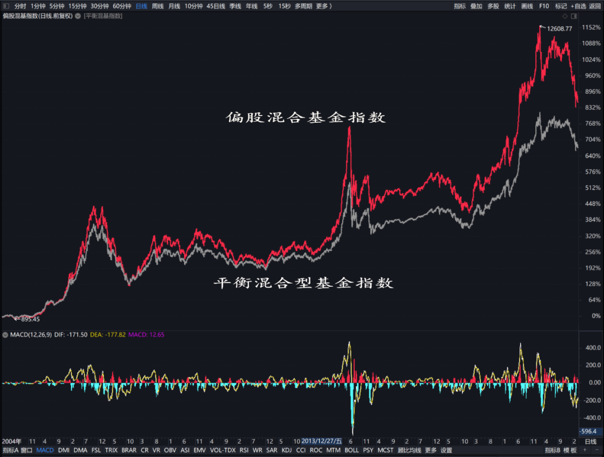

投资者对自己的投资都会有一个朦胧而模糊的期望，肯定都希望回报越高越好。

多高算高？多好算好？能不能实现？有没有跟自己的风险承受能力相适应？

问问这些问题就知道，其实我们中的绝大部分对自己的投资都是缺少规划的，我们的投资大都处于这么一种漫无目的的状态：“踩上西瓜皮，滑到哪儿算哪儿。”

这种漫无目的会让我们经常处于一种焦虑之中，总想追求最好的基金和最优组合，可现实却啪啪打脸，因为自己选定的基金或自己设定的组合大概率不是阶段回报最好的，于是不断换基金、不断调整方案，陷入追涨杀跌的怪圈。

一番折腾下来，苦死累活，亏了大把的钱，赚了个寂寞。

所以，根据自身情况，给自己的基金投资，定一个“锚”，也就是一个业绩基准，我认为还是非常有必要的。

因为一个具体可行的业绩基准让我们有了方向感，不再像无头的苍蝇。

只要我们的短期业绩跟业绩基准偏离不大，我们就完全可以放心躺平；而如果偏离大了，我们也有明确的调仓方向。

基金投资确定业绩比较基准基于以下基础认知和原则：

1、长期投资，长期回报与国运深度绑定；

2、市场不可战胜，获取市场平均水平的回报即为投资成功；

3、不同风险偏好对应着不同的业绩比较基准。

每个人想象中的风险偏好与实际风险偏好可能是有差距的，有时候这个差距可能还很大。

而满仓经历过一次大幅下跌，或者较长时间的下跌，经过实实在在的压力测试，才能得出一个人真实的风险偏好水平。

我经历过 2018 年越跌越买最后满仓的全过程；满仓经历了 2022 年开年以来猝不及防的大幅下跌。

基本感受是：没感觉，几乎毫无压力，大幅下跌还会给我一种莫名的兴奋，因为又可以获得一些廉价筹码了。

所以我把自己定义为较高风险偏好者，相应地，我给自己基金投资设定的业绩比较基准是偏股混合型基金指数，长期年化收益率 15% 左右。

风险承受能力再低一点的中等风险偏好者，对应的业绩比较基准可以设定为平衡混合型基金指数，长期年化收益率大约 10-12%。

较低风险偏好者，对应的业绩比较基准可以设定为偏债型基金指数，长期年化收益率大约 8-10%。

稳健型投资者，对应的业绩比较基准可以设定为债型基金指数，长期年化收益率大约 4-6%。

保守型投资者，直接买货币基金或者存定期存款就可以了。

如此一来，我们就有了与我们投资的基金组合净值同步更新的业绩比较基准。

以较高风险偏好的投资者为例，不要心比天高，首先确保自己能拿到偏股混合型基金指数长期年化 15% 左右的收益，如果运气够好、能力够强，再图谋自己的超额。

几乎所有的互联网基金销售平台都能显示我们投资的基金组合各个时间段的收益率，我们就用“今年以来”收益率与偏股混合型基金指数作比较。

如果我的基金组合与偏股混合基金指数“今年以来”收益率偏离度不大，比如 ±5 个百分点以内的偏离度，就可以维持基金组合中各基金比例不动，增量资金按各基金原比例追加投入。

如果组合超越基准 5 个百分点以上（比如今年以来组合收益率 16%，基准涨幅 10%），可以卖出一部分超过基准涨幅的基金、买入同等金额涨幅不如基准的基金，恢复组合中各基金的原始比例；如果全部基金涨幅都超过基准，说明成份基金都处在热门赛道或风格上，组合结构不合理，需要调出部分热门赛道或风格基金，调入部分均衡风格基金或者冷门赛道或冷门风格基金。

如果组合落后基准 5 个百分点以上（比如今年以来组合收益率-5%，基准涨幅 1%），需要检视组合中成份基金是否过于集中于某个行业或某种风格，或者大部分为追高买入，或者逆向布局的基金是否占比过大，需要调整为总体风格较为均衡的结构。

当然如果增量资金相对已投资部分占比较高，也可以通过调整增量资金买入比例达到以上目的，不用对现有基金做出调整。

可能有投资者会觉得 5 个百分点会不会太少了，这样做会不会触发频繁调仓？其实如果我们的基金组合不赌方向、相对来说是比较均衡的结构，与偏股混合型基金指数要产生 5 个点以上的偏离度并不容易。

我自己构建的基金组合，从今年以来我一直在公众号写《实盘周记》做详细记录，三个多月的时间里，基本上就是稳定在比偏股混合基金指数好 1-2 个百分点的水平。

如果一个基金组合过于赌方向，偏向某一行业主题，或者单纯布局典型成长或深度价值风格，它的业绩与偏股混合型基金指数的偏离度就会比较大；除非自认是轮动高手、能够战胜市场，否则是很不利于长期投资的，需要检视做出调整，以行业和风格均衡配置为好。

当然，对应每一种风险偏好，相应的基准偏离度达到多少需要调仓、怎么调仓，跟每个人构建投资组合的思路不同应该有所不同，需要在投资实践中不断调整和完善。

## 原文

- [给自己的基金投资设定一个业绩基准](https://mp.weixin.qq.com/s/RuJmERmZS3DQMizEti2CbA)
