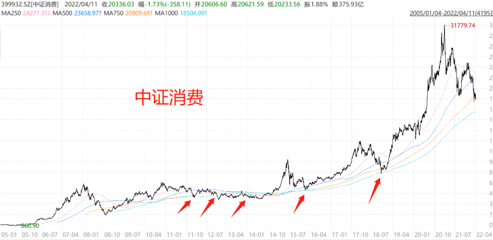

今天又是一场大跌，美债继续飙升，盘中十年美债利率一度去到 2.76%，而国债利率只有 2.75%，是近十二年来首次出现中美利率倒挂的情况。

大家可以试想下，老外把钱投在咱国内就是图点利差，结果自家无风险收益还超过了你这里，那不得把搬资金搬家回去了

于是今天继续大幅度的从 A 股流出，净卖出 57 亿，成长股直接尿崩。

美债持续加息，美股今年是稍有回调的，不过如果比烂的话，美股相比 A 股还是差点。

参考标普 500 和沪深 300，两指数最近一年多已经跑出接近 40 个点的差距了，大 A 不争气啊~

美股之所以比 A 股走势好，除了经济复苏加息推进美元回流之外，我觉得还有美国在对待疫情的态度方面已经躺平的缘故。

毕竟米国采取集体免疫之后吧，短期经济恢复正常运转是肯定的，长期潜在隐患资本市场暂时它没看到，也不会考虑。

而我们疫情爆发后，采取全面封锁，可以说接下来疫情受损企业的财报，注定不会太好看。

再加上美联储加息后两边利差缩窄，导致外资撤离，就出现了这么个拉跨的股市。

此外还有一个现象，就是 10 年期美债飙升，但同时 2 年期美债却升的更快，甚至超过 10 年期国债，出现了罕见的短债和长债利率倒挂。

之前 08 年次贷危机和 00 年互联网泡沫也有过长短债利率倒挂的现象，所以大家都很担心这次会不会是金融危机的前兆。

解释下为什么利率倒挂会出现这种情况~

首先短期国债走高，说明很多人急着抛售短期国债，表明市场很缺钱，可能引发资金链断裂的系统性风险。

不过利率倒挂只是金融危机的必要非充分条件，并不是每次倒挂都出现了金融危机，所以咱也不用过度恐慌。

危机是没法去预测的，如果能精准预判危机，那么人人的财富都早就超过巴菲特了，老巴也说我们无法预判危机。

所以与其杞人忧天，不如去看看目前哪些资产足够便宜，可以抵御风险。

..........

那当前的位置到底如何，是不是便宜了。

除了看指数估值，今天思哲分享一个我之前在星球聊过的干货，一个均线指标的投资参考方法，我称之为四线买入法则。

主要运用的就是最为常见的四条均线指标 - 移动平均线。

结合估值一起使用，可以极大提升我们中长线投资的胜率。

好，接下来就给大家分享一下。

## 移动平均线

首先移动平均线是什么，简单说就是把过去的一段区间的平均点位连成线，比如年线，因为一年交易日是 250 天左右，就是按照当时时点前推 250 天平均价格连成的 K 线。

以 2 年均线为例，计算“收盘价 - 500 日平均价”，如果指标小于 0，说明目前跌破了 500 日均线，已经回调到均值以下了。

我们将把估值底 + 均线底结合起来去判断，可以更好的去识别一些投资的安全边际。

这里要聊的均线指标，主要将包含 1 年均线， 2 年均线，3 年均线，4 年均线。

## 那为什么这个策略会有用？

对于 A 股而言，因为受政策影响波动较大，经常会杀出各种极限底，但大多刚需行业总体都是螺旋向上的，所以对于大部分行业而言，如果跌到一定程度，会出现一个均值回归的现象，给我们一个抄底的机会。

一般情况下，我自己的观察是，如果某个品种同时跌破了 1、2、3、4 年四条均线，那我们可以开始重点关注一下，这个行业是不是已经到达政策底 + 估值底 + 情绪底了。

如果这三底同时齐备，那么三菜一汤都备好了，还要什么自行车呢，干就完事了。

## 咱们来分析几个指数图形。

以下四个线，粉色为 1 年均线，蓝色为 2 年均线，橙色为 3 年均线，带点的天蓝线为 4 年均线。

### 首先说中证医疗：

如上图，中证医疗长期走势就类似于一个正弦钟摆曲线，高低起伏，但整体向上。

中证医疗破四线主要有 4 个红色箭头标注的位置，历史来看，破四线都是比较好的买点，而最近医疗也刚刚进入了“破 4 状态”。

上一波破 4 还得追溯到三年前的 19 年 6 月...

### 我们再来看中证消费：

中证消费可以说要破 4 的难度还是非常大的。

因为每次跌破之后没多久很快就 V 回来了，过去十五年来，11 年期间跌破之后就进入了消费熊市，需要忍耐几年后起飞。

15 年股灾时有一次，还有一次在 18 年，但过去每一次破四线买入，都可以买在一个相对比较底部的位置。

目前消费只是跌破三年线，尚未跌破四年线，距离四年线还有 10% 左右的下跌空间。

距离也不远了。

### 接着我们看波动相对较大的中证电子：

中证电子也是 08 年，11 年，17 年和 19 年有四次机会，信号不说非常精准，甚至出现过几次跌过头的现象，但长期看也足够用。

但四线一起破的机会确实不多，11 年和 17 年中间相隔了足足有 6 年时间，期间也需要非常耐心的等待。

目前中证电子也已经破 4 线，上一波破 4 要追溯到三年前的 19 年 2 月。

所以科技基金近期我也开始买了。

可能大家要质疑了，刚你举例的都是长牛指数，有没有业绩比较差一点的指数。

### 再来说表现很烂的中证传媒：

如图，中证传媒算是这几年表现最烂的指数了，运用四线法则，会抄到一个无底洞。

因为行业整体的基本面，就是在不断下行的，越跌反而估值更高，指数也是深不见底。

所以四均线法则很显然不是万能，它也不能保证我们绝对盈利，只能减少我们的风险，而最终盈利还得取决于指数长期的利润表现。

因此四线法则的前提是筛选一个长期向好的行业，如果看不清行业发展，那么选宽基指数会更好。

### 以中证 500 为例：

中证 500 的几个破四线点如上，整体看来，除了在 15 年股灾暴跌之后买入风险较大之外，其他的买点都很不错，一年以上亏损概率极小。

目前中证 500 也跌破了三线，距离最后四年线只差 3%，非常逼近了。

### 再说沪深 300：

历史上几次沪深 300 破 4 线的位置，如上图，包括 08 年暴跌，之后很快迎来一波反弹，14 年的历史大底等等，整体看位置都还行。

目前沪深 300 只有 4100 点，也已跌破 4 线以下，进入便宜位置。

那问题来了，刚刚我说的是国内的指数，那么对于境外的市场，纳斯达克 100 这类指数，是否又适合？

### 来看纳斯达克 100 指数：

对于纳斯达克 100 指数而言，因为本身由机构定价，而且美股长牛，波动较小，可以说跌破四线是极其困难的，真发生了，必定是大型的金融危机。

所以我们看到近十五年纳指唯一一次破四线线是次贷危机阶段，再往上就要追溯到 00 年的互联网泡沫了。

要知道即便去年是疫情阶段，纳指也只是跌破了一年线和两年线而已。

所以对纳指的要求，我建议可以放宽到 2 年线，这样买入的机会相对会更多一些。

我们将对应均线修改成 1 年线和 2 年线之后，纳指的买点数据如下：

显然修改成跌破 2 年线，这种情况下我们的买点会更多，比如纳指上个月就一度跌破过两年线，但持续时间很短很短，机会转瞬即逝，现在已经反弹上去了。

总的来说，如果大家需要参考设置移动平均线，可以使用证券的电脑端交易软件自行去研究一下如何设置~

像同花顺、通达顺，东财、电脑版 WIND 都应该是可以实现的。

不过我再强调一下哈，四线买入只是一个长线价值投资的参考策略，咱们一定要结合指数的实际估值和估值百分位以及行业现状再一起进行分析买点。

其实你们仔细看，四线买入的机会真不多，几年才有一回。

我列的数据很多破了四线的，上一次还得追溯到 18 年、19 年了，中间等这种机会至少要 3~4 年，需要多有忍耐力的人才能憋得住

所以，现在不少品种又跌破四线了，加上当下宽基估值也进入底部，你们反倒还要割肉了？

唉，今天的内容与其是干货，不如说是鸡汤，给你们一个坚挺的数据支撑。

人们往往在大涨后去寻找市场还会涨的理由，而在大跌后却开始关注市场下跌的风险。

其实这些虚的东西，你真看不了那么准，数据反而不会骗人。

## 原文

- [三年坑，来了！](https://mp.weixin.qq.com/s/rHZ_aBjwSVK2zQkal8Y4Hw)
