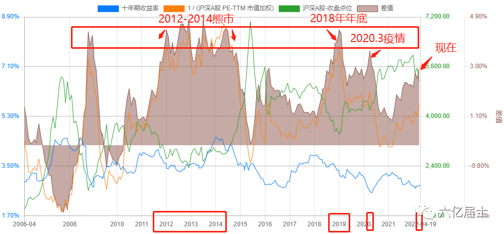
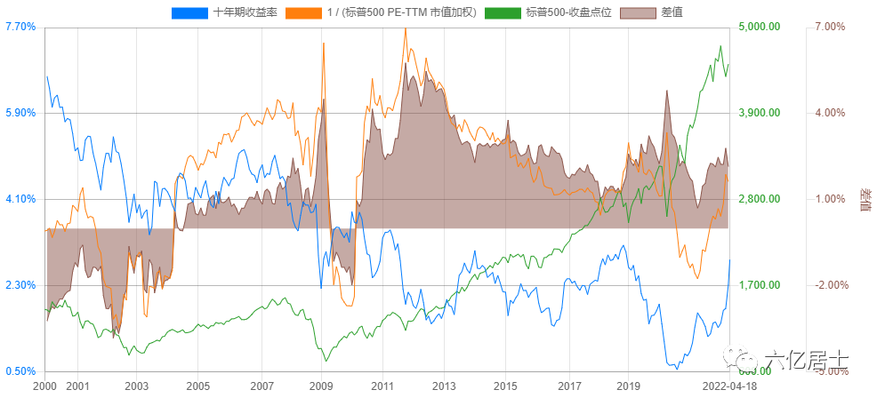

随着市场不断震荡下跌，很多新朋友可能会产生迷茫，对市场处于的位置也没有相对清晰的认知。因此，今天开文，我们先来看两张图：

1、沪深 A 股对比 10 年国债收益率差值图：

这图有三个关键指标：

1）下方蓝线为“十年期国债收益率”，也就是我们常说的“无风险利率”；

2）上方波动较大的橙线为“1/（沪深 A 股市盈率）”，即“A 股市盈率倒数”=A 股收益率；

3）褐色的差额曲线块图：即“橙线 - 蓝线”=“股市收益率 - 无风险收益率”；

褐色的高低，用大白话讲就是：我们冒风险买股票的性价比，褐色越高，则性价比越高。这个也是格雷厄姆指数的根基算法，我们参与股权投资， 所能获得的股市收益率高于无风险收益率的差额。

从图中可以看出，图片最左边是 2007 年牛市时，褐色处于负值，股市市盈率高企，导致股市收益率居然低于无风险收益率，说明当时的疯狂。2015 年夏天，股市收益率基本等于 10 年期国债收益率，也到达了阶段高点。即便 2021 年 3 月，差额好歹还有 1% 左右。

目前，A 股处于较便宜阶段：A 股市盈率倒数 = 5.72%，十年期国债利率 = 2.79%，差额 = 2.93%，股市收益率大于国债收益率的两倍，是良好的布局阶段。

自 06 年至今，历史上最大差额大概在 4.8% 左右，2018 年年底的最大差额在 4.41% 左右。由图可见，目前距离最低，还有一段距离，但我们不要猜底，稳定定投没问题。

2、美股情况

我们顺便看一眼美股的情况，整体上来说，美股的估值波动较低，尤其是 2010 年之后的近 10 年，虽然标普 500 的点位快速上升（绿线），但两种资产之间的收益率差额相对稳定。近 10 年，2020 年 3 月疫情差额是一个高点（因为大幅降息，凸显了股市价值），在 2021 年 3 月差额降至近年低点，说明潜在收益率降低。

从数据看，目前美股处于中等水平，不贵也不便宜。

## 原文

- [“61”指数基金估值表 (2022.4.21 期)，目前市场处于什么位置？](https://mp.weixin.qq.com/s/xYf7WtOCPAmzbdpUtRHmLg)
