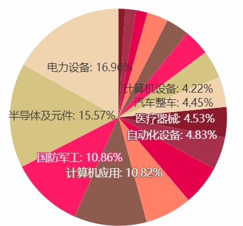

【 固收 + 是最近两年兴起的投资理念，通过重仓位投资债券，叠加打新、可转债、股票等增强收益，其核心要义是比纯债更赚、比股票更稳。但是固收 + 不代表固定收益，+ 既有可能增收益也有可能扩风险，其对基金经理宏观环境分析、资产判断及配置等有很强的依赖。】

步入 2022 年，国内经济承压、疫情蔓延，以及海外的俄乌冲突、美元加息，各类资产波动起伏，尤其是固收 + 中的增强利器股票资产下跌严重。时至 4 月，我们有必要回顾下固收 + 产品的一季度市场表现市，拨云见日，为我们日后选择指点迷津。

备注：偏债混合型基金是固收 + 的典型代表，本文所有数据和观点以此为基础。

偏债混合型基金包含偏债混合一级基金、二级基金，其区别就在于 + 的资产类别的参与方式，是一级参与（即打新）还是二级参与（二级市场直接买入），本文将其均归为固收 + 产品。接下来，本文将从固收 + 相关资产的一季度市场表现、偏债混合一级基金业绩情况、偏债混合二级基金业绩情况三部分进行分析，尝试为大家揭开偏债混合基金一季度业绩全貌。

## 01 各类资产一季度表现回顾

### 1. 主资产之债券：市场先涨后跌、基本面短期利好

2021 年底，国家提出稳增长基调，先后降准、降息，10 年期国债收益率下降，债市上涨。到了 2 月份，天量信贷，叠加房地产政策边际好转，市场有预期经济后续向好，3 月份，俄乌冲突、疫情全国蔓延等，国内稳增长的不确定性增加，不过美国加息、制约国内货币政策空间，债市调整。展望后市，因为诸多不确定性仍在，国内稳增长压力大、后续出台降准等政策概率大，因此债市还是有机会。

图表：2018 年以来国债收益率与中证全债指数

数据来源：wind，金斧子投研

### 2. 增强收益资产之股票：市场深度调整、低估值板块相对较好

2022 年一季度在国内经济承压、美国加息预期等背景下，股市难有表现，尤其是 2021 年涨幅过大的成长股跌幅明显。1-2 月经济数据相对良好，步入 3 月海外俄乌冲突增加不确定性和全球通胀压力、国内疫情蔓延加大稳增长压力，各方对国内经济和市场的信心不断被消磨，市场或仍需一段时间培育信心。

观察申万一级 31 个行业一季度表现，仅有煤炭、房地产、综合、银行 4 个行业实现正收益，其他如电子、国防军工、汽车、家用电器等 10 个行业跌超 15% 以上，12 个行业跌超 10% 以上，合计占比超 7 成。

图表：2022 年一季度申万一级行业涨跌幅及动态市盈率（至 2022/3/31）

数据来源：wind，金斧子投研

### 3. 增强收益资产之可转债：大年之后遭受估值压力

2021 年中证转债指数涨幅为 18.48%，成交金额为 15.62%，可谓是转债大年。短期上涨之后面临估值压力，叠加 2022 年股市下跌，可转债调整较多。目前可转债已有大幅调整，尤其是高价转债估值压缩，配置性价比提升，可以关注。

图表：近五年可转债指数估值水平（至 2022/4/21）

数据来源：wind，金斧子投研

### 4. 增强收益资产之打新：打新收益日渐萎缩

2020 年之前，中新股几乎是稳赚不赔的生意，一签动辄几万，让投资者趋之若鹜，但是 2021 年屡有新股破发，2022 年叠加股市下跌，单季度破发数量超去年全年。根据华安证券数据，自 2022 年起截止 4 月 1 日，假设询价新股全部入围情况下，A 类 2 亿规模账户、C 类 2 亿规模账户打新收益分别是 0.8%、0.32%；随着收益率不及预期，部分固收 + 基金已经率先退出打新。

图表：2018 年到 2022 年 Q1 新股上市数量及破发比例

备注：新股破发是指当日涨幅为负

数据来源：wind，金斧子投研

## 02 偏债混合一级基金一季度表现：正收益占比近 3 成

首先，我们就本文的样本数据进行说明：

1. 去重优化，根据 wind 数据，偏债混合一级基金共 161 只基金，考虑到同一基金的份额不同如 AC，但投资策略及业绩表现一致，因此进行了数据剔除优化，即单一基金虽有不同份额但仅保留 A 份额作为统计；
2. 成立时间，剔除 2022 年之后成立的基金；
3. 暂未考虑申购赎回因素。

基于以上处理，偏债混合一级基金最后分析样本为 88 只产品。数据显示，88 只产品 2022 年一季度平均收益为-1.63%，中位数为-0.88%。从结构上看，共 26 只产品非负收益，占基金比例的 29.55%。

整体来看，偏债混合一级基金因为没有股票的持仓，规避了股票市场下跌的风险。88 只产品中，仅 27 只产品有股票仓位（3 成），其中 12 只是 3% 以上，15 只均在 2% 以内。

图表：2022 年一季度偏债混合一级基金收益区间分布

备注：“ [ ”表示大于等于，“ ）”表示小于

数据来源：wind，金斧子投研

观察一季度收益排名的前 10 名基金，均无股票仓位。我们以排名第 4 的泰信 XXXX 为例来观察其如何在 2021 年 10% 以上增长，而后在今年还能表现居于前列。整体在于市场判断、把握阶段性机会，2021 年上半年看好权益的相对表现、积极配置可转债；下半年加强回撤控制，一方面把握利率债的波动交易机会，同时配置优选信用债；步入 2022 年基金继续把握利率债的波段机会，降低组合久期、提升信用债的配置。

图表：2022 年一季度偏债混合一级基金收益前 10 名

数据来源：wind，金斧子投研

## 03 偏债混合二级基金一季度表现：不容乐观

数据处理方式同偏债混合一级基金，最后分析的数据样本为 426 只产品（全部数量为 829 只）。数据显示，426 只产品 2022 年一季度平均收益为-4.65%，中位数为-3.47%，从收益区间来看，多数都分布在 0% 与-5% 的收益区间内，合计占比 63.85%，整体收益不容乐观。

图表：2022 年一季度偏债混合二级基金收益区间分布

备注：“ [ ”表示大于等于，“ ）”表示小于

数据来源：wind，金斧子投研

从结构上来看，呈现以下 2 个特点：

### 1. 正收益占比仅一成左右

至 2022/3/31，41 只产品非负收益，占比 9.62%，若剔除 0 收益的 2 只产品，那么正收益的基金占比仅为 9.15%。也就是说 400 多只的偏债混合二级基金中，每 10 只不到 1 只在一季度实现正收益。

看了正收益产品的具体信息，方能明白固收 + 今年的格外不容易。一季度正收益的前 10 名基金中，5 只是 2021 年 5 月之后成立的产品，一般而言成立不久的基金相对谨慎，目前股票仓位基本为 0；另外 5 只表现不错的老产品中，东兴某基金、华夏某基金分别自 2018Q2、2019Q1 一直没有股票仓位，基金经理也是频繁更换，目前在任基金经理分别是 2021 年 4 月、10 月上任。

图表：2022 年一季度偏债混合二级基金收益前 10 名

数据来源：wind，金斧子投研

今年以来股票资产的大幅调整是固收 + 表现不佳的重要原因，我们尝试从股票占比最高、收益排名第五的基金招商某基金入手，看下其具有哪种特点：

1）基金经理有一定管理经验，基金经理自 2019 年 1 月入职，从三季度开始逐渐加股票仓位，2020 年以来股票仓位中枢在 18% 左右；

2）分散并且是超级分散，基本上全行业覆盖，前五大行业占股票仓位的 47% 左右，前 10 大个股的持仓集中度在 8.6% 左右；

3）2021 年末布局行业属于低估值、稳增长板块，风格上主要以大盘为主合计占比 52%，价值型合计占 51%；回顾前文的不同行业 Q1 涨幅，上涨 22% 的煤炭正是其第一重仓行业，或是表现不错的重要原因。

图：招商某基金 2021Q4 行业分布

数据来源：乌龟量化，金斧子投研

那是否我们就可以直接冲入这一只产品了？当然不。1 个季度的表现不足以证明其是好基，我们还需要去观察过往多季度的调仓情况，看其市场判断、行业配置是否具有前瞻性。另外作为其配置的基本盘债券资产，我们也需要去看基金经理的投资风格、市场判断及落地到持仓中的杠杆、久期、信用等变化情况，由此才能最终决定其是否符合可以作为我们的配置之一。

### 2. 可转债基金跌幅居前

将季度收益升序排列后，排名靠前（即跌幅最高）的一水儿是可转债基金，其中跌幅最大的基金收益是-23.68%，远超同期沪深 300、中证 500 的跌幅 14.53%、14.06%，这是大多数投资者始料不及的。

要知道，可转债本质是上市公司发行的债券，不仅可以类似普通的企业债还本付息，还可按照转股价格将债券转换成股票，若当前股价高于转股价格，投资者即可转股，否则则继续持有债券，因此被认为是“进可攻、退可守”的资产。去年在可转债大行情下，相关基金收益可观，甚至超过不少普通股票型基金，引得诸多投资者买入。如果投资者根据 2021 年可转债基金收益排行榜来买，大概率今年跌幅近 20 个点。

图表：2022 年一季度偏债混合二级基金收益后 10 名

数据来源：wind，金斧子投研

需要关注的是不同基金经理的策略对基金收益影响较大，今年行情下，虽然同为可转债基金，但不同产品表现也大有差异。

举例而言，南 X 可转债、华 X 可转债一季度收益分别是-23.68%、-5.84%，仔细研究，或有几个因素影响业绩（数据均截至 21 年 Q4）：

图表：2022 年一季度部分基金表现差异

数据来源：wind，金斧子投研

1）债券持仓，南 X 可转债相对激进，债券占基金净值比例 107.84%，其中 102% 是可转债、其余为国家债券；对比之下，华 X 可转债相对稳健，债券比例 85.40%，其中 79.9% 为可转债，其余为国债；

2）股票持仓比例及风格，南 X 可转债股票占基金净值比例为 8.91%，相对较低，但持股风格以大盘成长型为主，占比 75%，对应到估值方面，基金整体股票 PE 高于 A 股全市场（62.24 倍 VS 16.02 倍）；反观华 X 可转债，股票比例接近 20%，但是以大盘价值型为主，占比 52%，对应到估值方面，基金整体股票 PE 低于 A 股全市场（12.14 倍 VS 16.02 倍）；

3）持仓分散度，两只基金在债券方面相差不多，南 X、华 X 前十大债券占比分别是 52%、42%；在股票方面，南 X、华 X 前十大持仓占比分别是 8.9%、18.79%。结合两只基金的行业分布，可以看出分散一定能控制回撤吗？NO，选对赛道比分散更重要。

图：南 X 可转债行业分布（至 21 年 Q4）

图：华 X 可转债行业分布（至 21 年 Q4）

另外，值得提醒投资者的是，部分基金即便名称不是可转债，但穿透底层依然是可转债。举例如金 X 元 X 债券 A，看其名字很容易将其理解为普通的债券基金，但实则不然，观察 21 年四季度持仓情况，94% 的债券持仓其中国债为 30.4%、可转债为 62.54%，叠加其 19%+ 的成长类股票，今年的市场行情下大幅调整是难以避免的了。

## 04 写在最后

投资者购买固收 + 追求的就是背后的安全性，若普涨行情当然无碍，但是当下跌宕起伏，好的固收 + 才能更显本色。通过对偏债混合一、二级基金的季度业绩回顾，基金的研究和选择“水还是比较深的”，我们总结以下 3 点，帮你避坑、更好配置：

► 不能根据某一时间段的业绩盲目跟进，需要长期动态跟踪，验证基金经理的投资能力是关键。因为固收 + 涉及多个债券、股票、可转债等多个资产类别，对基金经理及研究团队的宏观分析、市场判断、行业配置、个股选择等要求高，资产方向选择正确才是最重要的。

► 不能根据产品名称想当然买入，因为你买到的不一定是想买的。部分基金虽然名为债券基金，但投资的是与股票相关性很高的可转债，如此也将导致收益和回撤不如预期。

► 多看少动，如果为投资可投入的时间有限，建议专业的事交给专业的人，可选择优秀投顾给予指导或者通过优秀管理的 FOF 产品，达到优选产品、分散配置、安心稳健。

最后的最后，投资者可千万别对固收 + 失望，虽然偏债混合整体表现不佳，但仍有优秀的产品存在，何况本文仅分析了固收 + 在公募产品中的 1 个策略类别——偏债混合，后续我们会继续分析另外 1 个潜藏固收 + 优秀产品的策略——灵活配置，希望能持续对投资者解疑答惑。

## 原文

- [水星 FOF 之公募掘金 vol.2 | 一季度正收益仅占一成，我们还能相信固收 + 吗？](https://mp.weixin.qq.com/s/fsa6XUnDy3SPJmfZ9X-Yvg)
