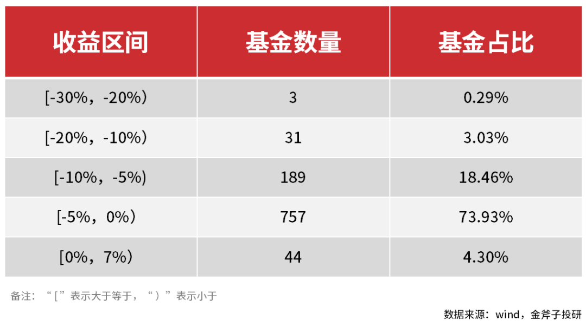
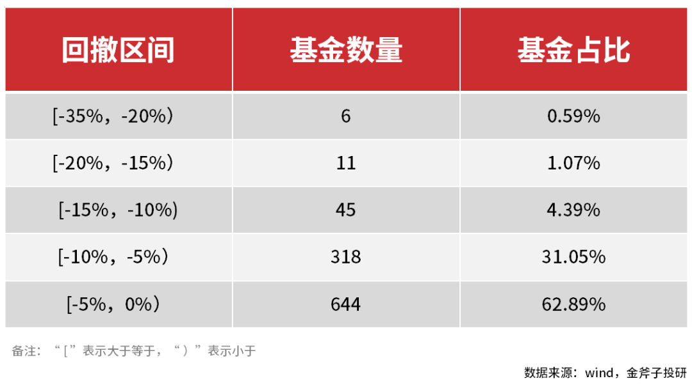
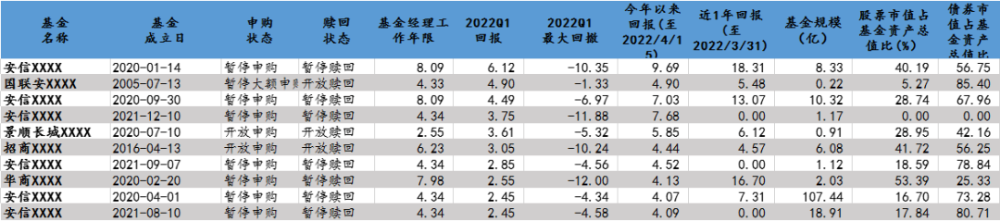
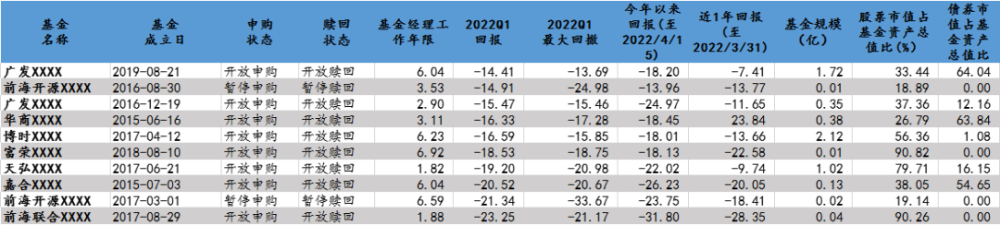
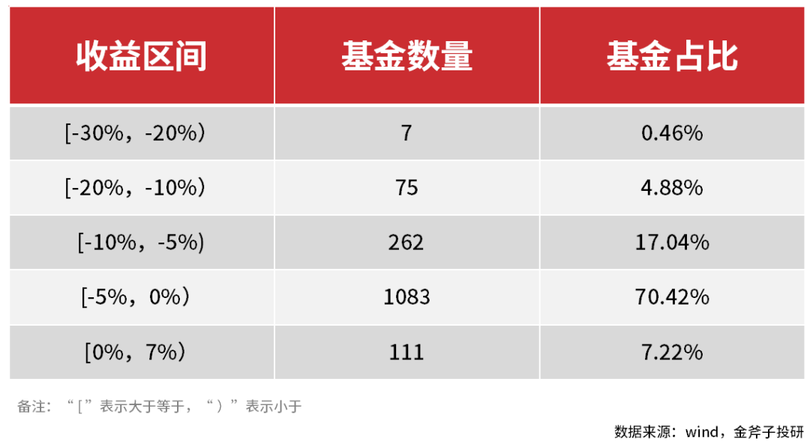
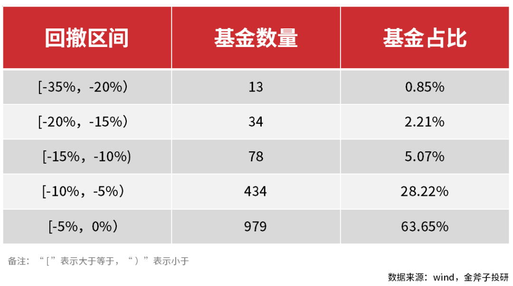

上篇文章中我们对固收 + 包含的一级债基与二级债基进行了本年第一季度业绩分析，其整体表现不佳，正收益占比仅 1 成，好产品需要仔细淘。接下来，我们将延续上周话题，继续对固收 + 中偏债混合型策略、灵活配置类策略基金（偏债）一季度业绩进行回顾分析。

回顾上文[《一季度正收益仅占一成，我们还能相信固收 + 吗？（上）》](/pages/597281/)

## 01 偏债混合与灵活配置基金一季度表现：正收益占比 4.3%

首先，我们还是就本文的样本数据进行说明：

1. 本文调取 wind 数据库中开放式混合型基金中“偏债混合型”与“灵活配置型”基金共 2421 只，剔除同一基金不同份额如 A 与 C，即单一基金虽有不同份额但仅保留 A 份额作为统计；
2. 剔除 2022 年之后成立的基金；
3. 由于灵活配置型基金对股债的比例配置有所不同，根据固收 + 相对稳健的特点，剔除 2021 年股票占基金总市值比例均值超过 40% 的灵活配置型基金；
4. 暂未考虑申购赎回、规模因素。

基于以上处理，两类基金最后分析样本为 1024 只产品。数据显示，业绩回报上 1024 只产品 2022 年一季度平均收益为-3.65%，中位数为-3.10%。从结构上看，共 44 只产品非负收益，占基金比例的 4.30%，收益占比最大的区间在-5%~0% 之间，占比 73.93%。

图表：2022 年一季度偏债混合与灵活配置基金收益区间分布

最大回撤上，1024 只产品 2022 年一季度平均最大回撤为-4.98%，中位数为-4.22%。从结构上看，最大回撤占比最大的区间在 0%~-5% 之间，占比 62.89%。这里需要关注的是虽然中位水平在-5% 以内，但是仍有 6 只产品一季度最大回撤超 20%，回撤堪比普通股票型基金，并未体现出固收 + 本应稳健的显著特点。

图表：2022 年一季度偏债混合与灵活配置基金最大回撤区间分布

## 02 收益前十基金解读

图表：2022 年一季度偏债混合与灵活配置基金收益前 10 名

数据来源：wind，金斧子投研

► 成立时间角度，业绩前十名中有七只基金是已经成立一年以上的，相对来说操作和管理都已经进入到比较成熟的阶段；

► 基金规模角度，十只基金除了第九只外，规模均未超 20 亿，体量适中也对市场震荡来临时的迅速调整有一定助益；

► 基金经理角度，十只基金的基金经理除了景顺长城外都有 4 年以上的工作年限，职业经验相对丰富。此外，前十名中安信基金上榜六只，表现相当亮眼。探究其原因，我们发现这六只基金背后都站着同一个基金经理——张翼飞（部分产品是双基金经理）。张翼飞有丰富财务管理经验，对宏观流动与债市有深刻研究，风格偏稳健，能在避险同时赢得收益，也能在行情动荡前提下通过择股获得超额收益。

以本次拔得头筹的第一只基金为例，可以看到 6 个点的回报与二三名还是拉开了一点差距，但是相对它的回撤也就更大。那我们来看下背后的原因：

1）债券持仓中可转债基本占到一半，前文我们也提及可转债市场一季度有大幅调整[《一季度正收益仅占一成，我们还能相信固收 + 吗？（上）》](/pages/597281/)；

2）21 年四季度股票的持仓达到了四成出头，股票市场一季度也是动荡不已。不过值得关注的是其股票持仓对地产、大宗等板块进行布局，也使基金在俄乌冲突大宗价涨、经济承压稳增长的宏观背景下有所获利，体现了张翼飞把握宏观动态的实力。

再来看看排名第二的国联安基金，收益将近 5 个点，而回撤相比第一名控制得更好，是前十名中回撤最小的。仓位分布上看，股票占比不超一成，基本布局于银行等低估值行业，债券持仓上去年基本没有持有可转债。可见，本只基金一季度的特点是稳中求胜，对于纯债的大额持仓在股市颠簸时更显优势。

然而，对于该只基金也有三个关注点：

1）这只基金成立时间长，规模很小，基金经理更换变动比较频繁，投资风格也就不好一概而论；

2）目前该基金是双基金经理，一位是 2017 年 12 月上任，任职以来该基金年化收益 4.93%、最大回撤-19.69%，另一位 2020 年 5 月上任，过往背景是与债券相关，任职以来该基金年化收益 10.85%、最大回撤-4.57%。若回顾结构性行情的 2021 年，基金收益 0.92%、最大回撤-4.57%；

3）自去年三季度以来，该基金大改以往持股行业分散的风格，对银行业重仓，而后续是否能延续这种投资风格并获得红利也是无法确定的。

## 03 收益后十基金解读

► 成立时间上看，倒数十名的基金成立时间不一；

► 规模上看，大部分倒数的基金规模都偏小，因此若持仓时个别高权重的股出现明显下跌，会对基金业绩有明显的下拉；而规模较大的基金相对来说受个别股拉动的情况较少。

► 持仓比例上，可以明显的看出，十只中有四只基金在去年第四季度时对股票的持仓都在五成以上，有的甚至超过九成。这也使股市大跌时，基金跟随跌的惨烈。

图表：2022 年一季度偏债混合与灵活配置基金收益后 10 名

数据来源：wind，金斧子投研

## 04 四类基金总述

最后，我们将第一篇文章中统计的一级债基、二级债基与本文所统计的偏债混合与灵活配置综合进行分析，以便对一季度固收 + 市场作整体业绩了解。

通过处理，四类基金最后分析样本为 1538 只产品。数据显示，2022 年第一季度 1538 只产品平均收益为-3.73%，中位数为-3.07%。从结构上看，共 111 只产品做到非负收益，占基金比例的 7.22%。其中收益占比最大的区间在 0%~-5% 之间，占比 70.42%。

图表：2022 年一季度四类基金收益区间分布

最大回撤上，1538 只产品 2022 年一季度平均最大回撤为-5.03%，中位数为-4.16%。从结构上看，最大回撤占比最大的区间在 0%~-5% 之间，占比 63.65%。

图表：2022 年一季度偏债混合与灵活配置基金最大回撤区间分布

总的来说，一季度固收 + 的表现并不亮眼，可能还会让投资者们感觉到一些失望，很多投资者会想，买固收 + 就是为了在动荡的行情中获得稳健的回报，然而它们的表现却不及预期。不过我们也看到一些正收益的产品，背后与基金经理对全球宏观研判、资产的投资配置能力相关。

长期来看，宏观经济复苏的步调依旧不明朗，因此布局稳中求胜的固收 + 产品在长期价值投资角度上依旧是可取的。当然，产品不能盲目选择，要结合多方因素分析，这里详细可以看上篇我们为大家阐述的几个要点，我们还是相信优秀固收 + 产品的回报能力的。

最后，一季度的固收 + 业绩分析就到这里结束啦~

## 原文

- [水星 FOF 之公募掘金 Vol.5 |  一季度正收益仅占一成，我们还能相信固收 + 吗？（下）](https://mp.weixin.qq.com/s/pmGP2UuZ_MFUVZ58GeNDEQ)
