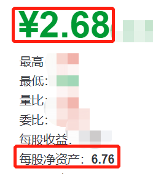

虽然总说，股市无法预测。

但历史上已经出现过很多次熊市了。

以史为鉴，可以知兴替。

自 2000 年以来，A 股出现了 4 次熊市底部。

分别是 2005、2008、2013 和 2019 年。

在这几次熊市里，可以找到一些共同的特征。

## 第一个特征：股市吸引力指数较高。

之前讲过，这里简单说下。

点这里复习：[惊喜！股市捡钱的机会来了！](/pages/811ecf/)

先来看一张图，是股市吸引力指数和中证 800 的走势图。

从图中可以发现，

每当熊市底部时，股市吸引力指数都较高。

反之，亦然。

目前股市吸引力指数为：2.86。

## 第二个特征：估值中位数处于底部。

我们都知道，股票是有内在价值的。

股票的价格，始终围绕在其内在价值上下波动。

这就像是遛狗。

虽然小狗（股价）一会跑主人（公司价值）前面，一会儿跑在后面。

但最终，总会和主人一起回到家。

一般用市盈率 PE 来判断股票到底够不够便宜。

PE 越低，代表公司越便宜。（但不能是负数）

来看下图。

从过去的 4 次熊市来看，全 A 股 PE 中位数都位于历史的较低区域。

（四条竖红线位置）

而当前 A 股 PE 中位数为 28.3，快赶上前几次熊市底部了。

（截止到上周五）

## 第三个特征：成交额和 7 日换手率低迷。

这个很好理解，也是我一直爱用的一个指标。

（因为观测起来非常简单）

如果把股市看成是菜市场。

来买菜的人越多，那市场的交易额就会越多。

在股市里，我们也可以通过成交额来看市场情况。

成交额高，说明市场活跃，买卖的人多。

成交额低，说明市场低迷，买卖的人少。

如果成交额长期保持低迷，并持续一段时间。

很有可能机会要来了。

有一个指标——中证全指。

查看它的成交额，能大致判断股市整体的情况。

好消息是，最近一个交易日（上周五），中证全指的成交额只有不到 7000 亿。

相比之前动不动 1 万亿，这个幅度开始有点“冷淡”的意思。

我个人是很期待，看到它降下去，甚至低于 6000 亿的。

再来看下 7 日换手率。

换手率高（＞ 10%），代表大家交易热情高。

换手率低（＜ 6%），代表交易热情低。

看下图，是 4 次熊市底部与 7 日换手率情况。

从 7 日换手率来看，几次大跌的换手率都不到 3%。

至少是低于 5%。

这一次，虽然估值下降不少。

但是 7 日换手率还有 6.8%，不算低。

（数据截止上周五）

## 第四个特征：新基金发行被嫌弃。

先来看张图。

从 08 年至今，上证指数和新基金发行量的对比。

（这里的新基金指股票和混合型基金，下同）

（黄线为新基金平均发行量）

可以发现：熊市底部时，新基金发行量也同样处于底部。

市场行情低迷，大家都不愿意入市。

自然，新基金就无人问津。

而市场火热、人声鼎沸时，生怕错过捡钱机会。

管他什么基金，先抢为敬。

这也是公募基金行业典型的规律：

好做不好发，好发不好做。

“好做”指的是业绩，好买股票，好构建组合，因为市场上机会很多。

“好发”指的是基金容易发行，卖得出去。

今年 2 月新发基金份额 17.3 亿，而 3 月发行份额仅 13.6 亿份。

十几亿份，看起来很多对不对。

大家知道牛市的 2021 年，发行数量是多少吗？

猜一下。

20 亿？

40 亿？

不……大家格局还是太小了，打开点。

答案是 320 亿！

相比之下，现在就是典型的“好做不好发”。

不好发的时候……其实是什么呢？

铁柱抢答道：师兄，这说明市场上出现机会了！

这么好的机会，必须加仓十万。

我：……你小子，这是啥情况？

这么多子弹。

可就算家里有矿也不是这么造的。

还有 2 个特征，看完再说。

## 第五个特征：新增投资者大幅度减少。

来看下图，新增投资者数量与上证指数走势图。

（橙色为新增投资者数量）

当市场处于底部时，新增投资者数量往往也在底部。

自 21 年 10 月以来，新增投资者数量同比（与去年同时期）均下降。

甚至今年 1 月时，同比下降了-36.7%，是近 5 年来新低。

目前看，新增投资者数量在降低，但要保持观察。

如果后续几个月，数量持续走低，或许就差不多。

铁柱：师兄，这还观察啥？

已经创新低了啊，再加十万吧。

我：不是吧，又加仓，快枪手啊你。

一阵子不见，这本金也增加得太快了吧。

不过，小心被埋啊，毕竟这 6 个特征最好结合看。

快来看最后一个。

## 第六个特征：破净股数量明显增多。

股票破净有点像新债破发。

新债破发是指，上市价格低于了发行价（100 元）。

而破净，是指股票价格低于了每股净资产。

比如上面这个公司，每股净资产是 6.76 元，而股价却才 2.68。

就是典型的“破净”。

从历史规律看，

熊市底部时，破净股数量会明显增多。

看下熊市底部时，破净公司占比情况。

（图表数据截止 2 月 16 日）

目前市场上破净股有 421 只，破净比例约 9%。

虽还未达到 05、08 年的占比，但已经超过 13、19 年。

至于破净股数量是否会继续增多，可以保持观察。

铁柱：

师兄，破净股比例这么高了？

绝好机会啊，此时不加更待何时，加仓十万。

师兄：……男人不能太快啊……

## 总结一下。

熊市底部会出现的 6 个特征：

1、股市吸引力指数处于高位；

2、估值中位数处于底部；

3、成交额和 7 日换手率较低；

4、新基金发行被嫌弃；

5、新增投资者大幅度减少；

6、破净股数量明显增多。

综上，现在是比较糟糕，估值比较低。

有些信号，也有逐渐出现的迹象，但整体还并没有到达最极端的情况，需要继续观察。

股市涨跌很复杂，很多因素都可以作为参考。

这里只是把一些看得见、摸得着的指标，和大家分享。

有能力的同学，可以深入了解其他指标。

需要提醒的是，

熊市底部并不是一个点，更像是一个区域。

没人能精准预测哪一刻是底部。

就像无法预测哪一刻是顶点一样。

每次下跌会有四个阶段：

1、侥幸：应该不会再跌了，要反弹了吧？

2、焦虑：行不行啊，到底要不要抄底，还是止损呢？

3、恐慌：卧槽，到底咋回事啊，是不是要没了？

4、绝望：累觉不爱，就这样吧，拒绝打开账户。

结合上面三个指标，你觉得目前在哪呢？

不少人认为到了恐慌，甚至绝望阶段。

我的理解是，市场下跌，可能还只是在“焦虑”和“恐慌”层面。

距离“绝望”还差一点意思。

## 原文

- [苦等 3 年多，熊市终于要见底了？](https://mp.weixin.qq.com/s/P8d71TfflcfvTSpJSZPjpQ)
- [苦等 3 年多，熊市终于要见底了？（下）](https://mp.weixin.qq.com/s/uga3CjHagphRJW4bBJUcZw)
