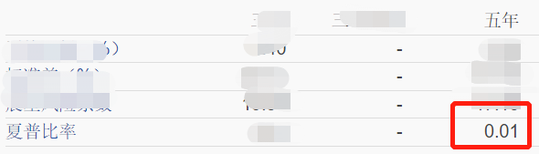

最近 2 个月行情有所回暖，沪深 300 从低点涨了 12%。

基金贴吧里，风向也变了。

不再是骂骂咧咧，而是：

“回本了”

“绿了那么久，终于翻红了”

“表现这么好”

……

定投基金的小伙伴，近期也回血不少。

甚至有同学已经回本了。

正当大家一片喜气洋洋时。

铁柱哭唧唧走来：

为什么我的基金不涨啊？

别说回本了，不继续跌就很开心了。

我：

不对啊，近期行情回暖怎么会继续跌？

你买了啥基金啊？

铁柱：

去年市场涨得好，朋友推荐了一只。

但一不小心买在了高点，现在还亏了近 20% 呢。

师兄，现在我该怎么办啊？

不少小伙伴也有同样的疑惑：

别人的基金都在涨，为啥我的基金却不涨？

难不成是只辣鸡基金？

可怎么知道手里的基金是不是辣鸡呢？

优秀基金有特征，辣鸡基金当然也有。

今天就分享三个小方法，

帮大家鉴别一只基金到底是优秀还是辣鸡吧。

## 第一个方法：看基金的【进攻力】—收益率。

大家觉得：

一只基金的收益率越高越好，还是越低越好呢？

相信大家都有答案。

肯定是越高越好。

来看下铁柱手里的基金，就叫它“铁柱基金”吧。

近 3 年，铁柱基金涨了约 21%。

不算好，远低于同类平均（73%）。

再看下近五年。

什么……

竟然是-8%！

5 年啊，别人拿基金赚的钱都结婚生子，

孩子都能打酱油了。

反观铁柱，别说赚钱了。

本金都像太阳下的冰块，逐渐缩水……

作为对比，我们再挑一只优秀基金，姑且叫它“靓仔基金”吧。

看看它的表现。

近 3 年，靓仔基金涨了约 73%。

近五年，靓仔基金涨了 123%。

做成表格对比一下。

（数据截止至 6 月 13 日）

可以看到，靓仔基金完全吊打铁柱基金。

那同为偏股型（股票型）基金，收益率多少才算高呢？

根据经验来看：

长期年化 10% 左右，是及格收益率。

低于 10%，就是不及格。

远高于 10%，就是优秀。

铁柱基金的年化收益率是-1.7%，确实挺……

## 第二个方法：看基金的【防御力】—风险系数。

该系数越高，说明基金的波动性强，出现下跌的概率越大。

所以，风险系数，越低越好。

先看铁柱基金。

近五年，风险系数高达 17。

靓仔基金，近五年风险系数为 12.6。

那这个风险系数多少算优秀，多少是辣鸡呢？

总结下，偏股型（股票型）基金，

长期风险系数控制在 12-15，是合格的。

高于 15，就是不及格。

低于 12，就是优秀。

这么看，铁柱基金远大于靓仔基金（17 ＞ 12.6）。

铁柱基金又是不及格！

靓仔基金是合格，却很接近优秀。

## 第三个方法：看基金的【性价比】—夏普比率。

夏普比率，是每单位收益跟风险之间的比率。

可以简单理解为性价比。

夏普比率越高，基金的性价比越高。

铁柱基金，近五年夏普比率竟然是……

0.01？！

真的是该高的时候不高，该低的时候不低啊……

靓仔基金，近五年夏普比率为 0.87。

对于偏股型（股票型）基金，

长期的夏普比率控制在 0.5 左右，是合格的。

远低于 0.5，就是不及格。

远高于 0.5，就是优秀。

0.01 ＜ 0.5 ＜ 0.87，一目了然。

铁柱基金又输了……

这 0.01，伤害性不大，侮辱性极强啊。

最后总结一下：

（建议大家保存图片）

铁柱基金和靓仔基金三项对比：

可以发现，铁柱基金没一个能打的。

而靓仔基金，除了风险系数是合格外，均是优秀。

（但风险系数也很接近优秀了）

同样是偏股型基金，差距却这么大。

所以，选对目标很重要。

定投一只辣鸡基金，损失的不止是钱和时间，

更是错过了一只优秀基金的涨幅。

好啦，这三个小技巧你学废了吗？

那今天就这样，大家晚安。

愿持有优秀基金的你，被世界温柔以待~

## 原文

- [基金回血了，朋友铁柱却哭了。](https://mp.weixin.qq.com/s/Og6OQ_qvvS59sZ29DtFKuQ)
