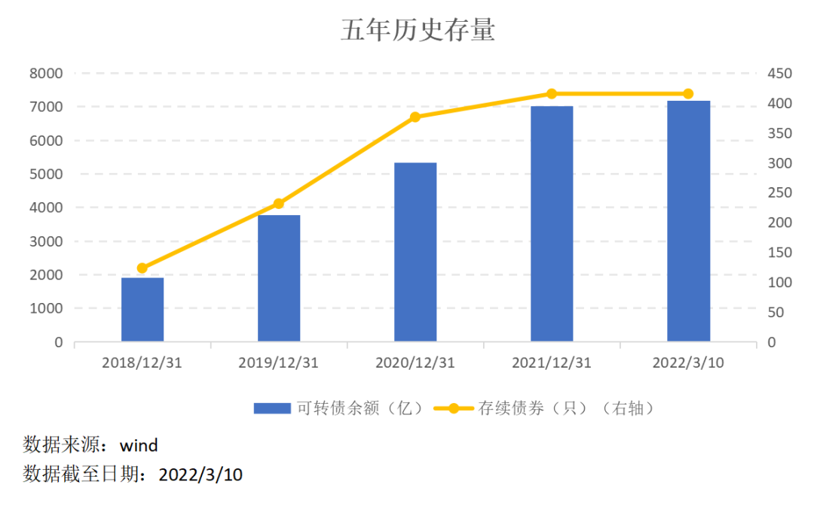
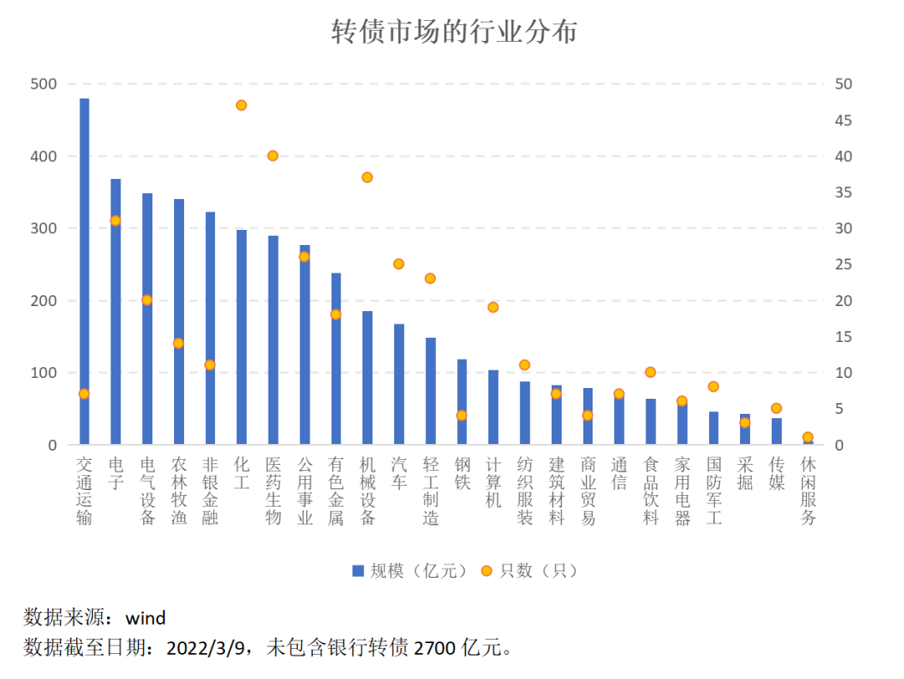
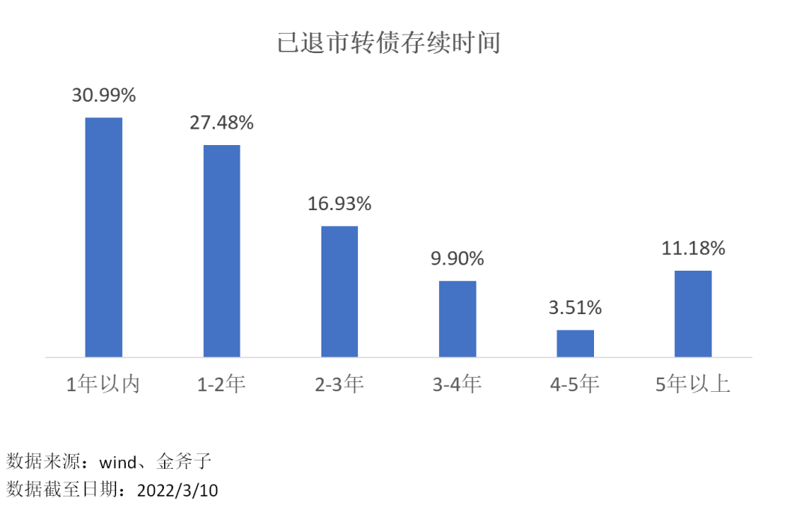
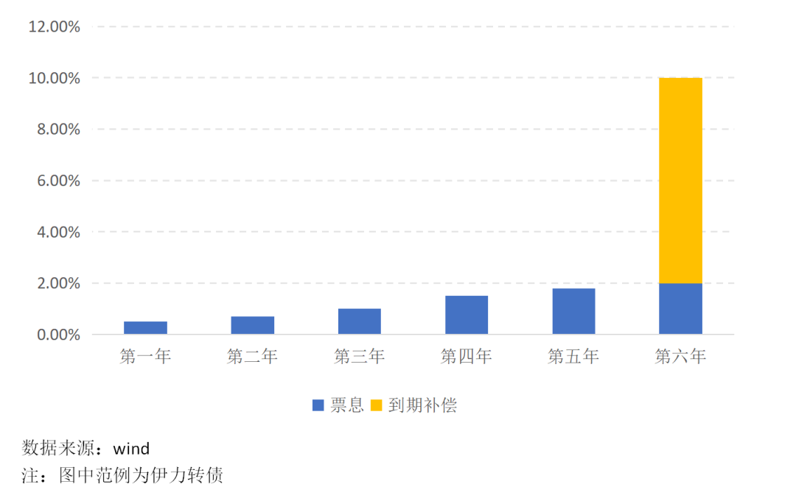
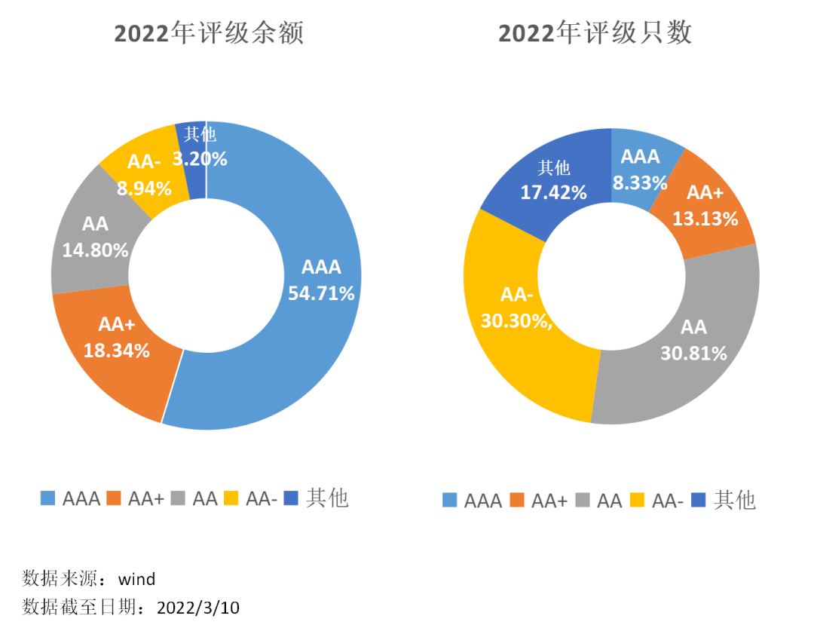
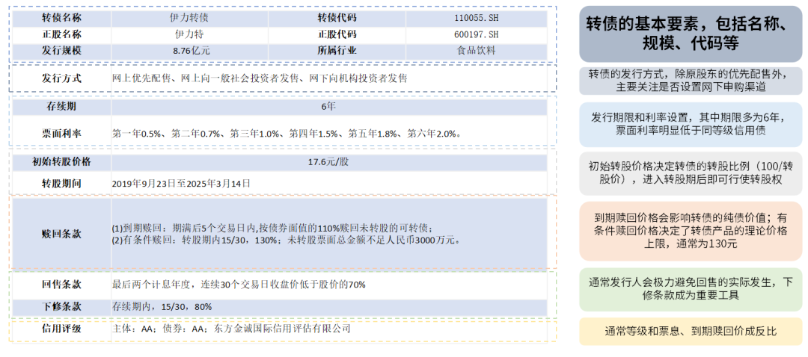

上期跟大家介绍了转债产品的基本概念 ([点此回顾](/pages/9f8296/)), 本期我们讲讲在接触一只陌生的转债时，需要关注哪些要素和条款。

一只转债在发行时，募集说明书或发行合同上可以查找到所有信息，但说明书或合同有大量的解释性文字，未经整理和提炼对于大多数投资者来说，难以抓到重点。

我们可以从基本信息和条款设置两方面，重点关注以下内容：基本信息主要包括正股信息、发行规模、发行期限、票面利率和信用评级等; 条款设置主要有四点：转股条款、回售条款、下修条款和强赎条款。

## 基本信息

### 正股信息

正股价格是决定转债价格走势的重要因素，因此首先要对正股建立基本认识，便于后续分析研究，包括主营业务、行业趋势、竞争价格、上下游关系、营业收入等。

### 发行规模

传统意义上转债的发行规模会在一定程度上影响个券的流动性，但随着转债市场择券空间的不断扩容，以及市场参与者逐渐丰富，转债规模效应的影响正逐步减弱。

### 发行期限

绝大多数转债的发行期限为 6 年，极少量转债期限为 5 年，期限设置给发行人充足的转股时间.(过往退市转债的平均存续时间为 2 年)

### 票面利率

这决定该转债作为一只纯债的价值。转债一般采用累进利率设置，且通常会在最后一期给予一定的到期补偿，使其到期赎回额高于票面利息和本金之和。以伊力转债为例，其 6 年利率设置分别为 0.5%、0.7%、1.0%、1.5%、1.8% 和 2.0%, 到期时还有 8% 的到期补偿，即到期后公司将按债券面值 110% 的价格赎回未转股的可转债，投资者可以获得 110 元。通常情况下，纯债价值可以视作转债价格的理论下限。

### 信用评级

信用评级对于转债实际违约风险的参考价值相当有限，这是因为，无论什么等级的转债，其发生实际违约的可能性都明显低于同等级信用债。由于转股条款的存在，转债票息设置通常明显低于同等信用债，这意味着转债给发行人带来的票息偿付压力较小，且绝大部分转债以转股方式退出，转股后无需偿还本金。目前，我国历史上还从未发生过可转债违约。

信用评级对转债的影响更多在于，评级越高的品种，可参与投资的机构相应越多，同等情况下也可能得到更高的溢价。

以伊力转债为例 (不代表投资建议), 我们按照逻辑条理对其进行整理，该转债基本就一目了然了。

## 原文

- [转债投资 vol.2 | 面对陌生的转债，如何提炼基本要素和条款？](https://mp.weixin.qq.com/s?__biz=Mzg4ODcyMzQ1NA==&mid=2247511557&idx=2&sn=576f3b5567cae7fe9c5f742efc1ddae6&source=41#wechat_redirect)
