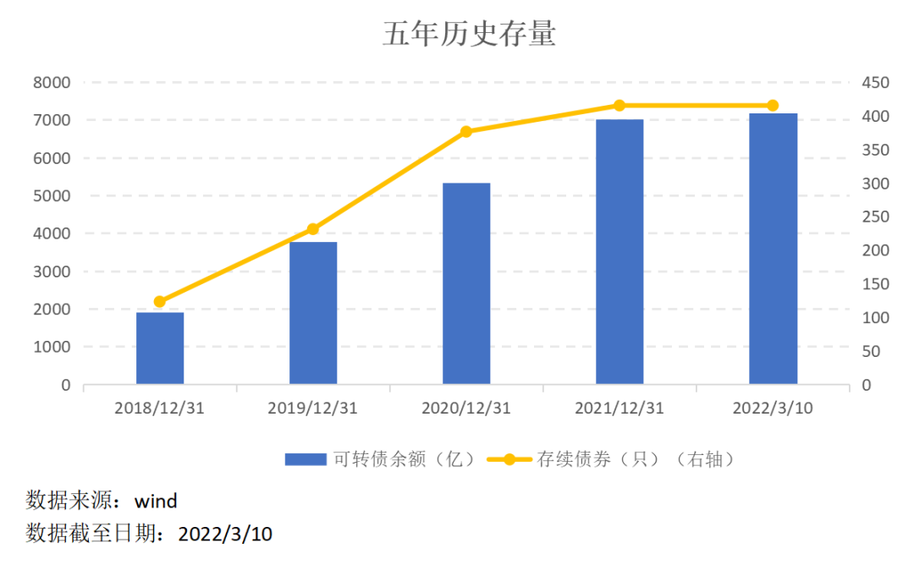
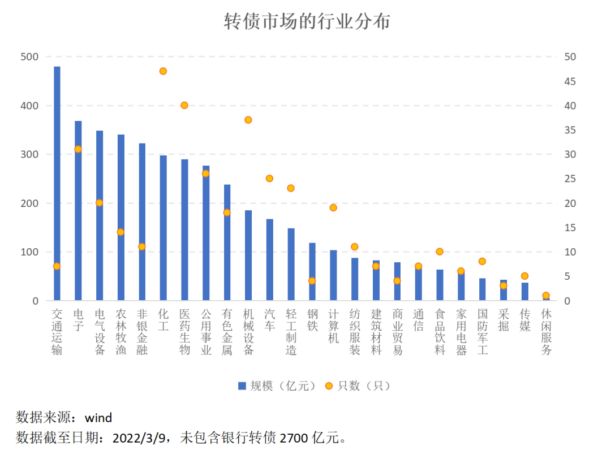
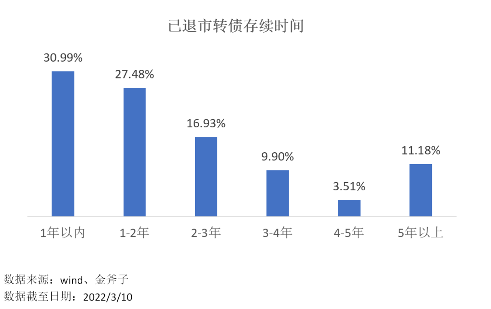
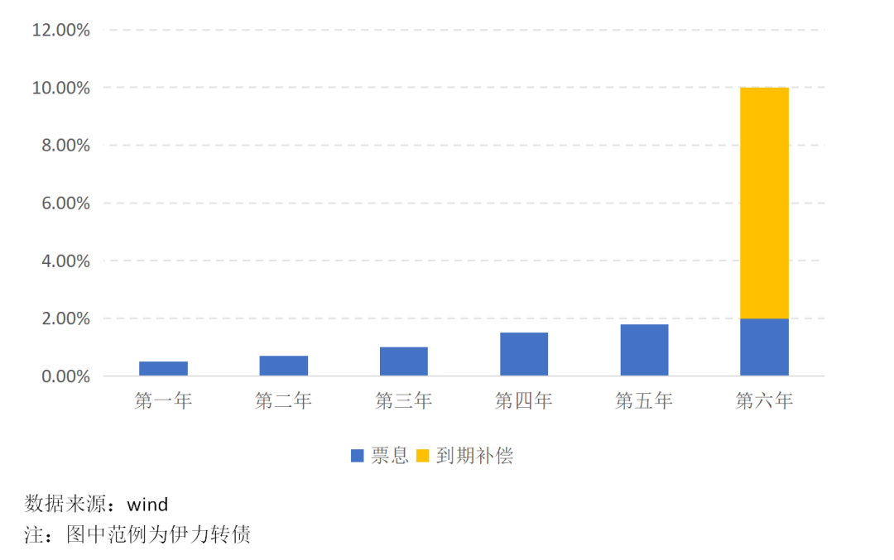
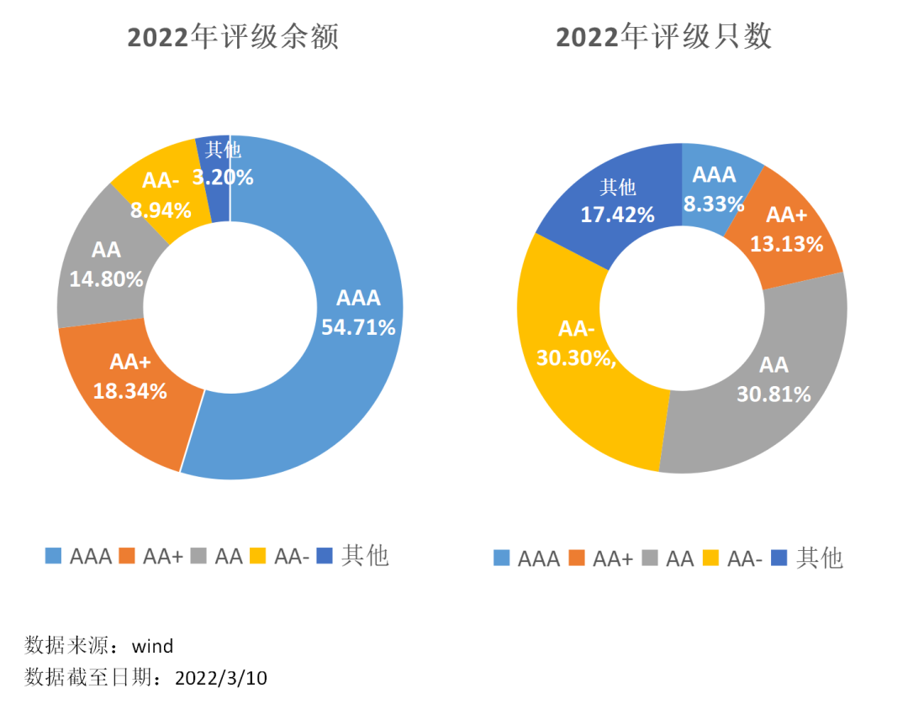

上期跟大家介绍了转债产品的基本概念([点此回顾](/pages/9f8296/)), 本期我们讲讲在接触一只陌生的转债时, 需要关注哪些要素和条款.

一只转债在发行时, 募集说明书或发行合同上可以查找到所有信息, 但说明书或合同有大量的解释性文字, 未经整理和提炼对于大多数投资者来说, 难以抓到重点.

我们可以从基本信息和条款设置两方面, 重点关注以下内容: 基本信息主要包括正股信息、发行规模、发行期限、票面利率和信用评级等; 条款设置主要有四点: 转股条款、回售条款、下修条款和强赎条款.

## 基本信息

### 正股信息

正股价格是决定转债价格走势的重要因素, 因此首先要对正股建立基本认识, 便于后续分析研究, 包括主营业务、行业趋势、竞争价格、上下游关系、营业收入等.

### 发行规模

传统意义上转债的发行规模会在一定程度上影响个券的流动性, 但随着转债市场择券空间的不断扩容, 以及市场参与者逐渐丰富, 转债规模效应的影响正逐步减弱.

### 发行期限

绝大多数转债的发行期限为 6 年, 极少量转债期限为 5 年, 期限设置给发行人充足的转股时间.(过往退市转债的平均存续时间为 2 年)

### 票面利率

这决定该转债作为一只纯债的价值. 转债一般采用累进利率设置, 且通常会在最后一期给予一定的到期补偿, 使其到期赎回额高于票面利息和本金之和. 以伊力转债为例, 其 6 年利率设置分别为 0.5%、0.7%、1.0%、1.5%、1.8%和 2.0%, 到期时还有 8%的到期补偿, 即到期后公司将按债券面值 110%的价格赎回未转股的可转债, 投资者可以获得 110 元. 通常情况下, 纯债价值可以视作转债价格的理论下限.

### 信用评级

信用评级对于转债实际违约风险的参考价值相当有限, 这是因为, 无论什么等级的转债, 其发生实际违约的可能性都明显低于同等级信用债. 由于转股条款的存在, 转债票息设置通常明显低于同等信用债, 这意味着转债给发行人带来的票息偿付压力较小, 且绝大部分转债以转股方式退出, 转股后无需偿还本金. 目前, 我国历史上还从未发生过可转债违约.

信用评级对转债的影响更多在于, 评级越高的品种, 可参与投资的机构相应越多, 同等情况下也可能得到更高的溢价.

以伊力转债为例(不代表投资建议), 我们按照逻辑条理对其进行整理, 该转债基本就一目了然了.

