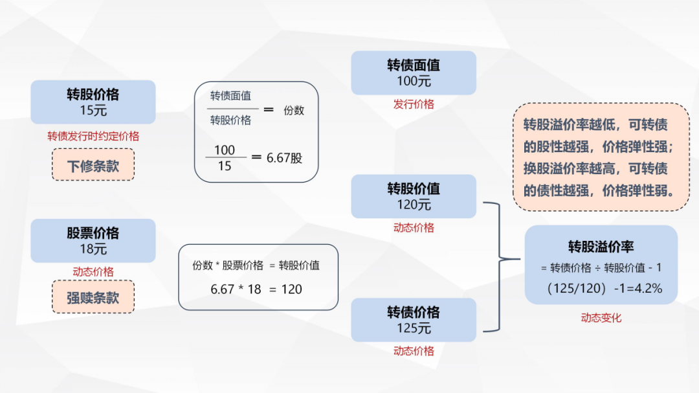
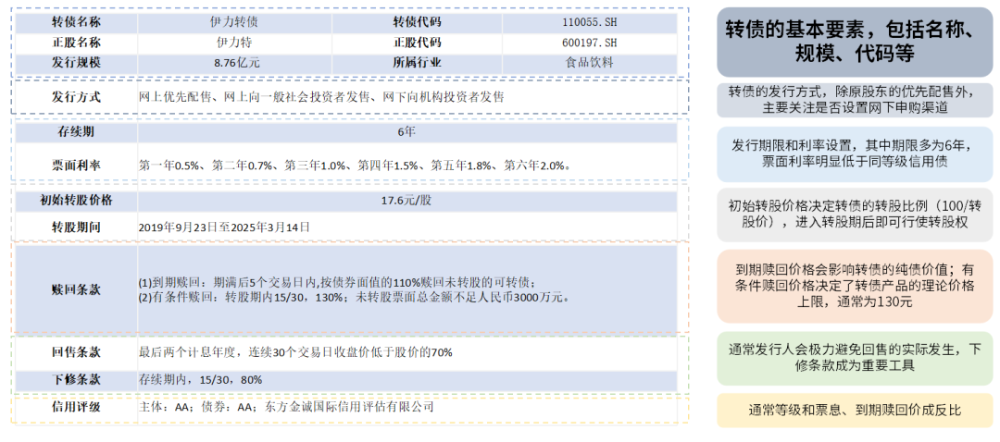

接上期（[转债的基本要素及条款说明一](/pages/fd96af/)），本期我们继续介绍可转债中最重要的四个核心条款：转股条款、回售条款、下修条款和强赎条款。很多投资者在刚接触可转债时，一定会被各种概念弄的晕头转向，在此之前，我们先来梳理一下各概念之间的关系。

## 概念解读

### 转债面值

发行价格是 100 元，即转债面值是 100 元。

### 转股价

上市公司发行可转债时，在募集说明书中约定的，可以将可转债转换为公司股票的每股价格。一张可转债可转换的股票数量=100/转股价，转股价越低，每张可转债换到的股票越多。

假定发行时约定的转股价格是 15 元，一张 100 元面值的转债，可以转换正股 100/15=6.67 股。

### 转股价值

每张可转债转换为正股股票，并在二级市场交易的价值，也就是转换为股票卖出后可以获得的金额。假定正股价格当下是 18 元，那 6.67 股股票卖出后即可获得 120 元。

转股价值=可转债面值/转股价\*正股价

### 转股溢价率

指转债价格相对其转股价值的溢价情况，在数值上的体现，就是转债价格相对于转股价值高出的百分比。

假定当下转债价格是 125 元，转股溢价率即为 4.2%。

转股溢价率=（转债价格—转股价值）/转股价值\*100%

如果溢价率大于 0，可转债溢价，转股价值小于可转债市价；如果溢价率小于 0，可转债折价，转股价值大于可转债市价。

转股溢价率越低，可转债的股性越强，价格弹性强；溢价率越高，可转债的债性越强，价格弹性弱。

接下来我们进入可转债的四大条款。

## 条款设置

### 1、转股条款

一只转债究竟如何转股？首先，每一只转债在发行时都会确定一个转股价，转股价规定不得低于，募集说明书公布前一交易日股票交易均价与发行前 20 交易日股票交易均价的孰高者（一般会与这个价格相等）。

在进入转股期后（通常为发行后六个月后），转债即可随时按照面值——100 元除以转股价的比例转出对应张数的股票。

以伊力转债为例，目前其转股价为 17.40 元/股，那么在发行六个月后，即 2019 年 9 月 23 日起，伊力转债的持有人便能够以 100/17.40 的比例，用每一张持有的转债转换出约 5.74 份股票，并得到这些股票的市场价值。需要注意的是，当天选择转股后，转出的股票要在下一个交易日才能选择卖出。

那么，是否当正股价格上涨至超过转股价的水平，并且转债处于转股期内，转债持有者就会选择转股呢？

其实不然，我们在前文中提到，当转股溢价率为正，这就意味着若此时选择转股，那么得到的股票市场价值（即平价）将低于转债的市场价格，得不偿失。

一般情况下，转债的持有人仅会在如下情况下选择转股：

转债触发强赎条款，通常当转债平价在转股期内持续超过 130 元后达成（后文中将详细介绍），此时选择转股往往会获得更多的价值。

转债到期，且平价高于到期赎回价：若转债面临到期，那么转债持有人的选择仅有两个：1、接受转债的到期赎回价；2、选择转股。因此，当平价高于到期赎回价时，转股就会是更好的选择。

转股期内出现负溢价套利机会：当转股溢价率为负时，转债的平价已经高于市场价，选择转股将会得到更高的价值。因此若转债在转股期内出现了负溢价，投资者便可通过买入转债再转股卖出的形式进行“套利”。但因为转出的股票需在下一个交易日才能卖出，持有人仍会面临股价波动的风险。

### 2、回售条款

回售条款是转债投资者的保护性权利，它通常规定转债正股在出现一定程度的下跌时，转债持有人有权将转债按照约定的价格回售给发行人。

以伊力转债为例，回售条款设置为：在转债的最后两个计息年度，如果公司股票在任何连续三十个交易日的收盘价格，低于当期转股价的 70% 时，转债持有人有权将其持有转债全部或部分，按面值加上当期应计利息的价格回售给公司。上述条款通常被简写为 30、70%。需要注意的是，银行类转债通常不会设置回售条款。

对于转债发行人而言，回售当然不是一个好消息，这意味着转债发行人将不得不提前偿还本息，而发行转债最理想的情况是达成转股后便不需要偿付后续本息。因此，在公司面临转债回售压力时，通常倾向于采用一些手段（如下修转股价），尽力规避触发回售条款。

回售条款通常仅在转债的最后两个计息年度才能触发，这意味着在转债发行后的前四年中，即便是正股出现了较大幅度的回调，发行人也不会面临实际的回售压力。

### 3、下修条款

下修条款是转债发行人的权利，规定当转债正股价格达成一定条件后，公司可以下调自己的转股价。

转债发行人通常会尽力避免回售条款的实际触发，其中一个重要的手段便是运用下修条款来下调转股价。以伊力转债为例，一个典型的转债下修条款设置为：当公司股票在任意连续三十个交易日中至少有十五个交易日的收盘价低于当期转股价格的 80% 时，公司董事会有权向股东大会提出向下修正转股价格的提案。上述条款通常被简写为 15/30、80%。

修正后的转股价格按规定，应不低于股东大会召开日前二十个交易日公司股票交易均价和前一交易日均价和前一交易日均价之间的较高者。一般情况下，下修的价格触发线有 90%、85% 和 80% 三个等级，触发价格设置越高，则条件越容易达成。

下修条款最直观的意义是防止回售条款的实际触发。若转股价下修被股东大会通过并顺利执行，那么转债的转股价将较原有转股价明显下调，回售条款“低于转股价 70%”的条件也相应被放宽，从而避免了回售条款的实际触发。

从下修的幅度规定来看，若发行人选择按照前文所述的下限足额下修，那么下修后转债的平价将回到 100 元左右，而触发下修则需要平价在 80-90 元以下。并且在以避免回售为目的的下修中，转债的平价通常已经下跌至接近 70 元或更低。因此下修执行后，转债的平价将瞬间上升，在平价 + 转股溢价率的定价思路下，转债的价格也有很大相应提升的可能。

除规避回售外，发行人也会在其他一些情况下选择下修。例如：1）正股价格处在低位，但公司判断股价后续将迎来上行机会，此时公司有可能会选择下修以降低触发强赎转股的难度，确保公司能顺利转股；2）大股东持有大量转债，在正股价格处在低位时，出于解套目的，大股东提议下修的意愿可能增强。

### 4、强赎条款

强赎条款是转债发行人的价格保护条款，规定其可在特定条件下按照约定的价格将转债从投资者手中赎回。

以伊力转债为例，强赎条款设置如下：在转股期内，若连续 30 个交易日中至少有 15 个交易日转债的正股价格不低于到转股价的 130% 以上（即平价达到 130 元），公司有权决定按照债券面值加当期应计利息的价格赎回全部或部分未转股的可转债。上述条款通常被简写为 15/30、130%。当前的绝大多数转债产品都会采用该强赎条款设置。

强赎条款真正的意义并不在于从持有人手中赎回转债，而是促进持有人转股。在公司公告行使强制赎回权利后，持有人若选择接受赎回，那么得到的赎回金额通常仅略高于 100 元。而此时转债已经触发了强赎条款，这意味着转债的平价已持续处在 130 元以上的位置，选择转股获得平价显然是更好的选择。对于大多数投资者来说，强赎转债会促使投资者完成转股。

一般来说，触发强赎转股对于转债发行人和持有人来说都是最理想的退出方式。强赎达成后，对于公司来说，不必再支付转债剩余的本息，而对于持有人来说，强赎转股也意味着获利了结。有一点特别值得注意，强赎是发行人的权利而不是义务，也就是说可转债触发了强制赎回的条款，公司有权利选择强赎，也可以选择不强赎。

现在我们再看转债的条款和要素，是不是立刻就一目了然了。

## 原文

- [转债投资 vol.3 | 面对陌生的转债，如何提炼基本要素和条款（二）](https://mp.weixin.qq.com/s/DS-8I2pCaPM5xsq7xkNaTA)
