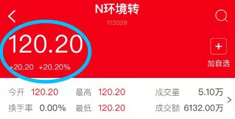
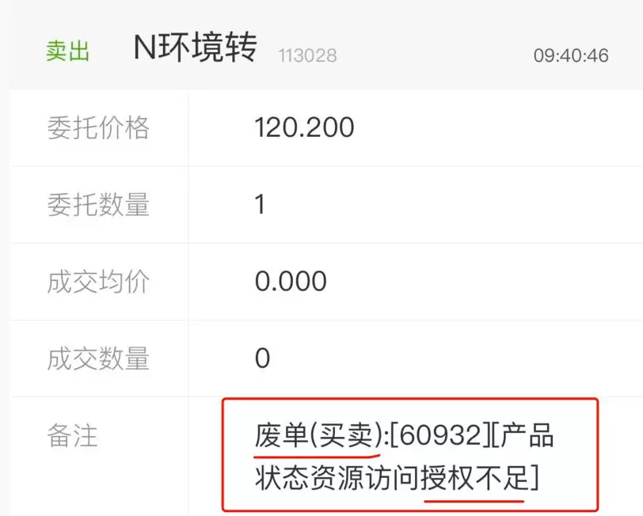
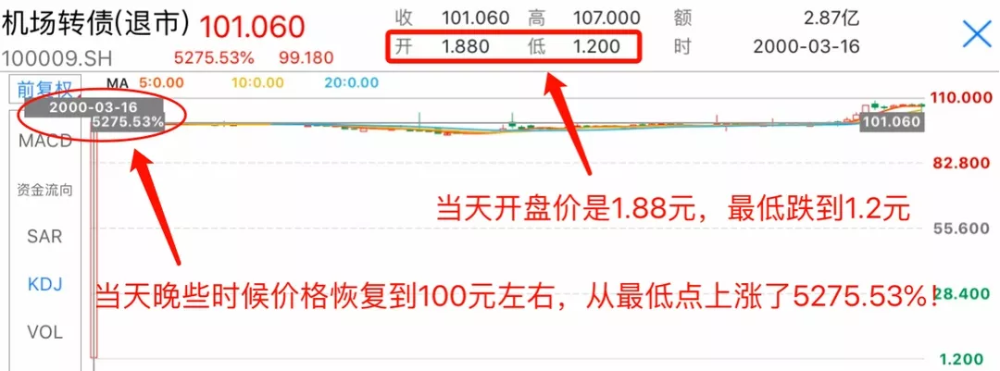

今天和大家说一个一天赚 20%, 却担心得要死的故事.

最近, 小花中了一只新债, 刚上市就赚到了 20%.

赚到钱, 应该是一件开心的事, 但小花感到很紧张和担忧.

难道是嫌涨的还不够多, 担心现在卖出少赚了钱? 还是因为涨的太快, 小心脏一下承受不住了? 都不是.

她是遇到了一个非常"紧急"的状况:

**她赚了 20%的新债, 居然卖不出去!**

(卖出可转债时, 系统反馈的内容)

"废单"、"授权不足"...... 听着好吓人!

到底出什么事情了? 是我操作失误吗?

会不会有警察叔叔来抓我?!

眼睁睁看着这 200 块的利润, 塞不进自己的腰包里, 别提有多着急了.

(小花在圈子里向大家求助)

小花的新债, 到底为什么卖不出去呢?

那是因为, 因为公司卷款跑路了......

是不可能的.

**真正的原因, 是因为新债一下子涨的太凶, 交易所为了保证投资者们能够"理性"买卖, 而暂时限制了大家的交易.**

所以, 这个时候不用担心.

**本金是安全的, 到嘴里的肉也不会飞了.**

**一般只要等待 30 分钟, 就可以卖出了.**

因为涨太多, 所以大家喝杯茶先冷静一下, 不得不说这交易限制还挺"贴心".

但说起它, 不得不说到历史上一段很有趣的往事.

2000 年, 也就是大约 20 年前. 那时中国的股市还处于"蛮荒"时期, 可以买卖的股票很少, 交易也不像现在那么快捷和规范.

股票尚且如此, 可转债就更不用说了.

当年, 绝大多数投资者, 对可转债都是闻所未闻.

就连发行可转债的上市公司, 对于可转债的发行条款, 也是一改再改.

就在这样的市场环境下.

"上海机场"当时发行了一只可转债, 叫做"机场转债".

实力这么硬的公司, 发行的可转债一定差不到哪去.

因此, 投资者们纷纷认购, 激动的搓着小手, 准备大赚一笔.

然而, 等待着他们的, 是一场前所未有的"腥风血雨"......

2000 年 3 月 16 日, "机场转债"终于上市了.

当天早上, 发生了一件现在看来不可思议的事.

让我们把视角跟随上海市民王大爷, 一起体验当时的经过.

当天, 家住上海虹桥附近的王大爷, 跑到交易大厅, 准备看看"机场转债"涨势如何.

结果, 吓得他把老花镜都掉在了地上.

什么情况? 面值 100 块钱的机场转债, 居然只卖 1 块多!

足足下跌了 99%!

你说这时候,

该捡钱的呢?

还是捡钱呢?

还是捡钱呢?

......

"不对, 会不会是有什么未知的风险呀, 我得冷静一下."王大爷不愧是老江湖.

短暂的纠结之后, 他还是决定干一票.

他拿出了家里的生活费, 买了 1000 块机场转债.

然而, 更匪夷所思的事, 还在后面:

"机场转债"的交易价格, 从刚开始的 1.8 元, 一度跌到了 1.2 元.

"册那, 什么情况. 怎么还又跌了."王大爷心脏砰砰跳, 决定再等一会儿看看.

又过了五分钟, 王大爷再看.

"101......?"王大爷揉揉眼睛, "没看错, 真的是 101, 机场转债回到了 101 块, 比 1.2 元涨了 8400%!"

("机场转债"上市当天匪夷所思的交易价格)

到底发生什么了呢?

原来是有机构把可转债交易价格搞错了, 原来 100 块的可转债, 他们把它当基金的初始净值 1 元来看待了.

(你看即便是机构, 不好好学习也会犯蠢的)

于是有不少人在 1 元附近卖掉了自己的可转债.

在这个过程中, 有像王大爷一样的人.

1 块多买入, 100 块钱卖出, 赚了将近 100 倍.

也有机构中了签本来打算大赚一笔.

结果 100 块买的, 1 块多卖出, 亏光了本金.

而我们的王大爷, 直拍大腿, "这么好的机会, 竟然才买 1000 块, 我脑子瓦特了!"痛恨自己刚才买少了.

不过, 这个大腿拍得有点太早.

这件事情, 引发了市场强烈的恐慌, 更是惊动到了交易所的管理人员.

后来, 交易所觉得不对劲, 临时叫停了"机场转债"的交易.

并且对当天的交易进行了"撤回":

所有在机场转债上市当天, 以 75 元以下成交的交易, 全部作废!

可怜的王大爷竹篮打水一场空, 这下大腿肉都快拍烂了......

从此, 为了避免日后再发生类似的"闹剧", 交易所对可转债买卖的价格进行了规定和限制:

**当可转债价格波动过大时, 系统就会自动暂停交易.**

这就是现在遇到的"盘中临时停牌机制"的雏形.

现在, 我们中国两大证券交易所, "上海交易所"和"深圳交易所", 都对可转债的交易价格都作出了明确的限制.

虽然具体标准不尽相同, 但思路都是一样的:

**当可转债的交易价格, 在当天上涨或者下跌到了一个幅度(一般当天首次是 20%, 之后是 10%), 就会触发"临时停牌", 暂停交易.**

其目的就是为了防止当年在"机场转债"发生的故事重蹈覆辙, 维持交易的稳定和理性.

所以, 对于新债来说, 停牌一般意味着已经上涨了 20%.

这时候我们不必紧张, 短暂的 30 分钟后, 就可以继续卖出了.

(如果又接着涨了 10%, 那可能就要等到明天才能卖)

看完今天的内容, 相信下一次你中的新债, 遇到"临时停牌"时, 就不会再慌慌张张啦.

而且, 你应该期待你的可转债能"停牌".

因为, 那意味着, 你至少要赚 20%, 甚至可能赚 30%!

哎, 本来只想着赚个 10%的盒饭钱就开心了, 非要让伦家赚 20%, 真的好烦恼啊......
