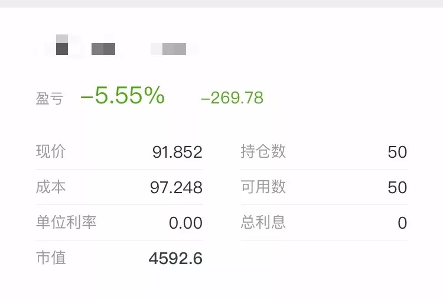
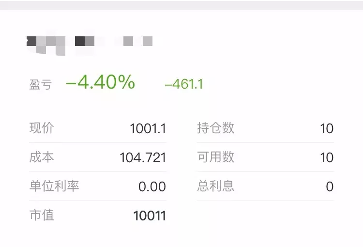
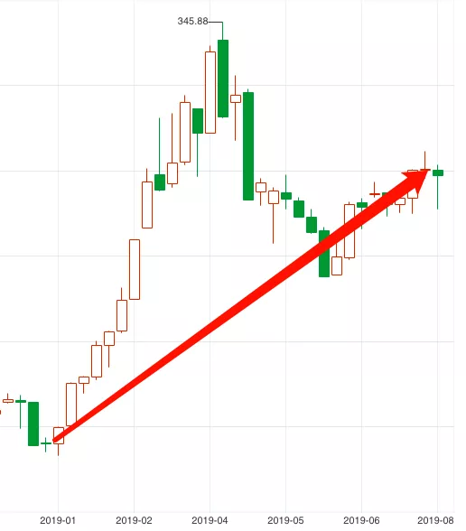
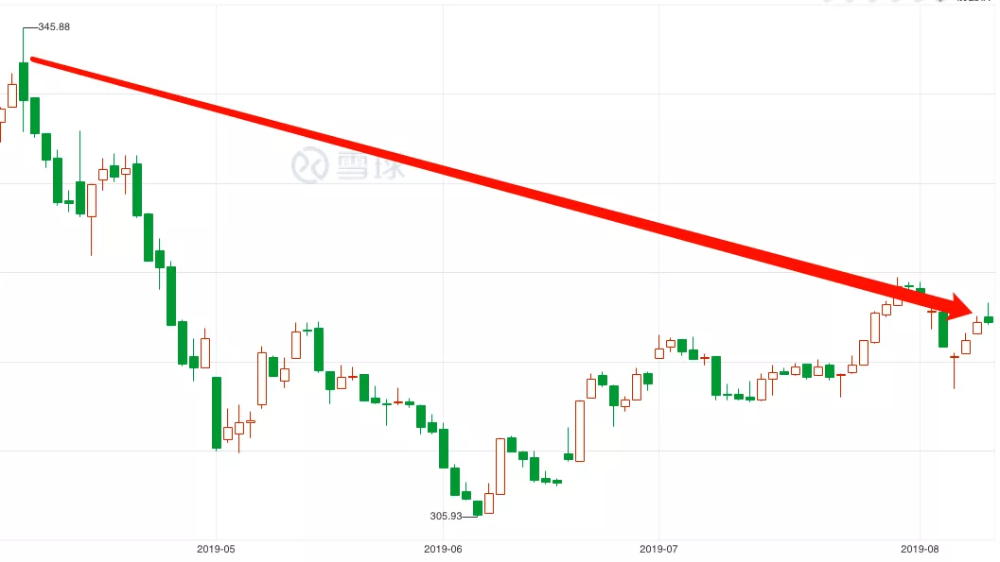
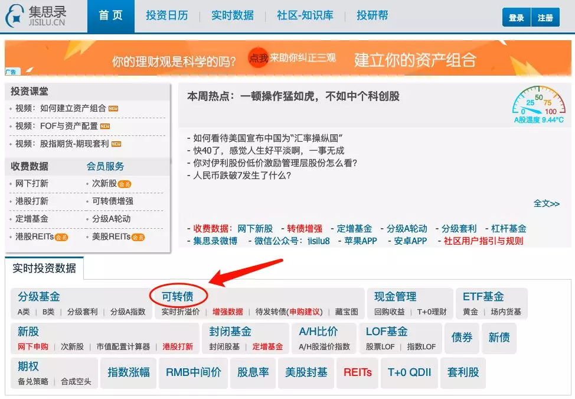
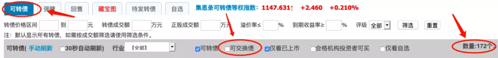
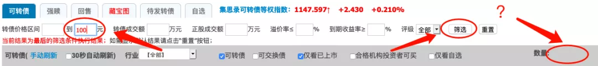

今天我们来讲一个"抄底"可转债的方法。

## 现在是抄底的机会吗？

最近市场发生了不少事情。

而要简单总结的话，就是一句：要想生活过得去，就得头上有点绿。

股市下跌不少，不少白马股跌停，跌幅 20% 甚至 30% 的股票比比皆是。

我们的老朋友，铁柱同学，也很烦恼。

他是新手，比较谨慎，买的是可转债。

但覆巢之下，焉有完卵，可转债的头上也绿了：

当然，可转债的优越性也体现出来了：

虽然也有下跌，但幅度相比股票，温和得多。

既然转债都跌了......

铁柱产生一个很重要的问题：

现在是抄底的机会吗？

而对于还没有买转债的豆粉来说：

现在是入场的机会吗？

自己可以踩着师哥师姐们尸体进场捡便宜的筹码！

------这么一想，有点邪恶，又有点激动！

如果我们能预测到接下来可转债的涨跌，这个问题就能被轻易解答。

但是，预测涨跌，显然是不可能的。但也不是完全没有办法。

## 可转债吸引力指数

有一个简单的指标，可以用来判断当前可转债市场，整体的吸引力如何。

如果指标显示吸引力很高，那很自然地，我们应该进场、应该抄底，应该大举买入。

如果指标显示吸引力很低，那我们就不要着急冲进去。

道理就是这么简单。

那么重点来了，这个指标是什么呢？

如何计算呢？

办好小板凳，准备好水果瓜子，我们一起来看看。

在之前的文章和直播中，我们说过：

股票世界里，可以通过"股票吸引力指数", 来大致判断市场整体处于什么位置。

**它等于"沪深 300 股息率/三年期国债收益率".**

通过把"股票吸引力指数"划分为"黄金、白银、青铜、废铁"四个阶段，我们可以轻松的把握自己投入股票当中的资金比例。

打个比方，现在的股票吸引力指数是 0.98.

这个数值属于白银机会，接近黄金机会。

那我们分配比如"七到八成的资金"买入股票，就比较合适。

(注意是"比如", 你也可以根据自己的情况来调整)

具体的方法，在 3 月份的直播里有详细的讲过。没听过的同学，可以在公号后台输入"录播"来复习，这里就不再多说了~

既然股票有"吸引力指标", 可转债也会有类似的指标吗？

嗯，当然是肯定的。

我们就把它称作"可转债吸引力指数"吧！

**可转债吸引力指数，它等于"低于 100 元可转债的数量/市面上可转债的总数量".**

什么意思呢？

打个比方，

现在有 30 只可转债，价格是在 0-99 元之间 (也就是低于 100).

那"低于 100 元可转债的数量", 就是 30.

现在市场上已经发行且可交易的可转债，一共有 100 只。

那"市面上可转债的总数量", 就是 100.

最后，我们用 30 除以 100,

就得到了"可转债吸引力指数"为 30%.

所以，可转债吸引力指数，它实际上代表了"低价可转债的占比".

这个指数越高，就意味着可转债越低估，吸引力越高，我们投资可转债的力度，也应该越大。

反之亦然。

那到底多高算高，多低算低呢？

同样的，我们也来给它分个段。

**吸引力指数>50%, 属于黄金机会.**

**30%<吸引力指数<50%, 属于白银机会.**

**10%<吸引力指数<30%, 属于青铜机会.**

**吸引力指数<10%, 属于废铁机会.**

之所以把 50% 作为黄金机会的分界点，道理很简单：

如果有超过一半的可转债，价格都低于 100 元了。

那基本上就算你不按标准筛选，瞎瘠薄买，基本上也能赚钱了。

也就是说，可转债市场已经"遍地黄金"了。

## 吸引力指数到底有没有效果呢？

我们找两个典型的时间，一起来看一下。

首先是去年 12 月底，股市低迷的时期。

去年 12 月 28 号，当时市面上一共有 111 只可转债，其中有 75 只价格低于 100 元。

因此，可转债吸引力指数为 67%, 属于黄金机会。

如果在那个时候花 1 万块钱买入一组可转债。

短短的半年多时间里，我们会赚到大约 1500 块钱~

(去年年底至今，可转债平均有 15% 左右的涨幅)

看到了市场的低迷时期，我们再反过来看看市场的狂热时期。

今年 4 月，市场就比较狂热。

市场狂热，可转债的价格自然也就水涨船高。

4 月 9 号当天，市面上一共有 139 只可转债。

那么，低于 100 元的可转债有多少呢？

20 只？10 只？

怎么着也有 5 只吧？......

答案是：只有 1 只。

这只可转债叫做"亚太转债", 当天的价格是 99.83 元。

(其实跟 100 已经没啥差别了)

因此，今年 4 月 9 号可转债吸引力指数就是 1/139, 大约等于 0.7%.

很明显，0.7% 是低于 10% 的，属于废铁机会。

如果你在那个时候，花 1 万块钱买入一组可转债。

短短 4 个多月的时间里，你就会亏掉 1000 块钱。

(今年 4 月初至今，可转债平均有 10% 左右的跌幅)

## 计算吸引力

哇，可转债吸引力指数真的非常有用。

那，究竟可以在哪里查到它呢？

可转债吸引力指数，目前在网上无法直接查到。

不过，我们可以手动统计。

计算方法也很简单：

在"集思录"等平台上，查到低于 100 元可转债的数量，以及可转债的总数量，两者一除，就出来了答案。

具体来说：

【1】百度"集思录". 打开"集思录"网站后，进入"可转债"界面。

【2】在"可转债"栏目中，去掉"可交换债", 就可以看到可转债的总数量。比如现在，一共有 172 只可转债。

(按照方法操作，可以看到当前可转债的总数是 172 个)

【3】然后，我们设置一下价格区间，把价格上限设置为"100 元". 再点一下"筛选", 就可以看到 100 元以下可转债的数量。

同学们可以自己操作一下看看，现在 100 元以下可转债的数量是多少呢？

(按照方法操作，就可以看到当前低于 100 元的可转债数量)

最后，我们用"低于 100 元的可转债数量", 除以"可转债的总数量", 就可以得到可转债吸引力指数啦。

最后，跟股票吸引力指数一样。

可转债吸引力指数，它只是告诉我们可转债目前处于低估还是高估，让我们更清楚自己的投资力度到底该有多大。

**它并不能预测可转债价格的走势，更不可能改变可转债的价格.**

所以。

**即使是到了黄金机会，可转债仍然可能会跌.**

**即使是到了废铁机会，可转债也仍然可能会继续涨.**

但有一点，它却又跟股票吸引力指数不太一样：

**可转债吸引力指数仅仅作为"买入时机"的判断，不作为"卖出时机"的判断.**

到了黄金机会，你可以多投入一些资金在可转债上。

但即使到了废铁机会，你也不需要将之前买入的可转债卖出哟。卖出还是按照我们之前说的卖出方法来就可以了~

## 原文

- [一个指标，教你如何"抄底"可转债.](https://mp.weixin.qq.com/s/F5bGmAm7FThZHLE4dBga-Q)
