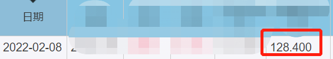

前段时间，分享了火姐投资可转债的故事。

不少小伙伴来问：

可转债现在是熊市还是牛市？

有没有机会？

啥时候才是入场好时机呢？

其实啊，真的有个【神奇指标】能帮我们判断：可转债是否出现机会。

铁柱好奇：师兄，一个指标就能判断机会？

判断熊、牛市，都需要好几个指标呢。

这【神奇指标】，真的有那么神奇吗？

当然啦，这可不是我拍脑门决定的。

是靠数据和逻辑的。

而且历史情况早已告诉我们答案了。

春江水暖鸭先知，这【神奇指标】像鸭子。

当转债市场出现机会时，它最先反映出来。

口说无凭，让我们一起回到过去，

掀开可转债的头盖骨，

啊，不是……是神秘面纱吧。

先来看下，这【神奇指标】最低为 100，出现在 21 年 2 月。

（数值越小，机会越多）

当时投资可转债的小伙伴一片哀嚎，直呼太惨了。

本想抄个底，没想到反被抄家了。

而这【神奇指标】却暗戳戳说有机会了。

随后，可转债发生了什么呢？

直接暴涨，等权指数头也不回的一路上涨，

甚至涨出了最高值。

（随后可转债走势）

指数大涨，各转债涨的也很欢乐。

比如：湖盐转债。

历时 8 个月，从 91 涨到 144，涨幅达 47%。

白电转债。

历时 11 个月，从 90 涨到了 170。

大涨了 55%。

这样的例子数不胜数。

楼上那位同学，虽然没抄在最底部。

（没人能精准抄底）

但想必也是吃到了一大口肉。

而大涨过后，这【神奇指标】发生了什么变化呢？

从 100 上涨到 128。

刚刚说，数值越小代表机会越多。

那现在岂不是……

没错，22 年以来，一直在震荡中下跌。

除了 21 年，这【神奇指标】还出现过较低的数值吗？

当然有了，比如在 2018 年时曾到过 106。

难道和 21 年情况一样？

这时候只要买入转债就能大赚特赚？

不不不，当时可转债没这么爽。

反倒是一个字——惨。

受到毛衣战影响，整整一年，都没赚钱。

假设 2018 年，你投入 1 万块进去，一年后几乎原地踏步。

收益率是 0%，毛都没赚到。

师兄，说好的机会呢？就这？

可别看不起这 0% 的收益啊。

要放在 2018 年，人家会以为你是凡尔赛。

尤其是周围买股票的人，可能会把你胖揍一顿。

因为当时股市整体可是跌了 30% 多！！

（2018 年的股市）

在熊市里，可转债顶多不赚钱，但股票、基金可是亏钱啊！

就像《唐伯虎点秋香》，让你在一堆红盖头里点美娇娘。

如果你第一个点，点到的是这个。

刚开始可能觉得平平无奇。

但如果周围的人，点到的都是这类货色……

那怕是晚上睡觉都会笑醒。

更何况，当年熊市结束后，率先反弹的可不是股市。

而是可转债！

（2018 年底，可转债率先反弹）

为什么？

因为可转债具备转股的特殊性。

正是由于这个特殊性，所以在行情转变的时候，往往存在巨大的套利空间。

这时候，可转债的涨幅，一般会跑在股市前面。

铁柱：

哇塞，果然有点东西。

那师兄，这个【神奇指标】到底是什么？怎么看呢？

本来呢，这是一个秘密。

不过看在咱俩有着“酸奶”交情的份上，就偷偷告诉你吧。

其实这【神奇指标】就是【中位数价格】。

中位数价格顾名思义：反映了所有转债的中间价位。

比如：现在市面上有 5 只可转债。

价格分别是：60，80，100，120，200。

这时，中位数是 100。

假设经过一段时间的上涨，现在 5 只转债价格为：

90，110，130，150，230。

那中位数就是 130。

所以，当市场上的转债价格都上涨时，中位数也会随着上涨。

反之，中位数会降低。

因此当数值越大时，说明转债整体较贵。

反之，则代表整体比较便宜。

铁柱：

师兄，那多少算便宜，多少算贵呢？

哎哟，不错啊铁柱。

这个问题问得好。

为了方便大家参考，师兄根据经验人为的划分了一下。

100 元以下算非常便宜，可以给 5 星；

100-110 元，4 星；

110-115 元，3 星；

115-120 元，2 星；

120 元以上，代表市场非常贵，1 星。

当然，利用【中位数价格】的评价方法。

也只是我能想到的，相对比较贴切的方法。

评判的维度，还有很多。

比如，100 元、90 元以下的可转债占比，换手率，平均到期收益率等等。

这些指标，也有一定的帮助。

但整体来说，【中位数价格】，是当前最直观，最好用的。

接下来，手把手演示一下。

如何查找中位数价格。

第一步，请出我们可转债的老朋友【集思录】。

百度——集思录即可。

第二步，点击【实时数据】，然后点击【转债等权指数】。

第三步，进入页面后，下拉就能找到当前以及历史的中位数价格啦。

怎么样，是不是很简单？

其实这个指标以及查找方法都不难。

难的在于人心，因为很多人并不相信这个指标。

（就像不相信股市吸引力指数一样）

即便，无数次历史情况已经验证了它的有效性。

但身处熊市时，没人会相信它还能涨回来。

同样行情火热时，即便提醒风险，别人反而会怪你拦着他发财。

就像现在股市，跌太惨了，大家都跌麻了。

而转债还未熄火，总有人想冲进去……

邓普顿说：

“牛市在悲观中诞生，在怀疑中成长，在乐观中成熟，在兴奋中死亡。”

你觉得转债市场，现在是什么时刻呢？

常说逆向投资。

在别人恐惧时贪婪，在别人贪婪时恐惧。

可知道与做到又是一回事儿。

知识和智慧，在很多地方还是不同的。

愿充满智慧的你，被世界温柔以待~

## 原文

- [这神奇指标，能发现转债机会？！](https://mp.weixin.qq.com/s/AGVhcJhPs3OJoTSu-gtiXg)
