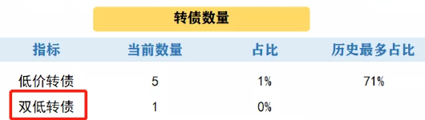

最近发现一件有意思的事儿。

有两只转债，一个叫鬼衰，一个叫靓仔。

有段时间价格一样，都是 103。

而过了一段时间后，鬼衰转债涨了 4%。

很一般。

反观靓仔转债就厉害了，最高涨幅 51%！

奇怪，当时它俩明明价格一样，评级也相当。

怎么一段时间后，差了这么多呢？

虽说很多因素会影响价格，

但其中最重要的一个是：溢价率。

鬼衰转债溢价率高（45%），而靓仔转债溢价率低（9%）。

靓仔的溢价率小的多，所以涨幅大的多。

看来，这溢价率是个很重要的东西。

那问题来了，溢价率，这是个啥？

好吃吗？

## 什么是溢价率呢？

为了方便大家理解，举个例子。

大家遛过狗吗？

就算没遛过，总归也见过吧。

狗虽然到处溜达，但总归是跟着主人走的。

转债和股票的关系，就像是狗和主人的关系。

总的来说，这两者是正相关。

主人向东走，狗就算东闻西凑的，但最终也会跟着向东走。

（除非是性格奇葩的柴犬）

（柴犬：你拽得动我算我输）

很多时候，憋了一天的小狗好不容易放风，就会到处撒欢，跑在主人前面。

当狗跑在前面，领先主人 10 米时。

此时若回家，主人需要往前走 50 米，而狗却只需要走 40 米。

这时，我们可以近似认为，狗领先的距离就是“溢价率”。

这里，主人=股票，狗=转债。

梳理一下：

1、狗前进方向，和主人一致。

转债的涨跌，和股票也一致。

股票涨，转债涨；股票跌，转债跌。

2、但由于狗有时先跑前头了，之后的前进“里程”，和主人的里程就不一样。

同样，由于溢价率的存在，转债的涨幅，不一定和股票一样。

比如，当股票大涨 50% 时，转债可能只涨 40%（因为溢价率为 10%）。

就像主人已经到了家，走了 50 米。

狗可能只走了 40 米，因为它之前“抢跑”了 10 米。

上面的鬼衰转债，溢价率高达 45%。

当股票涨 50% 时，转债的涨幅就没办法有 50% 这么多。

（谁让你之前抢跑了 45%，对吧）

而靓仔转债，因为溢价率低。

当股票大涨 50% 时，转债也就能涨 50%。

就像小狗，紧紧贴着主人，主人走 50 米到家，它也得走 50 米。

因此，我们总结一条规律：

小狗领先主人越少，要走的距离就越远。

也即：

转债溢价率越小，转债潜在的涨幅就越大！

（随着正股上涨而上涨）

我们知道，如果转债的价格越低（比如 100 以下），越安全。

现在又知道了，溢价率越低（比如 20% 以下），潜在的涨幅也越大！

所以，如果能挑到价格低，且溢价率低的转债，就是兼顾了“安全”与“弹性”的香饽饽转债！

而这价格低，与溢价率低，就是我们传说中的“双低转债”！

当然，因为上市满足半年，转债才能兑换股票。

这时参考溢价率才有效。

## 所以，双低转债的标准就出来了：

1、价格低，如低于 100 或 110。

（具体标准取决于市场行情，与个人风险偏好）

2、溢价率低，如低于 20%。

（同上）

3、上市时间超过半年。

溢价率和双低转债讲完了。

我们平时更新的“双低”转债就是这个啦。

最近，我们都会定期更新公布，看看当前市场有多少双低转债。

过去十来年的转债历史证明：

在理性操作、遵守纪律的情况下，每次大量买入双低转债的话。

之后若干年都有不菲的收益。

所以，大家完全可以先参考我们平时更新的表格，再自主筛选出“双低转债”。

## 原文

- [大涨 51%，发现这只转债的秘密了！](https://mp.weixin.qq.com/s/c1GmmcBFZiwuviO4PIe9uw)
