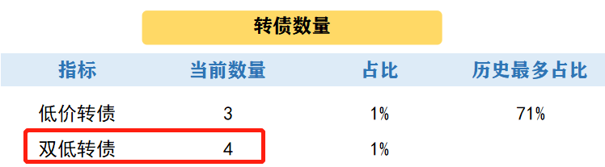
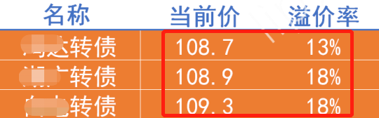
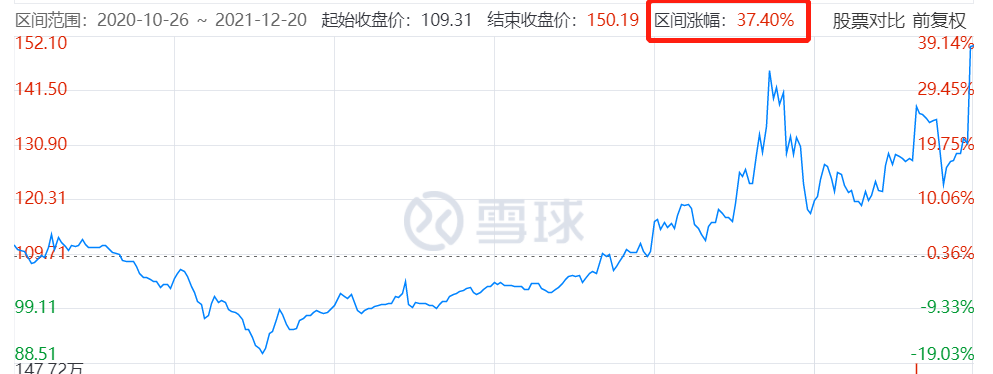
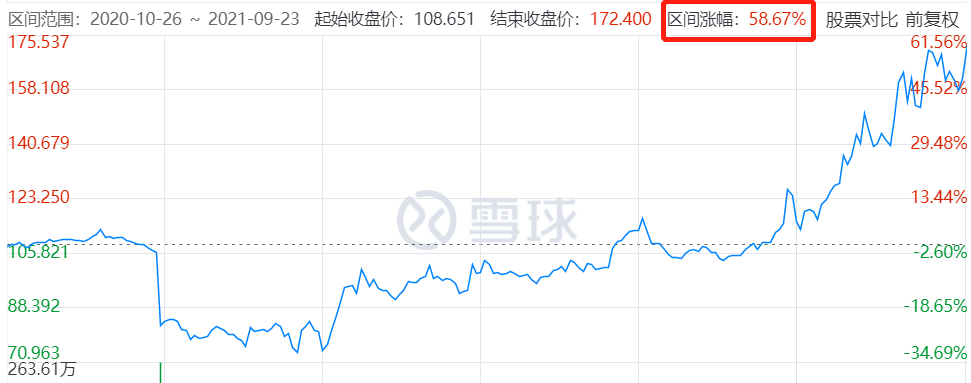
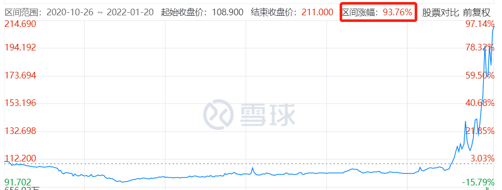
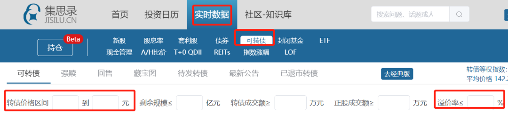
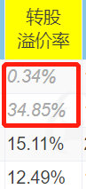

昨天，转债晴雨表中出现了 4 只双低转债。

铁柱跑来问：

师兄啊，这双低转债竟然多了。

难道出现机会了？

不过双低转债真的这么神奇吗？

只要按纪律买入，就能赚钱？

铁柱你呀，倒是挺小心谨慎的嘛。

当然神奇，而且很多同学从它身上赚到了钱。

不过，口说无凭，我们来看下历史情况。

以 20 年 10 月为例，当时出现过 3 只双低转债。

（条件因人而异，这里仅作为举例）

经过一年多，

三兄弟中，小弟大涨了 37%。

铁柱吐槽道：也没有很多嘛。

要知道，同期沪深 300 才涨了 3%。

而且，三兄弟中的大哥、二哥没出场呢。

不到一年时间，二哥最大涨幅约 59%。

大哥的涨幅更恐怖，最大约 94%！

一万块投入这只转债，一年后就变成了 19400！

这下相信它的厉害了吧。

铁柱看完后坐不住了：

师兄，快教教我怎么找双低转债吧。

不止铁柱，很多小伙伴也想知道怎么筛选。

那今天就手把手演示一下。

第一步，百度【集思录】。

第二步，选择【实时数据】-【可转债】。

就看到下方的筛选框了。

在里面输入适合自己的双低标准就可以。

第三步：剔除上市未满半年的转债。

可以观察溢价率的颜色，区分是否上市满半年。

当溢价率为灰色时，代表未满半年；

黑色则代表已满半年。

（仅做演示）

而未满半年，不能转股，

此时的溢价率没啥参考意义。

因此，需要剔除掉灰色溢价率的转债。

怎么样，是不是很简单？

快去试试看，找出属于你的双低转债吧。

铁柱过了一会，又跑来问：

师兄啊，为什么会筛不到啊？

还有，双低的标准可以调整嘛？

……

实际操作中，总会遇到一些问题。

我汇总了下，挑了几个重要的问题和大家分享。

1、双低转债的标准是什么？

首先要清楚，

具体的标准取决与市场情况、与个人风险偏好。

这里只是给出一个参考。

1、价格低，如低于 100 或 110。

2、溢价率低，如低于 20%。

3、上市时间超过半年。

2、价格上，100 和 110 的区别是什么？

我们都知道，转债的价格越低（比如 100 以下），越安全。

因为最差情况，公司会到期还本付息。

我们拿到的钱会比 100 多。

（100 块，加每年的一点点利息）

因此价格越低，安全性越高、保本性越强。

3、为什么会筛不到？

首先考虑是否操作错了。

例如输入的数据有误、输错位置等。

其次，可能是市场上没有符合目前标准的转债。

这时，需要根据个人风险偏好进行调整。

比如适当调高价格，但安全性相比之前会降低。

适当增加溢价率，这样涨幅或许会小一些。

好啦，如果你还有其他问题，

可以留言，我们一起讨论。

那今天就这样，大家晚安。

愿耐心的你被世界温柔以待~

## 原文

- [只需 3 步，找到涨 94% 的转债。](https://mp.weixin.qq.com/s/ZsSgD-7UqysWVCjfVo8AOA)
