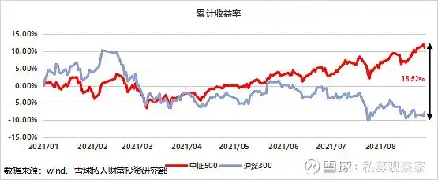
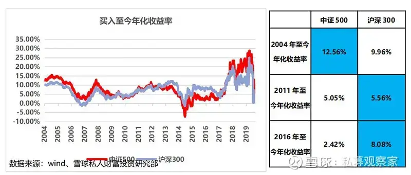
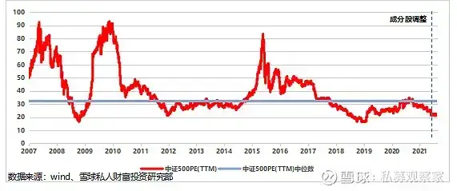
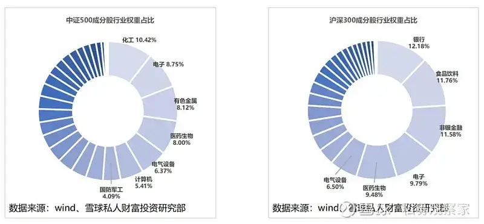
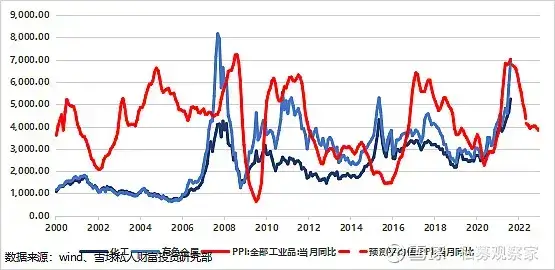
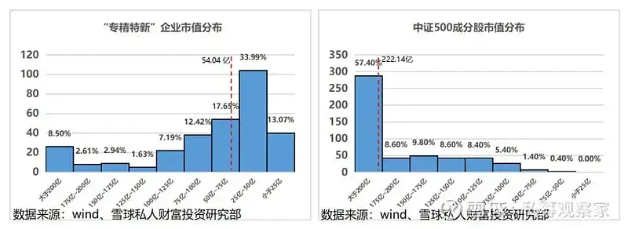
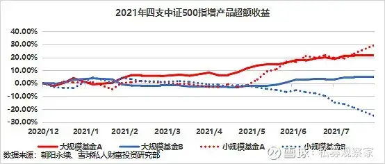
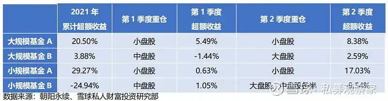

2021 年初, 市场对大盘蓝筹股的热情不减, A 股板块轮动加剧, 人们在讨论谁会是下一个"茅台"、下一个"宁德时代". 在大盘股倍受关注的环境下, 一个中小盘指数"中证 500"却悄无声息地冲上高点. 年中, 中证 500 指数点位更是创下五年新高.

## 2021 年, 中证 500 指数发生了什么?

中证 500 指数是由中证指数有限公司开发的一组指数, 根据中证指数有限公司官方网站, 其构成为: 全部 A 股中剔除沪深 300 指数成份股及总市值排名前 300 名的股票后, 总市值排名靠前的 500 只股票. 中证 500 指数成分股市值主要分布在 100 亿至 300 亿之间, 反映了 A 股市场中一批中型市值公司的股票价格表现.

中证 500 指数点位从 2021 年初的 6, 482.79 点至 9 月 1 日达到 7, 193.10 点, 累计涨跌幅为 10.96%, 同期沪深 300 及上证 50 均发生负增长. 2021 年 6 月, A 股市场中一批大市值蓝筹股震荡下跌, 作为大盘股代表的沪深 300 也一路走低. 后疫情时代, 中小企业渐渐恢复生机, 代表中小盘的中证 500 也是水涨船高. 指数间分化逐渐形成并扩大, 截至 2021 年 9 月 1 日, 中证 500 指数年内跑赢沪深 300 指数 18.52 个百分点.

中证 500 指数成立于 2004 年 12 月 31 日, 长期来看, 截至 2021 年 9 月 1 日, 累计年化收益率 12.56%, 而同期沪深 300 年化收益率仅为 9.96%. 尽管中证 500 长期收益超过沪深 300, 放眼最近十年, 中证 500 表现却不如沪深 300.

以 2011 年 9 月中证 500 以及沪深 300 指数点位为基准, 两者十年年化收益率分别为 5.05%和 5.56%, 中证 500 指数涨幅劣于沪深 300. 而近五年年化收益率沪深 300 更是达到 8.08%, 远超中证 500 的 2.42%. 由于指数编制规则的限制, 随着指数成立时间增长, 中证 500 中表现优秀的个股大概率会被剔除并调入沪深 300, 同时沪深 300 中表现不佳的个股又会被调入中证 500, 外加市场近年对行业龙头的青睐, 沪深 300 指数表现近十年优于中证 500 指数.

## 中证 500 被低估了吗?

有人说"中证 500 被大大低估了", 研究中证 500 指数历史市盈率数据, 我们不难发现其市盈率的确处于历史相对低位. 但由于中证 500 成分股调整对市盈率影响较大、且指数里行业构成包含大量周期股, 我们不能简单通过市盈率百分位值来判断中证 500 是否被低估.

1、今年 6 月中证 500 成分股调整带来了估值下降.

在通过市盈率判断相对价值时, 我们选择滚动市盈率(TTM PE), 即以过去最近的十二个月为基准, 计算每股价格与每股盈利之比. 相比静态市盈率以上一年盈利来计算每股盈利, 滚动市盈率更加准确客观.

在 2019 年结构性牛市市场背景下, 大盘股备受关注, 股价带动沪深 300 指数上涨的同时, 大盘股的估值也到达了历史高位, 沪深 300 滚动市盈率一度在 2021 年初到达 17.45 倍, 处于历史 80%分位. 而中小盘股票因为鲜有人关注, 炒作空间有限, 中证 500 滚动市盈率仍在其中位数上下浮动, 估值没有明显变化. 2021 年 6 月 11 日, 中证 500 成分股进行了调整, 滚动市盈率更是大幅度降低. 6 月 11 日中证 500 滚动市盈率为 25.5 倍, 处于历史 17%分位, 而 6 月 15 日成分股调整后滚动市盈率进一步降至 21.5 倍, 处于历史 5%分位.

通过具体研究被剔除的和新调入的 50 支股票, 我们发现, 排除市盈率为负值的企业, 被剔除股票的平均滚动市盈率为 53.3 倍, 而调入股票市盈率为 42.4 倍. 从权重角度考虑, 剔除股票曾占中证 500 指数权重 14%, 而新调入的股票权重仅为 11%. 在成分股调整后, 高权重高市盈率的企业被剔除, 而一些低市盈率股票的调入使中证 500 指数的滚动市盈率降低, 达到历史相对低点.

2、受益于大宗商品价格的上涨, 以有色、化工为代表的周期股不断走强, 为中证 500 指数的估值走低起到了重要的作用.

尽管中证 500 估值处于低位, 但我们仍要关注指数行业成分对估值的影响. 行业成份方面, 根据申万一级行业分类, 中证 500 指数相较于沪深 300 指数成分行业分布更加平均, 权重排名前五的行业分别是: 化工、电子、有色金属、医药生物以及电气设备, 其中权重最高的化工行业占比为 10.42%. 化工、有色金属等工业企业占据了中证 500 大量权重, 而工业作为周期性行业的特点就是低市盈率不单单代表股票价格被低估, 同时说明该行业在未来大概率将会受到行业周期波动的影响, 很可能进入一段衰弱周期.

从宏观数据我们可以清晰地看到, 2021 年 PPI(工业品出厂价格指数)再次冲高, 8 月涨幅高达 9.5%, 更是创下了近十年来的新高. PPI 对以化工为主的周期股有良好的指示意义, 2020 年 PPI 与化工和有色金属行业指数涨跌方向一致. 根据 Wind 的 PPI 预测平均值, 在 2022 年前后, PPI 可能会逐渐回落. 回落的 PPI 预示了化工及有色金属这一类中证 500 高权重行业的盈利能力可能会出现反转.

中证 500 指数的行业结构所带有的强周期特征, 决定了市盈率并不能完全体现其价值是否被高估, 尽管目前市盈率处于历史相对低位, 但也有可能是行业景气度已到达了高点, 即将开始由盛转衰.

## "专精特新"小巨人能带动中证 500 更进一步吗?

为贯彻在中央财经委员会第五次会议中提出的"培育一批'专精特新'中小企业", 财政部和工信部联合印发的通知提出, 2021 年开始中央财经将安排超过 100 亿元的奖补资金引导地方完善政策, 重点支持 1, 000 余家国家级专精特新"小巨人"企业高质量发展, 带动更多中小企业成长为国家级专精特新"小巨人"企业. 在政策扶持下, 代表中型企业的中证 500 指数似乎迎来了发展机遇? 但通过严谨的数据整理和分析, 可以看到中证 500 指数包含的企业和"专精特新"关联度其实并不高.

在工信部公布的四批"专精特新"名单中, 共有 306 家 A 股上市公司, 仅有 2 家同属于中证 500 指数成分股, 有 63 家同属于中证 1000 指数成分股, "专精特新"企业和中证 500、中证 1000 似乎没有太多关联, 中证 500 指数是否搭上了"专精特新"的"顺风车"仍值得商榷.

从市值方面观察, "专精特新"中的上市企业平均市值为 94.72 亿元, 中位数 54.04 亿元; 而中证 500 成分股中的企业平均市值高达 262.31 亿元, 中位数 222.14 亿元. 随着股票市场发展, 如今的中证 500 指数似乎代表的已不是中小企业了, 代表的更多是一些优质的发展中企业, 以及经营不善市值骤降的大型企业.

## 中证 500 这么好, 私募怎么封盘了?

2021 年 8 月底, 随着中证 500 指数点位一路高升, 部分私募基金管理公司却开始封盘旗下中证 500 量化指数增强策略产品, 而封盘原因也很简单: 为了保护超额收益.

指增产品超额收益主要来源包括多因子模型选股以及打新. 2021 年以前, 中证 500 指增产品规模相对较小, 超额收益获取相对容易. 进入 2021 年, 投资者对中证 500 指增产品的热情越来越高, 当产品规模扩大时, 通过选股获得的超额收益自然会降低, 同时打新带来了额外收益相较于整体规模对整体涨幅也不会提供太大帮助.

同时, 中证 500 指数成份股分化程度逐渐加大, 机构抱团行情也初见端倪. 2021 年第一季度中证 500 成分股中只有 192 支股票涨幅超过指数, 而到了第二季度超过指数的股票数量更是减少到了 161 支. 随着指数中个股分化愈演愈烈, 量化选股所获得的超额收益也会受到影响.

我们选取了两只规模较大的以及两只规模较小共四支中证 500 量化指数增强策略私募基金产品, 通过净值分别计算其收益率以及波动率. 以沪深 300、中证 500 以及中证 1000 指数作为基底对私募基金产品进行线性拆解, 分析每支产品大、中、小盘的持仓情况, 以季度为周期, 研究私募基金产品在 2021 年前两个季度的持仓.

截至 2021 年 9 月 1 日, 四支抽样私募基金产品中, 相比中证 500 指数仅有一只小规模基金获得收益为负值. 在 2021 年第一季度中, 根据结果, 四支中证 500 指增产品持仓都以中、小盘股为主; 而进入第二季度, 仅有一支产品依旧选择大量持仓中盘股, 其余产品均在小盘股或大盘股寻求超额收益. 我们可以认为, 机构逐渐开始脱离赛道, 在中盘股以外寻求超额收益.

很多人认为规模较大的指增产品不够灵活, 但在我们选择的四只产品中, 无论规模大小, 均在积极寻求阿尔法收益机会更好的赛道. 同时大规模基金产品也并不会被限制在持仓大盘股中, 例如"大规模 A"产品坚定选择重仓小盘股, 也获得了 20.50%的累计超额收益. 另一方面, 也有人认为小规模指增产品在市场中更容易获得超额收益, 通过观察我们选取的小规模私募指增产品的收益可以发现: 小规模指增产品不一定能获得更高的收益, 其波动率较大, 获得收益相对不稳定.

## 保持理性才是投资中"最不容易"的事情

中证 500 指数以及指数增强产品无疑是今年权益市场中最大的亮点, 伴随着收益的提升, 也获得了越来越多投资者的关注. 当"茅指数"和"宁指数"的估值越来越高的时候, 投资者对于 A 股市场的新势力也寄予了更多的期待.

但任何事情都有两面性, 我们在看到中证 500 指数走出相对大盘的独立行情后, 也应该关注他取得超额收益的来源, 所谓"盈亏同源", 如果我们不知道他为何盈利, 也意味着我们很难在他走弱的时候提前察觉. 毕竟, 没有任何一款投资品可以长期只涨不跌的.

站在投资的角度, 我们更呼唤市场的理性, 当某一款投资品热情高涨的时候, 冷静想想背后的前因后果, 而不是头脑一热就杀进去, 才是真正事半功倍的选择. 这对于投资来说, 是一件很容易的事情, 但可能又是"最不简单"的事情.

免责声明: 本文内容仅供参考, 不构成任何投资建议. 文中所引用的信息和数据均来自于公开渠道, 私募观察家对这些信息的真实性、准确性和完整性不做任何保证. 私募观察家对任何人因使用本文或其内容或者其他与之相关的原因引起的任何损失, 以及因本文或其内容的发布, 或者由于事实或分析数据传达中的错误而导致的直接或间接损失, 不承担任何责任.

## 原文

- [这篇关于中证500最客观的科普，你一定要知道](https://mp.weixin.qq.com/s/qyuDPH64-C8izeOGSs-jJw)
