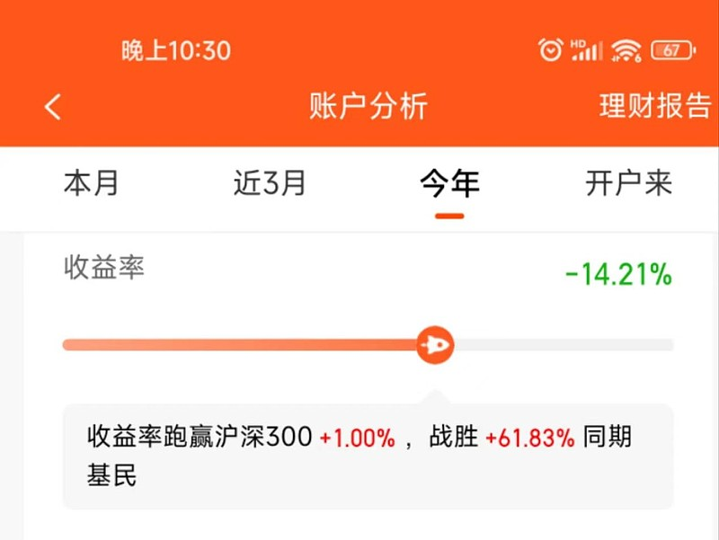
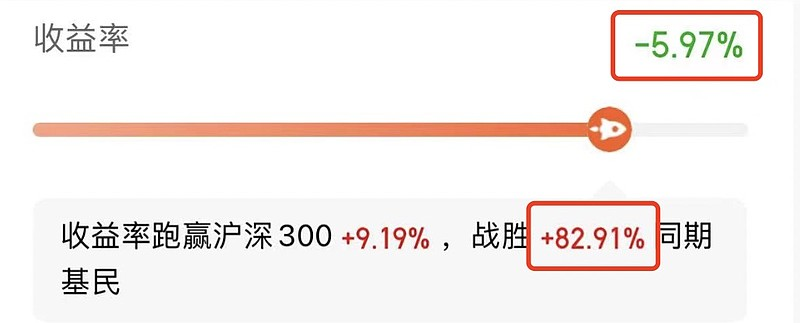
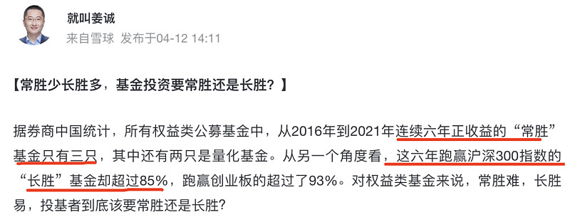
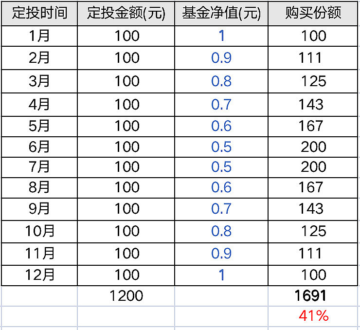

这是我基金账户今年来的收益率 (2022.04.15)：-14.21%

没想到还跑赢了沪深 300......1%......，还跑赢了 61% 的基民，，，我突然不知道该悲伤还是欣慰。。

下图是我一个朋友今年来的收益率 -5.97%，亏了 6 个点，仍然跑赢了 83% 的基民。估计 空仓 0% 的，跑赢 90+%！

看来，大家今年都没有赚到钱嘛

言归正传，今年来，我确实没有想到会回调这么久，回调这么多。

也实在没有料到今年会发生这么多破事～～导致一度，我都想删 APP 跑路算了。

于是我经过了一番思想斗争，终于说服了自己，没有清仓，也没有割肉减仓，然后还鼓起勇气设置定投继续加仓。。

我是这么说服我自己的。（以下，是我这段时间，真实的心路历程）

## 1 首先问自己：除了买基金，我还有别的选择，可以让我的资产保值增值吗？

我的答案是：没有其他选择了。

我不可能现在还去买房投资吧，那杠杆率就太高了，流动性太差了，未来升值的确定性也说不清楚。

我不可能是开实体店吧。虽然曾经想过开店，感觉每天都有流水进账，但是这个成本确实太高了，而且一旦有什么闪失，那就不是浮亏 15% 的事情了。特别是现在疫情这个样子，我亲朋好友中开烤肉店的，开奶茶店的，基本上都要倒闭了。

那我还有什么其他“更可靠，更易接触到”的投资项目呢？

恕我无能，我实在想不到。

既然买基金（含股票）是我唯一的选择，那么，我投资肯定就不仅仅只看今年收益的，而是至少看未来 5 年以上的。

## 2 然后，为了让自己更安心持有，我就开始找历史数据来作为支撑

第一个数据：就拿 2018 年的大熊市来说，大盘从 2018 年 1 月的 3529 点持续下跌了整整一年，到 2019 年 1 月时已经跌了 30% 了！如果在这时卖出割肉，那就硬亏 30%。但是，只要持有 3 年，那么到 2021 年 1 月 15 日时，大盘已经涨到了 3633 点，不仅回本了，还有得赚！

第二个数据：最近在 @就叫姜诚 的雪球号看到的，长胜容易，常胜难。

看完这两个数据，基本上就更加坚定了“长期持基”的想法。

## 3 紧接着，接下来就是解决“要不要割肉先避险，等出现拐点再买回来？”的问题

我的答案是：算了吧。

我自认为自己没有这个能力和时间。

最重要的是，每当我们开始嚷嚷着“要清仓，要割肉”的时候，已经跌了很久了，基本上跌到位了。（因为，在跌的前期，我们大部分人肯定是“高兴的”，当时的想法肯定是感谢市场给我们“抄底”的机会。然后，基本上逢跌加仓到中期，发现还在暴跌，动辄一天跌 3～5% 时，就开始很恐慌了。）

现在当我们再看回撤时，单基金基本上跌了 20% 以上了，这个时候再割肉避险，感觉意义不大了。而且，一旦开始回暖，涨 10% 也是很快的时候，到时候等我们后知后觉反应过来，估计也涨到半山腰了。。

要是我们真有这个能力，就不会出现 0% 的收益跑赢 90+%的基民了。所以，我还是敬畏市场的（也可能就是懒吧，anyway~），反正我不认为自己是天之骄子。综上，还是继续躺平持有吧。

## 4 为什么我们总是忍不住追涨杀跌呢？

然后，看着自己亏了 -14%，而非基金从业者的朋友只亏了 -6%，我还是会觉得“自责 + 内疚”。我想知道，为什么我们（含被我跑赢的 60% 的基民朋友）总是忍不住追涨杀跌呢？

于是乎，我看了一些分析，总结了 2 大点原因。（核心目的是让自己心里好受一点，不用太自责。）

### 追涨杀跌 - 原因 1: 从原始时代遗传的底层心智模式。

这套底层心智模式，是在这样一幅生活场景下形成的：我们的祖先和其他灵长类动物一样，生活在草原和树林之间，也生活在复杂社会结构的群体之中，和同类互动，一起躲避强敌、寻找食物充饥。其主要对应解决：①躲避野兽攻击；②存储食物。

①想想原始祖先，突然看到草丛中窜出一只猛兽，他是仔细思考逃跑路线，还是直接大脑空白，四肢充血，立马开溜！ 同样的道理，在股票市场上，我们的恐惧就是这样发挥作用的，一旦有暴跌，一旦跌跌不休，我们第一反应就是割肉清仓跑路。

②因为祖先们生活的环境里食物高度稀缺，这让我们极度迷恋甜食、水果。减肥成为一个大难题。喜欢糖和脂肪的基因帮助祖先活下来。结果，在现代社会中造成我们喜欢储蓄，追求高收益，永远都很难克服自己的贪欲。

### 追涨杀跌 - 原因 2：无论盈亏，我们都存在“风险错觉”。

心理学家研究发现，在输赢的概率没有发生任何变化的情况下，人们对风险的认知，会随着自己输赢结果的变化，很自然地发生错觉。这种错觉隐藏着让赌徒越陷越深的陷阱。

简单地说：

赢了钱的人，就会忘记风险，更加兴奋，想继续赌下去，直到输钱；

而输了钱的人，也会忘记风险，会特别想翻本，甚至一直到最终输光。

我们在天性上非常容易受这两种错觉的影响。

这两种典型的风险错觉类型，有正式的概念，分别是“赌场的钱”效应和“试图翻本”效应。

1>“赌场的钱”效应

人们通常在获得收益之后，对风险的认知会变的麻木，通常愿意承担更大的风险。

就像赌博的人刚刚赢了一大笔钱之后，下意识里不会把赚来的钱当作自己的钱，而是会当成赌场的钱，下注的时候更加随意、更加冒险，也就更容易输掉。

我们学过心理账户的概念，“赌钱的钱效应”，就是赢钱之后我们会把这些同等效用的钱放在“浮财”的心理账户里，亏了也不心疼。

看明白了这个现象，我们就不难理解，为什么散户总是赔钱。因为散户在赚到钱之后，“赌场的钱效应”往往就开始发挥作用，越赚得多，这个作用效果越大，直到亏钱。。。

2>“试图翻本”效应

人们在亏钱之后，总想找机会把钱赢回来（解套回本），结果亏得更多。

在美国做过这么一个实验，研究者统计了 426 名芝加哥期货交易所里的国库券期货交易员的交易记录。发现这些交易员如果早晨发生了亏损，下午就往往会增加风险程度，进行更加频繁的交易。结果时，这些冒险进行的交易更容易发生亏损。

～～～～～～～～～～～～～～

这两种风险错觉，一个让人获利之后风险意识变弱，从赚钱变成亏钱；一个让人在亏损之后风险意识模糊，在亏钱的道路上越走越远。

怎么能对治我们的风险偏差，防止投资中的过度冒险行为呢？那就要建立起我们的系统性投资框架，把钱交给机制，而不是我们的情绪。

## 5 最后一组老掉牙的微笑曲线数据，让我开启定投。

老实说，最近设置定投，核心原因是“我不想自己打开账户，看到亏损了”

我自己简单算了一组“微笑曲线”的数据：

当一只基金净值从 1 跌到 0.5 再涨回 1，只要持续定投，那么收益率是 41%～～

那我就按部就班，鼓起勇气定投下去

好啦，我的 5 步心路历程就给大家分享完了。

希望对跟我一样曾经纠结过，迷茫过，自责过的小伙伴，有帮助！

稳住！我们能赢！！

## 原文

- [大跌 4 个月亏了-14%！我想跟你分享 5 个我自己坚持的理由](https://xueqiu.com/8687456694/217474085?sharetime=2)
